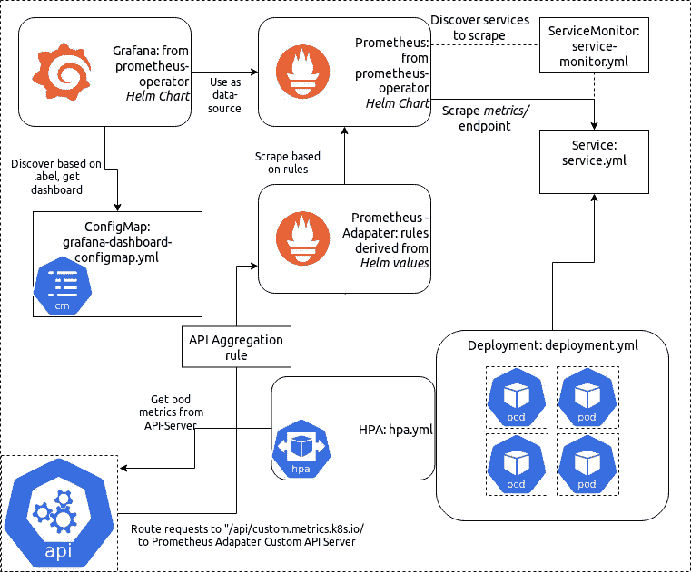
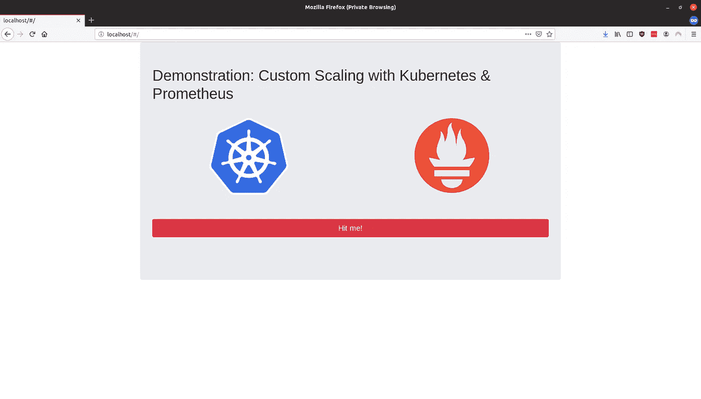
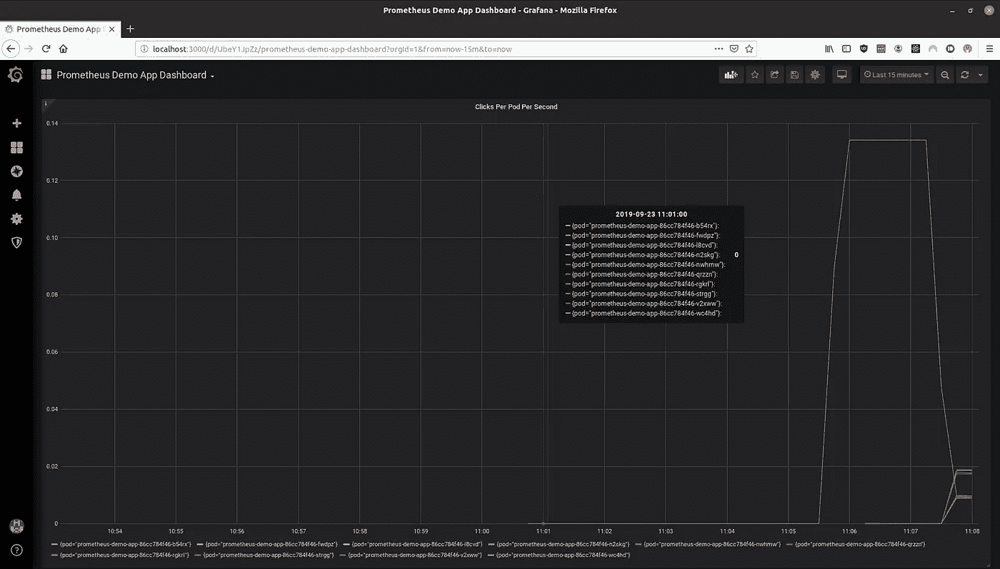

# 构建基于自定义指标的 Kubernetes 应用程序:一个温和的介绍

> 原文：<https://levelup.gitconnected.com/building-kubernetes-apps-with-custom-scaling-a-gentle-introduction-a332d7ebc795>



部署的系统

**2020–10–25:为 Kubernetes 1.19 &头盔 3** 更新

**GitHub Repo:**[https://GitHub . com/flip stone 42/k8s-Prometheus-custom-scaling](https://github.com/flipstone42/k8s-prometheus-custom-scaling)

## **您将了解到的内容:**

*   部署联合监控管道
*   使用 [Prometheus 适配器](https://github.com/DirectXMan12/k8s-prometheus-adapter/)

**如果您对本教程有任何问题，请在相关的 GitHub 项目上留下问题。**

本教程中的项目旨在为安装项目的技术人员和您希望向其展示最终部署的任何外行人提供一个温和的介绍。它包括一个 Grafana 仪表板，实时显示您的部署规模。

如果你不熟悉 Kubernetes 或普罗米修斯，这可能不是那么有用。我将尝试提供关于某些方面的更多细节的文档链接，但是您至少应该对系统有一个工作上的理解。

我使用[种类](https://kind.sigs.k8s.io/)来开发它，但是它应该可以与任何启用了 [API 聚合](https://kubernetes.io/docs/tasks/extend-kubernetes/configure-aggregation-layer/)的 1.19+集群一起工作。

## **先决条件:**

*   访问 k8s 集群(`k8s version 1.19` 推荐)
*   [Minikube](https://minikube.sigs.k8s.io/docs/) / [种类](https://kind.sigs.k8s.io/) **推荐**
*   本地安装[舵](https://helm.sh/)舵&舵[舵](https://kubernetes.io/docs/tasks/tools/install-kubectl/)

## **第一步:克隆项目**

```
git clone [https://github.com/flipstone42/k8s-prometheus-custom-scaling.git](https://github.com/flipstone42/k8s-prometheus-custom-scaling.git)cd k8s-prometheus-custom-scaling
```

让我们先来看看我们要扩展的应用程序。它是使用[烧瓶](http://flask.palletsprojects.com)和[反应](http://reactjs.org)前端在 Python 中构建的。我们还利用了“[Flask Prometheus Exporter](https://github.com/rycus86/prometheus_flask_exporter)”，一个优秀的社区图书馆。

[看完整文件这里](https://github.com/flipstone42/k8s-prometheus-custom-scaling/tree/master/demo_app/server.py)

让我们在本地发布应用程序。如果你不熟悉`docker-compose`，先看看这里的。

```
docker-compose up -d #add the --build flag to build locally
```

如果我们在浏览器中导航到`localhost:8000`,就会看到我们的网页:



这是部署的应用程序的外观。

这是一个非常简单的 web 应用程序。*打我！”*向网站的`/click-button`端点发出 POST 请求。服务器中该端点上的 Prometheus 装饰器确保这被应用程序记录下来。

每次 POST 请求到来时，应用程序增加一个 [Prometheus 计数器](https://prometheus.io/docs/concepts/metric_types/#counter)。这然后反映在 app 的`/metrics` 端点，我们最终会配置一个正在运行的 Prometheus 实例来定期抓取。

如果我们跑:

```
curl -s localhost:8000/metrics | grep demo_app_button_clicks
```

我们得到以下输出:

```
# HELP demo_app_button_clicks_total Multiprocess metric
# TYPE demo_app_button_clicks_total counter
demo_app_button_clicks_total 0.0
```

这是普罗米修斯[计数器。让我们按一下按钮，看看再次运行该命令时会发生什么:](https://prometheus.io/docs/concepts/metric_types/#counter)

```
# HELP demo_app_button_clicks_total Multiprocess metric
# TYPE demo_app_button_clicks_total counter
demo_app_button_clicks_total 1.0
```

假设你得到了和我一样的输出，一切都按计划进行！

**第二步:创建一个集群**

本指南是用 k8s 1.19 编写的，经过实物测试。对于本教程，我建议使用 kind 或 minkube:

*   [实物入门](https://kind.sigs.k8s.io/docs/user/quick-start/)
*   [Minikube 入门](https://minikube.sigs.k8s.io/docs/start/)

创建集群后，继续下一步。

## **第二步:安装 Kube-Prometheus-Stack**

```
helm repo add prometheus-community [https://prometheus-community.github.io/helm-charts](https://prometheus-community.github.io/helm-charts)helm repo updatehelm install prometheus-operator prometheus-community/kube-prometheus-stack -f helm-values/prometheus-operator-values.yml
```

让我们引进并安装[普罗米修斯操作器](https://github.com/prometheus-operator/prometheus-operator)(通过 kube-prometheus-stack 图表)。这个 k8s 操作员将帮助我们抽象出普罗米修斯的部署。

> *注意:默认配置不使用选择器来发现 ServiceMonitors，所以它会选择任何部署到当前名称空间的监视器。这不应该是一个问题，但是如果这是一个共享集群，就应该记住这一点。*

## **步骤 3:将应用程序部署到集群并开始监控它**

```
kubectl apply -f manifests/deployment.yml -f manifests/service.yml -f manifests/ingress.yml
```

这应该会将[部署](https://kubernetes.io/docs/concepts/workloads/controllers/deployment/)和附带的[服务](https://kubernetes.io/docs/concepts/services-networking/service/)添加到我们的集群中。

我还包括一个 ingress 资源:如果你不熟悉 ingress，请阅读 [Kubernetes 文档](https://kubernetes.io/docs/concepts/services-networking/ingress/)。

让我们在浏览器中查看一下普罗米修斯仪表盘。

```
kubectl port-forward svc/prom-demo-prometheus-opera-prometheus 9090
```

如果你转到[http://localhost:9090/targets](http://localhost:9090/targets)，你会看到一个被监控的端点列表。使用 Prometheus-Operator 安装的[CRD](https://kubernetes.io/docs/concepts/extend-kubernetes/api-extension/custom-resources/)之一，我们将确保服务受到监控。

除非你已经改变了 Prometheus 部署的一些值文件，否则你不会在这里看到 *prometheus-demo-app* 。让我们改变这一点。

```
kubectl apply -f manifests/service-monitor.yml
```

[点击这里查看 GitHub 上的文件](https://github.com/flipstone42/k8s-prometheus-custom-scaling/manifests/service-monitor.yml)

该对象指示 Prometheus 操作员配置正在运行的 Prometheus 实例，以监控标签为*app:Prometheus-demo-app*的服务

如果你回到[http://localhost:9090/targets](http://localhost:9090/targets)，你应该会看到我们的演示应用程序就在那里。让我们在 Prometheus 仪表板中运行以下查询:

```
demo_app_button_clicks_total
```

这告诉我们在应用程序的所有实例中，总共发出了多少点击。

我们如何开始将此转化为我们的 pod 可以衡量的指标？

## **第 4 部分:开始缩放**

Prometheus-Adapter 是 k8s 的 API 扩展，它使用用户定义的 Prometheus 查询来填充 k8s 资源&自定义指标 API。

我们将把它安装到我们的集群中，并添加一个规则来跟踪每个 pod 的请求率。规则被定义为 YAML，我们将把它添加到 Prometheus 适配器的舵图中。

我们需要定义填充 *custom.metrics.k8s.io* 组的规则。

以下是规则配置文档中的一段引文:

> 每条规则可以大致分为四个部分:
> 
> **发现**，它指定适配器应该如何找到该规则的所有普罗米修斯度量
> 
> **Association** ，它指定适配器应该如何确定特定指标与哪些 Kubernetes 资源相关联。
> 
> **命名**，它指定适配器应该如何在定制度量 API 中公开度量。
> 
> **查询**，它指定了对一个或多个 Kubernetes 对象的特定指标的请求应该如何转换成对 Prometheus 的查询。

让我们从向配置文件添加*规则*键开始:

```
rules: []
```

我们只需要**发现**一个指标:*demo _ app _ button _ clicks _ total。*我们在 pod 标签上添加了一个非空匹配，以确保它与一个匹配相关联。

```
rules:
- seriesQuery: 'demo_app_button_clicks_total{pod!=""}'
```

**关联**非常简单:Prometheus 标签都直接映射到 Kubernetes 资源(作业、名称空间、pod 等)，因此我们可以使用一个模板来映射资源:

```
rules:
- seriesQuery: 'demo_app_button_clicks_total{pod!=""}'
  resources: {template: "<<.Resource>>"}
```

演示按钮点击的总和是没有用的:我们需要让它按 pod 缩放。这就像给我们的规则添加一个简单的**命名**定义一样简单:

```
rules:
- seriesQuery: 'demo_app_button_clicks_total{pod!=""}'
  resources: {template: "<<.Resource>>"}
  name:
    matches: "^(.*)_total"
    as: "${1}_per_second"
```

我们只剩下定义**查询:**

```
seriesQuery: 'demo_app_button_clicks_total{pod!=""}'
resources: { template: "<<.Resource>>" }
name:
  matches: "^(.*)_total"
  as: "${1}_per_second"
metricsQuery: "sum(rate(<<.Series>>{<<.LabelMatchers>>}[2m])) by (<<.GroupBy>>)"
```

这是一个参数化的普罗米修斯查询。让我们来分析一下它是做什么的。

Series 是由 seriesQuery 匹配的任何序列。这个规则只有一个系列，所以我们可以替换 *< <。*系列 *> >* 同*演示 _ 应用 _ 按钮 _ 点击次数 _ 总数。< <。* LabelMatchers > >是适配器放置标签查询的地方(例如“pod='deployment-name-abcd-1234 ')。< <。GroupBy > >代表了您想要扩展的资源:在我们的例子中就是 pods。

Prometheus-Adapter 的一个缺点是配置是通过一个与应用程序一起部署的静态文件来完成的，而不是通过一个 ConfigMap 或其他一些基于 API 的对象。

我们将使用另一个舵图表来部署它，并使用舵值文件编写我们的规则。

我们的舵值文件

```
helm install prometheus-adapter prometheus-community/prometheus-adapter -f helm-values/prometheus-adapter-values.yml
```

等待几分钟，然后运行以下查询:

> jq 可从所有知名的包装经理处获得。

```
kubectl get --raw="/apis/custom.metrics.k8s.io/v1beta1" | jq
```

您的输出应该如下所示:

```
{
  "kind": "APIResourceList",
  "apiVersion": "v1",
  "groupVersion": "custom.metrics.k8s.io/v1beta1",
  "resources": [
    {
      "name": "pods/demo_app_button_clicks_per_second",
      "singularName": "",
      "namespaced": true,
      "kind": "MetricValueList",
      "verbs": [
        "get"
      ]
    },
    {
      "name": "services/demo_app_button_clicks_per_second",
      "singularName": "",
      "namespaced": true,
      "kind": "MetricValueList",
      "verbs": [
        "get"
      ]
    },
    {
      "name": "jobs.batch/demo_app_button_clicks_per_second",
      "singularName": "",
      "namespaced": true,
      "kind": "MetricValueList",
      "verbs": [
        "get"
      ]
    },
    {
      "name": "namespaces/demo_app_button_clicks_per_second",
      "singularName": "",
      "namespaced": false,
      "kind": "MetricValueList",
      "verbs": [
        "get"
      ]
    }
  ]
}
```

接下来，让我们获取 pod 的指标:

```
kubectl get --raw="/apis/custom.metrics.k8s.io/v1beta1/namespaces/default/pods/*/demo_app_button_clicks_per_second?pod=$(kubectl get po -l app=prometheus-demo-app -o name)" | jq
```

输出应该类似于以下内容:

```
{
  "kind": "MetricValueList",
  "apiVersion": "custom.metrics.k8s.io/v1beta1",
  "metadata": {
    "selfLink": "/apis/custom.metrics.k8s.io/v1beta1/namespaces/default/pods/%2A/demo_app_button_clicks_per_second"
  },
  "items": [
    {
      "describedObject": {
        "kind": "Pod",
        "namespace": "default",
        "name": "prometheus-demo-app-86cc784f46-c5m66",
        "apiVersion": "/v1"
      },
      "metricName": "demo_app_button_clicks_per_second",
      "timestamp": "2019-09-20T18:06:55Z",
      "value": "0"
    }
  ]
}
```

注意值的零:因为我们还没有开始点击按钮，正常化的速率是每秒 0。

运行以下命令以端口转发演示应用程序:

```
kubectl port-forward svc/prometheus-demo-app 8080
```

导航到演示应用程序的网页并敲击按钮，然后重新运行上述命令。您应该会看到速率增加。

**第 5 部分:部署 HPA**

[水平 Pod 自动缩放器](https://kubernetes.io/docs/tasks/run-application/horizontal-pod-autoscale/)根据满足的特定条件向部署添加新的 Pod。

我们将添加一个 HPA，目标是每秒每 pod 0.01 次点击。

点击此处查看完整文件

> 提示:如果您正在使用此工具向观众演示扩展，请调整 targetAverageValue，以便在将更多 pod 添加到部署之前需要一定的参与度

现在，这应该会自动扩展我们的部署，以响应超出的指标阈值。

运行以下命令以确认您只有一个 pod 在运行:

```
kubectl get po -l app=prometheus-demo-app
```

在浏览器中打开网站。

*Minikube:* 运行“minikube ip”，然后在浏览器中找到该地址

按几次按钮，然后再次运行上面的命令。

您应该会看到部署已经扩大了！您可以在仪表板上查看，或者只查看已部署的 pod。

## **下一步是什么？**

**在 Grafana** 中显示缩放数据

我还包括了一个 [Grafana](https://grafana.com/grafana/) 仪表板，它跟踪每个 pod 的指标。

我包括了一个配置图，它带有一个如下所示的仪表板:



Grafana 仪表板

```
kubectl apply -f manifests/grafana-dashboard-configmap.yml
```

要查看 grafana 仪表板，要么为它创建一个入口，要么运行这个命令，然后转到 [http://localhost:3000](http://localhost:3000)

```
kubectl port-forward svc/prom-demo-grafana 3000:80
```

默认用户名/密码是 *admin/prom-operator。*

**部署入口**

清单/目录中包含一个入口文件。

[](https://gitconnected.com/learn/kubernetes) [## 学习 Kubernetes -最佳 Kubernetes 教程(2019) | gitconnected

### 7 大 Kubernetes 教程-免费学习 Kubernetes。课程由开发人员提交并投票，从而实现…

gitconnected.com](https://gitconnected.com/learn/kubernetes)