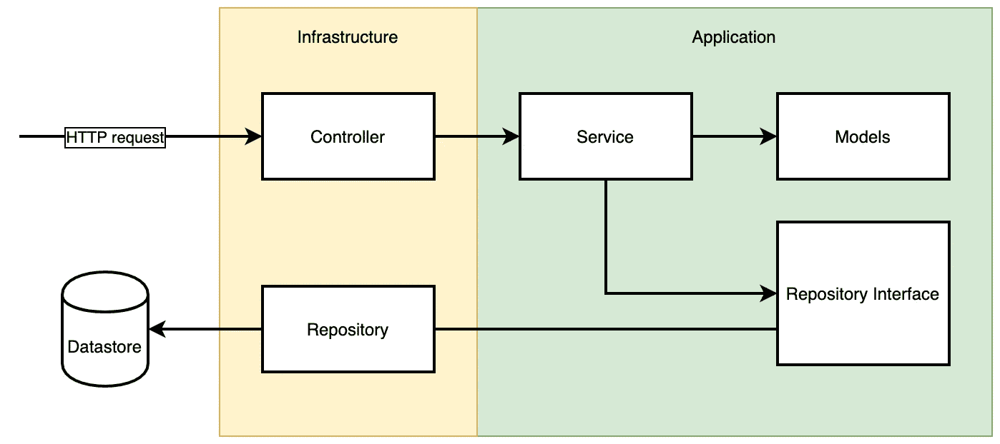
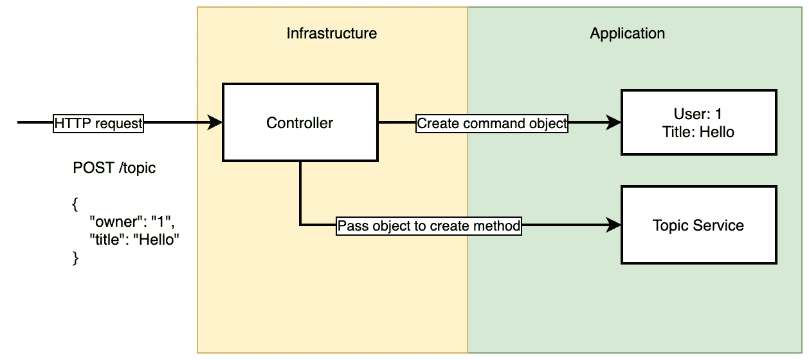
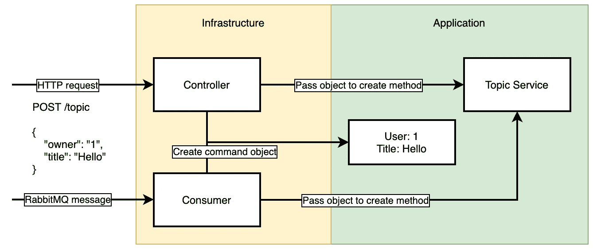
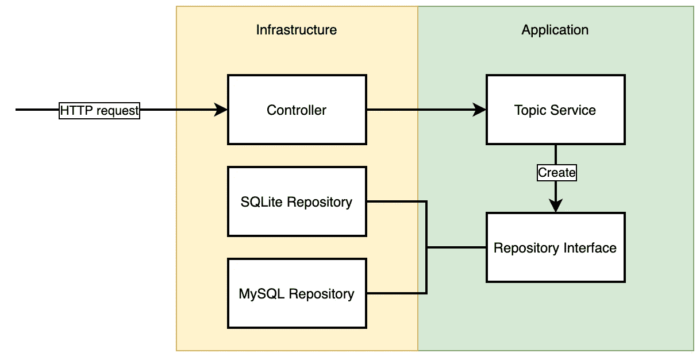

# 构建可维护的软件

> 原文：<https://levelup.gitconnected.com/building-maintainable-software-50c6bd09c611>

## 将基础设施与应用程序分离


凯文·霍尔瓦特在 [Unsplash](https://unsplash.com?utm_source=medium&utm_medium=referral) 上的照片

在过去的几年里，我遇到了一些我不想谈论的代码。我总是想知道一个项目怎么会以这样的状态结束，更重要的是，我怎么能阻止自己编写遗留代码。

# 开始一个新项目

开始一个新项目总是令人兴奋的。这是使用许多新技术并写出比上次更好的代码的绝佳机会。

> 这看起来是微服务的完美项目！

不要误解我，我喜欢微服务，但你不应该从它开始。这太大材小用了，除非你已经在微服务环境中工作。

相反，确保您的代码为分离做好了准备。有很多方法可以做到这一点。问题是，你需要走多远。它仍然只是一个 MVP，我们希望在几周内发布我们的项目，而不是几个月。然而，我们也不想为此做噩梦。

依我看，有两种选择

*   快速建造一些肮脏的东西。当人们开始使用它时，我们把它扔掉，并适当地建造它。
*   分离应用程序的某些部分，以便我们可以在需要时替换它们。节省实施时间，而不是分离时间。

# 构建和替换

这可能是一个非常好的方法，尤其是当我们想要快速测试人们是否喜欢我们的产品时。

然而，当产品变得成功时，我们将不得不重写一切，说实话。我们真的要在它投入生产后从头开始构建它吗？大概不会。

当然，如果产品成功了，总有一天会被改写。但是这可能需要几年的时间，如果你运气不好，你可能最终会处理超过一万行代码的文件。

> 我想我找到窃听器了，在 10782 行。

这可能有点夸张，但你明白了。

如果你的目标是测试某个想法，一定要考虑这个选项，**只要确保重构它**。

# 将基础设施与应用程序分离

这将需要更多的时间，但如果项目失败，我们可以为另一个项目重用我们的一些代码。然而，如果做得不正确，我们仍然可能以重构整个项目而告终。

那么，我们如何分离我们的项目以保持它的可维护性呢？

让我们从创建基础设施和应用层开始。



基础设施层将包含管理任何网络请求的所有类。从接收 API 调用到与数据存储通信。这是项目开始时最重要的部分。

假设我们为 MVP 选择了一个 SQLite 数据库。只要确保实现隐藏在接口后面，我们就可以在必要时轻松替换数据存储。

对于处理传入的请求，这有点不同。但目标是一样的。我们可以使用命令对象来区分处理请求的方式和处理请求的方式。让我们看看下面的例子。



我们有一个控制器，它接收创建新主题的请求。控制器将把数据从 HTTP 请求转换成命令对象。这个对象将包含我们想要执行的变异所需的所有数据。我们可以将这个对象传递给位于应用层的服务。服务本身不知道任何关于 HTTP 请求的信息。正因为如此，我们可以轻松地用消费者替换我们的控制器，甚至可以同时支持两者:



然后，我们的主题服务将决定是否应该创建主题。题目独特吗？题目符合要求吗？这些业务规则应该放在应用层中。如果所有断言都通过，服务将在存储库上执行 create 方法。重要的是，存储库只能通过一个接口来引用。



假设我们现在想用 MySQL 数据库替换我们的 SQLite 数据库。为此，我们只需要创建一个新的存储库，实现现有的接口，并将其注入到主题服务中。

通过将基础设施从业务逻辑中分离出来，我们使得替换应用程序的某些部分变得更加容易。当然，仅仅创建两个文件夹和一些类不足以阻止遗留应用程序的存在。我们仍然需要不时更新我们的服务。

# 分离不同的上下文

确保将应用程序的不同部分分离到它们自己的上下文中。我们不希望有一个包含数百个控制器的`Controller`文件夹。每个上下文都应该有自己的基础设施和应用层。某些类(比如日志记录器)可以在上下文之间共享。这些共享类可以放在`Common`文件夹中。

```
src/
    Topic/
        Application/
        Infrastructure/
    Account/
        Application/
        Infrastructure/
    Common/
```

此外，尽量避免直接引用其他上下文。您可以使用事件在它们之间进行通信。如果您必须引用另一个上下文，请确保只在基础结构层这样做。当您的应用变得非常大时，这种分离使得迁移到微服务架构变得更加容易。

# 最后的想法

新项目的截止日期通常很紧。通过将项目分成两层，我们将能够在保持质量和可伸缩性的同时快速交付。

关于这个话题还有很多要讲的。如果您喜欢将应用程序分成不同的层，您可能还喜欢:

*   [六角形建筑](https://en.wikipedia.org/wiki/Hexagonal_architecture_(software))
*   [分层建筑](https://en.wikipedia.org/wiki/Multitier_architecture)
*   [领域驱动设计](https://martinfowler.com/bliki/DomainDrivenDesign.html)

感谢您阅读这篇文章。如果你喜欢，可以考虑关注我，下次见！