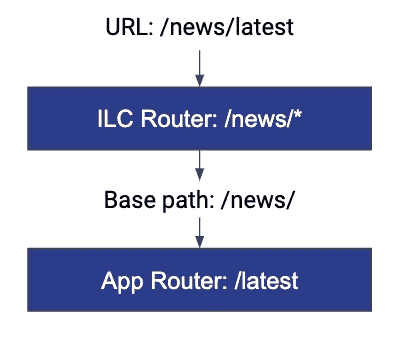
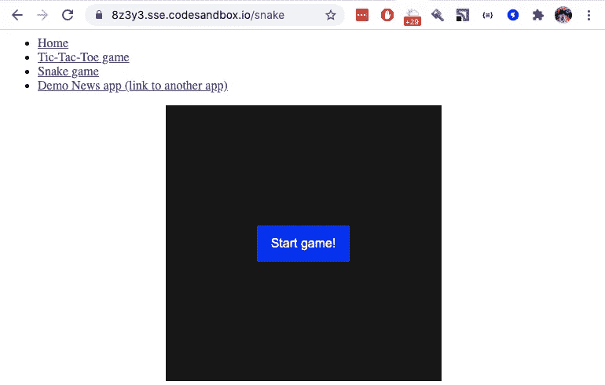
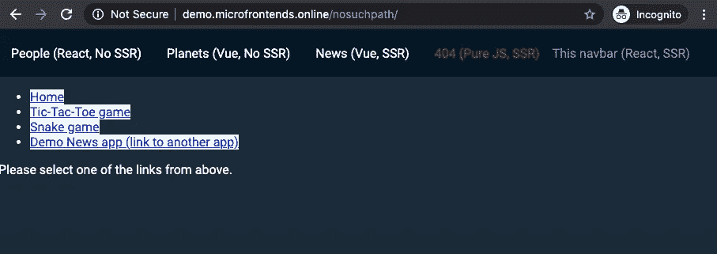

# 用 SSR 构建微前端——路由

> 原文：<https://levelup.gitconnected.com/building-micro-frontend-with-ssr-part-2-routing-d86480de8894>


尼克·蒂梅尔在 [Unsplash](https://unsplash.com?utm_source=medium&utm_medium=referral) 上的照片

这篇文章是第一篇[的延续，可以在这里找到第一篇](/how-to-build-your-first-micro-frontend-with-ssr-in-minutes-95cd57788529)。然而，如果你是一个有经验的开发人员——请放心从这个开始。

在这一部分中，我们将展示如何将一个使用 [React router](https://reactrouter.com/web/guides/quick-start) 的应用程序转变为与[同构布局编辑器](https://github.com/namecheap/ilc)协同工作的微前端。

# 一点理论…

应用微前端架构时，首先需要解决的问题之一是路由。这是因为您不再有一个单独的 React/Vue.js/etc 应用程序来处理所有的路线转换。现在你有多个应用程序同时在网页上工作，你需要知道哪些应用程序在当前 URL 的页面上应该是活动的。

我们在[同构布局编辑器](https://github.com/namecheap/ilc) (ILC)中，通过使用所谓的“2 层路由”方法来解决这个问题。



“两层路由”方法

在这个例子中，用户在`/news/latest` URL 打开了一个页面。它与 ILC 中配置的`/news/*`路由相关，该路由包含关于应该加载到页面上的应用程序和它们需要接收的道具的信息。当我们将应用程序加载并挂载到它的容器 DOM 节点时——我们还传递了应用程序的路由器在工作期间应该使用的`basePath`属性。

但是理论已经足够了——让我们看看一些真实的代码。

# 出发点

我们将从样本 React 应用程序开始，它有 3 个内部路径:Home、Tic-Tac-Toe 游戏和 Snake 游戏。

请去这里抢:[https://github . com/StyleT/ILC-learning-react/tree/step _ 2-Router](https://github.com/StyleT/ilc-learning-react/tree/step_2-Router)(需要使用`step_2-Router`分支)。在 git 克隆之后，运行`npm i && npm start`。

或者你可以使用 [codesandbox.io](https://codesandbox.io/s/github/StyleT/ilc-learning-react/tree/step_2-Router) 让它在云中为你运行。我建议使用 [codesandbox.io](https://codesandbox.io/s/github/StyleT/ilc-learning-react/tree/step_2-Router) 来消除我们前进过程中可能出现的所有本地环境相关问题。

当你启动应用程序时——尝试浏览菜单中的链接，禁用 JavaScript 执行以查看 SSR 输出，等等…

如果你刚刚完成了这篇文章的第一部分[——看看`master`分支和`step_2-Router`之间的区别。查看发生了什么变化。](/how-to-build-your-first-micro-frontend-with-ssr-in-minutes-95cd57788529)



# 使应用程序适应 ILC

为了让我们的 React 应用程序与 ILC 一起播放，我们需要让它符合 [ILC 到应用程序接口](https://github.com/namecheap/ilc/blob/b4622ee06f6c3e52a045d156ba346eeb90b51237/docs/ilc_app_interface.md)。幸运的是，这很容易，浏览源代码并解决所有我为你放在那里的`//TODO:`注释。

一旦你完成这项工作，重启应用程序并尝试打开`/microfrontend`路线。你应该得到`200 OK`响应代码&一些 SSR 标记。

> **注意**:如果有任何问题—尝试切换到回购中的`step_2-Router_ILC_integrated`分支—它已经为您完成了所有更改。

# 配置 ILC 以处理新应用程序

在这一步中，我们将使用我们的公共演示网站和"[开发“生产”](https://github.com/namecheap/ilc/blob/cdf6afaa73c3dd7358036ebb0fae3cf0b0ec391f/docs/develop_at_production.md) " ILC 功能来完成任务。我们这样做只是为了简单起见。然而，您可以使用本地运行的 ILC 获得非常相同的结果。

关于如何为您的特殊情况确定公共和 SSR 路径的更多信息—您可以在之前的文章中找到[。](/how-to-build-your-first-micro-frontend-with-ssr-in-minutes-95cd57788529#9f88)

现在让我们打开[demo.microfrontends.online/nosuchpath](http://demo.microfrontends.online/nosuchpath)，通过在浏览器中设置“魔法 cookie”——让我们动态更改 ILC 配置:

```
var publicPath = 'https://abcde.sse.codesandbox.io/public/';
var ssrPath = 'https://abcde.sse.codesandbox.io/microfrontend';var overrideConfig = encodeURIComponent(JSON.stringify({
    apps: {
        '@portal/myapp': {
            spaBundle: publicPath + 'client.js',
            cssBundle: publicPath + 'style.css',
            ssr: {
                src: ssrPath,
                timeout: 10000,
            },
            props: { publicPath },
            kind: 'primary',
        },
    },
    routes: [{
        routeId: 555,
        route: '/nosuchpath/*',
        slots: {
            body: {
                appName: '@portal/myapp'
            }
        }
    }]
}));

document.cookie = `ILC-overrideConfig=${overrideConfig}; path=/;`
```

代码执行后刷新页面。如果你做的一切都正确——你应该能够看到你的应用程序在一个公共的 ILC 演示网站上运行。

> 如果对你不起作用，请确保 `*ssrPath*` *不仅可以从你的机器上访问(使用*[*【https://reqbin.com/*](https://reqbin.com/)*)而且 JS/CSS 链接确实可以从你的机器上工作。*

# 探索结果



现在，您可以通过自己的微前端中相应页面的链接来尝试玩一些井字游戏和贪吃蛇游戏😎

关注“演示新闻 app”链接。尽管它是一个普通的`<a>`标签，但它不会导致页面重新加载，并能顺利加载另一个应用。这是 ILC 的特性之一，有助于它与遗留的单片应用程序一起工作。

另外，尝试禁用 JS 执行，并再次浏览链接。请注意，所有页面看起来都与启用 JS 时完全一样(除了您现在不能玩游戏的事实)。

# 摘要

在大约半个小时的时间里，我们把最简单的基于反应路由器的应用程序变成了一个微型前端，我希望它对你来说很好很容易。

当你开始使用微前端架构时，它是非常复杂的。但是[同构布局编辑器](https://github.com/namecheap/ilc)提供的适当工具链可以简化很多事情。

如果你喜欢这篇文章——给它一个掌声—“星”我们的 [GitHub repo](https://github.com/namecheap/ilc) 。希望在本系列的下一集中能再次见到你，我们将会探索元标签处理、状态水合以及微前端开发的其他更高级的方面。