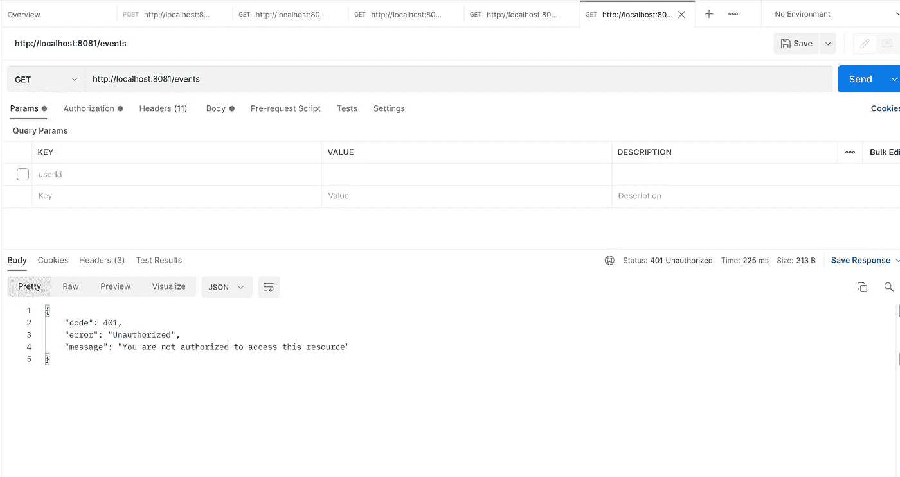
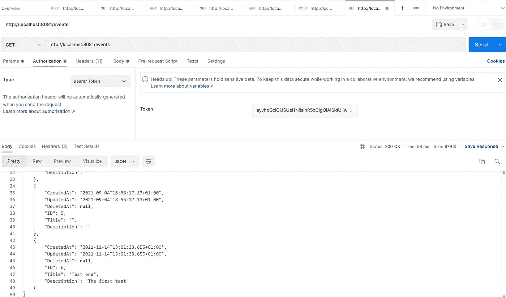
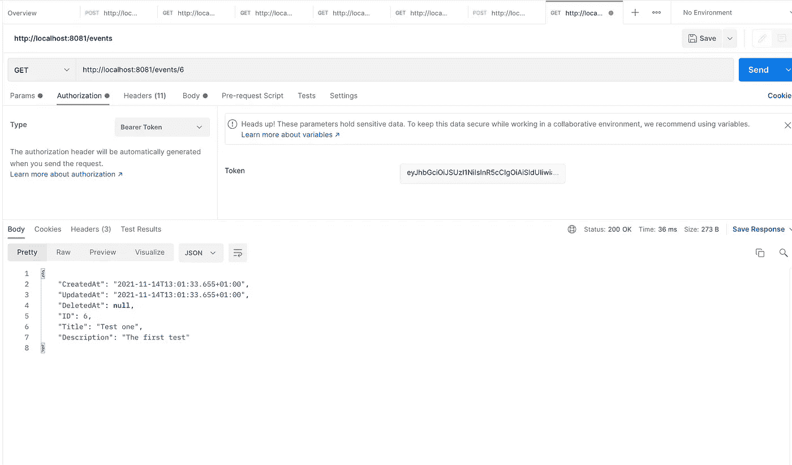

# 使用 Keycloak 进行授权在 Go 中构建微服务

> 原文：<https://levelup.gitconnected.com/building-micro-services-in-go-using-keycloak-for-authorisation-e00a29b80a43>


当使用微服务架构构建应用程序时，最好有一个中央授权服务器来处理跨服务的认证和授权。Keycloak 是一个流行的选择，作为一个开源的身份和访问管理解决方案。在这篇文章中，我将展示如何在你的 Go 微服务中使用 keycloak 进行授权。不幸的是，在写这篇文章的时候，还没有官方的 keycloak 适配器，但是我找到了一个很棒的库 [gocloak](http://github.com/Nerzal/gocloak/v8) 一个 keycloak 管理客户端，我主要用它来实现自省功能，它实际上只是 keycloak 服务器的自省令牌 api 的包装器。如果您需要做的只是内省令牌，那么您应该考虑自己编写这个函数。

对于这个特定的练习，我将构建一个简单的事件 api，它只有 3 个端点，用于创建、检索一个事件并列出所有可用的事件。我还将把事件数据保存到 mysql 数据库中。你需要一个 keycloak 服务器来完成这项工作，我的本地主机上就有一个。

**初始化 go 模块**

```
go mod init simplegoapi
```

**项目结构**

我更喜欢为我的网络应用程序使用领域驱动设计，因为我觉得这真的有助于组织项目，使查找东西变得容易，并降低复杂性。下面是这个项目的结构。

```
simplegoapi
- /src - /config
   - /controllers //contains the actual api’s
   - /services    //Handles business logic
   - /repositories //Handles data access layer
   - /domains       //contains database related structs
  main.gogo.mod
go.sum
```

**更新 go.mod**

```
module simplegoapigo 1.17require ( github.com/Nerzal/gocloak/v8 v8.1.1 github.com/gorilla/mux v1.8.0 gorm.io/driver/mysql v1.0.4 gorm.io/gorm v1.20.12)require ( github.com/dgrijalva/jwt-go/v4 v4.0.0-preview1 // indirect github.com/go-resty/resty/v2 v2.3.0 // indirect github.com/go-sql-driver/mysql v1.5.0 // indirect github.com/jinzhu/inflection v1.0.0 // indirect github.com/jinzhu/now v1.1.1 // indirect github.com/pkg/errors v0.9.1 // indirect github.com/segmentio/ksuid v1.0.3 // indirect golang.org/x/net v0.0.0–20200822124328-c89045814202 // indirect)
```

我创建了一个名为 controller 的接口，它只有一个方法 RegisterRoutes，该方法将路由器作为参数，所有控制器都将实现 controller 接口，这将允许在各种控制器中注册路由，而不必在每次添加新路由时修改 main.go。

```
package controllersimport ( “github.com/gorilla/mux”)type Controller interface { RegisterRoutes(router *mux.Router)
}
```

接下来，我们在 models 包的 event.go 文件中创建 Events struct，其内容如下，这也代表了我们的数据库表。

```
package domainsimport (“gorm.io/gorm”)type Event struct { gorm.Model ID int `json:”ID”` Title string `json:”Title”` Description string `json:”Description”`}
```

对于这个例子，我使用 gorm orm 来处理数据库迁移。存储库包中的 eventRepository.go 处理数据库中的持久化和检索。

```
package repositoriesimport ( “simplegoapi/src/config” “simplegoapi/src/domains” “simplegoapi/src/errors”)func SaveEvent(event *domains.Event) (*domains.Event, *errors.HttpError) { e := config.Database.Create(&event) if e.Error != nil { return nil, errors.DataAccessLayerError(e.Error.Error()) } return event, nil}func FindOneEventById(id int) *domains.Event { var event domains.Event config.Database.First(&event, id) return &event}func FindAllEvents() []domains.Event { var events []domains.Event config.Database.Find(&events) return events}
```

为了初始化数据库连接和进行迁移，我在配置包中创建了 dbHandler.go

```
package configimport ( “gorm.io/driver/mysql” “gorm.io/gorm” “simplegoapi/src/domains”)var Database *gorm.DBfunc DbConnect() { dsn := “root:@tcp(127.0.0.1:3306)/simple_go_db?      
   charset=utf8mb4&parseTime=True&loc=Local” db, err := gorm.Open(mysql.Open(dsn), &gorm.Config{}) Database = db if err != nil { panic(“failed to connect database”) } runMigrations()}func runMigrations() { Database.AutoMigrate(&domains.Event{})}
```

在这里，我们连接到我的本地 mysql 安装上的 simple_go_db 数据库。runMigration 函数使用 gorm 在数据库中创建或更新作为表提供的结构。

事件服务使用事件存储库处理创建和列出事件的业务逻辑

```
package servicesimport ( “encoding/json” “fmt” “github.com/gorilla/mux” “io/ioutil” “net/http” “simplegoapi/src/domains” “simplegoapi/src/errors” “simplegoapi/src/repositories” “strconv”)func CreateEvent(w http.ResponseWriter, r *http.Request) { var newEvent domains.Event reqBody, err := ioutil.ReadAll(r.Body) if err != nil { fmt.Fprintf(w, “Kindly enter data with the event title and    
     description only in order to update”) } json.Unmarshal(reqBody, &newEvent) ev, httpErr := repositories.SaveEvent(&newEvent) if httpErr != nil { w.WriteHeader(httpErr.Code) json.NewEncoder(w).Encode(errors.UnauthorizedError()) return } w.WriteHeader(http.StatusCreated) json.NewEncoder(w).Encode(&ev)}func GetOneEvent(w http.ResponseWriter, r *http.Request) { params := mux.Vars(r) idStr := params[ “id”] id, err := strconv.Atoi(idStr) if err != nil { w.WriteHeader(400) json.NewEncoder(w).Encode( errors.BadRequestError(“Id must be an integer”)) return } event := repositories.FindOneEventById(id) if event == nil { w.WriteHeader(404) json.NewEncoder(w).Encode(errors.NotFoundError()) return } json.NewEncoder(w).Encode(&event)}func AllEvents(w http.ResponseWriter, r *http.Request) { events := repositories.FindAllEvents() json.NewEncoder(w).Encode(&events)}
```

在 other 中，为了返回结构良好的 Json 错误消息，我创建了一个 httpError.go 来返回基于定义的错误的消息。

```
package configtype HttpError struct { Code int `json:”code”` Error string `json:”error”` Message string `json:”message”`}func UnauthorizedError() HttpError{ return HttpError{ 401, “Unauthorized”, “You are not authorized to access this resource”, }}func NotFoundError() *HttpError{ return &HttpError{ 404, “Not found”, “The requested resource was not found”, }}func DataAccessLayerError(message string) *HttpError{ return &HttpError{ 400, “Data access error”, message, }}func BadRequestError(message string) *HttpError{ return &HttpError{ 400, “Bad Request”, message, }}
```

**授权**

在另一个使用 keycloak 处理授权的例子中，我使用了一个拦截器，它基本上是一个在端点被调用时被调用的函数，试图检查用户是否被授权，然后如果允许的话，将请求转发到下游。在包含以下内容的服务包中创建 authService.go

```
package servicesimport ( “encoding/json” “github.com/Nerzal/gocloak/v8” _ “github.com/gorilla/mux” “net/http” “os” “simplegoapi/src/errors” “strings”)type LoginResponse struct { AccessToken string `json:”access_token”` Title string `json:”Title”` Description string `json:”Description”`}var( clientId = os.Getenv(“CLIENT_ID”) clientSecret = os.Getenv(“CLIENT_SECRET”) realm = os.Getenv(“REALM”) hostname = os.Getenv(“HOST”))var client gocloak.GoCloakfunc InitializeOauthServer(){ client = gocloak.NewClient(hostname)}func Protect(next http.Handler) http.Handler { return http.HandlerFunc( func(w http.ResponseWriter, r   
    *http.Request) { authHeader := r.Header.Get(“Authorization”) if len(authHeader) < 1 { w.WriteHeader(401) json.NewEncoder(w).Encode(errors.UnauthorizedError()) return } accessToken := strings.Split(authHeader,” “)[1] rptResult, err := client.RetrospectToken(r.Context(), 
     accessToken, clientId, clientSecret, realm) if err != nil{ w.WriteHeader(400) json.NewEncoder(w).Encode(errors.BadRequestError(err.Error())) return } isTokenValid := *rptResult.Active if !isTokenValid { w.WriteHeader(401) json.NewEncoder(w).Encode(errors.UnauthorizedError()) return } next.ServeHTTP(w, r) })}
```

protect 函数检查传递的访问令牌是否有效，我们获取访问令牌，对其进行自省，如果有效，则继续服务请求。在控制器包中创建 eventController，内容如下

```
package controllersimport ( “net/http” “simplegoapi/src/services” “github.com/gorilla/mux”)type EventController struct {}func (t EventController) RegisterRoutes(router *mux.Router) { router.Handle(“/event”,   services.Protect(http.
   HandlerFunc(services.CreateEvent))).Methods(“POST”) router.Handle(“/events/{id}”, services.Protect(http.
   HandlerFunc(services.GetOneEvent))).Methods(“GET”) router.Handle(“/events”, services.Protect(http.
   HandlerFunc(services.AllEvents))).Methods(“GET”)}
```

这里我们实现了控制器接口的 RegisterRoutes 函数，传递 authService 的 Protect 函数和负责 http 中指定动作的各种函数。
HandlerFunc 函数。这样，首先调用保护函数，然后如果一切顺利，我们继续调用服务函数。

最后，这就是 main.go 的样子

```
package mainimport ( “github.com/gorilla/mux” “log” “net/http” “simplegoapi/src/config” “simplegoapi/src/controllers” “simplegoapi/src/services”)func main() { run()}func run(){ config.DbConnect() services.InitializeOauthServer() router := mux.NewRouter().StrictSlash(true) router.Use(commonMiddleware) registerRoutes(router) log.Fatal(http.ListenAndServe(“:8081”, router))}func registerRoutes (router *mux.Router){ registerControllerRoutes(controllers.EventController{}, router)}func registerControllerRoutes(controller controllers.Controller, router *mux.Router) { controller.RegisterRoutes(router)}func commonMiddleware(next http.Handler) http.Handler { return http.HandlerFunc(func(w http.ResponseWriter, r 
   *http.Request) { w.Header().Add(“Content-Type”, “application/json”) next.ServeHTTP(w, r) })}
```

这里，我们首先通过调用 DbConnect 函数连接到数据库，该函数也将运行 db 迁移，接下来我们初始化 keycloak 客户端，然后注册 mux 路由器，并继续调用 registerRoutes 函数，该函数调用控制器中实现的 RegisterRoutes 函数。我还添加了一个中间件，它为所有对 application/json 的请求全局设置 Content-Type 头。

继续启动您的 keycloak 服务器(如果尚未启动),并测试该服务。



无效的令牌响应



列出事件响应



获得一个事件响应

完整的代码可以在这里找到[https://github.com/okemechris/simplego-api](https://github.com/okemechris/simplego-api)