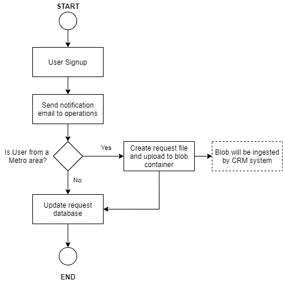
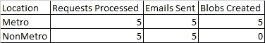
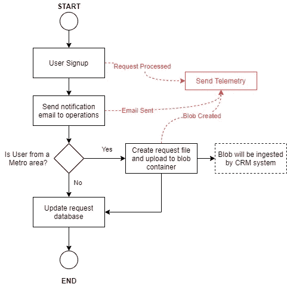
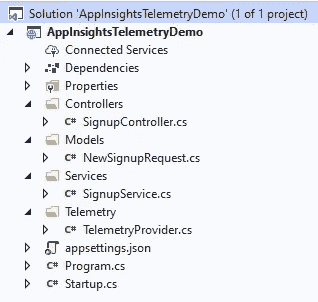
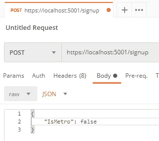
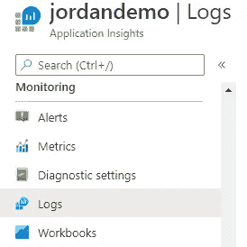
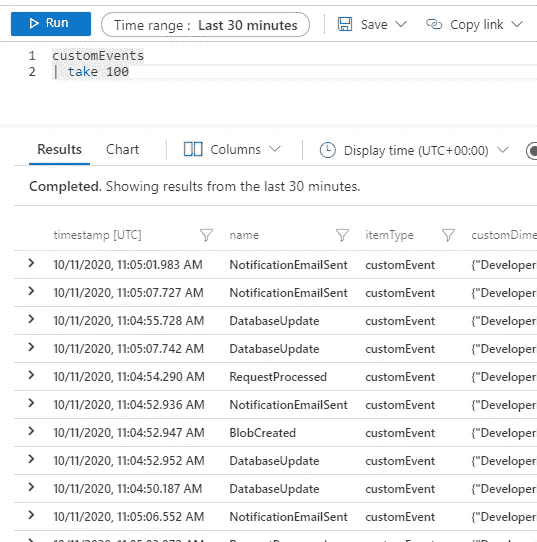
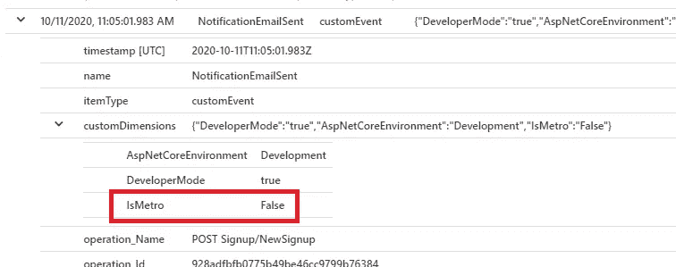
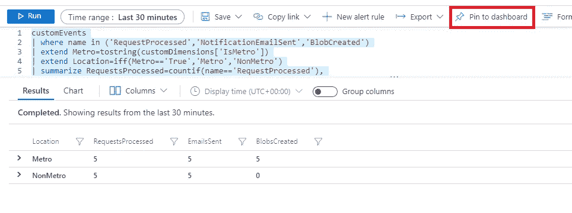

# 使用应用洞察自定义事件构建监控仪表板(ASP.NET 核心)

> 原文：<https://levelup.gitconnected.com/building-monitoring-dashboards-using-application-insights-custom-events-asp-net-core-c45228f7cf2d>


图片由来自 [Unsplash](https://unsplash.com/) 的 [Markus Winkler](https://unsplash.com/@markuswinkler) 提供

如果你是一名在 Azure 环境中工作的 web 开发人员，你很有可能使用过[应用洞察](https://azure.microsoft.com/en-au/services/monitor/?&ef_id=Cj0KCQjwt4X8BRCPARIsABmcnOo8VLbNDDisakXraMxLX99a4n9y5UdtxwPvh9bj88BC-hhvb62QVogaAu7XEALw_wcB:G:s&OCID=AID2100005_SEM_Cj0KCQjwt4X8BRCPARIsABmcnOo8VLbNDDisakXraMxLX99a4n9y5UdtxwPvh9bj88BC-hhvb62QVogaAu7XEALw_wcB:G:s)来监控你的应用。毕竟，在排除应用程序故障时，能够跟踪异常和操作时间是非常宝贵的。

但是，您是否也意识到 Application Insights 遥测技术本身也可以用于分析业务指标？

在本文中，我将介绍如何使用 Application Insights 事件创建一个仪表板来跟踪用户注册。

如果您不熟悉 Application Insights *(此后称为“App Insights”)*，我已经包含了我用来实现本文中描述的解决方案的微软文档的链接。链接在文末。

本文中使用的示例解决方案的完整代码可从 GitHub 获得:
[https://GitHub . com/therealjordanlee/appinsightstalemetrydemo](https://github.com/therealjordanlee/AppInsightsTelemetryDemo)

# 方案

我工作的一个应用程序是销售漏斗。

这遵循了一个典型的单页面应用程序架构——一个 React 前端，其中包含许多用 ASP.NET 核心编写的 API，负责所有的数据处理和验证。

销售漏斗的最后一部分(当用户输入了他们的所有细节并点击“提交”)触发了对注册 API 的调用。工作流程大致如下:



最近，我被要求帮助建立一个仪表板，业务用户可以通过它了解销售漏斗应用程序的运行情况。预期的模型看起来是这样的:



*   如果一切正常，发送的电子邮件数量应该总是等于处理的请求数量(包括地铁和非地铁位置)
*   创建的 Blobs 应该始终等于为 metro 位置处理的请求数
*   非市区位置永远不会产生斑点，预计将始终保持为 0。

# #1 —确定要收集哪些遥测数据

在进入代码之前，首先规划出哪些操作需要被跟踪以满足给定的需求是很有用的。

根据我之前的图表，我确定了需要发送遥测数据的 3 个操作。每个操作对应于仪表板中的一列:



此外，我还需要跟踪第四件事——请求的位置。再次查看 dashboard mock 中的表，您可以看到位置*不是我们需要跟踪的事件*本身，而是我们跟踪的事件的*属性*。当我们看到代码时，请记住这一点！

# #2 —解决方案概述

我的解决方案是这样的:



由于本文专门讨论 App Insights 遥测事件，因此我删除了所有处理器代码，以便专注于代码的遥测部分。

# # 3—TelemetryProvider 类

该类包含 App Insights 遥测客户端，我们将使用该客户端向 App Insights 发送事件。

这样做并不是严格要求的，但我认为从最佳实践的角度来看，这是一个好主意——将所有遥测操作封装在它们自己的类中，并使得在编写单元测试时模拟客户机成为可能。

**安装所需的软件包**

*   微软。应用洞察
*   微软。AspNetCore

```
Install-Package Microsoft.ApplicationInsights
Install-Package Microsoft.ApplicationInsights.AspNetCore
```

这是代码:

*   向 App Insights 发送遥测事件时，可以通过传递一个`Dictionary<string, string>`对象将附加属性附加到事件上。这对于以后创建仪表板至关重要。
*   调用`TrackEvent()`方法将刷新`_eventProperties`字典。这意味着遥测事件假定了事件的连续进行，即步骤 A 结束，然后是步骤 B，等等。

# #4 将 TelemetryProvider 添加到服务类别并设置遥测事件

编写完 TelemetryProvider 后，现在可以将它添加到服务类中(通过构造函数注入)，然后我们可以使用`TrackEvent()`方法将事件写入 App Insights。

这是我的注册服务示例中的代码:

*   请注意我是如何在每次调用`TrackEvent()`时发送`IsMetro`属性的。这允许我区分每个事件是响应 metro 还是非 metro 请求而被调用。
*   正如本文前面提到的，所有实际的处理和异常处理代码都已删除，因为重点是 App Insights 遥测事件。

# #5 向 appsettings.json 添加 App Insights 键

这是 App Insights 遥测客户端工作所必需的。

```
// appsettings.json
{
 **"ApplicationInsights": {
    "InstrumentationKey": "0a12345c-000f-1a23-4bcd-567e8910c25"
  },**
  "Logging": {
    "LogLevel": {
      "Default": "Information",
      "Microsoft": "Warning",
      "Microsoft.Hosting.Lifetime": "Information"
    }
  },
  "AllowedHosts": "*"
}
```

# #6 建立国际奥委会

将 App Insights 和遥测提供程序添加到 IoC 容器中。

```
// Startup.cs
using AppInsightsTelemetryDemo.Services;
using AppInsightsTelemetryDemo.Telemetry;
using Microsoft.AspNetCore.Builder;
using Microsoft.AspNetCore.Hosting;
using Microsoft.Extensions.Configuration;
using Microsoft.Extensions.DependencyInjection;
using Microsoft.Extensions.Hosting;namespace AppInsightsTelemetryDemo
{
    public class Startup
    {
        public Startup(IConfiguration configuration)
        {
            Configuration = configuration;
        }public IConfiguration Configuration { get; }public void ConfigureServices(IServiceCollection services)
        {
            services.AddScoped<ISignupService, SignupService>();
            **services.AddScoped<ITelemetryProvider, TelemetryProvider>();
            services.AddApplicationInsightsTelemetry(Configuration["ApplicationInsights:InstrumentationKey"]);**
            services.AddControllers();
        }public void Configure(IApplicationBuilder app, IWebHostEnvironment env)
        {
            if (env.IsDevelopment())
            {
                app.UseDeveloperExceptionPage();
            }app.UseHttpsRedirection();
            app.UseRouting();
            app.UseAuthorization();
            app.UseEndpoints(endpoints =>
            {
                endpoints.MapControllers();
            });
        }
    }
}
```

# #7 控制器类别

这里没有什么可做的，因为所有的遥测都是在服务类中完成的。但是为了解释的完整，下面是我的注册控制器的样子:

```
using AppInsightsTelemetryDemo.Models;
using AppInsightsTelemetryDemo.Services;
using Microsoft.AspNetCore.Mvc;namespace AppInsightsTelemetryDemo.Controllers
{
    [ApiController]
    [Route("signup")]
    public class SignupController : ControllerBase
    {
        private ISignupService _signupService;public SignupController(ISignupService signupService)
        {
            _signupService = signupService;
        }[HttpPost]
        public IActionResult NewSignup([FromBody]NewSignupRequest request)
        {
            _signupService.ProcessRequest(request);
            return Ok();
        }
    }
}
```

# #8 测试应用洞察

我们现在准备测试！让我们运行应用程序，并对 API 进行一些调用。



使用 Postman 向我的 API 发送一些请求

一旦我们向 API 发送了一些请求，我们现在就可以查看 App Insights 了。

在 Azure 门户中，转到您的 Application Insights 实例并选择 **Logs** 。



我们使用 TelemetryProvider 发送的事件保存在 customEvents 表中。让我们看看里面有什么:



还记得我们是如何在 TelemetryProvider 中将`IsMetro`属性与对`TrackEvent()`的调用一起发送的吗？展开事件的 customDimensions 部分，我们可以看到该属性已作为自定义事件的一部分发送。



所以在这一点上:

*   从 TelemetryProvider 触发的事件被记录在 customEvents 表中
*   每个事件的`IsMetro`属性都在该事件的`customDimensions`属性中。

# #9 使用 App Insights 创建仪表板

我们现在已经拥有了创建仪表板所需的一切！

我发现这是最难的部分，因为 App Insights 使用自己独特的查询语言(Kusto 查询语言)。在花了很多时间在 google 和 Kusto 语言参考上之后，我想到了下面的查询:

```
customEvents
| where name in ('RequestProcessed','NotificationEmailSent','BlobCreated')
| extend Metro=tostring(customDimensions['IsMetro'])
| extend Location=iff(Metro=='True','Metro','NonMetro')
| summarize RequestsProcessed=countif(name=='RequestProcessed'),
    EmailsSent=countif(name=='NotificationEmailSent'),
    BlobsCreated=countif(name=='BlobCreated')
    by Location
| sort by Location asc
```

*   `where`操作符过滤出满足特定条件的事件
*   `extend`向结果集追加一个新列
*   `summarize`汇总结果



有用！

所以…我们结束了！我们现在可以将这个查询固定到一个共享的仪表板上，然后我们可以与我们的业务涉众共享它。

感谢阅读，希望这篇文章对你有用！

# 参考

[](https://docs.microsoft.com/en-us/azure/azure-monitor/app/app-insights-overview) [## 什么是 Azure Application Insights？- Azure 监视器

### 实时 web 应用程序的应用程序性能管理和使用情况跟踪。检测、分类和诊断…

docs.microsoft.com](https://docs.microsoft.com/en-us/azure/azure-monitor/app/app-insights-overview) [](https://docs.microsoft.com/en-us/azure/azure-monitor/app/asp-net-core) [## ASP.NET 核心应用 Azure 应用洞察- Azure Monitor

### 本文描述了如何为 ASP.NET 核心应用启用应用洞察。当你完成…

docs.microsoft.com](https://docs.microsoft.com/en-us/azure/azure-monitor/app/asp-net-core) [](https://docs.microsoft.com/en-us/azure/data-explorer/kusto/query/) [## 概述- Azure 数据浏览器

### Kusto 查询是处理数据并返回结果的只读请求。请求是用纯文本表述的，使用的是…

docs.microsoft.com](https://docs.microsoft.com/en-us/azure/data-explorer/kusto/query/)