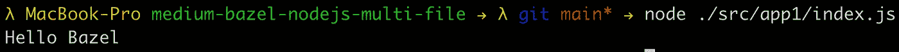
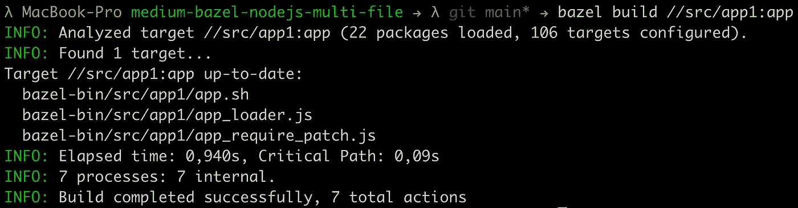
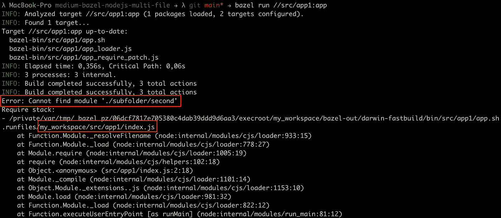
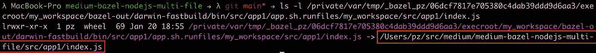
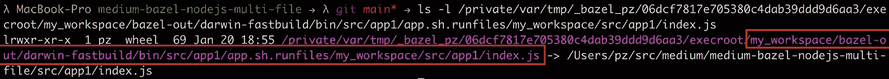
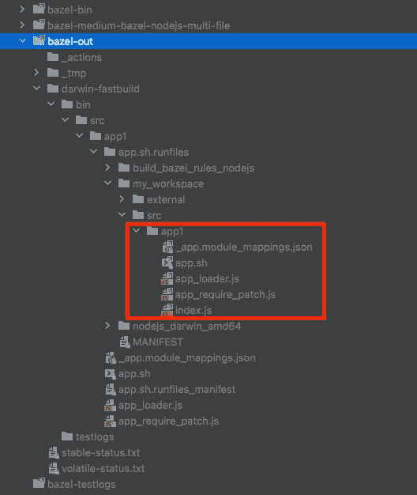
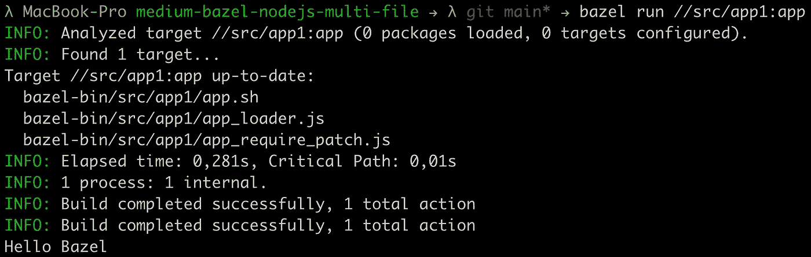
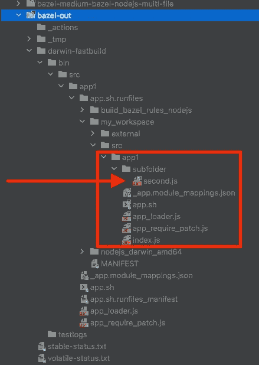
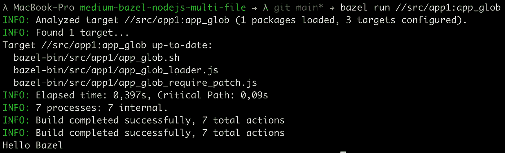
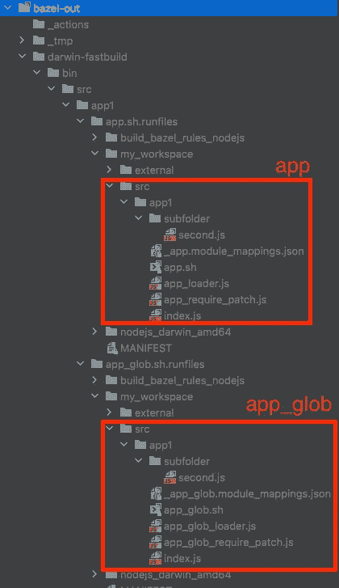

# 用 Bazel 构建多文件 Node.js 应用程序

> 原文：<https://levelup.gitconnected.com/building-multi-file-node-js-applications-with-bazel-9d631b667c8d>

使用 Bazel 构建多文件 Node.js 应用程序的分步指南。


创建应用程序时使用多个文件是非常常见的。我甚至可以说，没有一个结构良好、有用的单文件应用程序。

但是在 Bazel 中，为 Node.js 应用程序使用多个 JavaScript 文件并不能神奇地开箱即用。涉及到一些小的配置工作。

## 要求

*   [Bazel 已安装](https://docs.bazel.build/versions/main/install.html)(我在这个演示中使用的是 Bazel 4.2.2)
*   [Node.js 和 NPM 安装了](https://nodejs.org/en/)
*   请查看我的[前一篇文章](/build-and-run-your-first-node-js-application-with-bazel-898e1a92fac5)来检查一下我们将要工作的设置。我在上一个教程的基础上构建了这个教程。

[](/build-and-run-your-first-node-js-application-with-bazel-898e1a92fac5) [## 用 Bazel 构建并运行您的第一个 Node.js 应用程序

### 使用 Bazel 构建和运行第一个 Node.js 应用程序的分步指南。

levelup.gitconnected.com](/build-and-run-your-first-node-js-application-with-bazel-898e1a92fac5) 

## 你将学到什么

*   通过 Bazel 构建和运行由多个文件组成的小型 Node.js 应用程序
*   让 Bazel 向 Node.js 应用程序添加多个文件的两种不同方法。

像往常一样，我准备了一个 [GitHub 库](https://github.com/Abszissex/medium-bazel-nodejs-multi-file)供您查看完成的代码库，并遵循本文中描述的步骤。

[](https://github.com/Abszissex/medium-bazel-nodejs-multi-file) [## GitHub-abszisex/medium-bazel-nodejs-多文件

### 此时您不能执行该操作。您已使用另一个标签页或窗口登录。您已在另一个选项卡中注销，或者…

github.com](https://github.com/Abszissex/medium-bazel-nodejs-multi-file) 

## 一般设置

这里我们不会从头开始，但是我希望您熟悉我的[用 Bazel](/build-and-run-your-first-node-js-application-with-bazel-898e1a92fac5) 构建和运行您的第一个 Node.js 应用程序的文章。因此，我将只强调我们将更改的重要部分。

```
/
|- ...
|- src/
   |- app1/
     |- BUILD.bazel
     |- index.js
```

在最初的情况下，Node.js 应用程序`app1`由一个单独的文件组成，其唯一目的是将一些字符串打印到控制台。

要创建一个更大、结构更好的应用程序，我们需要添加新的文件和文件夹，所以让我们创建以下结构:

```
/
|- ...
|- src/
   |- app1/
     |- subfolder
       |- second.js
     |- BUILD.bazel
     |- index.js
```

现在有一个名为`subfolder`的文件夹包含第二个 JavaScript 文件`second.js`。`second.js`文件可能有一些有价值的功能，我们希望将它们包含在驻留在`index.js`的实际应用程序中。所以让我们添加一些代码。

对于我们的`second.js`,我们将只添加一个小助手，它在输入变量前面添加字符串`Hello`,并返回它。我们以一个对象的形式导出这个助手，包含作为属性的`myFunc`，以及作为属性值的我们定义的方法。

在`index.js`文件中，我们添加了一个`require`语句来导入导出的模块，并使用参数`'Bazel'`调用`myFunc`方法。

## 让我们运行它

为了测试我们的 Node.js 应用程序是否工作，我们现在可以运行以下命令之一:

```
# Running from root level
node ./src/app1/index.js# Running from application level (./src/app1)
node index.js
```

两个命令应该打印相同的`Hello Bazel`输出。



但是当然，我们不想在使用 Bazel 时直接运行`node`命令。让我们来看看 Bazel 命令。

**通过 Bazel 建造和运行**

首先，让我们通过`bazel build //src/app1:app`来“构建”应用程序。



正如我们所料，它的工作没有问题。但这并不奇怪，因为 JavaScript 并不是一种需要编译以便在运行时会弹出错误的语言。

现在，我们还希望能够通过`bazel run //src/app1:app`像往常一样运行我们的应用程序。让我们看看。



如你所见，有一个错误。这个错误告诉我们我们的文件`index.js`找不到模块`/subfolder/second`。这个错误起初是意料之外的，因为通过`node`运行它也是可行的。但是如果你仔细看看`index.js`文件路径，你会注意到基于我们的项目根，它不在`./src/app1/index.js`处。但这是巴泽尔管理的临时文件夹。

让我们进一步调查一下。使用指向上面错误消息中提到的`index.js`文件的`ls -l`，我们可以看到它指向我们实际的`index.js`。



但是如果你检查临时文件，它的一部分听起来很熟悉。



`my_workspace`是我们在`WORKSPACE.bazel`文件中定义的命名工作空间。而`bazel-out`文件夹是 Bazel 在工作区根目录下自动生成的文件夹。因此，让我们检查项目中的`bazel-out`文件夹，并遵循剩余的路径。



我们可以看到，在这条路的尽头，我们找到了我们的`index.js`。在这个`index.js`上再次使用`ls -l`，我们会注意到它指向我们原来的那个。但是我们这里缺少的是我们的`subfolder/second.js`。文件夹和 JavaScript 文件都不在这里。这也解释了为什么`index.js`找不到`subfolder/second.js`模块，因为它没有链接到 Bazels 上下文。

让我们解决这个问题。

**BUILD.bazel**

检查`app1`应用程序的`BUILD.bazel`文件，我们有了定义应用程序的`nodejs_binary`目标。可以看到只有`index.js`被设置为入口点。但是看不到对其他文件的引用。

为了向应用程序添加更多的文件，我们可以使用`data`参数在一个数组中添加额外的文件。在下面的代码片段中，您可以看到它在我们的示例中的样子。

如果我们现在尝试通过`bazel run //src/app1:app`重新运行该应用程序，我们将看到它可以工作，并将`Hello Bazel`打印到控制台。



为了验证一切正常，我们还可以再次检查`bazel-out`文件夹，并会注意到`subfolder/second.js`现在已经存在。



可以想象，如果我们对应用程序中的每个文件都使用上述方法，会变得非常乏味，特别是当文件变大时。此外，您不希望添加数组中的每一个文件，以防止认知负荷和潜在的错误，如果您错过了一个文件。

全球拯救组织

幸运的是，Bazel 支持开箱即用的 glob 模式。你可以在这里找到关于 glob 函数[的官方文档。](https://docs.bazel.build/versions/main/be/functions.html#glob)

使用 globs，我们现在可以快速编写以下代码来包含所有需要的 JavaScript 文件:

使用`glob(["**/*.js"])`而不是显式定义每个文件，我们在 Node.js 应用程序的包的每个子目录中包含每个`.js`文件。请注意，我还在这里更改了`nodejs_binary`目标的`name`，以便我们可以区分它们。

为了验证 glob-way 也能工作，让我们运行`bazel run //src/app1:app_glob`并查看控制台输出。



让我们再次查看`bazel-out`文件夹，验证两种变体——显式文件名与 glob——是否工作相同。在下图中，您可以看到`app`和`app_glob`目标的输出。两者具有相同的文件和相同的结构。



## 摘要

在本文中，您应该已经学会了通过 Bazel 构建和运行一个由多个文件组成的小型 Node.js 应用程序。此外，您还体验了向应用程序添加文件的两种不同方式。

## 你想联系吗？

如果你想联系我，请通过 [LinkedIn](https://www.linkedin.com/in/pascal-zwikirsch-3a95a1177/) 联系我。

另外，请随意查看[我的书籍推荐](https://medium.com/@mr-pascal/my-book-recommendations-4b9f73bf961b)📚。

[](https://mr-pascal.medium.com/my-book-recommendations-4b9f73bf961b) [## 我的书籍推荐

### 在接下来的章节中，你可以找到我对所有日常生活话题的书籍推荐，它们对我帮助很大。

mr-pascal.medium.com](https://mr-pascal.medium.com/my-book-recommendations-4b9f73bf961b) [](https://mr-pascal.medium.com/membership) [## 通过我的推荐链接加入 Medium—Pascal Zwikirsch

### 作为一个媒体会员，你的会员费的一部分会给你阅读的作家，你可以完全接触到每一个故事…

mr-pascal.medium.com](https://mr-pascal.medium.com/membership)