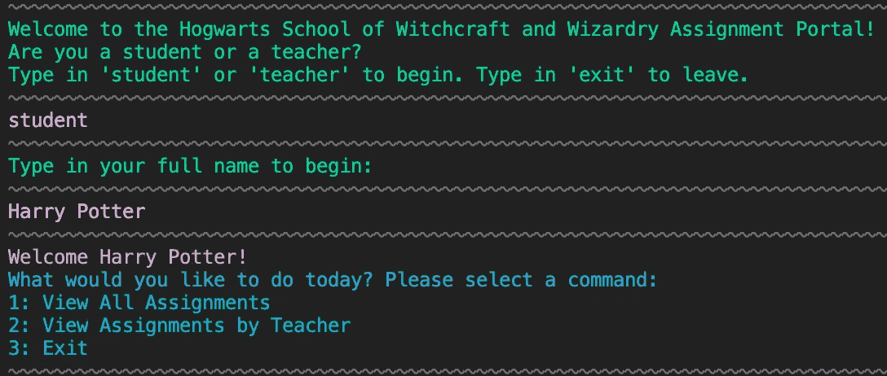
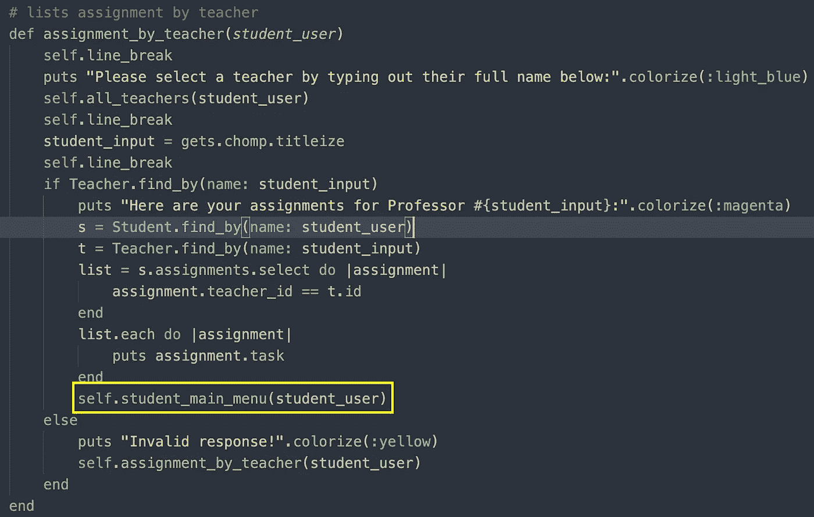

# 构建我的第一个 CLI 应用

> 原文：<https://levelup.gitconnected.com/building-my-first-cli-app-7f636946000>

在 bootcamp 的前两周学习了 Ruby 和 ActiveRecord 之后，终于到了展示我从零开始构建我的第一个命令行界面(CLI)应用程序的时候了。到目前为止，我做过的唯一一个 CLI 应用程序是为了构建一个井字游戏的前期工作。然而，这个项目将是我第一次从一个空白文件开始，我必须想到一个应用程序的想法，并把它变成现实。

一开始，这是非常令人生畏的，我觉得我就要去攀登珠穆朗玛峰，没有合适的装备或服装。然而，最终我学会了信任自己的知识，并对自己的技能和对 Ruby 和 ActiveRecord 的理解建立了信心。现在回想起来，这一周的学习和建设有三大收获。

**先**，计划计划计划！这是一个耗时的过程，但它确实帮助我编写了我的应用程序。我的记事本大概有 5-7 页，专门用来对我想要构建的应用程序进行头脑风暴，找出必要的模型，确定每个模型所需的属性，最后创建模型之间的关系。我决定使用霍格沃茨魔法学校的作业应用程序。

模型是学生、教师和作业，作业是连接模型。一旦解决了这个问题，我就计划好了我的应用程序的功能。这又占用了几页，最终我让学生们能够查看所有的作业或老师布置的作业，如下所示。教师将能够为所有学生创建作业，为单个学生创建作业，编辑作业和删除作业。所有这些都计划好了，让我对我的应用程序应该能够做什么和我需要编码什么有了一个非常清晰的了解，这在我开始编码时被证明是无价的。



学生用户视角

**其次**，在学习 Ruby 的两周时间里，保持事物“干燥”的概念被经常提及。然而，直到我开始创建这个应用程序，我才完全理解这种做法的意义，与我在课堂上做的实验相比，这个应用程序有许多行代码。我的应用程序最终总共有 20 个方法:7 个用于学生，10 个用于教师，还有 3 个附加方法。当我使用第三个方法时，我意识到我的方法变得很长，这是因为我重复了许多行代码。下面是一个非常频繁重复的代码示例:


上面几行代码允许用户返回主菜单或退出应用程序。我没有一遍又一遍地重写它，而是把它变成了一个独立的方法，如下所示:


然后，通过使用下面的代码行，我可以在其他方法中需要时引用上面的方法:

```
self.student_main_menu(student_user)
```



“干”的实践允许我保持我的个人方法更短，这使得在出现问题时更容易调试。我最终创建了许多这样的助手方法，并在上面的方法中有规律地使用它们作为证据。

最后的**外卖是测试和定期测试。当我构建我的应用程序时，我意识到持续测试我的应用程序以确保它按照我的计划运行是非常重要的。测试还让我认识到应用程序的一些方面对用户不友好，需要调整。例如，最初应用程序会在我完成一个选项后退出，这意味着一旦老师查看了作业列表，它就会退出应用程序。但是如果老师想完成另一个动作呢？我意识到我需要为他们创建一个返回主菜单或退出的选项。此外，我需要一个欢迎页面来区分它是学生用户还是教师用户。运行大量的测试也帮助我意识到，当我在代码中创建冗余时，在实际退出应用程序之前，会将用户带到退出菜单两次。在构建过程中和完成后，多次测试我的应用程序的各个方面有助于我识别错误，并使我的应用程序更加用户友好。**

我希望这些要点能帮助你创建你的第一个 CLI 应用程序！

1.  *计划，计划，计划*
2.  *干*
3.  *测试和定期测试*