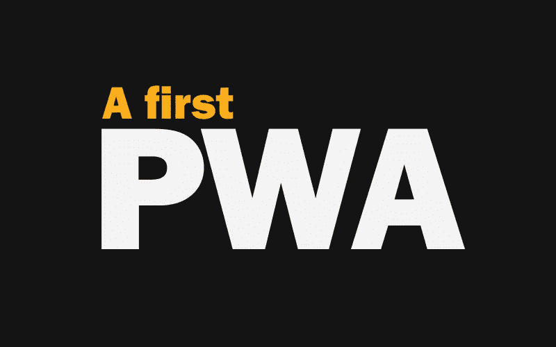
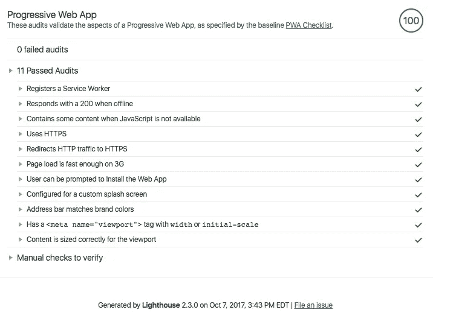

# 建造我的第一个 PWA

> 原文：<https://levelup.gitconnected.com/building-my-first-pwa-d90c61013420>

*原载于我的个人博客*[*https://tylergaw.com/articles/building-my-first-pwa*](https://tylergaw.com/articles/building-my-first-pwa)



一段时间以来，我一直在寻找时间和沙盒来坐下来学习如何建立离线/第一网站或“渐进式网络应用”(PWA)。我通过亲身实践的方法学得最好。ColorMe 是我维护的一个网站，也是离线实验的绝佳选择。这篇文章详细介绍了我采取的步骤，我遇到的问题，以及我在构建我的第一个 PWA 时学到的东西。

快速笔记。这不是一个普通的“如何制作 PWA”帖子。这甚至可能不是一个好的介绍。有大量的文章和教程来获得基本知识。这个帖子是专门针对制作 ColorMe PWA 的工作的。

在我读到的很多关于 pwa 的文章中，都有构建它们的通用步骤。表面上看起来很简单的过程。这是杰里米的一份清单:

> 切换到 HTTPS，
> 
> 用元捕获添加一个 JSON 清单文件，并
> 
> 添加服务人员。
> 
> 杰里米·基思，《发展网络》

好的，这看起来很简单。除了最后一步。看起来要打开的东西太多了。他确实提供了一份免责声明:

> 如果你是第一次接触服务人员，最后一步可能会很棘手，但也不是不可克服的。

现在，我将忽略这个过程中的服务人员部分，而专注于前两项。

# 使用 HTTPS

ColorMe 已经有了 HTTPS。我在 S3 托管它，并通过 CloudFront 提供服务。我用[亚马逊的证书管理器](https://aws.amazon.com/certificate-manager/)添加了一个 SSL 证书。HTTPS 已经就位，并自发射以来一直如此。

# 添加清单

这是事情变得更有趣的地方。我用 [Create React App](https://github.com/facebookincubator/create-react-app) (CRA)构建了 ColorMe，所以我在`public`目录下创建了一个`manifest.json`文件。与网站图标和`index.html`相同的目录。`public`目录中的任何内容都被原样复制到`build`目录中。这就是我们需要的`manifest.json`。

# CRA 做的 PWA 不是开箱即用的吗？

是的。CRA 在版本`1.0.0`中增加了对 PWAs 的内置支持。ColorMe 还在版本`0.8.4`上。这是我创建项目时的最新版本，没有理由更新。

我本可以更新 CRA 来使用内置的 PWA，但是我不想错过逐步学习的机会。我自己这样做，走了一条漫长而“愚蠢”的路，帮助我理解了每一步的原因和方法。在未来 CRA 建造的项目中，我将使用内置 PWA 支持的最新版本。这样一来，这就是我所有的“元剪辑”

我知道货单上有“东西”，但我不确定具体是什么。我能用什么钥匙？每个键的示例值是什么？我应该有什么键值呢？我为第一个和第二个问题找到的最佳资源是 MDN [Web 应用清单文档](https://developer.mozilla.org/en-US/docs/Web/Manifest)。它列出了可用的键和示例值。

# 灯塔

对于第三个问题，我求助于 Chrome 开发工具中的[灯塔审计](https://developers.google.com/web/tools/lighthouse/)。在向清单添加任何东西之前，我进行了 PWA 审计。它报告了满足 PWA 最低要求所需的项目(根据审计)。


以审计报告为起点，我逐一检查了清单上的每一项。最重要的是，我在`index.html`的`head`中引用了清单。这使用了 CRA 特有的`%PUBLIC_URL%`。

```
<link rel="manifest" href="%PUBLIC_URL%/manifest.json">
```

清单中的大多数项目都很简单，所以我不会一行一行地介绍。但我会说出几个需要更多努力的项目。你可以在 GitHub 和下面看到完整的文件[:](https://github.com/tylergaw/colorme/blob/develop/public/manifest.json)

```
{
 "background_color": "#ffffff",
 "theme_color": "#B50003",
 "display": "standalone",
 "short_name": "ColorMe",
 "name": "ColorMe",
 "start_url": "/",
 "icons": [{
  "src": "launcher-icon-48x48.png",
  "type": "image/png",
  "sizes": "48x48"
 }, {
  "src": "launcher-icon-96x96.png",
  "type": "image/png",
  "sizes": "96x96"
 }, {
  "src": "launcher-icon-192x192.png",
  "type": "image/png",
  "sizes": "192x192"
 }, {
  "src": "launcher-icon-256x256.png",
  "type": "image/png",
  "sizes": "256x256"
 }, {
  "src": "launcher-icon-384x384.png",
  "type": "image/png",
  "sizes": "384x384"
 }, {
  "src": "launcher-icon-512x512.png",
  "type": "image/png",
  "sizes": "512x512"
 }]
}
```

# 图标大小

正如你在 manifiest 中看到的，我包括了六种不同大小的图标。审计需要两种尺寸；192x192 和 512x512。前者用于 Android 上的主屏幕图标，后者用于 Android 上的闪屏图标。

我不确定其他四种尺寸是否有必要，但我在例子中看到了它们，所以我认为包含它们不会有什么坏处。

# 主题颜色

根据审计，一个需求是给`index.html`添加一个`theme-color`元标签:

```
<meta name="theme-color" content="#B50003">
```

> 主题颜色 meta 标签确保当用户访问你的网站时，地址栏被标记为普通网页。

# noscript

另一个失败的审计是“当 JavaScript 不可用时包含一些内容。”为此，我添加了`noscript`内容。除了为没有 JavaScript 就无法工作而道歉之外，它没有做任何事情。如果没有 JS，拥有一些有用的经验会更好，但是我会把这个留到以后再说。想想如何让这样的网站在没有 JavaScript 的情况下提供价值，这很有趣。

# “根据审计”

我在这里故意使用了特定的语言，如“根据审计”和“根据审计”。其中一些并不普遍。例如，据我所知，`theme_color`属性和`theme-color` meta 标签对 iOS 上的 Mobile Safari 或 Mobile Chrome 没有影响。出于这个练习的目的，我正在努力 100%地进行审计。我确信不是每个项目都需要每个项目。像往常一样，看情况。

# Chrome 开发工具清单标签

每次我对清单进行更改时，我都会重新运行 PWA 审计来检查结果。这太慢了。我没有意识到 Chrome 开发工具中有一个选项卡可以检查`manifest.json`的结果。我在这个过程中很早就发现了这一点，这有助于加快事情的进展。它还有一个“添加到主屏幕”按钮来测试这个机制。非常感谢，因为我没有安卓设备来进行正确的测试。

在这一点上，我仍然没有一个 PWA。审计发现了最后一个失败之处:

> *失败:站点未注册服务工作程序，服务工作程序未缓存清单 start_url。*

有了清单的基础，我把注意力转向了服务人员。

# 服务人员

就像我上面提到的，这对我来说是最大的谜团。我理解服务工作者的一般概念，但我不明白一个 PWA 的服务工作者的目标是什么。当然是 JS，后台运行。但是那个 JS 应该*做什么*？在花时间学习教程、例子和摆弄之后，我有了更清晰的认识。

# ColorMe 服务人员的目标:

1.  在`window.caches`对象中存储站点的静态文件——HTML、CSS、JavaScript 和图像
2.  拦截所有网络请求。如果请求文件的名称在`window.caches`中，用缓存的文件响应，而不是向服务器发出请求
3.  当缓存键改变时删除过时的缓存

最早引人注目的是全局`window`作用域上的`caches`成员。当我第一次看到`caches`使用示例服务工作者时，我认为它只是服务工作者上下文中的一个全局变量。事实并非如此。`window.caches`适用于任何 JS。

这里有一个`caches`的快速例子。转到 [colorme.io](https://colorme.io/) 。打开开发人员控制台并运行以下代码片段:

```
caches.keys().then(names => {console.log(names)});
```

这应该输出`["colorme-v7"]`(版本号可能不同)。看的不多，但是可以看到`window.caches`是这个语境下的一个东西。这意味着您可以从任何客户端 JavaScript 访问缓存，而不仅仅是服务人员。那很酷。

# 目标 1:缓存静态文件

为了让 ColorMe 离线工作，它需要缓存所有关键的静态文件。这是一个单页网站，所以只有几个；`index.html`、`main.css`、`main.js`、`manifest.json`、一个 svg 图像和一个 Google 字体样式表。

CRA 构建过程创建或重命名 CSS、JS 和 image 文件。这使事情变得困难，我将在后面描述我修复它的过程。现在，我将假设文件名就是文件名，并遍历代码。

我在`public`目录中创建了`service-worker.js`。完整文件可从 GitHub 上的[获得。](https://github.com/tylergaw/colorme/blob/03946e9540a031075f3f691356d7aa3f4e457a2d/public/service-worker.js)

```
const STATIC_CACHE_NAME = "colorme-v1"; 
const STATIC_URLS = [ 
  "/", 
  "/index.html", 
  "/manifest.json", 
  "/static/css/main.css", 
  "/static/js/main.js", 
  "/static/media/bgTransparent.svg",
  "https://fonts.googleapis.com/css?family=Cousine:400|Karla:400,700" 
]; self.addEventListener("install", event => { 
  event.waitUntil( 
    caches.open(STATIC_CACHE_NAME).then(cache => { 
      return cache.addAll(STATIC_URLS); 
    }).then(() => self.skipWaiting()) ); 
});
```

`STATIC_CACHE_NAME`是该缓存的唯一键。`STATIC_URLS`是要缓存的文件列表。我将在后面解释如何更新这个列表来考虑动态文件名。

大致来说，下一行写着:

1.  当维修工人完成安装过程时，
2.  找到或创建一个以我们的名字命名的缓存，
3.  并将我们指定的文件放入缓存中。

有安装事件和`waitUntil`的完整描述。 [MDN](https://developer.mozilla.org/en-US/docs/Web/API/InstallEvent) 就是一个很棒的。

## 跳过等待？

我读过关于`skipWaiting`的文档，但是我仍然不清楚它是做什么的，或者我是否需要它。很多例子推荐，所以我暂时保留。当我使用它的时候，我会了解更多。

有了这些行，ColorMe 的静态资产就藏在一个缓存中。尽管如此，仍有工作要做。

# 目标 2:提供缓存文件

将静态文件放入`caches`本身是不够的。为了让 ColorMe 脱机工作，我们需要告诉浏览器在缓存中查找这些文件。

```
self.addEventListener("fetch", event => { 
  event.respondWith( 
    caches.match(event.request)
      .then(response => response || fetch(event.request))
  ); 
});
```

这个代码片段监听来自用户浏览器的所有 HTTP 请求。`event.respondWith`阻止浏览器的默认`fetch`处理。这允许我们检查请求的 URL–`event.request`–是否在缓存中。如果是，用缓存的文件进行响应。如果没有缓存，使用`fetch()`继续向服务器发送请求。

ColorMe 现在可以在有或没有互联网连接的情况下工作。



# 目标 3:删除过时的缓存

如果我停在这里，ColorMe 离线工作，但我没有办法向用户发布更新。缓存的项目必须被删除——它们永远不会过期。服务人员应该删除过时的缓存。

```
self.addEventListener("activate", event => { 
  event.waitUntil(
    caches.keys().then(cacheNames => { 
      return Promise.all( 
        cacheNames.filter(name => name.includes("colorme") && name !== STATIC_CACHE_NAME)
      .map(name => caches.delete(name)) ) })
      .then(() => self.clients.claim()) 
  ); 
});
```

这是 service worker 中看起来最复杂的代码，但是它没有做太多事情。

1.  用`caches.keys()`获取所有缓存键的数组，
2.  删除所有不包含我们名字的关键字，并删除一个包含准确的`STATIC_CACHE_NAME`的缓存，
3.  对于剩余的每个键，删除该缓存。

当服务人员激活时——每次页面加载时——检查是否有过时的缓存。如果有，就删掉。我用上面的#2 来确定缓存是否过时。

在第一段代码中，我定义了缓存键`const STATIC_CACHE_NAME = "colorme-v1"`。当我更改任何缓存文件并部署站点时，我也会更改版本号。如果用户在`colorme-v1`是最新的时候访问了站点，然后在`colorme-v7`是最新的时候再次访问，服务工作者删除 v1 并缓存 v7。

# 缓存动态文件名

至此，我已经达到了 ColorMe 服务人员的所有目标，并且拥有了一个正常工作的 PWA。如果您访问 ColorMe，然后关闭您的网络连接，您应该能够刷新页面并正常使用它。

有一个问题我上面提到过。CSS、JS 和 image 的文件名不正确。在前面的代码片段中，我缓存了名为；

*   `"/static/css/main.css"`
*   `"/static/js/main.js"`
*   `"/static/media/bgTransparent.svg"`

CRA 构建过程将这些文件名指纹化为类似于:

*   `"/static/css/main.2ebebc14.css"`
*   `"/static/js/main.7e7a1a8f.js"`
*   `"/static/media/bgTransparent.e6317315.svg"`

这是常见的缓存破坏，以便浏览器将识别新文件。

我被这件大事耽搁了。当我无法控制文件的名称时，我如何告诉服务人员缓存文件呢？我没有找到太多关于这个话题的信息。[这个问题](https://github.com/w3c/ServiceWorker/issues/657)提出了问题，讨论帮我想出了一个办法。我需要在构建过程中以某种方式生成文件名列表。我有几个选择，有几个不是很好；

1.  运行 CRA 弹出脚本，并更改默认 webpack 构建流程以生成服务工作进程
2.  更新到最新的 CRA，并使用其内置的 PWA 支持
3.  离开电脑，睡上一觉，在第二天早上遛狗的时候思考更好的解决方案

我不想被逐出 CRA，因为这似乎不值得。我上面提到过，更新到最新的 CRA 会剥夺学习的机会。选项 3 听起来最好。离开电脑后，我意识到我有比我意识到的更多的选择，以及一个*应该*起作用的解决方案。它不会是优雅的或可伸缩的，但它能完成工作。

# 借用 CRA 的构建脚本

默认的 CRA 构建脚本根据 webpack 中的配置构建项目。我不能在不弹出的情况下更改配置，但是我可以在`package.json`中添加构建脚本。我已经修改了脚本，加入了`NODE_PATH=src`。这使得在不引用完整路径的情况下导入模块变得更加容易。ColorMe 的起始构建脚本如下所示:

```
NODE_PATH=src react-scripts build
```

我知道一些事情。我知道构建过程会创建一个名为`asset-manifest.json`的文件。该文件的内容包括站点中使用的所有静态资产的完整指纹名称。清单文件的内容示例:

```
{
 "main.css": "static/css/main.2ebebc14.css",
 "main.css.map": "static/css/main.2ebebc14.css.map",
 "main.js": "static/js/main.7e7a1a8f.js",
 "main.js.map": "static/js/main.7e7a1a8f.js.map",
 "static/media/bgTransparent.svg": "static/media/bgTransparent.e6317315.svg"
}
```

这些是我需要用我的服务人员缓存的完整文件名。我需要将这些文件名保存到服务人员文件中。

我做的第一件事是添加到构建脚本中。回到`package.json`，我将脚本更新为:

```
NODE_PATH=src react-scripts build && npm run generate-sw
```

这上面说:运行正常的构建过程，完成后运行另一个 npm 脚本。该脚本看起来像:

```
"generate-sw": "node scripts/generate-sw.js"
```

为了确保有效，我创建了`/scripts/generate-sw.js`并添加了一行代码；`console.log('hello')`。然后，我运行构建脚本`npm run build`以确保项目构建成功，我在终端输出中看到了“hello”。到目前为止一切顺利。

## 生成脚本

我需要将文件名从`asset-manifest.json`中取出，放入文件名数组中，并缓存在`service-worker.js`中。我的计划是不要幻想这个。我只需要从一个文件中取出字符串，并将它们写入另一个文件。目标文件是 JavaScript 这一事实对于这个过程并不重要。

GitHub 上的[提供了完整的文件，我将在这里详细介绍代码。](https://github.com/tylergaw/colorme/blob/03946e9540a031075f3f691356d7aa3f4e457a2d/scripts/generate-sw.js)

```
const manifest = require("../build/asset-manifest.json"); 
const fs = require("fs"); 
const swPath = "build/service-worker.js";
```

首先是设置。`asset-manifest`是 JSON 所以我把它`require`放在这里作为对象使用。我将使用`fs`包来读写文件。为了方便起见，我存储了服务人员的路径。

```
const urlsCSV = Object.keys(manifest)
  .filter(k => !k.includes(".map"))
  .map(k => manifest[k]);
```

越来越有趣，但仍然不花哨。这段代码的目标是构建一个文件名数组。首先，使用`Object.keys`从清单 JSON 中获取键，以循环访问一个数组。

接下来，使用`filter`删除包含字符串“. map”的键。如果你查看`asset-manifest.json`，你会看到源地图。我们不想缓存这些。我不确定是否有支持或反对这种做法的最佳实践，但我认为这似乎不适合这个项目。

现在我们只有想要缓存的文件的键，使用`map`创建文件名数组，存储为`urlsCSV`；

```
[
  "static/css/main.2ebebc14.css", 
  "static/js/main.7e7a1a8f.js",
  "static/media/bgTransparent.e6317315.svg"
]
```

**短切线。根据上面的代码，你可能会问:*“为什么不用* `*Object.values*` *而不用* `*Object.keys*` *加* `*map*` *？”这个问题很好，回答也很快。在撰写本文时，我运行的是 Node.js 版本 6.9.1。在版本`7.0.0`之前，没有`--harmony`标志，不支持`Object.values`。我本不想为此升级 Node.js。我下次会做那件事。仅此而已。***

我需要将文件名数组放入服务工作者文件中。同样，这并不意味着花哨或可伸缩。它是用来工作的。

```
fs.readFile(swPath, "utf8", (err, data) => { 
  if (err) { 
    return console.log("Error trying to read SW file", err); 
  }   const result = data.replace(
    "%MANIFESTURLS%",
    JSON.stringify(urlsCSV)
  );   fs.writeFile(swPath, result, "utf8", err => { 
    if (err) { 
      return console.log("Error trying to write SW file", err); 
    } 
  }); 
});
```

我们来分析一下。首先，打开维修工人文件(`swPath`)进行读取。错误条件并不重要。我把它包括进来是为了在构建过程中万一发生一些奇怪的事情时对自己好一点。

下一行是这个脚本的要点。它在服务工作者文件(`data`)的内容中搜索唯一的字符串`“%MANIFESTURLS%”`。当找到它时，它被替换为文件名数组的 JSON 字符串版本，`urlsCSV`。然后，更新的内容被写回到服务工作者文件。

# service-worker.js 的更新

如上所述，生成脚本需要在`service-worker.js`中找到`“%MANIFESTURLS%”`。我回去更新了脚本来解释这一点。

```
const STATIC_CACHE_NAME = "colorme-v1"; 
const BASE_STATIC_URLS = [ 
  "/", 
  "/index.html", 
  "/manifest.json", 
  "https://fonts.googleapis.com/css?family=Cousine:400|Karla:400,700" 
]; const STATIC_URLS = BASE_STATIC_URLS
  .concat(
    JSON.parse('%MANIFESTURLS%')
  ); // The install handler is the same as when we started. self.addEventListener("install", event => { 
  event.waitUntil(
    caches.open(STATIC_CACHE_NAME).then(cache => {
      return cache.addAll(STATIC_URLS); 
    }).then(() => self.skipWaiting()) 
  ); 
});
```

我把我知道的文件名移到了`BASE_STATIC_URLS`。我不会对这些文件名进行指纹识别，所以硬编码它们是安全的。接下来是重要的变化。仍然是文件名的数组，但是现在它是两个数组的组合。我们知道的文件名和写入该文件的生成的文件名数组。

`STATIC_URLS`最终看起来像这样；

```
[ 
  "/", 
  "/index.html", 
  "/manifest.json", 
  "https://fonts.googleapis.com/css?family=Cousine:400|Karla:400,700", "static/css/main.2ebebc14.css",
  "static/js/main.7e7a1a8f.js",
  "static/media/bgTransparent.e6317315.svg" 
]
```

当项目构建过程运行时，指纹文件名和`asset-manifest`被改变。然后服务人员会得到新文件名的更新。

所有这些加起来就是一个处理指纹文件缓存的构建过程和一个支持离线的 PWA。

# 新常态

我看到人们详细谈论艾滋病毒感染者有多么具有变革性，但直到我经历了这个过程，我才明白。这感觉像是第一次构建一个响应式设计。这是意识到这不会是一个噱头或一个额外的或一个美好的拥有。习惯的养成和浏览器的跟上需要时间，但这将成为我建立网站时的默认设置。

*感谢阅读*

*原载于*[*tylergaw.com*](https://tylergaw.com/articles/building-my-first-pwa)*。*