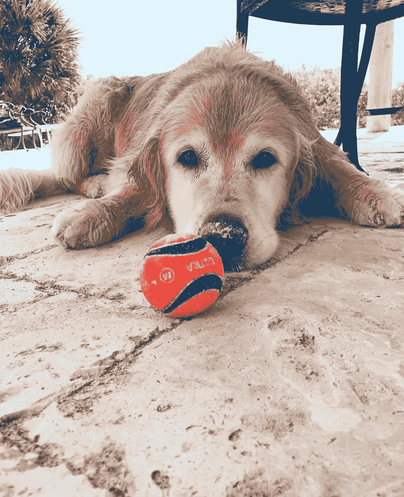

# 构建我自己的狗玩具推荐器

> 原文：<https://levelup.gitconnected.com/building-my-own-dog-toy-recommender-bf24d658d245>

对于我在大会上的最后一个顶点项目，我真的很难想出一个该做什么的主意。我知道我想创建一个模型，这个模型可能会被其他人使用，与我热衷的事情相关，并且可以在几周内实现。对我来说，这比我原先想象的要困难得多。我有很多不同的兴趣，但对其中的很多人来说，我提出的想法似乎在时间框架内无法实现，而且我不确定我需要什么样的数据，甚至不知道是否可以获得。最终，我决定创建一个狗玩具推荐系统。

Middy Taft(图片由作者提供)

起初，我想的更多的是预测狗的个性，然后根据个性推荐一个玩具，但这并不真正有意义，因为它实际上不是一个推荐系统。相反，它是一个性格预测器，即使我想创建它，我仍然不确定我需要什么类型的数据。当我们最终在课堂上学习了推荐系统之后，我意识到了我想要用来创建我的系统的方法。

为了收集数据，我决定查看所有来自 chewy.com 的狗玩具。使用硒和美丽的汤，我收集了狗玩具的标题，价格，总体评级，描述和评论。通常来说，刮擦并不像听起来那么简单，这个过程无疑证明了自己是相当困难的。在第一次使用 Selenium、不同格式的狗玩具页面和大量的玩具之间，我必须想出不同的方法来克服我不断遇到的所有小错误。

正如在本课程中反复教导我们的那样，数据收集、清理和 EDA 始终是数据科学和数据分析中耗时最长、最具挑战性的部分。尽管这不是我第一次收集自己的数据，但这绝对是最具挑战性的一次。但是当另一个错误出现后，我不得不第十亿次重新开始我的代码，我不断告诉自己，所有的挑战都是学习的时刻，这个顶点作为一个整体将是一个巨大的学习时刻，完全值得。

在最终收集了我所有的数据后，我终于能够继续进行数据清理、预处理和 EDA。幸运的是，我的数据大部分都很干净。我需要对某些列做一些小的改动，比如去掉价格中的' $ '和转换数据类型，但没什么大不了的。预处理也没那么糟糕。我决定让我的推荐系统使用来自产品描述、主要优点(如果玩具有这些优点，而只有少数玩具没有)以及我收集的评论数量的所有文本。因此，我必须将这些列组合在一起，对单词进行标记，并删除没有意义的不必要的停用词。完成后，我查看了哪些词在整个数据集中出现得最频繁，然后按类别进行分类。显然，一些最常见的单词是各种形式的“dog”和“toy ”,它们在这里没有太多意义，因为整个数据集都是关于狗玩具的，所以我决定将它们也添加到已删除的停用单词列表中。

我采取的另一个预处理步骤是根据 spaCy 在分析文本时创建的向量计算每个玩具的平均向量。我想一起看看这些平均向量的分布，然后按类别来看，看看类别和关于它们的文字之间是否有任何主要的差异。

对于我的推荐系统本身，我使用了 spaCy 的相似度函数和一些我找到的由 Armand Olivares 编写的代码，这些代码接受文本输入，将其与语料库中的每个文档进行比较，并提供两个文本相似度的分数。然后，我获取这些分数，并决定返回排名最高的前 10 个分数。在这个阶段，我需要形式化我的用户输入需要是什么，这样我就可以确保他们得到最好的结果。因为我找到的代码接受用户写的文本，所以我决定提供一些问题，让我的用户尝试回答关于他们的狗的问题。然而，由于单词被标记化，我似乎很难确定像“我的狗不喜欢..”这样的短语可能会被解释，所以我要求用户只对他们的狗和他们喜欢的事情，而不一定是他们不喜欢的事情。这是我想进一步研究的事情，看看我如何解决这个问题。

我在这个问题背后的部分理由是，出于多种原因，我没有对每个狗玩具的文本进行情感分析。我的第一个原因是，在大多数情况下，一个网站不会在描述或主要优点部分对他们的玩具说任何负面的话，因此对这些进行情感分析是没有用的。我的另一个原因是，由于时间问题，我没有刮所有的狗玩具评论。因此，我担心没有所有的评论，我将无法对玩具进行准确的情感分析。我希望将来能够花时间收集所有的评论，然后将对这些评论的情感分析纳入我的推荐系统。

在这个阶段，我已经完成了大部分的项目，但是为了在课程结束时让它看起来像样，我还需要修改一些东西。一件恼人的事情是，当我从 Chewy 刮来时，他们只有一个狗球玩具，从那以后，他们增加了更多的球，因为，球是一个非常常见的狗玩具，我需要确保我收集这些玩具。我还想创建某种框架，使人们更容易使用我的系统。希望这一次的抓取不会那么困难，因为我知道如何接近它，我也期待着研究像 Streamlit 这样的库来创建我的 web 应用程序。

我使用过的一些资源(更多信息包含在资源库中):

 [## Selenium 与 Python - Selenium Python 绑定 2 文档

### 请注意，这不是正式文档。如果你想对这个文档有所贡献，你可以叉这个…

selenium-python.readthedocs.io](https://selenium-python.readthedocs.io/index.html)  [## 构建基于自然语言处理内容的推荐系统

### 使用无监督学习的 NLP 推荐引擎教程

medium.com](https://medium.com/@armandj.olivares/building-nlp-content-based-recommender-systems-b104a709c042)  [## 空间 101:所有你需要知道的空间使用文档

### 最重要的概念，用简单的术语解释，不管你是 spaCy 的新手，还是只想温习一些…

空间. io](https://spacy.io/usage/spacy-101)  [## 关于| Streamlit -创建数据应用的最快方式

### 细流公司是由修补匠、工程师和科学家组成的公司。我们相信机器学习工程师值得…

www.streamlit.io](https://www.streamlit.io/about) 

注意:一旦我的项目完成，我会提供我的 GitHub 库的链接，这样任何人都可以看看我的最终产品。

链接到仓库这里:[https://github.com/haleytaft/capstone](https://github.com/haleytaft/capstone)