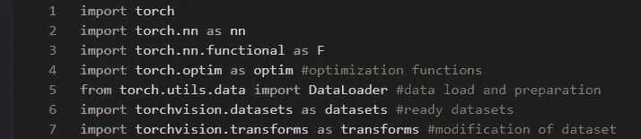
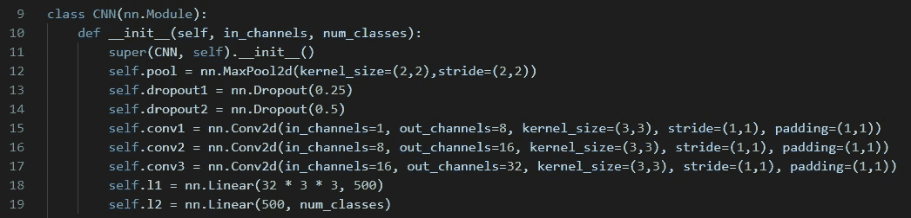
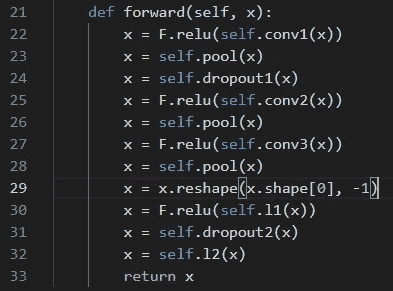
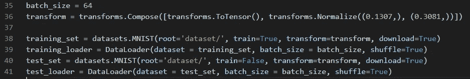
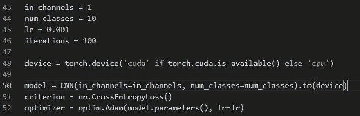
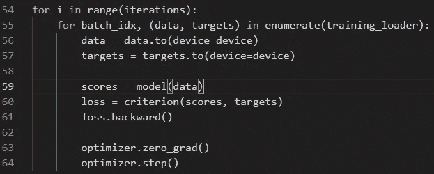
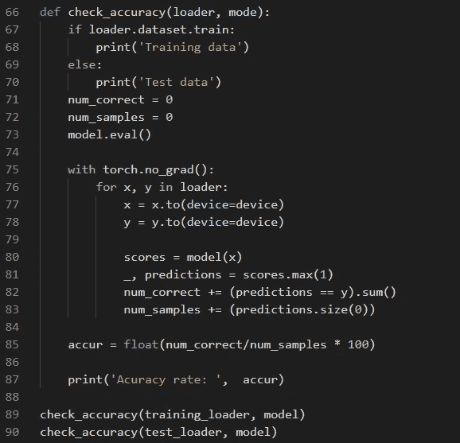
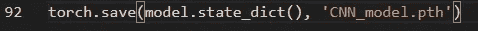

# 用 PyTorch 构建神经网络

> 原文：<https://levelup.gitconnected.com/building-neural-network-with-pytorch-e30019aa362>

之前我们讨论了从零开始构建监督学习模型。现在是时候推出大枪了。我将使用 PyTorch 库来构建一个能够识别手写数字的模型。从头开始写完所有东西后，PyTorch 如何简化开发和测试深度学习模型的过程令人惊叹。让我们看看我得到了什么。

图片由[sou Smith chint ala](https://commons.wikimedia.org/wiki/File:Pytorch_logo.png)提供

## **先决条件**

因为我们要使用 PyTorch，所以它必须安装在您的机器上。此外，库必须导入到 python 文件中。我们需要的是:

## **型号描述**

我们将使用卷积神经网络(CNN)来教会模型识别图像上的数字。首先让我们创建一个 python 类，从 PyTorch 导入所有必需的库，声明并连接 CNN 模型中的所有层。它看起来是这样的:

我们的模型包括:

*   **Conv2d** —是一个卷积层，用 2d 矩阵计算输入和输出之间的关系。
*   **MaxPool2d** —缩小矩阵或缩小数据。
*   **Dropout** —正则化函数，将输入张量中的一些元素随机置零。
*   **线性** —是一个线性变换层。

看看各层是如何连接的。卷积网络有输入和输出通道。您可以看到每个下一层输入通道如何与上一层的输出通道相匹配。这同样适用于线性层。

这个模型的另一个方面是前馈过程，看起来是这样的:

正如你所看到的，线性层的每个卷积都通过了 relu 激活函数。在每一层(但是线性的)之后，我们缩小数据并应用正则化函数。

## **数据和模型准备**

下一步是准备数据和配置模型。我们将从批处理开始。您可能知道，我们无法将整个训练数据集加载到模型中，因为世界上没有任何内存可以做到这一点。这就是为什么我们必须把数据集分成几个部分。此外，数据需要转换成张量和标准化。令人高兴的是，PyTorch 图书馆已经有了 MNIST 的数据。它可以在本地下载，然后用于培训和测试。事情是这样完成的:

下一步将指定应该使用哪个硬件，CPU 还是 GPU。你可能听说过 GPU 卡在矩阵乘法方面表现非常好，这可以加快学习过程。如果机器有 GPU，我打算让 PyTorch 使用 GPU，如果没有，使用 CPU。

最后，必须启动模型以及损失和优化功能。损失是交叉熵，优化是亚当。

## **训练**

培训过程与[以前的](https://betterprogramming.pub/neural-network-from-scratch-hidden-layers-bb7a9e252e44)完全一样。将数据前馈到模型中，计算损耗，反向传播损耗并应用优化函数。

## **评估模型**

为世界准备模型的最后一步是评估它在训练和训练后的测试数据上的表现。评估函数是这样的:

## **部署架构**

为了能够在应用程序中使用经过训练的模型，我们需要保存它。基本上，它保存的是模型每一层的权重值。PyTorch 的拯救模式是这样的:

现在我们准备在一些应用程序中部署 CNN 模型。有了数字识别器，就很容易提出概念应用程序的证明。用户应该能够在前端绘制图像，然后这将被发送到后端，转换成可馈送的形式和饲料的模型。输出应该被发送回前端渲染它。

关于 frontend 我就不多说了，只说我用 React.js 和 React Canvas Draw 让用户在浏览器里画东西。

为了使模型有用，我在 Flask 的帮助下设计了一个简单的 API，并将其部署在 heroku 上。

你可以在这里查看前端和 API [的完整代码。在这里](https://github.com/Exo-Labs/digits_recognizer/tree/main/web_app)[您可以尝试该模型如何与定制输入一起工作。](https://mldigits.netlify.app)

## **结论**

我的主要动机是把人工智能从实验室中取出来，放到现实世界中。我想把这个机会给我自己和每个人，让他们接触和使用基于人工智能的应用。请让我在评论中知道，应用程序如何(或不)识别你的图纸。

不断学习，不断成长！