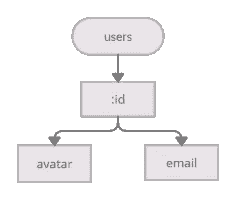

# 构建最快的 PHP 路由器之一

> 原文：<https://levelup.gitconnected.com/building-one-of-the-fastest-php-routers-dd466e51b04f>

由[马克-奥利维尔·乔多因](https://unsplash.com/@marcojodoin?utm_source=medium&utm_medium=referral)在 [Unsplash](https://unsplash.com?utm_source=medium&utm_medium=referral) 上拍摄的照片

**免责声明:**几乎所有的 PHP 路由库都快*够*。它们几乎不会成为应用程序的瓶颈，这意味着您应该更多地关注路由器的功能，而不是速度。这不仅仅是对 Aphiria 路由器背后的算法的有趣探索。

两年前，我开始做一个 PHP 路由器。我之前已经为[populance](https://www.opulencephp.com/docs/1.1/routing)构建了一个，但是我对额外的功能感兴趣，比如[自定义约束](https://www.aphiria.com/docs/1.x/routing.html#route-constraints)，它允许你匹配头文件(对于基于头文件的 API 版本控制很有用)。我对速度并不感兴趣，直到我读到尼基塔·波波夫对他的基于正则表达式的图书馆快捷路线的精彩分析。我最初采用了与 FastRoute 非常相似的匹配方法，但无法摆脱一个我认为可能与他的算法竞争的想法——基于树的路由。

例如，假设我的 API 中有以下路线:

*   `users`
*   `users/:id`
*   `users/:id/avatar`
*   `users/:id/email`

我希望为匹配生成以下树结构:

在计算机科学中，这种数据结构被称为“ [trie](https://en.wikipedia.org/wiki/Trie) ”(发音就像“树”)。每个节点与所有其他兄弟节点共享相同的前缀。

# 该算法

我的算法使用[深度优先搜索](https://en.wikipedia.org/wiki/Depth-first_search)在 trie 中寻找匹配路径。对于静态的，即不可变的段，我使用一个简单的哈希表对每个段进行 O(1)查找，如果没有找到匹配，我迭代可变段进行匹配，得到 O(n ),其中 n 是在该 trie 级别的可变节点的数量。我继续向下搜索 trie，直到找到匹配的候选对象或者找不到，结果是 404。最后一步是遍历匹配候选项上的任何路由约束，例如确保匹配候选项接受请求 HTTP 方法。如果所有约束都通过，那么这就是匹配路线。否则，我[返回](https://www.php.net/manual/en/language.generators.syntax.php)任何其他匹配候选项，直到我找到一个，或者返回 404 或 415，这取决于是否用不同的 HTTP 方法找到了任何匹配候选项。Yield returns 很有用，因为我不必在选择一个之前先收集所有可能的匹配候选，这样*会产生*轻微的性能改进。

算法的运行时间取决于路径中的线段数(我们称之为 n)。在所有静态路由的最佳情况下，运行时间为 O(n ),在最差情况下为 O(nm ),其中 m 是每个段的可变段的平均数量。

# 一个例子

假设请求路径是`/users/123/email`。我将扫描我们的路由 trie 寻找`users`，并在 O(1)中找到一个匹配，因为它作为静态段存在于 trie 中。然后，我将从`users`节点搜索`123`，但是没有找到静态匹配。所以，我会迭代变量节点，直到找到匹配。在这种情况下，`:id`节点没有任何[变量约束](https://www.aphiria.com/docs/1.x/routing.html#route-variable-constraints)，所以它将匹配任何值。然后，我在`:id`的子节点中搜索`email`，再次在 O(1)中找到一个匹配的静态节点。trie 将告诉我们,`email`节点映射到特定的路由，并且是匹配的候选。在这种情况下，我假设路径约束全部通过，并返回此路径作为匹配。

# 基准测试结果

那么，这个算法与 FastRoute 相比如何呢？我看了看网上的几个基准测试，但发现它们都有问题，例如，不切实际的长 URIs 有 9 个路段，或者只测试匹配集合中的第一条或最后一条路线。我决定[写一个基准](https://github.com/aphiria/aphiria/blob/1.x/src/Router/bin/benchmarks.php)，匹配*400 条路径中的每一条路径*。结果是:Aphiria 的算法比 FastRoute 的快 175%,但是落后于 Symfony 的优秀路由器大约相同的差距。

我确信我可以做一些微优化来稍微提高 Aphiria 的速度(例如尝试一次匹配多个静态段)，但是它们几乎肯定会以增加复杂性为代价。Aphiria 的路由器目前有 3976 条线路(仅匹配就有 123 条)，而 Symfony 的路由器有 6727 条(不包括测试)。然而，考虑到这三个库的速度都足够快，我对缩小与 Symfony 的差距并不特别感兴趣。也就是说，尼古拉斯·格雷卡斯和社区取得了这样的速度。

# 结论

重申一下——几乎所有的 PHP 路由器都足够快。为什么我觉得你应该用 Aphiria 的？它支持:

*   PHP 8.0 [属性](https://www.aphiria.com/docs/1.x/routing.html#route-attributes) **和** [流畅生成器](https://www.aphiria.com/docs/1.x/routing.html#route-builders)语法
*   匹配路径和主机
*   [自定义路由约束](https://www.aphiria.com/docs/1.x/routing.html#versioned-api-example)可以使用请求的任何部分来匹配路由，例如 API 版本控制的报头匹配
*   [路线分组](https://www.aphiria.com/docs/1.x/routing.html#route-attributes-groups)
*   将与框架无关的中间件绑定到路由
*   [根据路线名称创建 URIs](https://www.aphiria.com/docs/1.x/routing.html#creating-route-uris)
*   除了 Aphiria 的[反射库](https://www.aphiria.com/docs/1.x/reflection.html)之外，没有任何框架库

如果你想试用 Aphiria 的路由器，你可以[安装框架应用程序](https://www.aphiria.com/docs/1.x/installation.html)来快速启动并运行，或者[通过 Composer 只安装库](https://packagist.org/packages/aphiria/router)。

感谢[詹姆斯·拉普](https://www.obsessedcoder.com/)倾听我对算法的无尽思考，并作为优化的共鸣板。

# 链接

*   [Aphiria 路由器文档](https://www.aphiria.com/docs/1.x/routing.html)
*   [路径匹配器来源](https://github.com/aphiria/aphiria/blob/1.x/src/Router/src/Matchers/TrieRouteMatcher.php)
*   [Trie 编译器源代码](https://github.com/aphiria/aphiria/blob/1.x/src/Router/src/UriTemplates/Compilers/Tries/TrieCompiler.php)
*   [URI 模板词法分析器来源](https://github.com/aphiria/aphiria/blob/1.x/src/Router/src/UriTemplates/Lexers/UriTemplateLexer.php)
*   [URI 模板解析器源码](https://github.com/aphiria/aphiria/blob/1.x/src/Router/src/UriTemplates/Parsers/UriTemplateParser.php)