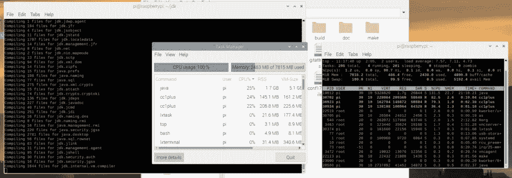
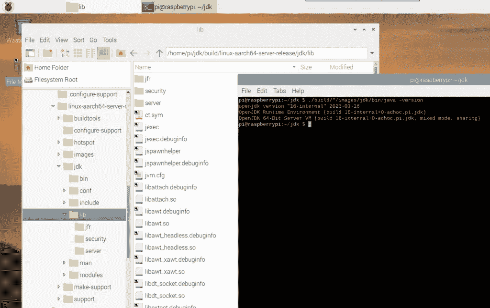

# 在 64 位 Raspberry Pi 上从 GitHub 源代码构建 OpenJDK

> 原文：<https://levelup.gitconnected.com/building-openjdk-from-github-sources-on-64-bit-raspberry-pi-6d90b7842654>

作为[项目 Skara](https://openjdk.java.net/projects/skara/) 的结果，OpenJDK 源代码现在[完全可用并在 GitHub](https://github.com/openjdk/jdk) 上开发。感谢社区所做的大量工作，完整的 Java 开发流程已经迁移到 GitHub，同时保留了存储库历史。这个过程已经在 GitHub 博客上[描述过了。](https://github.blog/2020-09-30-github-welcomes-the-openjdk-project/?s=09)

这也意味着我们现在能够在任何想要使用最新的尚未发布版本的设备上，非常容易地从最新的源代码中构建 OpenJDK。

> 考虑将您的 Raspberry Pi 切换到 USB 启动，以获得更高的读取速度和更可靠的光盘写入。有关更多信息，请参见
> " [更快&更可靠的 64 位操作系统，在 Raspberry Pi 4 上使用 USB 启动](/improve-raspberry-pi-4-disc-read-speed-with-64-bit-raspbian-os-with-usb-mass-storage-boot-4a22ff2d34e1)

构建过程在源代码中有很好的解释。每次运行其中一个步骤时(例如“bash configure ”),如果需要额外的工具以及如何安装它们，您都会收到警告。通过运行给定的命令，缺失的工具将被安装，您可以再次运行该命令。这就是我最终得到这个命令列表的原因。

在本文中，我使用了正在开发的 64 位版本的 Raspberry Pi 操作系统[。](https://www.raspberrypi.org/forums/viewtopic.php?f=117&t=275370)

为了能够建立，你需要一个最近(发布)的 JDK。所以我们从安装带有 SDKMAN 的 Java JDK 15 开始:

```
$ sudo apt install zip 
$ curl -s "https://get.sdkman.io" | bash 
$ sdk install java 15.0.0.fx-librca
```

现在我们已经准备好安装所有需要的工具，从 GitHub 获取源代码，并创建 JDK 构建配置。

```
$ sudo apt-get install autoconf
$ sudo apt-get install libx11-dev libxext-dev libxrender-dev libxrandr-dev libxtst-dev libxt-dev
$ sudo apt-get install libcups2-dev
$ sudo apt-get install libfontconfig1-dev
$ sudo apt-get install libasound2-dev
$ git clone [https://github.com/openjdk/jdk.git](https://github.com/openjdk/jdk.git)
$ cd jdk
$ bash configure====================================================A new configuration has been successfully created in
/home/pi/jdk/build/linux-aarch64-server-release
using default settings.Configuration summary:
* Debug level:    release
* HS debug level: product
* JVM variants:   server
* JVM features:   server: 'aot cds compiler1 compiler2 epsilongc g1gc graal jfr jni-check jvmci jvmti management nmt parallelgc serialgc services shenandoahgc vm-structs zgc'
* OpenJDK target: OS: linux, CPU architecture: aarch64, address length: 64
* Version string: 16-internal+0-adhoc.pi.jdk (16-internal)Tools summary:
* Boot JDK:       openjdk version "15" 2020-09-15 OpenJDK Runtime Environment (build 15+36) OpenJDK 64-Bit Server VM (build 15+36, mixed mode)  (at /home/pi/.sdkman/candidates/java/current)
* Toolchain:      gcc (GNU Compiler Collection)
* C Compiler:     Version 8.3.0 (at /usr/bin/gcc)
* C++ Compiler:   Version 8.3.0 (at /usr/bin/g++)Build performance summary:
* Cores to use:   4
* Memory limit:   7815 MB
```

在所有需要的工具都可用并配置好之后，我们可以从“制作映像”开始编译过程。这将运行更长的时间，编译 JDK 的所有组件。Raspberry Pi 4 有足够的资源，因为内存使用量在 1 到 3GB 之间波动。

```
$ make images
```



在我的例子中(8 GB 内存和 64 位 Raspbian 操作系统的 Raspberry Pi 4 ),这用了不到 60 分钟。作为参考，在配备英特尔酷睿 i7 和 16GB 内存的 Ubuntu 20.04 PC 上，大约需要 15 分钟。

现在让我们试试我们的新 JDK 吧！

```
$ ./build/*/images/jdk/bin/java -version 
openjdk version "16-internal" 2021-03-16 
OpenJDK Runtime Environment (build 16-internal+0-adhoc.pi.jdk)
OpenJDK 64-Bit Server VM (build 16-internal+0-adhoc.pi.jdk, mixed mode, sharing)
```

没错，就是它:**尚未发布的最新消息，直接来自原始资料，新鲜出炉的“爪哇 JDK 16-内部”覆盆子酱**！



*原载于 2020 年 10 月 21 日*[*https://foojay . io*](https://foojay.io/blog/building-openjdk-from-github-sources-on-64-bit-raspberry-pi/)*。*