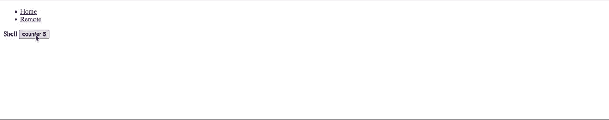

# 🔥使用 NX 在 2 分钟内构建⚛反应微前端 Monorepo 和状态管理😅

> 原文：<https://levelup.gitconnected.com/building-react-micro-frontends-monorepo-with-state-management-using-nx-in-2-min-b8b04f9afee0>

甚至你的祖母也可以用 NX 构建 react 微前端


# 内容

*   [**简介**](#a4ac)
*   [**概念验证**](#f5ae)
*   [**构建微前端应用**](#b327)
*   [**实现可共享状态**](#0f6a)
*   [**Github 链接**](#58c6)
*   [**结论**](#fa8a)
*   [**了解更多**](#fa8a)

# 介绍

前一段时间，我已经张贴了文章建设⚛️反应微前端 Monorepo 与 NX 在 5 分钟

[](/building-️-react-micro-frontends-monorepo-with-nx-10bf564f03fe) [## 用 NX 构建⚛️反应微前端 Monorepo

### 在本教程中，你将建立反应微前端没有拥挤

levelup.gitconnected.com](/building-️-react-micro-frontends-monorepo-with-nx-10bf564f03fe) 

那时候 NX 还不支持 React 的 micro frontends 预置生成器，只支持 Angular。许多人抱怨这个定制实现的错误和问题。现在，我想分享一些令人振奋的消息，这种支持成为现实，我很高兴为您提供这篇文章的更新版本。我们正在构建带有状态管理的 React 微前端，等待它…不是在 **5 分钟内，** …等待它…，而是在 **2 分钟内**😜

我们不要浪费时间，直接进入教程。

开始之前，请和我一起了解更多内容:

[](https://easy-web.medium.com/membership) [## 通过我的推荐链接加入 Medium 维塔利·舍甫琴科

### 作为一个媒体会员，你的会员费的一部分会给你阅读的作家，你可以完全接触到每一个故事…

easy-web.medium.com](https://easy-web.medium.com/membership) 

# 概念证明

通常，当我们构建微前端应用程序时，我们会创建一个 shell 应用程序(或主机、容器)和多个远程微前端应用程序。在我们的例子中，我们将有 2 个应用程序:外壳**和远程**和**。此外，我们将有一个**共享库**——一个共享数据上下文。**外壳**和**远程**都将消耗来自**共享数据上下文**的状态。**共享数据上下文**将保存状态——计数器**、**外壳**将有一个增加状态的按钮，以及**远程** —减少计数器状态的按钮。最终结果将如下所示:



# 构建微前端应用程序

我们将从生成 monorepo 开始。

```
**npx create-nx-workspace mf-react-state --preset=empty**
```

然后，让我们添加 React 依赖项

```
**yarn add --dev @nrwl/react**
```

现在，我们可以生成我们的 **shell** 和 **remote** React 应用程序

```
**nx g @nrwl/react:host shell --remotes=remote**
```

如果我们想要生成多个远程，我们将使用逗号分隔符指定应用程序的名称，如下所示:

```
**--remotes=remote1, remote2**
```

> 💡注意:如果您在运行命令时遇到错误，请确保您使用的是最新版本的 **nx cli** ，您也可以尝试使用以下命令更新 mono repo:`yarn add -D @nrwl/cli`、`nx migrate latest`和`nx migrate --run-migrations`

差不多就是这样，现在您可以运行应用程序了:

```
**nx serve shell --open --devRemotes=remote**
```

# 实现可共享状态

下一步是添加可共享库，我们需要运行命令

```
**nx g @nrwl/react:library shared/data-context**
```

让我们转到`mf-react-state/libs/shared/data-context/src/lib/shared-data-context.tsx`并添加**计数器状态:**

```
import { createContext, useState } from 'react';export interface SharedDataContextProps {
    children: JSX.Element;
}export const DataContext = createContext<Record<string, any>>({});export function DataProvider({ children }: SharedDataContextProps) {
    const [counter, setCounter] = useState(1); return (
        <DataContext.Provider value={{ counter, setCounter }}>
            {children}
        </DataContext.Provider>
    );
}export default DataProvider;
```

确保您从`mf-react-state/libs/shared/data-context/src/index.ts`中导出了**数据上下文**和**数据提供者**

```
export { DataProvider, DataContext } from './lib/shared-data-context';
```

我们需要作为单例共享我们的库。为此，我们需要修改**外壳**和**远程**中的`module-federation.config.js`文件:

在`mf-react-state/apps/shell/module-federation.config.js`

```
// Core libraries such as react, angular, redux, ngrx, etc. must be
// singletons. Otherwise the applications will not work together.const coreLibraries = new Set(['react','react-dom','react-router-dom','@mf-react-state/shared/data-context']);module.exports = {
    name: 'shell',
    remotes: ['remote'],
    shared: (libraryName, defaultConfig) => {
        if (coreLibraries.has(libraryName)) {
            return defaultConfig;
        } // Returning false means the library is not shared. return false;
    },
};
```

和在`mf-react-state/apps/remote/module-federation.config.js`时一样。

```
const coreLibraries = new Set(['react','react-dom','react-router-dom','@mf-react-state/shared/data-context']);module.exports = {
    name: 'remote',
    exposes: {
        './Module': './src/remote-entry.ts',
    },
    shared: (libraryName, defaultConfig) => {
        if (coreLibraries.has(libraryName)) {
            return defaultConfig;
        } // Returning false means the library is not shared. return false;
    },
};
```

然后我们需要将提供者添加到我们的 **shell** 应用程序`mf-react-state/apps/shell/src/app/app.tsx`

酷，最后一步是当我们需要在 **shell** 和 **remote** app 中消费上下文状态的时候。

在`mf-react-state/apps/shell/src/app/nx-welcome.tsx`

而在`mf-react-state/apps/remote/src/app/app.tsx`

祝贺🎉，如果你打字足够快，你可以在 2 分钟内完成这个应用程序，或者如果你从回购中取出它，可以在 30 秒内完成😅

# **Github 链接**

[](https://github.com/Vitashev/mf-react-state) [## GitHub - Vitashev/mf-react-state

### 此时您不能执行该操作。您已使用另一个标签页或窗口登录。您已在另一个选项卡中注销，或者…

github.com](https://github.com/Vitashev/mf-react-state) 

# 结论

嗯，我很高兴 NX 的人继续改进他们的产品，让我们这些前端开发人员的生活变得更轻松。我想象着有一天我们会从编写代码中解脱出来，从命令行生成我们想要的任何东西😁。不管怎样，不幸的是，在 Elon Mask 发布他的机器人之前，我们仍然需要做一些编码工作。亲爱的朋友们，如果你喜欢这篇文章，让其他人看到它，鼓掌👏它会多显示 10 个人。跟着我。

[](https://easy-web.medium.com/subscribe) [## 每当维塔利·舍甫琴科发表文章时，就收到一封电子邮件。

### 每当维塔利·舍甫琴科发表文章时，就收到一封电子邮件。通过注册，您将创建一个中型帐户，如果您还没有…

easy-web.medium.com](https://easy-web.medium.com/subscribe) 

# 了解更多信息

[](/top-3-react-tricks-pros-like-to-use-to-reduce-the-size-of-component-980900370505) [## 🔥前 3 名 React 技巧专家😎喜欢用来减小组件的大小

### 不要让您的 React 组件成为一个科学怪人

levelup.gitconnected.com](/top-3-react-tricks-pros-like-to-use-to-reduce-the-size-of-component-980900370505) [](https://itnext.io/how-to-deploy-and-host-angular-%EF%B8%8F-micro-frontend-for-free-using-firebase-6e675b511a4) [## 如何使用 Firebase 免费部署和托管角🅰️微前端🔥

### 一个关于如何部署和托管一个微前端应用程序的教程免费和零压力。

itnext.io](https://itnext.io/how-to-deploy-and-host-angular-%EF%B8%8F-micro-frontend-for-free-using-firebase-6e675b511a4) [](https://itnext.io/building-the-nft-instagram-app-with-react-and-thirdweb-d6266c925b32) [## 🥺用 React 和 Thirdweb 构建 NFT Instagram 应用

### 为网络的未来做好准备，或者从 NFT 的炒作中分得一杯羹😜

itnext.io](https://itnext.io/building-the-nft-instagram-app-with-react-and-thirdweb-d6266c925b32)