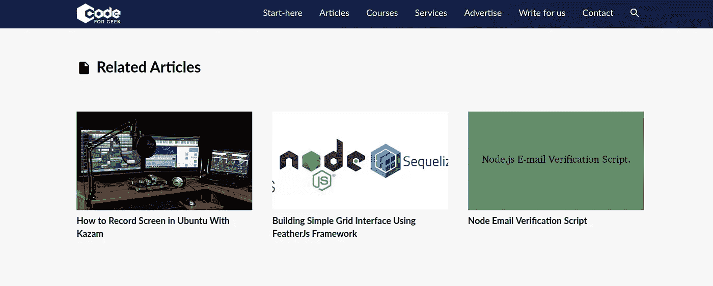

# 使用 MongoDB 聚合构建“相关帖子”引擎

> 原文：<https://levelup.gitconnected.com/building-related-post-engine-using-mongodb-aggregation-9d7186500dfb>

从 WordPress 迁移到自定义 Node.js 堆栈会带来很多挑战。其中之一是构建一些特性，比如处理与**相关的 post** 插件的功能。在 WordPress 中这么做很容易，只需添加一个插件，你就差不多完成了。

> 另请阅读:[将 WordPress 内容迁移到 MongoDB](https://codeforgeek.com/migrating-wordpress-content-to-mongodb/)

我不得不为**“相关帖子”**部分和本文定制代码，我将解释我是如何实现的。

那么什么是相关帖子呢？在每篇文章的底部，您应该会看到:



这说明读者刚看完的那个相关的帖子比较多。它不完全准确，但它是有效的，我使用以下步骤生成它:

# 步骤 1:标记数据

为了根据读者当前查看的内容生成帖子，我们需要关于帖子的信息，例如，这是什么类型的帖子？是基于 Node.js 还是数据库还是两者都是？

为了找到这些信息，我们需要对每篇文章进行相对标记。幸运的是，WordPress 已经有了类别和标签作为每篇文章的元数据。

所以我的 MongoDB 数据库中的每篇文章看起来都是这样的:

```
> db.posts.findOne();
{
    "_id" : ObjectId("5d246ef5f45b115cde3009bc"),
    "id" : 6354,
    "title" : "5 Free Python Programming Courses for Beginners",
    "date" : "2019-07-08T17:29:49",
    "url" : "https://codeforgeek.com/free-python-programming-courses-for-beginners/",
    "slug" : "free-python-programming-courses-for-beginners",
    "status" : "publish",
    "type" : "post",
    "excerpt" : "-----------------",
    "content" : "-----------------",
    "author" : 1,
    "categories" : [
        {
            "name" : "Python",
            "slug" : "python"
        }
    ],
    "tags" : [
        {
            "name" : "python",
            "slug" : "python"
        },
        {
            "name" : "Tips",
            "slug" : "tips"
        }
    ],
    "featured_image" : "-------------------",
    "pageviews" : 197
}
```

注意类别和标签——我们也将类别和标签存储在单独的集合中。

# 步骤 2:运行聚合查询

MongoDB 聚合是一个数据处理管道，其中文档进入管道的各个阶段，并将其自身转换为聚合结果。为了为我们的站点生成**“Related Post”**结果，我们还需要在集合中查找具有一个或多个匹配类别和标签的匹配帖子。

所以这个过程是这样的:

*   在帖子中查找，并将其与类别相匹配。
*   将匹配的数据传递到下一阶段，并与标签进行匹配。
*   从最多四个记录中抽取结果样本。

下面是我们网站目前正在使用的一个 MongoDB 查询:

```
function getRelatedArticle(data, callback) {
    dbo.collection('posts').aggregate([{
            $match: {
                "categories.slug": {
                    $in: data.categories
                }
            }
        },
        {
            $match: {
                "tags.slug": {
                    $in: data.tags
                }
            }
        },
        {
            $sample: {
                size: 4
            }
        }
    ]).toArray((err, records) => {
        if (err) {
            return callback(true, 'error retrieving related records');
        }
        callback(false, records);
    });
}
```

数据变量包含用户正在阅读的当前文章的标签和类别。我们使用这些标签和类别在集合中查找相关的文章。这当然是不准确的，但它现在起作用了。

此外，我们[在 Redis](https://codeforgeek.com/caching-a-mongodb-database-with-redis/) 中缓存返回的结果，这样我们就不会在每次用户请求页面时都运行聚合查询。

我也在考虑增加一些参数，以获得更准确的结果，如过滤网页浏览等。

# 结论

MongoDB aggregation 是一个强大的工具，通过将查询分解到不同的管道中，并在最后将它们组合在一起产生结果，从而获得复杂的结果。我们用这个来生成这个特性，你也可以用同样的任何你认为合适的目的。

*最初发表于*[*【https://codeforgeek.com】*](https://codeforgeek.com/building-related-post-engine-using-mongodb-aggregation/)*。*