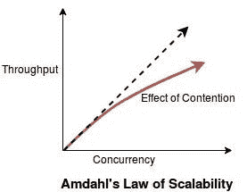
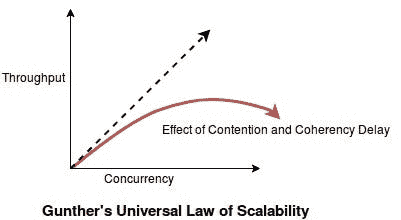
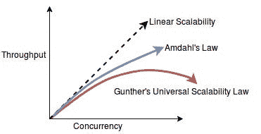
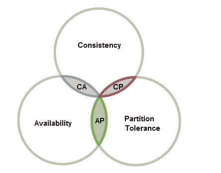

# 构建可扩展的系统

> 原文：<https://levelup.gitconnected.com/building-scalable-systems-c09374da82d7>

构建一个反应式系统是关于一致性和可用性之间的平衡，以及选择其中一个的后果。本文主要关注一致性和可用性，以及它们如何影响系统的可伸缩性。

> 什么是可扩展性、一致性和可用性？

如果一个系统能够满足需求的增长，同时保持响应，那么这个系统就被认为是*可伸缩的*。
如果所有节点同时显示相同的数据，则认为系统*一致*。
如果一个系统在出现任何故障时仍保持响应，则该系统被视为*可用*。

> **系统的可扩展性与系统的性能有何不同？**

可伸缩性和性能是相关但不同的概念，我们需要理解它们之间的区别。

可伸缩性是系统一次可以处理的请求数量，即*负载*。它是关于优化处理负载的能力，这意味着提高系统一次可以处理多少个请求。另一方面，性能是系统完成一个请求所需的时间，即*延迟*。它是关于优化响应时间，这意味着提高系统处理单个请求的速度。

性能在减少响应时间方面有一个极限，我们最终会达到这个极限。然而，可伸缩性没有理论上的限制。我们可能会受到实现的限制，但是在一个完全可扩展的系统中，我们可以永远扩展。

因此，当我们构建反应式微服务时，我们倾向于关注提高可伸缩性，而不是提高性能。

> **我们如何衡量系统的可扩展性和性能？**

像*每秒请求数*这样的度量实际上同时度量了两者。这使得它成为一个有价值的指标，因为我们可以使用它来查看我们是否提高了可伸缩性或性能。但这也意味着它在某种程度上是限制性的，因为如果它改进了，我们就不知道哪一个改变了。因此，如果我们想知道改进来自哪里，那么我们必须单独跟踪可伸缩性和性能。

> 我们如何解释分布式系统中的一致性？

分布式系统是由空间分隔的系统。这意味着，系统可以跨多个数据中心部署，也可以在同一数据中心内部署，或者只部署到不同的硬件或相同的硬件。

即使部署在相同的硬件上，分布式系统也需要在系统的不同部分之间传输信息，当信息传输时，它会跨越某种空间。它可以通过本地网络，也可以写入磁盘，或者写入数据库。

信息不能瞬间传递，它需要一些时间。诚然，时间可能非常短，但在信息传输过程中会消耗大量时间。在传输信息持续时间内，原始发送者的状态可能会改变。

这里的关键是要认识到，当我们处理分布式系统时，我们总是在处理陈旧的数据。*现实基本上最终是一致的。*

> **什么是最终的一致性？**

当一个系统至少在一段时间内停止接收更新时，我们可以保证系统的所有部分最终都会收敛到相同的状态。因此，通过这种方式，我们可以达到一致性的水平。

常见的源代码控制工具(Git、Subversion 等)在一个最终一致的模型上运行。它们依赖于后来的合并操作来使事物恢复一致。这就是现代源代码控制工具实现一致性的方式，它是一个最终一致的系统。

传统的整体架构通常基于强一致性，它们使用强一致性数据库，如 SQL 数据库。

> **什么是强一致性？**

当一个系统的所有成员在状态变得可用之前对状态达成一致时，我们就达到了强一致性的水平。

我们可以通过引入像*锁*这样的机制来实现强一致性。当我们有多个东西负责同一块数据时，就会出现分布式系统问题。只要只有一个东西负责这些数据，只要我们只有锁的一个实例，这就不再是分布式系统的问题了。这样，我们可以通过使用非分布式资源(锁)来解决分布式系统问题。

但是当我们引入锁时，它以争用的形式引入了开销。这种开销会对我们的弹性和恢复能力产生影响，还会产生其他影响。

> **什么是争用？**

竞争可以解释为任何两个事物争夺一个有限的资源，并且相互竞争。那场比赛只能有一个赢家。这意味着其他人被迫排队等待获胜者完成。

随着竞争的事物数量的增加，释放资源的时间也增加了。

> **什么是相干延迟？**

在分布式系统中，我们有一个由多个节点组成的系统，它们希望达到一种一致的状态，在这种状态下，它们都同意系统的状态。现在，为了达到这种一致性状态，系统中的每个节点都必须向每个其他节点发送消息，通知它们任何状态变化。随着时间的推移，系统中的所有节点将接收到通知它们状态改变的所有消息，并且它们将达到一致性状态，但是这需要时间。达到这种同步所需的时间就是我们所说的相干延迟。

随着节点数量的增加，一致性延迟也会增加。

> **伸缩性有什么规律？**

可扩展性的两个定律是:*阿姆达尔定律和巩特尔定律*

***阿姆达尔定律可伸缩性:***
阿姆达尔定律说明了争用对分布式系统的影响。阿姆达尔定律的关键部分是认识到争用限制了并行化。该定律定义了并行处理获得的最大改进。并行化带来的改进仅限于可并行化的代码。因此，如果我们有可以并行化的部分，我们可以改进它们。不能并行化的部分，我们对此无能为力，因为我们只有一个有限的资源来竞争。阿姆达尔定律表明，当我们有竞争，我们试图增加并发性，或扩大系统，我们开始看到收益递减。

***冈瑟定律可扩展性:***
冈瑟定律显示了争用的影响以及一致性延迟对分布式系统的影响。巩特尔定律表明，随着系统规模的扩大，我们需要在所有节点之间进行更多的沟通和协调，因此我们最终会达到这样一个点，即沟通和协调的成本超过了规模扩大带来的任何好处。这条定律表明，由于争用和一致性延迟，增加并发性会导致负回报。这降低了我们的并行能力。

因此，这两个定律表明，线性可伸缩性几乎总是无法实现。为了实现线性可伸缩性，我们需要完全隔离。我们基本上需要一个无状态的系统。应用程序或数据库中不存储任何状态。设计一个真正无状态的系统是非常困难或者不可能的。

反应式系统了解这些法律带来的限制。我们试图通过利用它们而不是避免它们来尽量减少它们的影响。

> **我们如何减少可伸缩性法则对反应式系统的影响？**

反应式系统可以通过以下方式减少争用:

*   通过隔离锁。隔离锁减少了争用。
*   通过消除交易。
*   通过避免阻塞操作。阻塞操作会在一段时间内占用内存、线程、CPU 和其他各种资源。

反应式系统可以通过以下方式减轻一致性延迟:

*   通过拥抱最终的一致性。如果我们接受这样一个事实，即由于相干延迟，事情需要一定的时间，那么我们就不会对此感到惊讶。
*   通过建立自主性。如果我们有更多的自治系统，那么我们就不必一直处理来回的通信，从而减少一致性延迟

因此，通过避免争用和一致性延迟，我们可以实现更高的可伸缩性。这里的目标是减少或消除反应式系统中妨碍可伸缩性的东西。

> **什么是 CAP 定理？**

CAP 定理指出，在分布式系统中，我们不能提供以下两个以上:
i. *一致性*，
ii。*可用性*
iii。*分区公差*。

分区容差表示系统继续运行，尽管节点之间的网络延迟了大量消息。在这种情况下，我们的系统可以支持任何数量的数据而不会出现任何故障。

这里有一个文氏图来说明上限定理:

我们越想实现一致性和分区容错，就越不得不牺牲可用性。类似地，我们越想向可用性和分区容差发展，我们就越不得不牺牲一致性。一致性和可用性之间存在权衡。

当出现分区时，分布式系统有两种选择:

*   **AP** :系统需要牺牲一致性，允许写入分区的两端。当分区解析时，我们需要一种方法来合并数据以恢复一致性。
*   **CP** :系统需要通过禁用或终止分区的一侧来牺牲可用性。在分区期间，我们的部分或全部系统将不可用。

我们可以使用像*分片*这样的技术来平衡一致性需求和可伸缩性需求。我们可以使用像*无冲突复制数据类型(crdt)*这样的技术来平衡可用性需求和可伸缩性需求。

> **一致性或可用性？**

一致性和可用性之间的选择实际上不是一个技术决策，而是一个业务决策。因此，理论上应该与领域专家和产品所有者讨论何时何地牺牲一致性和可用性的决定。在做出选择之前，我们需要考虑各种因素。
*如果系统不可用，与最终保持一致相比，会对收入产生什么影响？
什么会对业务产生更大的影响？
什么会对顾客产生更大的影响？
从长远来看，这对他们有什么影响？*

# 类似文章-

你也可以看看我关于*反应式架构*系列的其他文章

*   [倾向于反应式架构](/leaning-towards-reactive-architecture-190a6e02d0e1)
*   [投入反应式微服务](/diving-into-reactive-microservices-f9ff6a3f9686)
*   [了解反应式消息模式](/learning-about-reactive-messaging-patterns-ec174f510b03/)