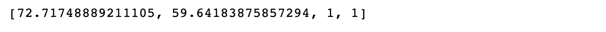
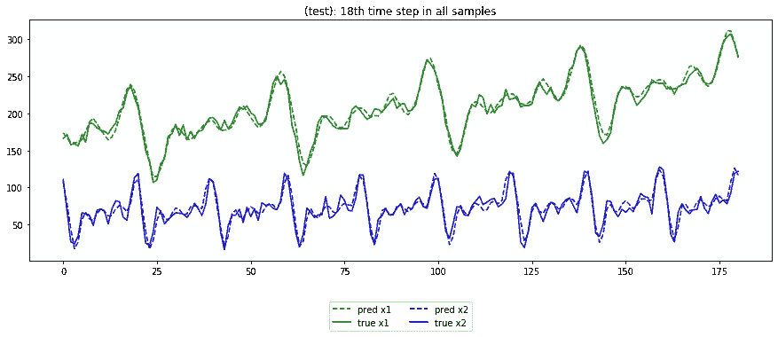

# 在 Keras 中建立 Seq2Seq LSTM 用于时间序列预测

> 原文：<https://levelup.gitconnected.com/building-seq2seq-lstm-with-luong-attention-in-keras-for-time-series-forecasting-1ee00958decb>

除了传统的回归，你想尝试一些其他的方法来解决你的预测问题吗？有许多常用于 NLP 领域的神经网络结构也可以用于时间序列。在这篇文章中，我们将在 Keras 中建立两个 Seq2Seq 模型，简单的 Seq2Seq LSTM 模型和 Luong 关注的 Seq2Seq LSTM 模型，并比较它们的预测精度。

# 创建一些数据

首先，我们来创建一些时间序列数据。

我们刚刚通过组合*正弦波*、*趋势*和*随机噪声*创建了两个序列**、x1**和**x2**。接下来我们将预处理 ***x1*** 和 ***x2*** 。

# 预处理

## 1.将序列分成 80%的训练集和 20%的测试集

由于序列长度为 *n_ = 1000* ，所以前 800 个数据点将作为我们的训练数据，其余的将作为我们的测试数据。

## 2.去趋势

去趋势时间序列不是必须的。然而，平稳的时间序列将使模型训练容易得多。时间序列去趋势的方法有很多，比如取序列与其 lag1 的差。这里为了简单起见，我们假设趋势的顺序是已知的，我们只是简单地将单独的趋势线拟合到 ***x1*** 和 ***x2*** 上，然后从相应的原始序列中减去趋势。

我们将为序列中的每个位置创建索引号，以便于消除趋势和恢复趋势。

这里我们将使用 np.polyfit 来完成这个小任务。请注意，只有前 800 个数据点用于拟合趋势线，这是因为我们希望避免数据泄露。

基于我们得到的上述值，我们现在可以得出 ***x1*** 和 ***x2*** 的趋势线。

让我们和 ***x1*** 和 ***x2*** 一起绘制趋势线，看看是否好看。

上面的结果看起来不错，现在我们可以扣除趋势。

去除趋势后，x1 和 x2 变得稳定。

## 3.组合序列

为了在接下来的几个步骤中更容易地进行预处理，我们可以将序列及其相关信息组合到一个数组中。

在组合数组中，我们创建了 *x_lbl* :

*   第一列是****x1****
*   *第二列是****x2*****
*   **第三列是*指标***
*   **第四列是*标签* (1 代表列车组，0 代表测试组)**

## **4.使标准化**

**归一化可以帮助模型避免偏向大特征而忽略非常小的特征。这里我们可以通过划分训练集中相应的最大值来简单地归一化 ***x1*** 和 ***x2*** 。**

****

**注意，上面的代码只计算第 1 列(*去趋势* ***x1*** )和第 2 列(*去趋势* ***x2*** )的最大值，第 3 列(*索引*)和第 4 列(*标签*)的分母都设置为 1。这是因为我们没有将列 3 和列 4 输入到神经网络中，因此不需要对它们进行归一化。**

********

**标准化后，所有值或多或少都在-1 到 1 的范围内。**

## **5.缩短**

**接下来，我们将通过滑动输入窗口(长度= 200 个时间步长)和输出窗口(长度= 20 个时间步长)将序列切割成更小的片段，并将这些样本放入 3d numpy 数组中。**

********

**函数 *truncate* 生成 3 个数组:**

*   **输入到神经网络***X _ in***:*它包含 781 个样本，每个样本的长度为 200 个时间步长，每个样本包含 3 个特征:*去趋势和归一化的* ***x1*** ，*去趋势和归一化的* ***x2*** 和*原始赋值数据位置只有前两个特征将用于训练。****
*   **神经网络中的目标***X _ out***:*它包含 781 个样本，每个样本的长度为 20 个时间步长，每个样本包含与 ***X_in*** 中相同的 3 个特征。只有前两个特征将被用作目标，第三个特征将仅被用于恢复预测的趋势。***
*   **标签 ***lbl*** : 1 代表列车组，0 代表测试组。**

****

**现在数据已经可以输入神经网络了！**

# **模型 1:简单的 Seq2Seq LSTM 模型**

****

**上图表示 Seq2Seq LSTM 模型展开的单层:**

*   *****编码器 LSTM 单元*** :将每个时间步长的值与前一个单元状态 **c** 和隐藏状态 **h** 一起输入编码器 LSTM 单元，重复该过程，直到生成最后一个单元状态 **c** 和隐藏状态 **h** 。**
*   *****解码器 LSTM 单元*** :我们使用来自编码器的最后一个单元状态 **c** 和隐藏状态 **h** 作为解码器 LSTM 单元的初始状态。编码器的最后一个隐藏状态也被复制 20 次，并且每个副本与先前的单元状态 **c** 和隐藏状态 **h** 一起被输入到解码器 LSTM 单元。解码器输出所有 20 个时间步长的隐藏状态，并将这些隐藏状态连接到密集层以输出最终结果。**

**设置隐藏层数:**

****输入层****

****

****编码器 LSTM****

**我们需要注意 2 个导入参数***return _ sequences***和 ***return_state*** ，因为它们决定 LSTM 返回什么。**

*   *****return _ sequences = False，return_state=False*** :返回最后一个隐藏状态:state_h**
*   *****return_sequences=True，return_state=False*** :返回堆叠隐藏状态(*num _ time steps***num _ cells*):每个输入时间步长一个隐藏状态输出**
*   *****return _ sequences = False，return_state=True*** :返回 3 个数组:state_h，state_h，state_c**
*   *****return_sequences=True，return_state=True*** :返回 3 个数组:堆栈隐藏状态，最后状态 _h，最后状态 _c**

**对于简单的 Seq2Seq 模型，我们只需要最后的 state_h 和最后的 state_c。**

****

**添加批量标准化是因为我们希望避免编码器中激活功能 ***ELU*** 导致的梯度爆炸。**

**接下来，我们复制 20 份编码器的最后隐藏状态，并将其用作解码器的输入。编码器的最后一个单元状态和最后一个隐藏状态也被用作解码器的初始状态。**

********

**然后我们把所有东西放进模型，并编译它。这里我们简单地使用 MSE 作为损失函数，MAE 作为评估指标。注意，我们为 Adam 优化器设置了 *clipnorm=1* 。这是为了归一化梯度，以避免反向传播过程中的梯度爆炸。**

****

**我们还可以绘制模型:**

****

**下一步是培训:**

********

## **预言；预测；预告**

**模型预测和真实值未标准化:**

****

**然后，我们将非标准化的输出与它们相应的指数结合起来，这样我们就可以恢复趋势。**

****

**接下来，我们将恢复趋势的所有输出放入一个字典 ***data_final*** 。**

****

**只是快速检查一下预测值分布是否合理:**

********

**预测值和真值的数据分布几乎重叠，所以我们是好的。**

**我们也可以按时间顺序画出所有样本的 MAE，看看是否有清晰的模式。理想的情况是当线是随机的时，否则它可能指示模型没有被充分训练。**

********

**根据上述情况，我们可以说，在训练和测试 MAE 中仍然存在一定的周期性模式。更多时代的训练可能会带来更好的结果。**

**接下来，我们将检查一些随机样本，看看预测线和相应的真实线是否对齐。**

********

**我们还可以检查每个时间步的第 n 次预测:**

****

**仔细看看测试集上的预测:**

****

# **模型二:关注度较高的 Seq2Seq LSTM 模型**

****

**参见[https://blog.floydhub.com/attention-mechanism/](https://blog.floydhub.com/attention-mechanism/)**

**简单 Seq2Seq 模型的限制之一是:只有编码器 RNN 的最后状态被用作解码器 RNN 的输入。如果序列很长，编码器对更早的时间步长的记忆会弱得多。注意机制可以解决这个问题。注意层将为编码器输出的每个隐藏状态分配适当的权重，并将它们映射到输出序列。**

**接下来我们将在 ***模型 1*** 之上构建 **Luong Attention** ，并使用 *Dot* 方法计算比对分数。**

******输入图层******

****同 ***模式 1*** :****

******编码器 LSTM******

****这与 ***模型 1*** 略有不同:除了返回最后一个隐藏状态和最后一个单元格状态，我们还需要返回堆叠的隐藏状态用于 ***对齐分数*** 计算。****

********

****接下来，我们应用批量标准化来避免梯度爆炸。****

******解码器 LSTM******

****接下来，我们重复编码器的最后隐藏状态 20 次，并将它们用作解码器 LSTM 的输入。****

********

****我们还需要得到 de 解码器的堆叠隐藏状态，用于 ***对齐分数*** 的计算。****

********

******关注层******

****要构建关注层，首先要做的是计算比对分数，并对其应用 softmax 激活函数:****

********

****然后，我们可以计算上下文向量，并在此基础上应用批量标准化:****

********

****现在，我们连接解码器的上下文向量和堆叠隐藏状态，并将其用作最后一个密集层的输入。****

****************

****然后我们就可以编译模型了。参数与 ***模型 1*** 中的参数相同，是为了比较 2 个模型的性能。****

****************

****数据如何在模型中流动:****

********

****培训和评估过程与 ***模型 1*** 中所示的相同。经过 100 个历元的训练(与 ***模型 1*** 的训练历元数相同)，我们可以对结果进行评估。****

********

****以下是训练集和测试集的样品 MAE 与样品订单的*图。同样，模型没有得到充分的训练，因为我们仍然可以看到一些周期性的模式。但是为了更容易比较这两个模型，我们现在不打算训练它。请注意，与 ***模型 1*** 相比，训练集和测试集的整体 MAE 略有提高。*****

***添加关注层后:***

*   ***训练集的平均误差从 5.7851 下降到 5.7381***
*   ***测试集的平均误差从 6.1495 下降到 5.9392***

************

***随机抽样检查预测线与真实线:***

************************