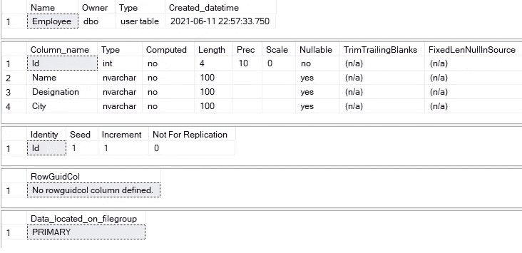
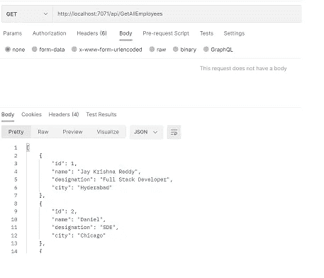

# 使用 Azure 函数和 C#构建无服务器 API

> 原文：<https://levelup.gitconnected.com/building-serverless-apis-using-azure-functions-and-c-67110b922943>

无服务器 Azure 功能

# 介绍

Azure Functions 是一种无服务器计算服务，是在云中运行小块代码或“功能”的简单解决方案。它可以使我们的发展更有成效。您将只为手头的事情编写您喜欢的代码，而不用担心整个应用程序或运行它的基础结构。

在本教程中，我将尝试通过使用实体框架核心层作为 ORM，使用 C#代码和 SQL 数据库进行数据存储，让您了解 Azure 函数将如何允许我们使用 HTTP Trigger 创建 API。那么，我们开始吧。

您可以从下面找到源代码。

 [## GitHub-JayKrishnareddy/API _ EFCore _ Azure functions:在 Azure 中使用 HTTP 触发器的无服务器 API…

### 设置 Azure 功能数据库模式和实体模型，使用 EF 建立与 SQL 数据库的连接

github.com](https://github.com/JayKrishnareddy/API_EFCore_AzureFunctions) 

**先决条件**

*   [邮递员](https://www.postman.com/downloads/)
*   [Visual Studio 2019](https://visualstudio.microsoft.com/downloads/)

# 目录

1.  设置 Azure 功能
2.  数据库模式和实体模型
3.  使用 EF Core 建立与 SQL 数据库的连接
4.  初始化依赖注入
5.  将 DbContext 注入到函数中
6.  实现功能
7.  使用 Postman 测试 API
8.  结论

# 设置 Azure 功能

打开 Visual Studio，搜索 Blazor 应用。点击下一步按钮，

图一

定义项目名称、路径和解决方案名称。点击创建按钮，

图二

之后会弹出一个新窗口选择目标框架( **Azure Functions v2(。Net Core)** ，确保选择 **Http 触发器**，并在 Authorization level 部分选择 **Anonymous** ，因为我们在本文中没有提到。

图三

这创建了一个具有基本 Azure 功能的框架项目。

# 数据库模式和模型实体

下面是 employee 表的模式。在各自的 SQL 数据库中执行模式。下面是在数据库中创建表格后的图片。

图 4

创建一个名为 **Models** 的文件夹，在该文件夹内将创建一个名为 **Employee** 的类——具有最少属性的实体模型，以使我们的实现变得容易

**员工。cs**

接下来，让我们将 DbContext 类添加到应用程序中。这有助于我们通过应用程序访问由我们的模型生成的数据库表。创建一个 **AppDbContext** 类来定义我们的 DbContext。

**AppDbContext.cs**

# 使用 EF Core 建立与 SQL 数据库的连接

为了使用 EF Core 连接到 SQL 数据库，我们需要下面的包来使用 Db first 方法建立连接。我们可以通过使用 Nuget 包管理器或使用包管理器控制台来安装所需的包。

请确保您安装了版本为 **v2.0.0** 的软件包，因为这是一个完全可用的版本，没有任何关于 **v2 Net Core 的问题。**

图五

# 初始化依赖注入

为了为我们的函数应用程序设置依赖注入，我们在程序集上使用了`***FunctionsStartup***`属性来指示一个启动类，它将在函数应用程序启动时运行。在继承自`***FunctionsStartup***`的那个类中，我们覆盖了`Configure`方法。这允许我们从配置中检索 SQL 连接字符串，并在服务中注册一个`DbContext`，这将允许我们将 ***AppDbContext*** 注入我们的函数。创建一个名为 **Startup.cs** 的类来集成依赖注入

**Startup.cs**

# 将 DbContext 注入到函数中

依赖注入现在为我们提供的是在类中定义函数的能力，这些类将它们的依赖注入到它们的构造函数中。打开 **Function1.cs** 文件来注入我们的依赖项。

**Function1.cs**

# 实现功能

在这个例子中，我们使用了五个函数

*   GetEmployees:从数据库中获取所有雇员
*   CreateEmployee:将员工相关信息插入数据库
*   GetEmployeebyId:根据雇员 Id 获取雇员记录
*   更新员工:用修改更新现有员工
*   删除雇员:从数据库中删除雇员记录。

获得员工

**第 8 行:**增加了函数名属性的名称。

**第 9 行:**定义一个函数(方法)

**第 10 行:**HTTP 触发器的属性特性。

*   **授权级别** — Azure 函数使用授权密钥保护您的 HTTP 触发器。授权级别有三种类型
    1。匿名:不需要密钥。
    2。功能:需要特定的功能键。如果没有指定，这是默认值。
    3。管理员:需要主密钥。
*   **路由** —定义端点监听的路由模板。路线的默认值设置为 api/ < FunctionName >。
*   **方法** —这用于为函数定义 HTTP 动词。

**第 13- 21 行:**添加 try catch 块来处理异常，并从数据库中获取所有雇员数据。

**创建员工**

**GetEmployeebyId**

**更新员工**

**删除员工**

最后，我们已经设法将所有的代码更改放置到位。运行应用程序，并验证 Postman 中的所有方法都按预期工作。运行应用程序后，我们所有的函数都将加载到终端中，因为 Azure 函数将使用存储模拟器来获取终端内部的响应。

图 6

> *Function 运行时版本——我们在 Azure Function 设置时选择的目标框架。*
> 
> *现在监听 Azure 函数运行的端口号(7071)。*

# 使用 Postman 测试 API

让我们首先使用 Postman 的 CreateEmployee API 创建雇员

图 7

**这实际上是如何工作的？**

我们从 HTTP 触发器获取 req 主体，并将 Json 附加到我们的 Employee 模型类进行反序列化，然后将 Employee 对象传递到数据库，您可以在 CreateEmployee 函数中看到这个数据库。

从 GetEmployee API 获取雇员列表。

图 8

使用 UpdateEmployee API 更新现有记录，在这个对象中，雇员 Id 是必需的。基于 Id，我们从数据库中获取现有记录，并用新对象更新相同的记录。

图 9

通过在路由中传递 EmployeeId 作为查询参数，从数据库中删除记录。

图 10

# 结论

在本文中，我们学习了如何使用 Azure 函数实现无服务器 API，并通过使用实体框架核心依赖注入与数据库集成。谢谢你坚持到最后。

感谢您的阅读，请在评论区告诉我您的问题、想法或反馈。感谢您的反馈和鼓励。

继续学习…！