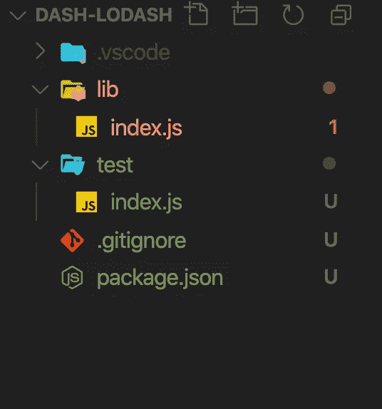
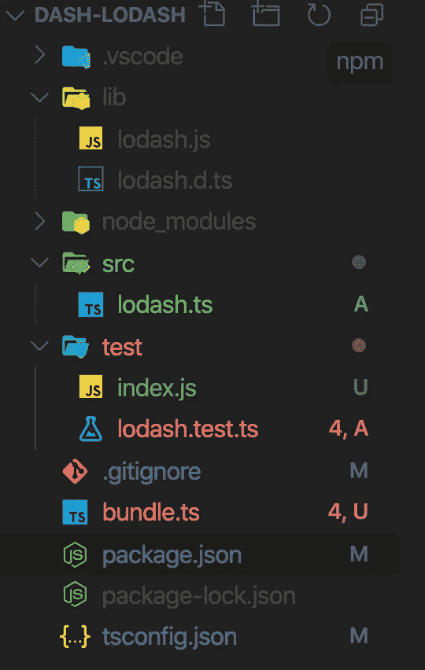

# 不使用 WebPack、Jest 或 Rollup 构建和测试 TypeScript/NodeJS 库

> 原文：<https://levelup.gitconnected.com/building-testing-typescript-without-webpack-jest-using-deno-39e98f7e54ed>

毫无疑问，Typescript 是近年来最好的编程语言/框架之一。TypeScript 帮助你打字来写干净的和模块化的 JavaScript。然而，编写和设置库是一项非常繁琐的任务。您可以使用 TypeScript CLI 来构建一个库，但测试仍然是一件痛苦的事情。在本教程中，我将解释如何使用 [Awesome Deno](https://deno.land/) 提供的工具来抛弃 WebPack、Jest 或 Rollup 并编写一个漂亮的库。

德诺在镇上待了一段时间。从一开始，它就受到了开发者的关注。它有`JavaScript`的`runtime`和使用 V8 并内置`Rust`的`TypeScript`。`Rust`的意思是，它既快又安全。


[亨利&公司](https://unsplash.com/@hngstrm?utm_source=medium&utm_medium=referral)在 [Unsplash](https://unsplash.com?utm_source=medium&utm_medium=referral) 上拍摄的照片

那么 Deno 将如何帮助你摆脱上面提到的这些事情。让我们稍微了解一下 Deno。我们将使用 Deno just Deno 构建一个小型 nodejs/npm 库。

# 图书馆概述

我们要建的图书馆将是 lodash，我们自己的 lodash。它会有一些实用的方法，比如 find `unique`，通过道具获取值。

# 库的初始设置

1.  创建文件夹并初始化 npm 和 git
2.  添加基本测试用例并实现方法`unique`
3.  运行并测试它的工作情况

## 1.创建文件夹并初始化`npm`和`git`

```
# Create a folder
md dash-lodash
md lib test## Create files
touch test/index.js
touch lib/index.js# Git init
git init
echo ".vscode\nnode_modules\nlib" > .gitignore# npm initnpm init --y
```

如果一切顺利，你会看到如下结构。



N注:如果你注意到的话，我已经在`.gitignore`中加入了 lib。因为我们正在构建 TypeScript 库。我们将不需要它的`compiled`版本。

## 2.添加基本测试用例并实现方法`unique`

打开文件`test/index.js`并添加以下行。

```
// title="test/index.js"
const { unique } = require("../lib");const uniqueValues = unique([1, 2, 3, 1]);if (uniqueValues.length === 4) throw new Error("Unique is not working");console.log("✅ All looks good");
```

打开文件`lib/index.js`并添加以下行。

```
// title="lib/index.js"
const unique = (arr) => arr;module.exports = { unique };
```

打开`package.json`添加下面的行

```
title="package.json" {5,7}
{
  "name": "dash-lodash",
  "version": "1.0.0",
  "description": "",
  "main": "lib/index.js",
  "scripts": {
    "test": "node test"
  },
  "keywords": [],
  "author": "",
  "license": "ISC"
}
```

## 3.运行并测试它的工作情况

因为我们的 npm 现在已经设置好了，所以您可以使用`npm test`命令运行和测试。一旦您运行`npm test`，您将看到如下错误消息。`Error: Unique is not working`

在`lib/index.js`中添加以下代码

```
const unique = (arr) => [...new Set(arr)];
module.exports = { unique };
```

如果您看到消息`✅ All looks good`表示一切正常，请再次运行测试。你的图书馆在工作。

# Deno 作为类型脚本运行时

我们的代码已经运行并经过测试。这很适合在 npm 上发表。但是，我们希望使用 TypeScript 作为源代码。好事，Deno 最大的卖点就是 TypeScript 运行时。这意味着你可以在没有任何外部`trans-compiler`的情况下运行 TypeScript。甚至不需要 [typescript cli](https://www.typescriptlang.org/index.html#download-links) 。使用 Deno 我们可以运行 typescript，同时 Deno 提供了像 bundle 这样的工具。我们可以编译 typescript，转换成 JavaScript。

**先决条件:**

`*Deno 1.1.0*` *及以上*

你可以从这里安装 Deno。[安装](https://Deno.land/#installation)

让我们转向打字稿。

1.  创建一个类型脚本 lodash 库
2.  更新`npm scripts`，添加德诺测试任务

## 1.创建一个类型脚本 lodash 库

```
md src
touch src/lodash.ts
```

在文件`src/lodash.ts`中添加以下行

`export const unique = (arr: any[]) => […new Set(arr)];`

## 2.更新添加 Deno 测试任务

让我们添加几个测试用例。

因为我们要搬到德诺。我们必须将测试用例转换成`TypeScript`文件。

```
touch test/lodash.test.ts
```

用下面给出的行替换文件的内容。

```
import { assertEquals } from "[https://Deno.land/std/testing/asserts.ts](https://Deno.land/std/testing/asserts.ts)";
import { unique } from "../src/lodash.ts";Deno.test("unique #1", () => {
  assertEquals(typeof unique, "function", "Unique is not defined!");
});Deno.test("unique #2", () => {
  const uniqueValues = unique([1, 2, 3, 1]);
  assertEquals(uniqueValues.length, 3, "Unique is not working");
  assertEquals(uniqueValues, [1, 2, 3]);
  console.log("✅ All looks good");
});
```

更新`package.json`中的测试命令

```
{
  // rest
  "scripts": {
    "test": "Deno test"
  }
}
```

再次运行测试。`npm test`。您将看到类似`test result: ok. 2 passed;`的消息

现在，我们已经成功地将源代码转移到了 typescript 中。但是，请注意，我们不能在 nodejs 中直接使用我们的`src/lodash.ts`。我们的`dash-lodash`仍然指向`lib/index.js`。在 nodejs 中消费这个。我们需要将 typescript 转换为 JavaScript，以便在没有 webpack[bundler]的 nodejs 中使用。

为了将`TypeScript`转换为`JavaScript`，我们将使用 [typescript CLI](https://www.typescriptlang.org/index.html#download-links) 工具。要进行设置，bundler 遵循以下给定步骤。

1.  将 typescript 作为开发依赖项添加
2.  添加`tsconfig.json`文件
3.  更新`package.json`

**1。作为开发依赖项的类型脚本:**

`npm i -D typescript`

**2。添加** `**tsconfig.json**` **文件:**

```
{
  "compilerOptions": {
    "target": "es6",
    "module": "CommonJS",
    "declaration": true,
    "outDir": "./lib",
    "moduleResolution": "node"
  },
  "include": ["src"],
  "exclude": ["node_modules", "**/test/*"]
}
```

**3。更新** `**package.json**` **:** 在`package.json`中添加捆绑命令

```
{
  // rest
  "scripts": {
    "test": "Deno test && node test",
    "bundle": "tsc"
  }
}
```

**运行** `**bundle**` **命令:** `npm run bundle`



N注:我们要更新，`test/index.js`导入/要求语句。由于`tsc`使用`commonjs`作为`tsconfig.json`中的一个模块，所有的文件都会被编译并转换成相同名称的 ie。`lib/lodash.js`。

更新后，`test/index.js`

```
const { unique } = require("../lib/lodash");// rest of the code
```

**尝试并再次运行测试。**

`*npm test*` *或* `*node test*`

Tada！！恭喜你们发布了你们的 nodejs-typescript 模块。要将您的模块发布到 npm，您可以关注[这个](https://zellwk.com/blog/publish-to-npm/)博客。

typeScript 模块需要定义类型定义位置。我们可以在`package.json`中添加元数据

在`package.json`中添加以下行

```
{
   // rest of the code
  "main": "lib/lodash.js",
  "types": "lib/lodash.d.ts",
  "files": ["lib/lodash.js"]
  //rest of the code
}
```

一旦你在 npm 上发布了你的模块。您可以按如下方式使用您的模块。

**在 NodeJS:**

```
const { unique } = require("dash-lodash");const uniqueValues = unique([1, 2, 3, 1]);if (uniqueValues.length === 4) throw new Error("Unique is not working");console.log("✅ All looks good");
```

**在打字稿里:**

```
import { unique } from "dash-lodash";const uniqueValues = unique([1, 2, 3, 1]);if (uniqueValues.length === 4) throw new Error("Unique is not working");console.log("✅ All looks good");
```

S 源代码，可以参考[dash-lodash-deno-typescript-sample](https://github.com/deepakshrma/dash-lodash-deno-typescript-sample)repo。

谢了。保持冷静，继续编码。😌

**博客:**获取更多博客和更新。请关注我的网站。[http://decipher.dev/](http://decipher.dev/)