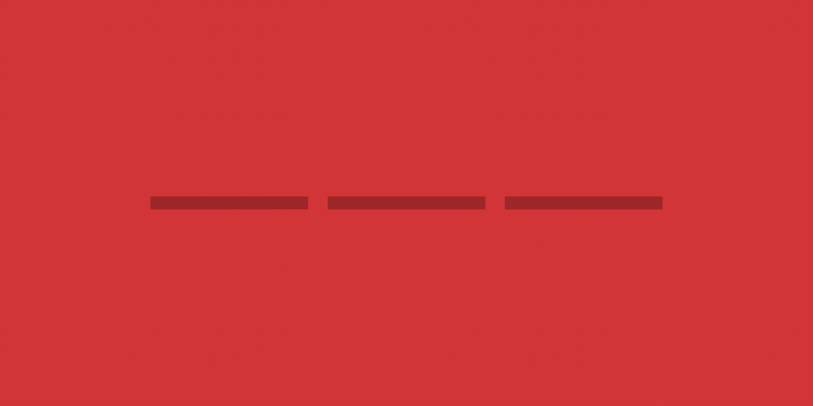

# 在 Vue 中构建 Instagram 故事自动播放 UX

> 原文：<https://levelup.gitconnected.com/building-the-instagram-story-auto-play-ux-in-vue-347670e979ba>

## 用 Anime.js 和 Hammer.js



上周，我分享了我在 CSS grid 中为一个客户项目创建一个简单的[日历](https://medium.com/@leemartin/building-a-damn-simple-calendar-layout-with-css-grid-moment-and-vue-65698e5e277e)的方法。事实证明，这个项目的 UX 还有另一面，我很乐意与大家分享。首先，一点背景。

该项目本身是一个[简单的应用程序](https://twitter.com/leemartin/status/1093148914490978304)，用于即将上线的摩城唱片公司 60 周年庆典。当摩城与我分享他们所有令人难以置信的内容时，我被一个充满摩城历史日常事实的文档吸引住了。客户和我一致认为，一个简单的移动友好的网络应用程序浮出水面“今天”的事实将是完美的。我很快构建了一个基本版本，并遇到了一个简单的 UX 问题。如果一天包括多个事实，我该如何在故事间导航？我跳进 data() {
return {
colors: ['#D53738', '#638867', '#FAF429']
}
}
})

对于这个例子，我们将根据颜色数组从一种颜色跳到另一种颜色。因此，让我们在`<main>`中添加一个 [v-for](https://vuejs.org/v2/guide/list.html) 循环，为每种颜色创建一组部分。

```
<section 
  v-for="(color, index) in colors" 
  :key="index" 
  :style="{ background: color }"
  >
  {{ color }}
</section>
```

这个来自 Vue 的方便的 v-for 指令可以呈现一个数组中的项目列表。在我们的例子中，我们为每种颜色创建一个`<section>`,并使用 Vue [样式绑定](https://vuejs.org/v2/guide/class-and-style.html)给它一个相关颜色的背景。太棒了。就像 Instagram 故事一样，我们一次只想展示其中一种颜色。首先，我们向名为 current 的数据对象添加一个新参数，并赋予它值 0。然后，您可以扩展您的`<section>`以包含一个 [v-if](https://vuejs.org/v2/guide/conditional.html#v-if) 指令，如果的索引等于当前值，该指令仅显示部分*。*

```
v-if="current == index"
```

一旦你添加了颜色，就应该只显示第一种颜色。现在让我们添加一点 CSS 来调整`<section>`的大小以填充屏幕。类似这样的事情应该会起作用:

```
html, body, main, section{
  height: 100%;
  width: 100%;
}
```

*注意:我总是在我的代码笔中包含一个* [*重置*](https://cdnjs.com/libraries/meyer-reset) *，它可以快速移除浏览器默认带来的任何填充或边距样式。你还会想把这个加到你的头部，这样在手机上看起来会很漂亮。*

```
<meta name=”viewport” content=”width=device-width, initial-scale=1">
```

由于一些 Vue 指令和 CSS 样式，现在我们有了一整页的颜色。很好。现在您可以从该部分中移除`{{ color }}`变量，因为我们不需要它。接下来我们要做的是创建进度条的小导航。原来我们可以使用一个非常相似的`v-for`循环来完成这个任务。

```
<nav>
  <div v-for="color in colors">
    <div></div>
  </div>
</nav>
```

简单的东西。真正的奇迹发生在 CSS 中。首先，让我们来设计我们的`<nav>`。

```
nav{
  box-sizing: border-box;
  display: grid;
  grid-column-gap: 1em;
  grid-template-columns: repeat(3, 1fr);
  height: 0.5em;
  padding: 0 1em;
  position: fixed;
  top: 1em;
  width: 100%;
}
```

这将`nav`固定在页面的顶部，并告诉内部 div 在一个三列网格中呈现，每列之间的间距为 1m。现在你可能想知道如果多于或少于三种颜色会发生什么。好问题。这将打破。在我的生产应用程序中，我决定添加一个样式绑定，它可以根据故事数量*或颜色*动态改变网格列。

```
<nav
  :style="{ gridTemplateColumns: `repeat(${colors.length}, 1fr)` }"
>
```

谢谢你 Vue。接下来，我们需要设计内部 div 的样式，但这很简单。首先，将它添加到您的 CSS 中:

```
nav > div{
  background: rgba(0,0,0,0.25);
  height: 100%;
}nav > div > div{
  background: black;
  height: 100%;
  width: 0%;
}
```

最初的内部 div 将获得透明的黑色背景，其中每个 div 都是不透明的黑色。不透明的 div 最初将被设置为 0%的宽度，但会随着时间的推移而调整。

这就是 HTML 和 CSS 的内容。让我们跳到 Javascript 开始制作动画。

# 动画

首先，在你的项目中加入 [Anime.js](https://animejs.com/) 。Anime.js 一个轻量级但功能强大的 javascript 动画库。我通常不会在我的项目中使用这些工具，但是当我使用的时候，我更喜欢使用 Anime.js 进行简单的补间。首先，我们将创建一个时间表:

```
mounted() {
  let timeline = anime.timeline({
    autoplay: true,
    duration: 10000,
    easing: 'linear',
    loop: true
  })
}
```

这很简单。时间轴将自动播放，默认持续时间为 10 秒，以线性速率循环播放。现在让我们为每种颜色的时间轴添加一个动画，就在`mounted()`中时间轴初始化的下面。

```
this.colors.forEach((color, index) => {
  timeline.add({
    targets: document.querySelector('nav > div')[index].children[0],
    width: '100%',
    changeBegin: (a) => {
      this.current = index
    }
  })
})
```

这告诉 Anime.js 为每个不透明的 div 添加一个时间轴动画，动画显示它们的宽度为 100%。当每个动画开始时，我们将当前颜色参数调整为当前动画的索引。这允许颜色随着动画的播放而改变。你已经很接近了！让我们添加一些触摸事件来控制时间轴。

# 触摸事件

Hammer.js 是一个 rad 库，可以为你的应用程序添加触摸手势。它也是以 MC Hammer 的名字命名的，他曾经在推特上对我说过友好的话。真实故事！包括在您的项目中，让我们首先添加新闻事件。

```
let hammertime = new Hammer(document.querySelector('#app'))hammertime.on('press', (e) => {
  timeline.pause()
})hammertime.on('pressup', (e) => {
  timeline.play()
})
```

这再简单不过了，多亏了 Hammer 的监听器事件和 Anime.js [控件](https://animejs.com/documentation/#playPause)函数。尝试通过点击并按住暂停，然后释放恢复播放。最后，如果我们的应用程序根据我们点击屏幕的哪一侧来导航下一个和上一个颜色，那就太好了。让我们使用 Hammer.js tap 事件来实现这一点。

```
hammertime.on('tap', (e) => {
  if (e.center.x > window.innerWidth / 2) {
    if (this.current < this.colors.length - 1) {
      this.current += 1

      this.timeline.pause()
      this.timeline.seek(this.current * 10000)
      this.timeline.play()
    }
  } else {
    if (this.current > 0) {
      this.current -= 1

      this.timeline.pause()
      this.timeline.seek(this.current * 10000)
      this.timeline.play()
    }
  }
})
```

当点击事件被调用时，我们检查点击的 x 位置，看看它是出现在屏幕的左边还是右边。如果它在屏幕的右侧，并且我们还没有到达最后一个故事，我们将首先把当前的颜色变量加 1。然后，我们将寻找时间轴动画到颜色进程的起始点，您可以通过将颜色索引乘以动画持续时间来声明。我们将对屏幕左侧做同样的操作，确保用户不会进入不存在的负面颜色。