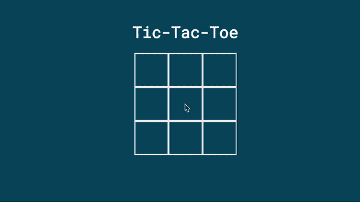

# 在 Vue.js 中构建井字游戏

> 原文：<https://levelup.gitconnected.com/building-tic-tac-toe-in-vue-js-57a23822313d>

用 Vue.js 构建 web 应用程序很酷，但有时看看你能用框架做些什么也很有趣。

在这篇博文中，我将概述如何在 Vue.js 中构建一个井字游戏——包括一个不可战胜的计算机 AI！

[在这里查看现场版](https://dirk94.github.io/)。


# 设置 Vue 项目

我将使用 [Vue CLI](https://cli.vuejs.org/) 建立一个新的 Vue 项目。为了全局安装`vue-cli`包，我运行以下命令。

```
npm install -g vue-cli
```

接下来，我将使用`vue-cli`创建 Vue 项目。

```
vue init webpack-simple tic-tac-toe
```

这将使用`tic-tac-toe`文件夹中的`webpack-simple`模板创建一个新的 Vue 项目。

为了运行这个项目，我执行以下命令。

```
cd ./tic-tac-toe
npm install
npm run dev
```

结果是一个工作的 Vue 应用程序🚀


# 创建董事会

我将在`src/TicTacToe.vue`文件中创建一个新的 Vue 组件。

在`<script>`标签中，我初始化了一个代表棋盘的 2D 字符串数组。

为了绘制电路板，我在`src/Cell.vue`文件中创建了一个新的 Vue 组件。每个单元格将代表井字游戏棋盘的一个网格单元。

每个细胞将获得一个`value`道具。这将是`'x'`、`'o'`或`''`。

我使用一些简单的 CSS 赋予每个网格单元 64 像素的宽度和高度。为了在网格单元的中间画十字和圆圈，我使用了 flexbox CSS 规则。

现在我必须显示每个井字游戏网格单元的`Cell`组件。为此，我在`TicTacToe`组件的`<template>`标签中添加了一个双 for 循环。

我还向`tictactoe-board`类添加了一些 CSS 规则，以确保我有一个 3 乘 3 的网格——而不是 9 乘 1 的网格。

我应该更新`src/main.js`文件来注册新的`TicTacToe`和`Cell`组件。

最后，我用下面的内容替换了`src/App.vue`文件中的内容。

结果就是下面这个井字游戏板🎉


# 玩家应该能够点击单元格

当玩家点击一个单元格时，那里会出现一个十字。

为此，我通过给每个`Cell`添加`@click`标签来更新`scr/TicTacToe.vue`文件。当一个单元格被点击时，`performMove(i, j)`被调用，其中`i`和`j`表示哪个单元格被点击。

在`performMove()`函数中，我检查点击的磁贴是否为空。如果是这样，我就在它上面打个叉。

但是，当我单击浏览器中的单元格时，没有任何反应。💔

这是因为两个原因。

1.  `@click`对其他 Vue 组件不起作用。
2.  Vue 的反应性不会自动检测到你改变了一个数组中的值— [在这里阅读更多关于 Vue 反应性系统的信息](https://vuejsdevelopers.com/2017/03/05/vue-js-reactivity/)。

让我们修理这些东西！

来触发`@click`事件。我从`Cell`组件向父组件发出 click 事件。

为了确保 Vue 在一个图块被点击时重新渲染，我在`performMove()`函数中调用了`this.$forceUpdate()`。

这是工作结果！🙌


# 实施人工智能

## 重构电路板结构

我要做的第一件事是重构我现有的董事会结构。

我认为在一个`scr/Board.js`文件中创建一个`Board`类会很棒。这将保持井字游戏棋盘的状态。这在以后创建 AI 时很有用。

现在我必须更新`TicTacToe`组件来使用这个新的`Board`类。

## 评估董事会

为了拥有一个正常运行的人工智能，计算机应该首先能够计算出某个特定的电路板“有多好”。为此，我在`Board`类中添加了一个`getScore()`方法。

该功能将检查`x`玩家是否连续 3 次，如果是，则从分数中减去 100 分。如果`o`玩家连续 3 次得分，将会增加 100 分。

这个函数依赖于一个`playerHas3InARow()`函数，所以我实现了它。

## 极大极小算法

极大极小算法是一种搜索最佳可能移动的算法。

给定一个棋盘，算法将生成所有可能的走法并应用这些走法。这将导致一组新的棋盘，对于这些棋盘中的每一个，算法再次生成所有可能的移动并应用这些移动，等等。

然后，该算法使用我在上一节中实现的`board.getScore()`函数来计算一块板有多“好”。


为了阅读更多关于极大极小算法的内容，我推荐这篇博文。

在实现`minimax`算法之前，我在`Board`类中添加了 3 个有用的函数。

*   `isGameOver()`检查游戏是否结束——即是否连续出现 3，或者棋盘是否已满。
*   `clone()`返回棋盘的副本。
*   `getPossibleMoves()`返回一个包含一个`x`和`y`字段的对象数组，表示棋盘上的空白单元格。

现在是实现算法的时候了！

在`TicTacToe`组件中，我向`src/TicTacToe.vue`文件的`methods`部分添加了一个新函数`minimax()`。

如果游戏结束了——无论是赢、输还是平——那么只需返回棋盘上的分数。

否则，为板的每个可能的移动调用`minimax()`功能。得分最高的棋被退回。

将所有组件粘合在一起后，`TicTacToe`组件看起来像这样。

我穿上我的设计师鞋，并添加一些额外的造型，结果是一个完全正常的井字游戏🚀🚀



感谢阅读— [在 Github 上查看源代码](https://github.com/Dirk94/tic-tac-toe)和[在这里查看现场版](https://dirk94.github.io/)。