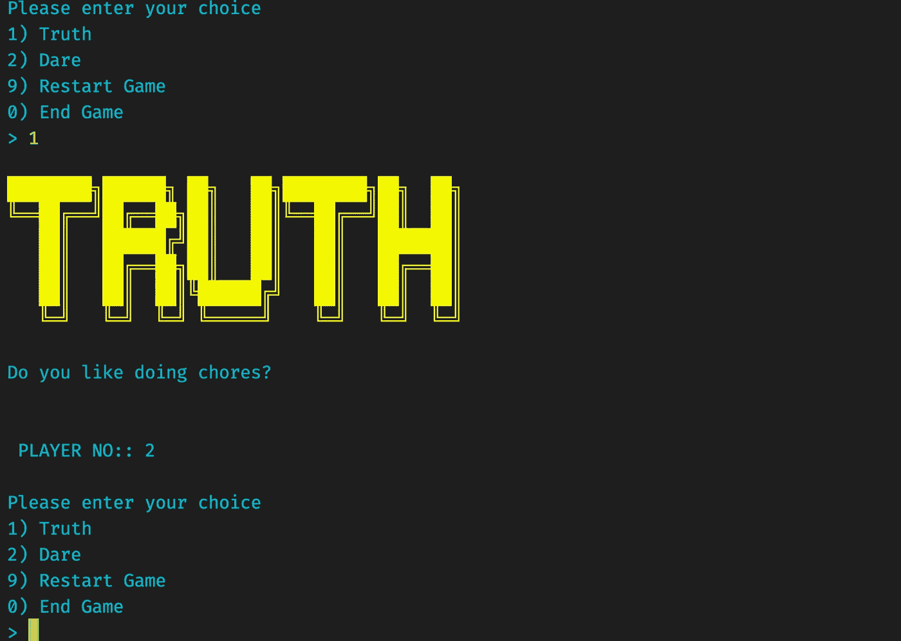

# 用 Python 构建真实而大胆的游戏|初学者指南

> 原文：<https://levelup.gitconnected.com/building-truth-and-dare-game-with-python-80a8e83bbc1b>


[https://www . fanpop . com/clubs/truth-or-dare-about any/images/35525557/title/truth-dare-photo](https://www.fanpop.com/clubs/truth-or-dare-about-anything/images/35525557/title/truth-dare-photo)

在这篇文章中，我将解释如何使用一个循环，基本的错误处理，并提出一个 HTTP 请求。我还将在本文中解释如何处理数据列表，即 JSON 数据。

## **先决条件**

1.  命令行应用的基本了解:如果没有基本了解，请阅读[building-a-CLI-tool-love-calculator-flames-using-python](https://medium.com/geekculture/building-a-cli-tool-love-calculator-flames-using-python-39419e7f1f64)
2.  python 的基本语法，列表，变量。

## 目录

1.  创建运行脚本
2.  使用 [urllib](https://docs.python.org/3/library/urllib.html) 请求 HTTP API
3.  解析和操作 JSON 数据
4.  游戏逻辑:接受输入(选择)并为玩家生成问题
5.  重复选择

## 1.创建运行脚本

作为开发人员，你必须做的第一件事就是从工作脚本开始。首先，创建一个文件名**“truth-dare . py”**，并赋予其执行权限。您可以添加以下代码并运行脚本。要了解更多信息，请阅读…[building-a-CLI-tool-love-calculator-flames-using-python](https://medium.com/geekculture/building-a-cli-tool-love-calculator-flames-using-python-39419e7f1f64)

```
#!/usr/bin/python3def printline(msg): print(f"\n{msg}\n")def print_logo(): printline("""
 _________  __  __________ __
/_  __/ _ \/ / / /_  __/ // /
 / / / , _/ /_/ / / / / _  / 
/_/ /_/|_|\____/ /_/ /_//_/  
     / __/___                
     > _/_ _/                
   _|_____/   ___  ____      
  / _ \/ _ | / _ \/ __/      
 / // / __ |/ , _/ _/        
/____/_/ |_/_/|_/___/""")def main():
    print_logo()if __name__ == "__main__":
    main()
```

一旦你运行上面的脚本，你会在你的终端上看到 ASCII 字符艺术。

## **2。请求 HTTP API**

一旦你可以运行脚本，你需要游戏的问题。您可以使用列表对问题列表进行硬编码。然而，最好的选择是，您可以使用任何服务器将您的问题保存为 JSON 格式，并且您可以使用 **urllib** 库获取数据。对于本文，我将 JSON 放在了我的 gist 页面上。你可以在[gist.github.com/](https://gist.github.com/deepakshrma/9498a19a3ed460fc662c536d138c29b1/)[truth-n-dare . JSON](https://gist.github.com/deepakshrma/9498a19a3ed460fc662c536d138c29b1)上下载并使用 JSON 数据

```
import json
from urllib.request import urlopendef requestJson(url, default=[]):
    data = default
    try:
        data = json.load(urlopen(truth_dare_url))
    except:
        print("Error while fetching data...")
    return data
```

这里的 **requestJson** 是 util 函数。这需要 **url** 来请求和获取数据。 **json.load** 加载数据并解析成 json 对象。在获取或解析的过程中，如果出现错误， **requestJson** 函数将返回**默认值**。

```
def main():
    print_logo()# Request truth_dare json data
    truth_dare_list = requestJson(truth_dare_url)print(truth_dare_list[0]["summary"])if __name__ == "__main__":
    main()
```

一旦你运行了上面的脚本，你将会看到输出**`我谅你也不敢站起来转 2 圈`。**这里我们取了一个问题列表，得到了第一项的摘要。

## 3.解析和操作 JSON 数据

现在，既然我们有了 JSON 数据，我们可以将数据分成**真相列表**和**挑战列表**。

```
def main():
  print_logo()
  # Request truth_dare json data
  truth_dare_list = requestJson(truth_dare_url)

  **# Parse and create list of truth and dare**
  **truth_list = [
      item
      for item in truth_dare_list
      if item["type"] == "Truth"
  ]**
  **dare_list = [
      item
      for item in truth_dare_list
      if item["type"] == "Dare"
  ]** print(dare_list[0])
  print(truth_list[0])if __name__ == "__main__":
    main()
```

这里，在上面的例子中，我使用了两个单独的来平分列表。但是，您可以使用相同的 for 循环来对分。

## 4.接受玩家的输入(选择)

我们还没有决定运动员的人数。玩这个游戏，我们最少需要两个玩家。不过这个游戏很多玩家都可以玩。我们可以接受用户输入来开始玩家的数量。

```
class Color:
    def colors_256(color_, msg=""):
        return(f"\033[38;5;{str(color_)}m {msg} \033[0;0m") def red(msg):
        return Color.colors_256(9, msg) def blue(msg):
        return Color.colors_256(6, msg) def yellow(msg):
        return Color.colors_256(11, msg) def green(msg):
        return Color.colors_256(10, msg)def main(): **# Take number of players
  number_of_player = int(input(Color.blue("Enter number of players: ")))** **print(Color.green(
        f"{number_of_player} players are playing this game"))**if __name__ == "__main__":
    main()
```

您可以使用 python 提供的 **input** 方法从用户那里获取输入。颜色**是处理颜色的实用类。**

每次用户玩这个游戏时，他/她需要从**【真相】****【挑战】**中选择一个选项。我们可以用同样的输入法要求选择作为提示。

```
#!/usr/bin/python3import json
from urllib.request import urlopen
**import random**# Rest of the codedef main():
  # Rest of the code
  # Take User input(choice)
  **command = int(input(Color.blue("""\nPlease enter your choice\n1) Truth \n2) Dare \n9) Restart Game\n0) End Game\n>""")))
  choice_list = truth_list**

  # On user select TRUTH
  **if command == 1:
    # do nothing
    pass** # On user select Dare
  **elif command == 2:
    choice_list = dare_list** # Guess question from list
  **ran = random.randint(0, len(choice_list)-1)
  question = choice_list[ran]["summary"]
  print(Color.green(f"\n{question}\n\n"))**if __name__ == "__main__":
    main()
```

基于用户的选择，我们将选择**真实列表或冒险列表。**一旦列表被选中，我们将从选中的选项列表中随机抽取问题。

## **5。重复选择**

到目前为止，我们已经根据用户的选择生成了问题。如果我们想对多个用户重复这个过程呢？我们需要运行一个无限循环。

```
def main():
  #Rest of the code # Infinte loop
  **while True:**
    # Take User input(choice)
    command = int(input(Color.blue("""\nPlease enter your choice\n1) Truth \n2) Dare \n9) Restart Game\n0) End Game\n>"""))) **# If exit, end the game
    if command == 0:
       break** # Rest of the code
    print(Color.green(f"\n{question}\n\n"))if __name__ == "__main__":
    main()
```

## 奖金:清理

现在，由于我们有了一个工作应用程序，我们可以清理一些东西。我们可以将所有消息移动到一个**字典**中。我们将用户输入解析为 num，如果输入无效，我们可以返回零(0)。

**完整的例子:**

运行上面的示例后，您可能会看到如下示例。



## **结论**

如您所见，用 python 构建 CLI 应用程序相当容易。在给定的文章中，我们学习了像 urllib，random 这样的模块，以及如何使用列表。希望你会这篇文章。