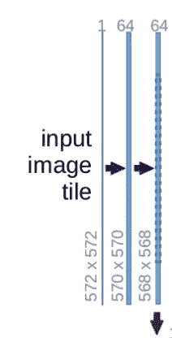
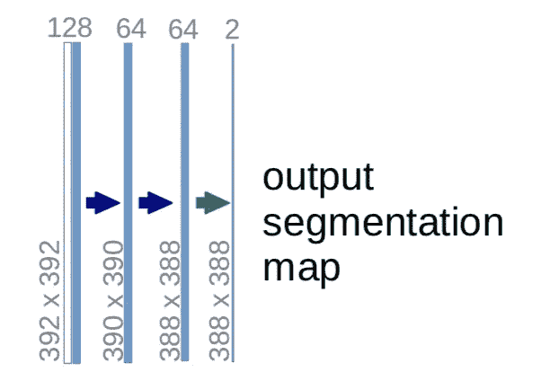
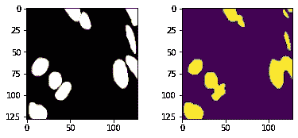
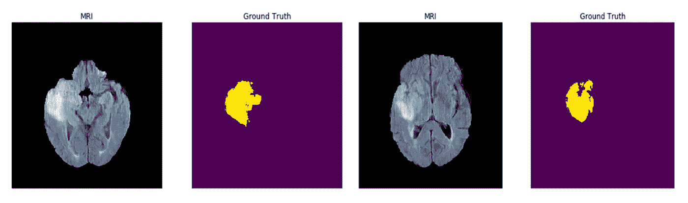

# 构建用于生物医学图像分割的 U-Net 体系结构。

> 原文：<https://levelup.gitconnected.com/building-u-net-architecture-for-biomedical-image-segmentation-4c53fc70d928>

U-Net 架构是使用全卷积网络构建的，其设计方式可以在医学成像中提供更好的分割结果。它最初是由 Olaf Ronneberger，Philipp Fischer 和 Thomas Brox 在 2015 年设计的，用于处理生物医学图像[[https://arxiv.org/pdf/1505.04597.pdf](https://arxiv.org/pdf/1505.04597.pdf)]。卷积神经网络通常用于图像分类问题，但在生物医学案例中，我们也必须定位异常区域。


它呈“U”形。U-Net 架构是对称的，其功能有点类似于自动编码器。它可以缩小为三个主要部分——收缩(下采样)路径、瓶颈和扩展(上采样)路径。在自动编码器中，神经网络的编码器部分将输入压缩成潜在空间表示，然后解码器从压缩或编码的表示中构造输出。但是有一个细微的区别，与常规的编码器-解码器结构不同，这两个部分没有解耦。跳过连接用于将细粒度信息从分析路径的低层传输到合成路径的高层，因为需要该信息来生成具有精确细粒度细节的重建。

# 收缩路径

收缩路径由四个块组成，每个块包括:

*   3x3 卷积层+激活函数(relu) [Dropout 可选]
*   3x3 卷积层+激活函数(relu) [Dropout 可选]
*   2x2 最大池层



每个块有两个卷积层和一个最大池层。然后，通道数量切换到 64。此外，使用(3，3)的内核大小，这将维度从 572x572 → 570x570→568x568 进行更改。MaxPool2D 层然后将维度减少到 284x284，并且该过程重复三次以上，直到我们到达瓶颈部分。

# 扩展路径

扩展路径也由 4 个块组成。每个模块都包括:

*   用步长 2 反卷积或上采样 2D 层
*   图像与收缩路径中的相应图像连接在一起
*   3x3 卷积层+激活函数【漏失可选】
*   3x3 卷积层+激活函数【漏失可选】



该图像与相应的图像连接，并生成尺寸为 56×56×1024 的图像。这个过程之后是一组卷积层，最后一个 Conv2D 层有一个大小为 1x1 的滤波器。

# 用 Tensorflow 和 Keras 构建 U-Net

该过程的第一步是下载数据集。在这个例子中，我们将使用 Kaggle 的 2018 年数据科学碗，这是一个包含 128x128 个细胞核及其掩模图像的数据集。它可用于生物医学图像分割。如果您使用的是 Kaggle API，可以通过以下方式下载:

```
!kaggle competitions download -c data-science-bowl-2018
```

导入所需的包和工具。

下一步是创建一个数据生成器函数，它加载数据，将图像调整到 128x128 的大小，并对它们进行归一化。我们的目标是创建一个数据生成器，返回图像及其遮罩。数据生成器的结构可能会有所不同，这取决于您的需求。在这之后，我们必须设置一些超参数，如图像大小、时期和批量大小。

现在我们可以实现 U-Net 的架构，即收缩路径、瓶颈和扩展路径。

# U-Net 模型与训练

我们将重复 down_block 和 up_block 过程四次，然后是最后一个卷积层，它给出最终的预测掩码。在这种情况下，“Adam”优化器是优化器的一个好选择，并且“binary_crossentropy”可以用作我们的损失函数。模型编译成功后，查看它的摘要。

下一步是在相当数量的时期内训练模型并做出预测。

现在我们可以将真实图像与它们的预测掩模进行比较。使用 matplotlib 来绘制这些图像，并更改 cmap，这样我们就可以清楚地看到不同之处。



这个例子只关注于构建 U-Net 模型。如果你想要这个分段任务的完整代码，你可以在我的 [GitHub 仓库中找到它。](https://github.com/farazkhanfk7/dl-models/blob/master/UNet/UNet_Biomedical_segmentation.ipynb)

# 优势

U-Net 的表现比 FCN-8 好得多。U-net 是对称的，收缩和扩展路径之间的跳过连接将来自下采样路径的位置信息与上采样中的上下文信息相结合。此外，它没有任何密集层，这意味着不同的图像大小可以用作输入，因为在卷积层上学习的唯一参数是内核。U-Net 模型可用于不同的图像集，结果相当令人满意。当我们只有几个训练样本时，像移位和旋转不变性这样的数据增强技术可以非常有助于教导网络期望的不变性和鲁棒性。



英特尔正在使用自己版本的 U-Net 来识别 2D 和 3D 模型中的肿瘤。英特尔的 U-Net 在 BraTS(脑瘤分割)上接受培训，BraTS 是医疗分割十项全能数据集的子集。你可以在这里查看他们的资料库[。](https://github.com/IntelAI/unet)