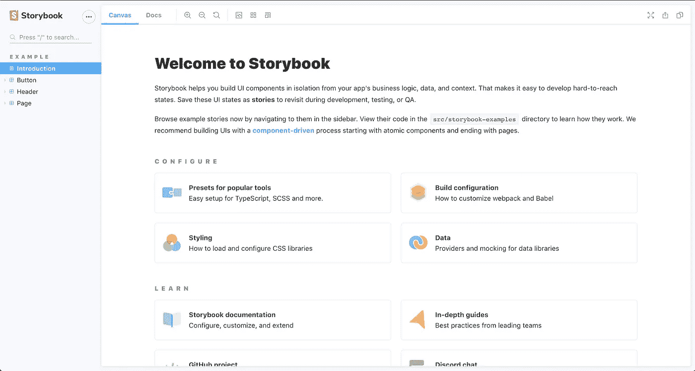
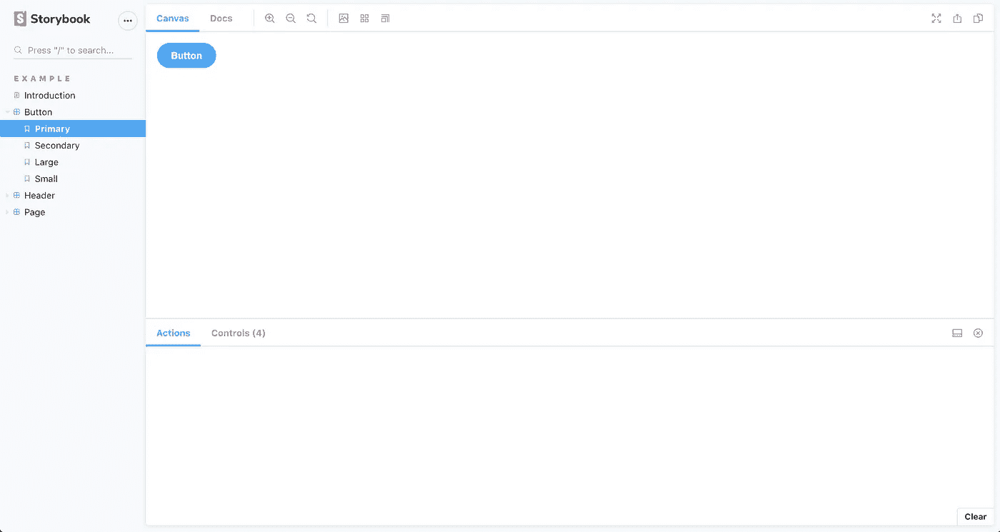

# 使用故事书在 React 中构建 UI 组件

> 原文：<https://levelup.gitconnected.com/building-ui-components-with-react-and-storybook-b273489db6b4>


我最近开始了一个新的角色，在 Softcom 担任界面开发人员。


耶！

作为一名界面开发人员，我需要将网页设计转换成代码。到目前为止，我学到了很多，我将分享我是如何用 React 和 Storybook 构建 UI 组件的。

我将讨论如何:

*   设置 react 应用程序
*   添加故事书-作为一个依赖和反应
*   用故事书创建一个 UI 组件库

在说别的之前，我先回答一下**【什么】**的问题。也就是 react，components，Storybook 是什么。

**什么是反应？React 是由脸书创建的 JavaScript 库，用于更快、更有效地构建 web 和移动应用程序的用户界面。它支持将复杂的用户界面分解成更小的代码块。这些小块被称为组件。**

**什么是组件？**
组件是可重用的代码块。将代码组织成组件使得阅读和理解更容易，减少了代码重复，并且还考虑到了可伸缩性。

以 [*Eyowo*](https://www.eyowo.com/) 网站为例，网站上有不同的版块可以转换成组件。你可以有

*   页眉


页眉

*   页脚


页脚

*   海罗（人名）；英雄（电影名）


海罗（人名）；英雄（电影名）

*   文本内容
*   特色内容等。

这些组件的组合构成了网站。

**什么是故事书？**
Storybook 是一个 UI 库，可以用来文档化组件。Storybook 可以与许多流行的前端框架和库一起工作，如 React、Vue、React Native、Angular 等等。

使用 Storybook，不需要构建一个全新的界面来显示你的 UI 组件，这使得开发更快更容易，也允许你一次只关注一个组件。

# 设置 react 应用程序

**Create React App** 是一个用于为 React 应用程序设置样板文件的命令。这是设置 react 应用程序的一种更快的方式，因为它不需要像 Webpack 或 Babel 这样的额外配置，因为所有这些都是在安装 create react 应用程序时完成的。你只需要在你的电脑上安装 Node.js 并运行一组命令。您可以使用下面的任何命令来设置 create React 应用程序

```
npx create-react-app my-appcd my-appnpm start
```

或者

```
npm init react-app my-appcd my-appnpm start
```

或者

```
yarn create react-app my-appcd my-appyarn start
```

# 添加故事书-作为依赖项反应

将故事书添加到一个项目中是非常容易的。您所需要做的就是将故事书包安装到您的项目中。

```
npx -p @storybook/cli sb init
```

运行故事书应用程序，开始创作你的故事。

```
npm run storybook
```

界面应该如下图所示



故事书

# 用故事书创建 UI 组件库

要使用 Storybook 创建 UI 组件库，您需要创建不同的 UI 组件，并为 Storybook 中的不同组件记录等效的故事。默认情况下，Storybook 附带了一些组件，包括按钮组件。你会看到一个 stories 文件夹，里面有 button.stories.js



您可以继续创建更多组件，也可以根据您的喜好编辑它们来覆盖默认组件。

使用 Storybook 进行开发允许开发人员交互式地开发和测试所创建的组件。Storybook 还有一些功能，可以让开发者增强其核心能力。这些功能被称为附加功能。关于附加组件的更多信息，请查看[故事书附加组件文档](https://storybook.js.org/addons)

*PS:它也可以作为团队中的设计师测试开发人员所构建的东西的平台。*