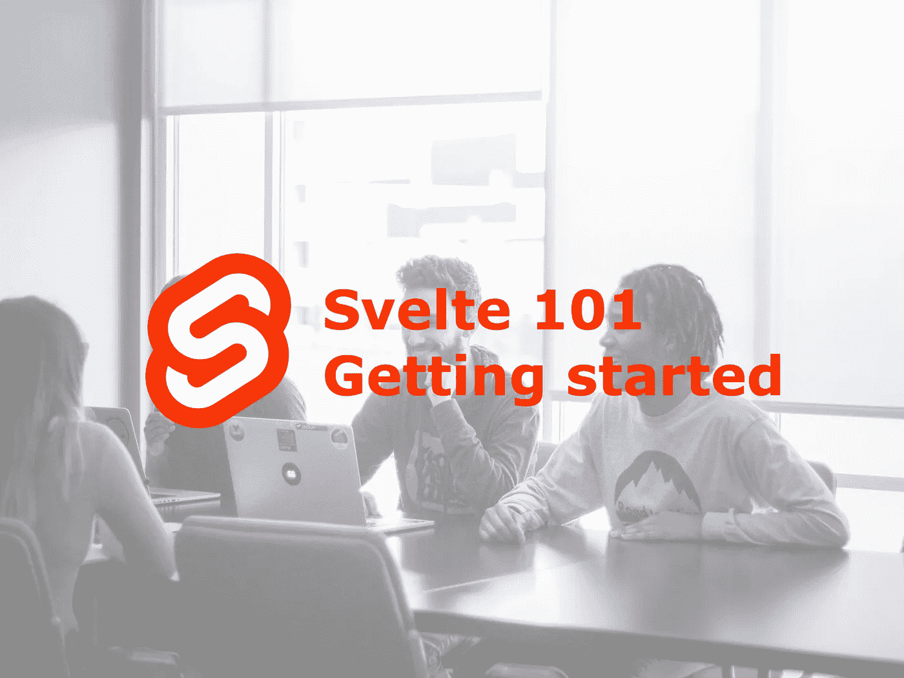
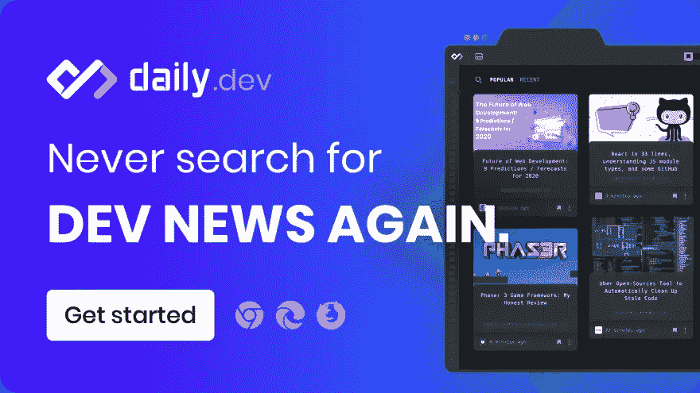

# 苗条的建筑——开始前你需要知道的一切

> 原文：<https://levelup.gitconnected.com/building-with-svelte-all-you-need-to-know-before-you-start-e70a0cf400e1>

*TL；DR——与 React、Angular 或 Vue 等已建立的基于组件的框架不同，使用 Svelte，您可以将用户界面的构建提升到一个新的水平。许多开发者对学习如何建造苗条身材感兴趣，我们很乐意帮助你开始！这里有一些精选的有价值的资源来帮助你开始苗条身材。*

# 为什么苗条？

最近，Svelte 在前端开发人员中越来越受欢迎，这是有原因的。我简要介绍了许多尝试使用 Svelte 进行构建的开发者所认同的主要优势，并讲述了他们的故事。

## 有什么好处？

*   Svelte 不是在浏览器中完成大部分工作，而是在你构建应用程序时完成工作，它**将其编译成高效的普通 JavaScript** 。
*   **减少你正在使用的 JavaScript 框架的开销**。通过将 Svelte 编译成 vanilla JavaScript，提高了代码的可读性，实现了重用，并产生了更快的 web 应用程序。
*   Svelte 不需要声明性的、状态驱动的代码，浏览器必须将这些代码转换成 DOM 操作。这意味着**你不再需要使用虚拟 DOM**。

## 有什么坏处？

*   **IDE 支持**还比不上常用的框架。它还有很大的提升空间。虽然网上有一些很好的资源可以解决一些问题，但它可以被认为是目前的一个主要缺点。
*   **目前没有太多的轻量级开发工具**。它仍然是一个年轻的、不断成长的生态系统。记住这一点。然而，这是一个很好的机会为苗条的群体开发一些。
*   **小型开源生态系统**。像许多其他框架一样，围绕一个特定的框架构建一个大型社区需要时间。尽管 Svelte 已经走了一条相当不错的路，但是仍然没有足够的开源贡献者。我也一样，你也可以把它看作一个机会。

想了解更多关于苗条身材的利弊吗？

*   [CTO 的苗条指南——瑞星前端框架能为你做什么？](https://tsh.io/blog/svelte-framework/)
*   [同而不同:苗条身材简介](https://blog.codecentric.de/en/2020/02/same-but-different-introduction-to-svelte/)
*   [Svelte:与其他框架的比较](https://codeburst.io/svelte-comparison-with-other-frameworks-e895c45567de)
*   一个强调苗条身材利弊的简单例子

# 帮助您起步的资源

## 苗条的生态系统 101👋🏼

*   [Svelte 的主页](https://svelte.dev/)
*   [官方 Selvte 社区](https://svelte-community.netlify.app/)
*   [苗条的 GitHub 库](https://github.com/sveltejs/svelte)
*   [苗条的不和谐服务器](https://svelte.dev/chat)
*   [苗条子 reddit](https://www.reddit.com/r/sveltejs/)

## 教程🤓

我们不想用教程淹没你。外面有大量的教程，我们只挑选了那些既**实用、全面又用户友好的**:

*   [苗条开发者的官方教程](https://svelte.dev/tutorial/basics)。
*   [构建我的第一个苗条的应用:想法和印象](https://scotch.io/tutorials/building-my-first-svelte-app-thoughts-and-impressions)作者[克里斯关于代码](https://twitter.com/chrisoncode)

## 使用案例和演示🚀

像任何事情一样，当开始做新的事情时，灵感是很重要的。查看一些使用 Svelte 的酷项目。其中一些已投入生产，一些是演示应用:

*   [OmniaWrite](https://omniawrite.com/) —一个为创意写作而设计的文本编辑器。同样在 [GitHub](https://github.com/TorstenDittmann/OmniaWrite)
*   TypeRunner.js —一个简单的打字游戏，有 2-4 个人类玩家相互竞争。第一个打出整段文字的人获胜。
*   [黑客新闻克隆](https://hn.svelte.dev/)身材苗条。也在 [GitHub](https://github.com/sveltejs/hn.svelte.dev) 上。
*   [Nomie](https://nomie.app/)——用纤巧打造的心情与生活追踪器。也在 [GitHub](https://github.com/open-nomie/nomie) 上。
*   许多其他应用程序[的酷炫展示](https://madewithsvelte.com/)

## 有用的代码库💻

*   [细长网格](https://github.com/vaheqelyan/svelte-grid)——一种响应灵敏、可拖动和可调整大小的网格布局，适用于细长网格
*   [Vime](https://github.com/vime-js/vime)——专注于简化网络媒体元素的嵌入和使用
*   [Svelte-mui](https://github.com/vikignt/svelte-mui)——一套受[谷歌材质设计](https://material.io/design)启发的轻薄 ui 组件
*   苗条组件模板——构建可共享苗条组件的基础
*   [细长加载器](https://github.com/sveltejs/svelte-loader) —细长组件的网络包加载器
*   [瘦路由](https://github.com/EmilTholin/svelte-routing) —一个支持 SSR 的声明式瘦路由库
*   [svelte-inetllij](https://github.com/tomblachut/svelte-intellij) —在 WebStorm 和 friends 中提供苗条组件的语法高亮显示
*   [@ testing-library/svelte](https://github.com/testing-library/svelte-testing-library)——简单完整的 DOM 测试工具，鼓励良好的实践
*   [纤巧的阿波罗](https://github.com/timhall/svelte-apollo) —阿波罗 GraphQL 的纤巧集成
*   在此搜索更多[回复](https://svelte-community.netlify.app/code/)
*   探索一些基本的[代码示例](https://svelte.dev/examples#hello-world)

## 开发者工具🔧

正如我们所说的……目前没有多少经过现场测试的开发工具可用。然而，这一个非常有用:用于 Chrome 和 Firefox 的浏览器扩展

## 保持对苗条新闻的更新🏄🏻

*   官方苗条博客
*   为什么是苗条——一个专为苗条新闻打造的新闻聚合器
*   [daily . dev](https://daily.dev/topic/svelte)——千万不要错过关于苗条身材的更新。让 daily.dev 为你收集和排列最新的科技新闻
*   苗条简讯——每两周一次将最新的苗条新闻发送到你的收件箱

我错过了一个重要的资源吗？评论下面，让我知道！👇🏽

*这篇客座博文是❤️与*[***daily . dev***](https://r.daily.dev/gitconnected)*合作向*[*git connected*](https://levelup.gitconnected.com/)*社区发布的。daily.dev 在每个新标签页提供最好的节目新闻。它将为您排列数百个合格的来源，以便您可以侵入未来。*

