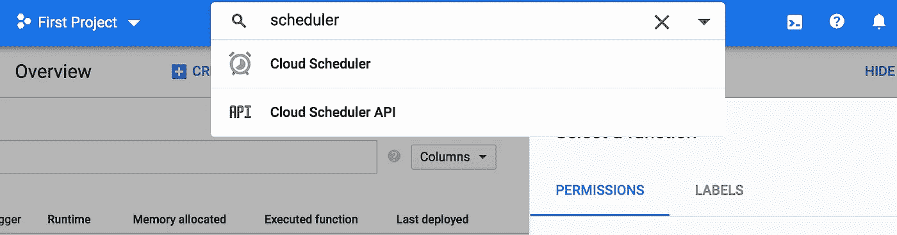

# 在 GCP 上构建你的第一个无服务器 Slack 应用是如此简单

> 原文：<https://levelup.gitconnected.com/building-your-first-serverless-slack-app-on-gcp-is-so-easy-bb812bad5bd1>

## 如何为 slack 开发一个令人惊叹的无服务器应用

## 构建您的第一个 Slack 应用程序并在零管理下运行它的最简单、最便宜的方式。


[Webaroo.com.au](https://unsplash.com/@webaroo?utm_source=unsplash&utm_medium=referral&utm_content=creditCopyText)在 [Unsplash](https://unsplash.com/@webaroo?utm_source=unsplash&utm_medium=referral&utm_content=creditCopyText) 上拍照

Slack 是世界上最大的平台之一。对于团队成员之间的协作来说，这是一个非常有用的工具。对于世界各地的软件团队来说，使用 slack 变得很正常。

然而，在这个世界上的任何一个平台上，你总是可以添加更多的东西。Slack 平台团队深知这一点！这就是为什么他们允许你开发应用程序、机器人和插件来提供更多的协作。许多软件工具都集成了 slack。许多公司开发他们的软件来轻松地与 Slack 一起工作。不仅如此，与 Slack 的构建和集成也有很大的商机。

# 你喜欢咖啡吗？

咖啡是开发人员的主要燃料之一，它在大多数时候提高了他们的工作效率。你可以在这篇文章中找到关于它的详细解释:[一个网站开发者的生产力秘密:咖啡【9 种】](https://dev.to/anastasionico/productivity-secret-of-a-web-developer-coffee-9-types-56ck)。

因此，我们将构建一个 Slack 应用程序，它将在#general channel 上发送通知，邀请团队在预先安排的时间喝一杯咖啡。

在这里，我将向您展示我是如何构建并运行一个简单的 Slack 应用程序的。此应用程序正在根据特定计划向空闲频道发送通知。

*   *我们将使用* ***GCP 调度器*** *来调用* ***GCP 云函数***
*   ***【GCP】云功能*** *会发消息给我们****Slack app web hooks***
*   ***Slack 平台*** *将消息从****Slack app web hooks****发送到****#通用频道*** *。*

# 建筑

我们的建筑非常简单。我们将使用 GCP 调度程序来调用 GCP 云函数，该函数将向我们的 Slack 应用程序 Incoming Webhook 发送一个 HTTP 请求。Slack 平台会将传入的 Webhook 接收到的消息重定向到目标通道。


我们简单的建筑

# 开始建造

去 Slack API 网站:[https://api.slack.com/](https://api.slack.com/)

点击**开始建造**按钮


开始构建你的第一个 Slack 应用

输入您的应用程序名称并选择目标工作空间(如果您有多个工作空间)


给你的应用取一个好听的名字

您将看到关于您的应用程序的**基本信息**。你的应用目前没有任何动作。


您的应用程序基本信息

选择**即将到来的 Webhooks** ，这将是我们的主要关注点。


引入的 Webhooks 是我们这里的工具

激活**进料网钩**


活动的传入网页挂钩屏幕看起来像什么

如您所见，我们可以在这里**向工作区添加新的 Webhook。**此 webhook 将仅映射到一个频道。


我们将使用#通用频道(您可以选择任何频道)

在您允许之后，您将被重定向到 Incoming Webhooks 屏幕，在这里您将找到新的 **Webhook URL** 。


每个 Webhook 都有一个唯一的 URL

Webhook URL 是您访问 Slack 平台的接入点。您可以将样本 curl 复制并粘贴到您的终端中，并对其进行测试。你应该会收到一条来自**#通用**频道内部的消息。


您使用 curl 从终端发送的信息会出现在频道中。

现在，我们准备了备用的，我们得到了一个平台的接入点。下一步是将我们的逻辑转换成实际运行的无服务器应用程序。

我们将与 GCP 合作，并将使用云功能服务。我们所需要的是一个可以调用 webhook 并将我们的消息传递给它的函数。

在你的 GCP 项目中，导航到**云功能**:


搜索并导航至云功能

创建一个 HTTP 云函数。


创建 HTTP 云函数

在本文中，我们将使用 Python 3.7


云函数简单代码

我们的代码将非常简单:

```
import requests

def coffee_time(request):
    request_json = request.get_json()
    url = "https://hooks.slack.com/services/TEAMID/CHANNEL/WEBHOOK"

    payload = '{"text":"It is the coffee time!"}'

    headers = {
        'Content-Type': 'application/json'
    }

    response = requests.request("POST"**,** url**,** headers=headers**,** data=payload)

    print(response.text.encode('utf8'))
```

前面的代码只是简单地向我们之前创建的 Slack webhook 发送一条文本消息，Slack platform 会将消息传递到附加的通道。

将您的代码部署到云功能，并测试它。您应该会在附加的频道中收到消息。


传递到#通用频道的消息

现在，我们想在每天上午 10:00 发送此消息，以召集最多的开发人员一起喝咖啡聊天。我们将使用 **GCP** **云调度器**。



搜索并导航到云调度程序

使用 HTTP 目标创建新作业。将频率设置为每天上午 10:00 一次。您可以在本页找到如何定义作业计划的有用指南:[配置 Cron 作业计划](https://cloud.google.com/scheduler/docs/configuring/cron-job-schedules?#defining_the_job_schedule)

在目标 URL 中，插入你的**云功能触发 URL** 。


配置您的计划程序

现在您的调度程序已经准备好运行了


调度程序从未运行过

为了测试，通过点击**立即运行**按钮运行调度程序，这将调用函数。您应该看到结果更改为 Success，并且显示了上次运行的日期。


调度程序成功运行

您应该会在目标通道中收到一条新的 Slack 消息。


调度程序调用云功能后收到的新消息

现在，您将在每天上午 10:00 收到一条新消息。无服务器的 Slack 应用程序将永远自动运行。

# 现在去哪里？

在本文中，我们讨论了一个非常简单的无服务器架构的 Slack 应用程序。你可以根据你的业务逻辑来开发你的应用。

阅读 Slack platform API，了解更多可以在该平台上使用的工具。

了解无服务器技术的威力以及如何优化它来构建您的应用程序也很重要。