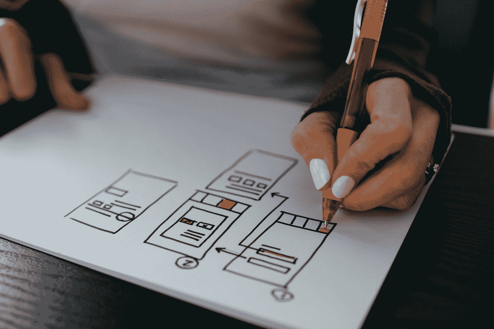
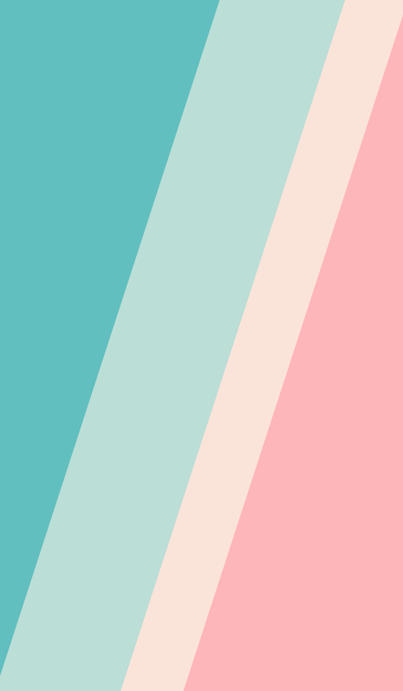

# 建立你的第一个网站

> 原文：<https://levelup.gitconnected.com/building-your-first-website-c25a5f5e7b04>

凯利·西克玛在 [Unsplash](https://unsplash.com?utm_source=medium&utm_medium=referral) 上的照片

建立一个网站需要一些规划，甚至在你输入第一行代码之前，这里有一些提示可以帮助你使这个过程顺利进行。

如果你和一个设计师一起工作，那么你是幸运的，因为你不必从头开始，设计师可以给你一个已经被客户认可的模型，你的工作是找出如何将美丽的模型转化为你的代码，并创建这样的网站。

如果你没有设计师，需要从头开始，那么在你编码之前，你有很多事情要做。首先，做你的研究，了解你要建立的网站的产品或服务。找出谁是你的客户和目标市场，你的客户期望是什么，什么样的调色板将匹配公司/产品，等等。从像 [Dribbble](https://dribbble.com/) [、](https://dribbble.com,) [Pinterest](http://pinterest.com) [、](https://www.pinterest.com,) [Behance](https://www.behance.net) [、](https://www.behance.net,)这样的网站获取一些灵感和样本，向你的客户展示一些网站样本，让他们感受一下他们喜欢什么样的网站设计。

从客户那里收集所有需要的资产，比如商标、产品图片、他们使用的字体以及其他等等。

在你收集了所有的信息后，现在是时候拿出你的笔和纸开始画你的网站的草图了。如果你知道如何更好地使用 Figma、Adobe XD 或 Sketch，你可以从头到尾开始设计你的网站模型，获得你的客户批准，然后你可以开始准备下一步开始编码。

花点时间研究模型，注意所有重复使用的东西，颜色，字体大小，按钮等。，并记下它。开始标记模型，并确定您将在哪里使用 flexbox 或 grid 来一部分一部分地构建它。

此外，创建 3 个单独的 CSS 文件也是一个好主意:

**default.css**

default.css 将包含所有默认设置，如字体大小、颜色和其他设置，您可以在整个页面中全局应用这些设置，而无需反复重新键入。

**style.css**

您可以将常规的 css 语法放在 style.css 上，以设置每个部分的样式。

**responsive.css**

最后，responsive.css 将为您的移动响应式视图托管所有媒体查询设置。

照片由 [Gradienta](https://unsplash.com/@gradienta?utm_source=medium&utm_medium=referral) 在 [Unsplash](https://unsplash.com?utm_source=medium&utm_medium=referral) 上拍摄

如果你的网站碰巧有以下几样东西，给你一些额外的提示:

*   你可以使用多重线性渐变来创建一个多彩的背景。
*   如果你用 position absolute 来设置你的组件，Position unset 是有用的，它会弄乱你的移动响应视图。
*   在绝对位置上使用百分比比固定的数字要好。
*   当你在 style.css 上有 position absolute 时，网格在 mobile responsive 中似乎更容易控制。

了解有关线性渐变和位置未设置的更多信息:

*   线性渐变:[https://developer . Mozilla . org/en-US/docs/Web/CSS/gradient/linear-gradient()](https://developer.mozilla.org/en-US/docs/Web/CSS/gradient/linear-gradient())
*   位置未设置:[https://developer.mozilla.org/en-US/docs/Web/CSS/unset](https://developer.mozilla.org/en-US/docs/Web/CSS/unset)

编码快乐！