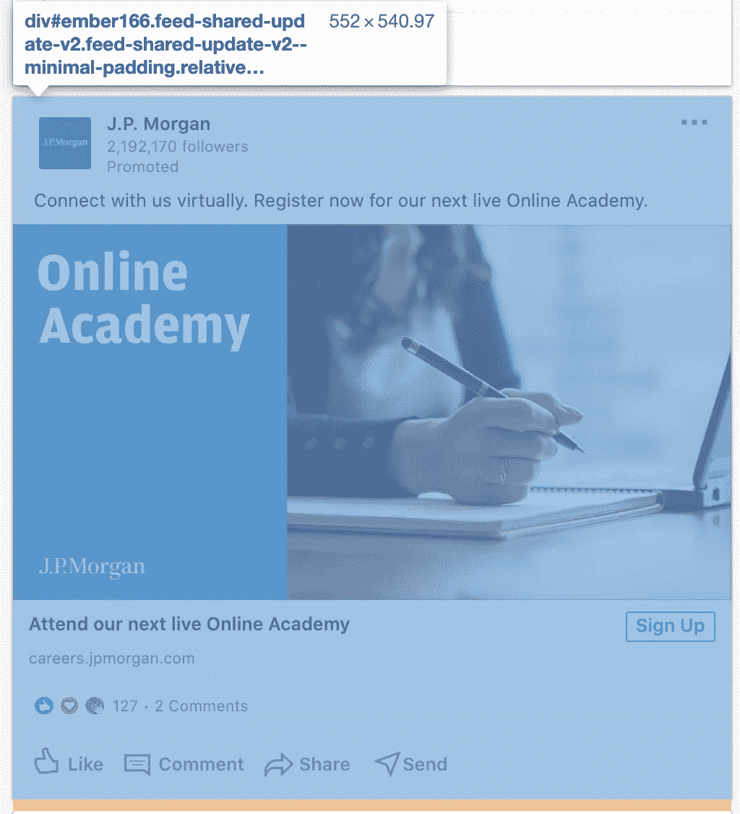
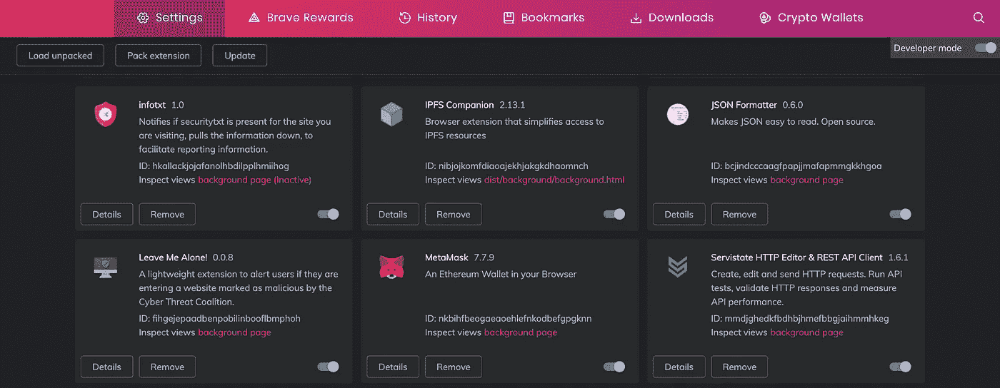

# 在(字面上)10 分钟内构建您自己的广告拦截器

> 原文：<https://levelup.gitconnected.com/building-your-own-adblocker-in-literally-10-minutes-1eec093b04cd>

## 编程教程

## 用不到 100 行代码创建浏览器扩展的分步指南

大声喊出来

浏览器扩展总是让我着迷。

这些天他们被低估了，尤其是从桌面到移动浏览的转变。然而，我喜欢根据自己的喜好定制我访问的网站，比如增强我的在线隐私。

今天我决定与你分享如何在 10 分钟内建立一个全功能的扩展来阻止 LinkedIn 广告。

信不信由你，扩展可能是**你能构建的最简单的东西**，所以让我们切入正题，为了在 10 分钟内真正做到这一点。

> **免责声明:**该扩展仅适用于基于 Chrome 的浏览器，如 Chrome、Brave、Opera、Microsoft Edge 等。换句话说，它在 Firefox 或 Safari 上不起作用。

# 设置

*一如既往，* [*所有代码都在 GitHub*](https://github.com/yakkomajuri/linkedin-adblocker) *上。*

为了使事情变得简单，我们的扩展实际上没有弹出窗口(当你点击一个扩展的图标时出现的小窗口)，它只是在后台工作。

因此，我们真正需要的是 3 个文件。这些是:`manifest.json`、`background.js`和`linkedin.js`。

因此，第一步是:创建一个空的存储库，并在其中创建这些文件。

现在，让我们浏览一下它们的内容。

## manifest.json

`manifest.json`是唯一一个**扩展名需要的必备**文件。在我们的例子中，它将包含关于扩展的元数据、它需要操作的权限以及它应该在后台运行的脚本。它看起来是这样的:

除了元数据之外，这里还有一些关于这个清单为我们设置的重要内容的信息:

**权限**

`permissions`建立你的扩展允许做什么，比如获取当前页面的 URL，或者给网站添加 JavaScript。

当你在 Chrome 网上商店这样的地方发布你的扩展时，为了确保你的用户的安全和隐私，你会被要求证明你请求访问的每个权限。

这里，我们请求对`tabs`和`webNavigation`的许可，以便知道我们何时访问一个新网站，以及那个网站是什么。我们需要这个来检查网站是否是 LinkedIn，这样我们就可以启动我们的广告拦截脚本。

最后，我们请求允许修改 https://www.linkedin.com/网页，这样我们就可以插入我们的脚本。

**背景**

`background`指定当某些事件被触发时应该运行的脚本。大多数扩展以某种方式监听的一个关键事件是新网页的加载。

在我们的例子中，我们将监听导航的变化，并获取每个新请求的网站的 URL。

## 背景. js

继续，让我们进入一些更有趣的东西。

在`background.js`中，我们将设置我们的事件监听器，它将在用户每次加载新网页时触发一个动作。然后，我们将检查该网站是否是 LinkedIn，如果是，我们将屏蔽广告。

文件的内容如下:

由于我在文件中留下了一些注释，所以我不会太深入地研究每一行是干什么的。

但是，本质上，我们在这里做的是当一个新的页面加载时获取 URL，去掉 URL 中不必要的内容，并检查域名本身是否真正匹配*linkedin.com。*

如果是这样，我们将把`linkedin.js`的内容注入网站，这将有助于移除我们的广告。如果没有，我们就什么都不做。

## 领英网

我们剩下的最后一个文件指定了如何真正阻止广告。

为此，我做了一点功课，这样你就不用做了。

左边的图片是我的 LinkedIn feed 被浏览器的开发工具检查的截图。

你可以看到，由于广告必须被适当地标记，LinkedIn 在帖子中添加了一行“Promoted ”,以表明这是一个广告。

然而，[与脸书](https://www.vice.com/en_us/article/7xydvx/facebooks-arms-race-with-adblockers-continues-to-escalate)不同，LinkedIn 并没有试图混淆 HTML 以使其难以区分广告，所以你只需在页面中寻找包含“Promoted”一词的元素，就可以在 JS 中找到广告。

然后，要真正删除广告，我们需要找到包围整个帖子的祖先(第 n 个父)元素，并删除它。使用 Dev Tools，您实际上可以右键单击元素并选择“Remove Element”来查看结果。在我们的代码中，我们将把那个元素的`style`属性设置为`display: none;`，这样就完成了。

这看起来是这样的:

简而言之，我们迭代所有的`span`元素，寻找那些具有“提升”文本的元素，尝试获得以两种不同方式包装广告的`div`，然后通过设置`display: none;`来消除它。

为了找到正确的祖先，我们首先为 HTML 元素使用一个名为`closest`的内置方法。这将迭代我们的`span`的祖先，直到找到第一个带有类`feed-shared-update-v2`的。我认为这是我们需要“删除”的元素。

然而，如果 LinkedIn 要更新他们的 UI 并将该类更改为`feed-shared-update-v3`，上面的方法将不起作用。因此，我们然后尝试获得第 6 个父代，这应该相当于来自另一个方法的相同的`div`。

自然，如果 LinkedIn 改变了`class` **和**他们被提升职位的结构，我们的扩展很可能会失败。但至少在一段时间内，它应该工作得很好。

我们还使用一种**不复杂的**方式，通过使用`setInterval`每 100 毫秒运行一次脚本，确保用户滚动时动态加载的广告也被删除。

一般来说，当我使用这个扩展时，我有时会在第一个广告消失前短暂地看到它，但在滚动时永远不会看到另一个广告的提示。

## 将扩展添加到浏览器中

我勇敢的浏览器扩展页面

所以这就是所有的扩展。整件事大概有 100 行代码，还有注释。

至于你如何使用它，你可以这样做:

1.  点击浏览器右上角的“汉堡菜单”或直接访问设置
2.  导航到“扩展”
3.  打开“开发者模式”，它通常在“扩展页面”的右上角
4.  一些按钮应该出现在页面的顶部。点击“加载解压缩”
5.  从文件浏览器中选择项目目录
6.  你都准备好了！

如果您已经正确地遵循了所有的步骤，您现在应该在您的扩展所在的位置有一个新的图标，也在右上方。

因为我们没有为它设置图标，所以它可能是一个正方形里面的“L”。

现在开始测试吧！这里有一个[LinkedIn 的便捷链接。](https://linkedin.com)

## 包扎

仅此而已！我真的相信这在 10 分钟内是可行的。

当然，这里的目标是非常快速地构建一些有用的东西，所以我们牺牲了一些方面，比如有一个实际的弹出窗口，甚至一个图标。

然而，这表明，只要抽出一点喝咖啡的时间，你就可以为自己(甚至他人)构建有用的软件。

最后，如果有兴趣进一步探索浏览器扩展，一定要让我知道，下次我会更深入地研究。

感谢你的阅读，并享受滚动 LinkedIn 的乐趣……如果那是一件事的话。

> 渴望另一个编程教程？[来点黑客](/learning-the-internals-of-git-by-hacking-websites-c70c59303b12?source=friends_link&sk=ae9b4795572ca43136d0e80ea3938f4c)怎么样？