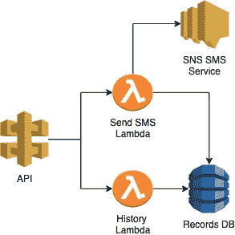
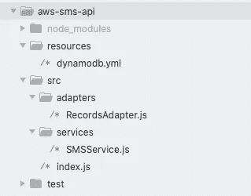
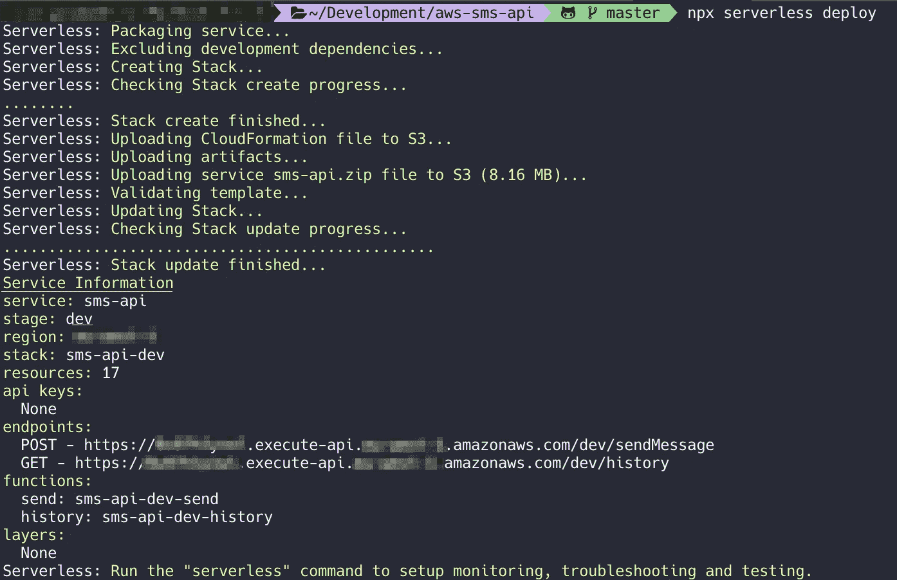
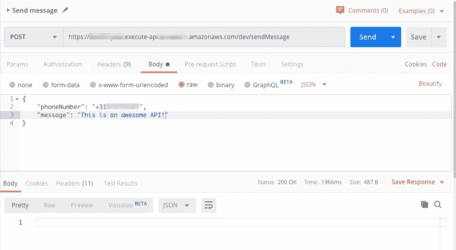
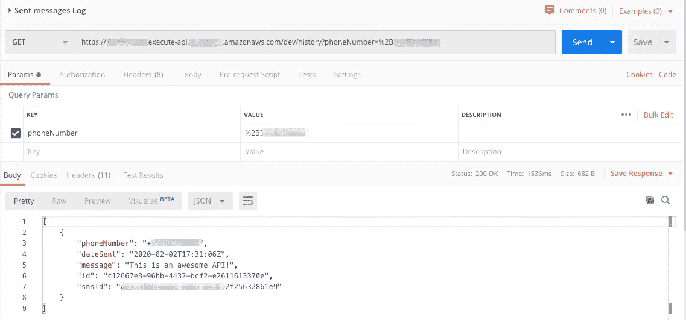

# 构建您自己的 SMS 无服务器 API

> 原文：<https://levelup.gitconnected.com/building-your-own-sms-serverless-api-c8d09c0b65eb>


[梁杰森](https://unsplash.com/@ninjason?utm_source=medium&utm_medium=referral)在 [Unsplash](https://unsplash.com?utm_source=medium&utm_medium=referral) 上的照片

比方说，您有一个特定的需求或任务，您需要向您的用户发送并发的 SMS 消息。如果你很务实，不想重新发明轮子，你很可能会使用像 [Twilio](https://www.twilio.com/sms) 或 [MessageBird](https://www.messagebird.com/en/sms) 这样的服务。

但也有可能出于某种原因，您需要构建自己的解决方案。也许您更喜欢构建自己的价格更具竞争力的解决方案，或者您只是想通过一个已定义的使用案例来了解更多关于无服务器的信息。

如果以上任何一个对你来说都是真的，那么让我们看看如何在 AWS 上构建你自己的无服务器 API 来发送 SMS 消息到世界上的任何电话号码。

# 开始前

您需要在机器上安装以下工具:

*   [](https://docs.npmjs.com/cli/install)****可通过您的 CLI 控制台访问。****
*   ****[**无服务器框架**](https://serverless.com/framework/docs/providers/aws/guide/installation/) **，**全球安装，可通过您的 CLI 控制台访问。****
*   ****一个 [**AWS 账户**](https://aws.amazon.com/) ，一个 IAM 用户，拥有为您的 CLI 或控制台配置的[凭证。](https://docs.aws.amazon.com/cli/latest/userguide/cli-configure-role.html)****
*   ****一个 [**AWS 用户角色**](https://docs.aws.amazon.com/IAM/latest/UserGuide/id_roles_create.html) 来执行您的 lambda，拥有以下权限:
    * AWS SNS 访问
    * AWS DynamoDB 访问
    * CloudWatch 日志创建****

****您也可以[在您的无服务器配置](https://serverless.com/framework/docs/providers/aws/guide/iam/)中设置角色。从安全角度来看，在更安全的流程中生成角色访问可能更好，但这超出了本文的范围。****

# ****建筑****

********

****无服务器 SMS API 体系结构****

****要发送我们的短信，我们将使用 [AWS SNS " *发布到手机*](https://docs.aws.amazon.com/sns/latest/dg/sms_publish-to-phone.html) "来发送我们的消息，因此我们可以委托发送短信。我们还需要一个 [AWS API 网关](https://docs.aws.amazon.com/apigateway/)来向世界或其他应用程序公开我们的服务。我们将需要 2 个 lambda 函数来执行我们的定制业务逻辑。****

****最后，我们需要一个数据库来存储发送的消息，以便我们可以在以后查询或审计这些消息，实际上，这可以是任何数据库，但为了易于部署我们的无服务器架构，我们将使用 [AWS Dynamo DB](https://aws.amazon.com/dynamodb/) 。****

# ****初始配置****

****首先，您需要初始化您的项目，将这个 NPM 配置复制到您的**包中******

****然后运行命令安装依赖项:****

```
**$ npm install**
```

****我们使用 ***AWS SDK*** 连接到 AWS，使用 ***moment*** 和 ***uuid*** 包为数据库中的记录生成日期和 id。****

# ****无服务器配置****

****现在创建一个 **serverless.yml** 文件，并使用以下信息:****

****请确保您还将信息更新为与您当前的 AWS 帐户和地区相匹配的信息。确保执行角色使用您之前创建的角色的 ARN。****

****我们设置了两个函数，一个是 ***send*** 函数，它将处理发送 SMS 的逻辑。以及一个 ***历史*** 函数，我们将用它来查询已发送的消息。****

****使用无服务器框架的[魔法，只需声明 ***http*** 事件，就会自动创建一个 API 网关作为我们堆栈的一部分，具有两个端点，即在 ***路径*** 配置下指定的端点。这些端点将触发 lambda 函数；](https://serverless.com/framework/docs/providers/aws/events/apigateway/)****

****因为我们需要一个 Dynamo DB，所以我们也可以用我们的无服务器配置来创建它。然而，在这种情况下，为了保持我们的配置文件有组织和干净，我们将把它移到一个[资源配置文件](https://github.com/foxxor/aws-sms-api/blob/master/resources/dynamodb.yml)中来声明组件。然后在配置中，我们只需导入资源文件。****

****声明了所有的资源和组件后，我们现在可以实现应用程序的逻辑了。****

# ****应用代码****

## ****项目结构****

****为了保持代码的整洁，我们将以下面的方式构建代码，试图分离关注点，并使应用程序易于维护和测试。****

********

****项目文件结构****

****您不需要遵循相同的结构，但是在这个例子中，我将把任何执行外部调用的逻辑移动到它们自己的类文件中。数据库调用的适配器和 SMS 请求的服务。****

****lambda 函数将在同一个文件中，但是您也可以为每个 lambda 使用单独的文件。在这种情况下，由于两个函数的配置是相同的，我将把它们放在一起。****

## ****外部呼叫类别****

****我们将实现的第一个类是我们的 SMS 服务，它将初始化 AWS SDK 并使用 SMS 数据调用 SNS *publish* 方法。然后，AWS 将发送 SMS 并返回消息 ID，然后应用程序将存储它，以便以后与历史端点一起使用。****

****短信服务****

****对于数据库适配器类，我们需要再次调用 AWS SDK 来初始化 Dynamo DB 调用。和 2 个函数，一个创建记录，另一个能够使用电话号码查询数据库。****

## ****λ函数****

****首先，我们需要包含我们已经创建的服务和适配器，并初始化我们需要的配置，以调用 AWS 服务。之后，我们可以添加 lambda 函数。****

****因为我们正在处理 API 网关 HTTP 请求和响应，所以我们将接收到一个 *HTTP* 数据对象，而不是一个事件，这个数据对象包含发送到我们 API 的请求数据。****

****我们用先前定义的配置初始化这些类，然后我们验证消息和电话号码是否被正确接收。否则，lambda 将返回 400 HTTP 错误代码，因为请求无效。****

****最后，我们调用 SMS 服务来发送 SMS，并使用服务将记录存储在 DynamoDB 中。****

****对于历史 lambda，我们做了类似的处理，但是这次我们验证了提供了 ***电话号码*** 。并调用适配器来检索所有相关的记录。****

# ****部署****

****既然已经定义了所有的应用程序，我们只需要部署它:****

```
**$ serverless deploy**
```

****部署完成后，您将看到以下信息:****

********

****无服务器框架部署****

*   ****关于由无服务器框架创建的 CloudFormation 堆栈的一般信息****
*   ****已部署资源的数量(S3 部署桶、lambdas、DynamoDB、SNS 队列等。)****
*   ****指向您的端点的 URL****
*   ****lambda 函数名称****

****现在，您可以开始使用您的 API，只需调用端点传递适当的数据，SMS 消息应该会立即发送。****

********

****API 发送消息调用****

****瞧，我收到了一条手机短信。****

********

****短信捕获****

****也可以根据我之前发消息用的电话号码查询历史:****

********

****API 历史查询调用****

****就是这样！您现在可以从自己的无服务器应用程序轻松发送 SMS 消息。****

****你可以在我的 GitHub 库中找到这个项目的副本[。](https://github.com/foxxor/aws-sms-api)****