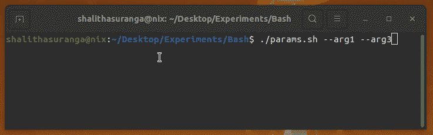
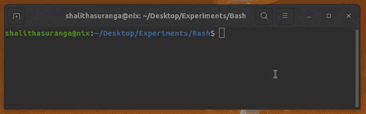
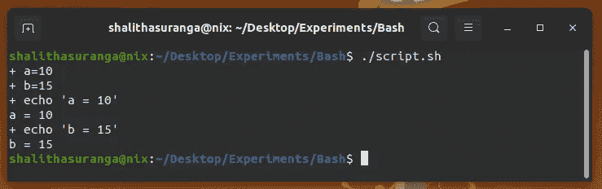
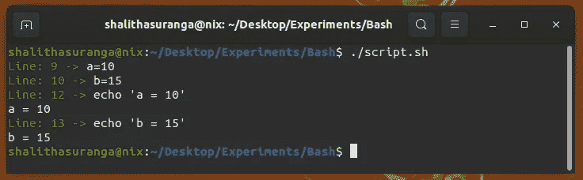
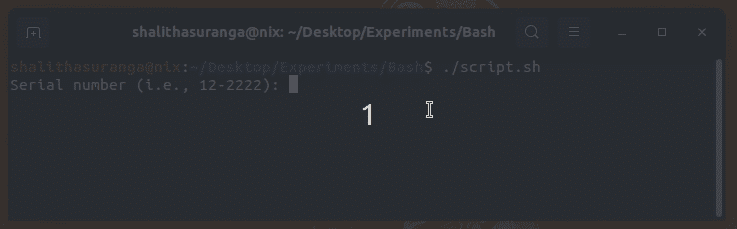

# 每个开发人员都应该知道的内置 Bash 参数

> 原文：<https://levelup.gitconnected.com/built-in-bash-parameters-that-every-developer-should-know-b6d7b73ccb7a>

## 使用这些语法高效地编写干净的 Shell 脚本


照片由[粘土银行](https://unsplash.com/@claybanks?utm_source=unsplash&utm_medium=referral&utm_content=creditCopyText)在 [Unsplash](https://unsplash.com/s/photos/coding?utm_source=unsplash&utm_medium=referral&utm_content=creditCopyText) 拍摄，用 Canva 编辑

现代操作系统提供了两种用户交互机制:CLI 和 GUI。用户通常在终端程序中输入各种命令，通过 CLI 执行操作。另一方面，他们可以用鼠标或触摸屏等指示设备来操作 GUI。由于灵活性、自动化支持、生产率和类似编程的语法，大多数程序员更喜欢使用面向 CLI 的方法。

Bash 现在通过提供一个最小的命令-进程转换器和一个全功能的命令语言，帮助每个 Unix/类 Unix 用户使用终端。DevOps 工程师和程序员倾向于选择 Bash 来编写自动化脚本、实用程序脚本，甚至通用程序。了解鲜为人知的有用的 Bash 语法对所有程序员来说确实是一件好事。

在 Bash 世界中，[参数](https://www.gnu.org/software/bash/manual/html_node/Shell-Parameters.html)指的是程序员在脚本执行期间可以用来存储数据的元素。Bash 有三种参数类型:变量、位置参数和特殊参数。让我们用一些实际的例子来讨论这些参数类型——然后，您可以在您即将到来的自动化脚本中使用它们！

# 在脚本范围和函数范围中使用位置参数

有几种方法可以获得特定 Bash 脚本的附加输入。如果我们正在为人类编写一个 Shell 脚本，我们可以使用`read`内置命令以一种用户友好的方式从键盘捕获用户输入。如果我们创建的 DevOps 或实用程序脚本在脚本执行期间不需要友好的用户交互，我们可以使用命令行参数。位置参数帮助我们以索引的方式访问进程参数列表，就像 c 语言中的`argc`。

请看下面的脚本，它显示了前两个整数参数值的总和:

```
#!/bin/bashsum=$(($1 + $2))
echo "sum = $sum"
```

上面的代码片段对前两个位置参数使用算术展开来获得总和。类似地，`$n`参数指的是`nth`命令行参数值。在函数内部，这些位置参数与函数参数进行映射，如下面的代码示例所示:

```
#!/bin/bashfunction sum() {
    echo $(($1 + $2))
}read -p "Enter num1: " n1
read -p "Enter num2: " n2echo "sum = $(sum $n1 $n2)"
```

如果我们需要处理动态索引的参数呢？然后，我们可以解析整个参数列表，或者通过`$@`迭代，或者通过[间接扩展](https://www.gnu.org/software/bash/manual/html_node/Shell-Parameter-Expansion.html)访问每个参数，如下所示。

```
#!/bin/bashfunction parse_with_for_in() {
    for arg in "$@"
    do
        echo $arg
    done
}function parse_with_expansion() {
    for ((i = 1; i <= $#; i++))
    do
        echo ${!i} # Indirect expansion syntax
    done
}parse_with_for_in "$@"
echo "---"
parse_with_expansion "$@"
```

第一个函数包含一个遍历所有参数的 for-in 循环。第二个函数通过索引提取参数值。例如，当`i`是`2`时，间接扩展首先构造`$2`，然后找到第二个参数的值。看下面的预告:



在 Bash 中使用流程参数，作者截图

当我们提取第一个和第二个参数时，您也可以使用`$0`参数找到当前脚本的文件名。我们可以通过在上面的 for-loop 中添加一个`case`语句来用 Bash 开发完整的 CLI 程序。

# 用特殊参数处理子进程

Bash 是一个 Shell 解释程序和一种命令语言——因此您可以编写大部分脚本逻辑，而无需生成子进程。例如，由于众所周知的参数扩展特性，您可以在 Bash 中进行字符串操作、数组处理和基本的算术运算。然而，我们通常使用 Bash 来开发实用程序和 DevOps 脚本，因此使用子进程是不可避免的。

我们通过 Bash 顺序执行其他二进制文件，因此 Bash 提供了`$?`参数来获取最近终止的进程的退出代码。执行命令并查看退出状态，如下所示:



查找最近进程的退出代码，作者截图

Bash 还允许您使用`&`符号在后台运行进程。如果您需要终止之前生成的后台命令，该怎么办？`$!`参数返回前一个后台命令的进程标识符( [PID](https://en.wikipedia.org/wiki/Process_identifier) )。以下脚本打开 gedit 五秒钟:

```
#!/bin/bashgedit &
sleep 5
kill $!
```

如果您处理多个后台任务，请将`$!`值保存在临时变量中。`$$`参数返回当前 Bash 进程的进程标识符。在子 shells 中，它总是返回父 Bash 进程的标识符。一些旧的 bash 脚本使用`$$`来创建唯一的临时文件，但是它创建了可预测的临时文件，并为攻击者制造了一个[漏洞](https://www.gnu.org/software/coreutils/manual/html_node/mktemp-invocation.html)，所以使用`mktemp`命令来创建安全的临时文件。

# 帮助我们高效调试 Bash 脚本的预定义变量

许多程序员使用`echo`命令调试 Bash 脚本，就像他们在 JavaScript 调试中使用`console.log`一样。对于开发简单的 Bash 脚本来说，这种方法无疑更加舒适和快速。但是，如果在一个特定的 Bash 脚本中处理更多的数据并执行许多命令，这种方法就会变得非常耗时。

正如许多 DevOps 工程师所知，我们可以使用`-x`或`-xv` (verbose)标志来执行 Bash 解释器进程，以分别显示当前命令和代码片段。默认情况下，Bash 将显示当前命令字符串的前缀`+`，如下面的预览所示:



调试 Bash 脚本，作者截图

注意，这里我使用了下面的 Shebang 行来启用调试:

```
#!/bin/bash -x
```

当您稍后在脚本中调用`set -x`时，也会发生同样的行为。

现在，我们可以使用内置的`PS4`和`LINENO`局部变量来使我们的调试任务更加高效！请看下面的代码片段:

```
#!/bin/bashgreen='tput setaf 2'
reset='tput sgr0'
PS4='$($green)Line: $LINENO -> $($reset)'set -xa=10
b=15echo "a = $a"
echo "b = $b"
```

在前面的例子中，`PS4`局部变量保存默认字符`+`作为指示当前命令的前缀。但是，现在我们将其定制为以绿色显示行号，如下所示:



调试 Bash 脚本，作者截图

如果您需要调试一个导入多个源文件的 Bash 脚本，那么您可以使用`BASH_SOURCE`局部变量来显示带有`PS4`的当前脚本文件名。Bash 还为您提供了`FUNCNAME`局部变量来获取当前的函数调用栈，您可以使用`${FUNCNAME[0]}`(或者仅仅是`$FUNCNAME`)来查找当前的函数名。

定义一个自定义的`PS4`作为全局变量，比如 [this](https://stackoverflow.com/a/17805088/3565513) 来更快地调试 Bash 脚本！

# 像 Python 一样用 IFS 变量分割字符串

我们经常不得不在 Bash 脚本中处理字符串拆分任务。例如，在某些情况下，我们必须通过用逗号字符分割每一行来处理 CSV 文件。此外，有时，我们需要根据输入掩码用`read`命令捕获键盘输入。我们可以用 IFS(内部字段分隔符)轻松处理这些场景。IFS 是一个内部变量，它指示 Bash 将单词段与字符串分开。

`IFS`变量的默认值是`<space><tab><newline>`，但是你可以根据自己的需要进行编辑，重新设置回原来的值。让我们从一个简单的例子开始。假设您想让用户输入一个`NN-NNNN`格式的序列号，并将两个屏蔽段保存在不同的变量中。默认情况下，`read`命令根据默认的`IFS`处理输入，但我们确实可以修改如下:

```
#!/bin/bashIFS=-
read -p "Serial number (i.e., 12-2222): " seg1 seg2echo "Segment 1: $seg1"
echo "Segment 2: $seg2"
```

现在，您可以将这两个序列号段读入单独的变量，如以下预览所示:



用 IFS 自定义 read 命令，作者截图

使用这种方法，您可以编写脚本来解析 CSV 文件，而无需使用外部二进制文件，如`sed`、`awk`或 [Python](https://betterprogramming.pub/bash-vs-python-vs-javascript-which-is-better-for-automation-92a277ef49e) 。你可以从[这里](https://github.com/shalithasuranga/bash-csv-parser-example)看到一个示例 CSV 解析器脚本。

# 在终端中检索 Bash 历史以提高生产率

前面，我们讨论了使用一些内置的预定义参数高效地编写 Shell 脚本。让我们讨论一些 Bash 符号，它们有助于更快地使用终端。正如您已经知道的，Bash 将命令历史存储在`~/.bash_history`文件中，我们可以用`history`命令浏览历史记录。

Bash 提供了一些访问历史记录的快捷方式。例如，您可以使用以下符号来访问以前输入的命令:

```
!-1   # Previous command. Alias: !!
!-2   # Second command in history records
!-3   # Third command in history records
```

这些不是内置参数——而是一种被称为[历史扩展](https://www.gnu.org/software/bash/manual/html_node/History-Interaction.html)的特殊语法。您可以用`HISTSIZE`、`HISTTIMEFORMAT` —类变量配置历史文件。

`$_`参数也有助于获得前一个命令的最后一个选项，因此我们可以跳过如下冗长的命令选项的重复输入:

```
touch long_file_name.sh
chmod +x $_
```

下面的故事解释了更多的生产力技巧:

[](/5-lesser-known-linux-terminal-tips-and-experiments-f14ac5739ea8) [## 5 个鲜为人知的 Linux 终端技巧和实验

### 开始试验您的终端，并找到新的方法来提高您的编程效率

levelup.gitconnected.com](/5-lesser-known-linux-terminal-tips-and-experiments-f14ac5739ea8) 

感谢阅读。

# 分级编码

感谢您成为我们社区的一员！更多内容请参见[升级编码出版物](https://levelup.gitconnected.com/)。
跟随:[推特](https://twitter.com/gitconnected)，[领英](https://www.linkedin.com/company/gitconnected)，[通迅](https://newsletter.levelup.dev/)
**升一级正在转型的理工大招聘➡️** [**加入我们的人才集体**](https://jobs.levelup.dev/talent/welcome?referral=true)