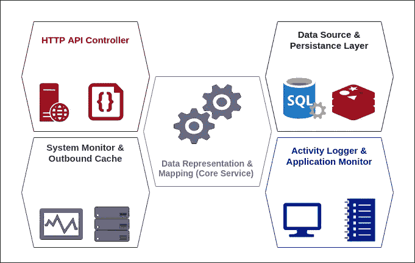
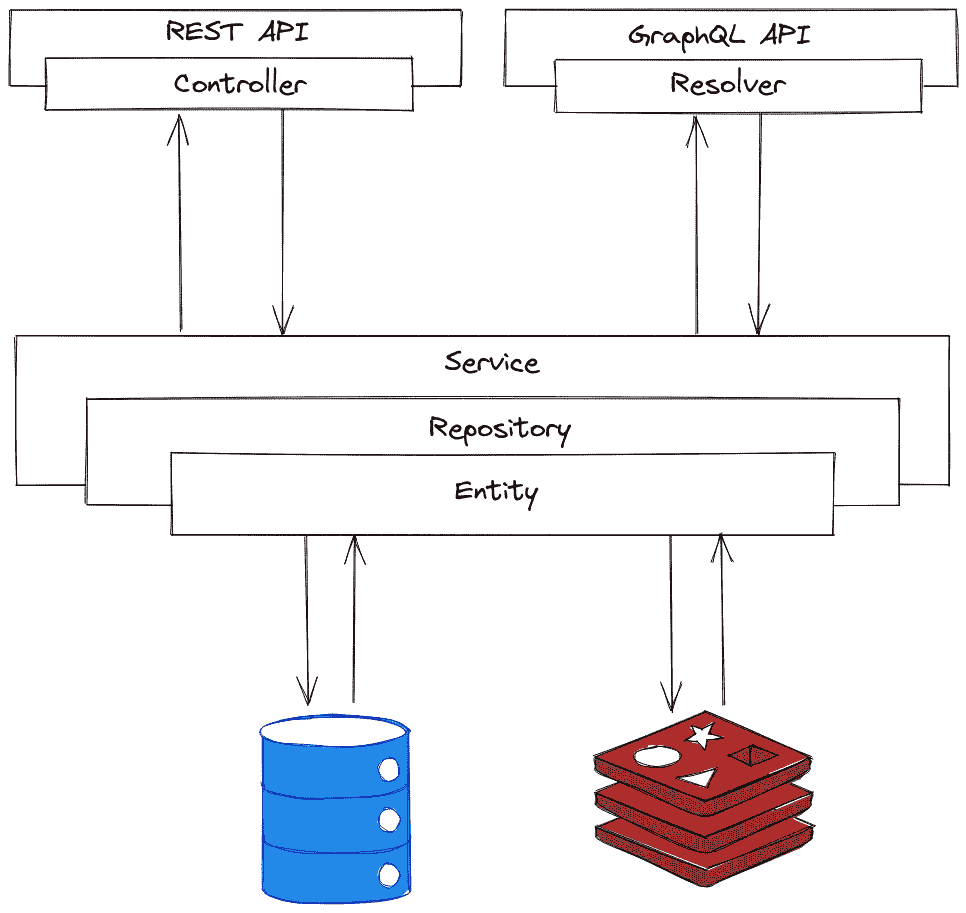

# 在现代微服务世界中构建可扩展的数据服务

> 原文：<https://levelup.gitconnected.com/bulding-a-scalable-data-service-in-the-modern-microservices-world-481f9d1cabad>

## 一种数据服务，它可以跨多个持久层执行事务，可以灵活地选择服务和数据库，即 TypeScript 方式。

**基于 SOA 的应用程序中的多方向数据流，带有一个中央数据存储库**

# 序言:应用程序

[面向服务的架构(SOA)](https://en.wikipedia.org/wiki/Service-oriented_architecture) 采用[微服务的架构设计](https://microservices.io/patterns/microservices.html)已经成为[分布式计算](https://www.ibm.com/docs/en/txseries/8.1.0?topic=overview-what-is-distributed-computing)的家喻户晓的名字。我们构建的数据密集型应用越来越多，将我们的系统分解成具有固定数量的数据集和固定数量的业务规则的小型可管理服务的重要性和必要性就变得越来越明显。

微服务架构不仅使整个应用程序更具解耦性和内聚性，还使团队更灵活地进行频繁部署，而不会中断或依赖他人。服务之间的通信通常使用超文本传输协议来完成。请求和响应格式( [XML](https://www.w3.org/XML/) 或 [JSON](https://www.json.org/json-en.html) )被称为 [API 契约](https://spec.openapis.org/oas/v3.1.0)，它将服务绑定在一起，形成应用程序的完整行为。

在上面给出的例子中，我们讨论的是一个服务于 Web 和移动用户的应用程序，它允许外部服务使用提供给最终用户的 [REST API](https://www.redhat.com/en/topics/api/what-is-a-rest-api) 端点进行集成。

每个用例都有自己的端点暴露在单独的 [*负载平衡器*](https://www.nginx.com/resources/glossary/load-balancing/) 面前，负载平衡器利用最佳可用资源管理*传入的请求*。每个内部服务都包含一个 [*Web 服务器*](https://www.nginx.com/resources/glossary/application-server-vs-web-server/) ，它处理所有传入的请求并将它们转发给正确的服务或将其发送给内部应用程序；一个*应用服务器*，它托管微服务的所有业务逻辑；以及一个准持久层，一个基于数据的空间和/或时间局部性的数据库的*本地复制。*

## 问题:我们试图解决什么

每个单独的服务维护自己的复制。但是通常情况下，我们的事务可能会改变另一个服务的行为。因此，我们需要在它们之间保持某种状态。实现这种状态共享架构的简单解决方案是拥有一个两种服务都可以访问的公共数据库。这种解决方案不能很好地与服务的数量相适应，尤其是当您考虑到每个服务在数据库事务上的自由度时。对此的快速解决方案可能是为个别服务添加自定义访问权限，但这也会增加维护开销。每个服务，如果被给予不受限制的访问，可以修改他们不应该修改的数据，或者将状态转换为不一致的状态。考虑这个例子，有两个实体— *用户*和*宠物*。他们有一对多的关系。现在假设我们有一个更新*用户的*电子邮件地址的事务。这个特定的事务不需要与 Pets 表交互，并且可以被禁止访问它。另一方面，如果我们有一个事务，其中我们向现有的*用户*添加了一个新的*宠物*。这将需要与两个表进行交互。

现在要考虑的另一件事是，我们不想在我们的服务中编写原始 SQL/文档查询，因为它们会与数据库实现甚至数据库供应商紧密耦合。这也将是一场维护噩梦，因为现在数据库中一个最小的结构变化可能需要更新成千上万个查询。

因此，在大多数现实世界的应用程序中，我们使用称为**或*对象文档映射器(ODM)* 的东西来封装查询，并抽象出所有与数据库相关的配置设置和手册。现在我们有了表示表结构的实体类，但也可以用作任何其他对象。现在，为了恢复早期的实现设计，我们必须在使用这些类的每个服务中重复地重新实现这些类，或者至少是其中的一些。这再次引入了我们之前讨论过的相同的维护开销。**

## **要点**

1.  **我们有多个微服务运行在外部负载平衡器之后。**
2.  **它们相互依赖，并通过专用的 web 服务器进行管理。**
3.  **每个单独的服务都有自己的数据库的本地副本。**
4.  **但是由于服务的相互依赖性，他们有一个集中的数据存储。它可以是 SQL，或者 Document/HashStore，或者两者都是。**
5.  **如果我们试图在服务中编写原始查询，我们将与数据库供应商和数据库实现高度耦合。这将在每个服务中引入维护和安全开销。**
6.  **因此，我们将使用一些 ORM/ODM 库来表示我们的数据库实体。但是这涉及到松散的内聚性，使得相同的实现在多个服务上重复。**
7.  **我们正在寻找一种方法，可以促进我们的中央数据库的跨服务请求处理，甚至可以减少服务间的通信开销；同时不在多个地方复制逻辑。**

# **构建数据服务**

**所以现在我们要做的是建立一个专用的数据服务，它的目的是提供一个与数据交互的接口。对于关系数据，这也应该考虑相关的实体组件。我们希望这个服务本身是无状态的，因为实际的逻辑将驻留在单独的服务中。**

## **数据服务的组件**

****

****附属于数据服务的依赖关系和服务*(六角形架构)*****

**在本服务中，我们假设可用的工具和服务如下:**

1.  ****HTTP API 控制器** —这部分程序负责处理*网络层*。我们可以有一个 REST API 或者一个 [GraphQL API](https://graphql.org/) 或者两者都有，供我们的消费者使用。我们可以在 [*TypeScript*](http://typescriptlang.org/) 中使用 [*表示*](https://expressjs.com/) 进行休息，而对于其他的则使用 [*Type-GraphQL*](https://typegraphql.com/) 。**
2.  ****持久数据层** —保存应用程序状态的实际数据库。根据数据的性质，它可以是某种 SQL 或 NoSQL T21，或者是两者的组合。当从我们的服务进行交互时，我们将在其上使用 ORM/ODM。 [*TypeORM*](https://typeorm.io/#/) 在这里是一个相当大的选择。**
3.  ****网络日志监视器** —这一层将负责提供我们服务的日志和指标，以便在稍后的时间点，我们可以监视它的行为、性能，甚至调试单个请求。我们可以使用 [*Winston*](https://github.com/winstonjs/winston) 进行日志记录，并使用 [*ELK Stack*](https://www.elastic.co/what-is/elk-stack) 将数据点汇集到适当的索引和仪表板中。**
4.  ****出站缓存—***网络层*中的缓存层，用于减少具有读取密集型操作的服务的读取时间。 [*Redis*](https://redis.io/) 在这里是个不错的选择。**
5.  ****活动日志—** 这将跟踪以可串行化方式完成的操作，以及元数据，包括但不限于调用该操作的服务，以及可以逆转该操作效果的请求。它本质上是数据库的时间序列，可以用于将来的审计目的。[*elastic search*](https://www.elastic.co/)是存储和检索这类数据的一个相当不错的选择。**

**所有这些依赖项都可以加载到应用程序中，并在运行时[引导](https://en.wikipedia.org/wiki/Bootstrapping)(使用 [DI](https://en.wikipedia.org/wiki/Dependency_injection) 容器，如 [*TypeDI*](https://docs.typestack.community/typedi/v/develop/01-getting-started) )，我们可以使用这些接口的[反射](https://en.wikipedia.org/wiki/Reflective_programming)来构建我们的服务。**

## **三层架构**

****

****数据服务的三层架构****

**在这种模式中，我们不仅将实际的数据库实现和网络层从核心服务逻辑中分离出来，而且数据处理部分也是分层的。*实体*层简单地提供了数据库中各个表的表示接口。*存储库*层在实体的简单实现上添加了特定领域的逻辑。*服务*层提供了一组可以在每个实体及其相关实体上执行的操作/事务。**

***服务*层稍后被注入到*控制器* (REST)和*解析器* (GraphQL)组件中，以基于来自各个微服务的传入请求来执行那些操作。**

**以下是*用户*实体的示例定义:**

**注意这里，类中没有提供方法定义，只有表列及其属性的定义。这是数据层的最接近的表示，不应该有更多的内容。**

**附加行为由基于实体的[库](https://medium.com/swlh/inside-out-repository-pattern-for-data-layer-5eca4dd0e7d4)类保持，如*用户*库如下:**

**此外，服务层托管所有操作，如下所示:**

**一个人能做多少手术就做多少手术。但是在处理所有请求的这一层之上，与服务层交互来执行这些请求。**

**以下分别是*用户*控制器和*用户*解析器:**

## **从微服务中消费数据**

**现在我们有了一个专用的数据服务，可以用来查询和变更存储在我们的中央持久数据库中的数据，我们进一步需要的是一个从我们的单个微服务访问它们的机制。**

**数据服务的开发方式有两种，要么通过 REST API，要么通过 GraphQL API。现在，在它们中的任何一个中手工编写查询或操作不仅耗时且不可维护，而且在某些地方效率也很低。**

**所以我们应该做一些叫做反思的事情。在这种方法中，我们将通过数据服务导入网络层定义的接口来与外部世界进行交互，并将它们重新实现为服务的代理。**

**现在，这个代理可以简单地如下使用:**

**对于*宠物*实体也可以遵循类似的模式。我们只需要[公开一个接口，该接口从中央数据存储库服务](https://blog.bitsrc.io/sharing-types-between-backend-and-frontend-with-the-bff-pattern-553872842463)定义这些实体。这些接口是我们用于数据服务的 API 契约。**

**另一个好方法是建立一个 [gRPC](https://grpc.io/docs/what-is-grpc/) 框架，使用协议缓冲区定义接口，将这些事务定义为消息，将数据存储库定义为服务，但是我将在另一篇文章中详细介绍这一点。**

## **缺点和警告**

1.  **身份验证超出了本服务的范围。由于预期该服务仅由内部服务使用，因此不预期该服务维护任何身份验证层，而是预期来自经过验证的资源的传入请求。**
2.  **这在单个服务和数据库之间增加了一个额外的层，因此导致了一些额外的延迟。这可以通过使用适当的基础设施工具和缓存来最小化，但无法消除。**
3.  **因为这个服务本身是无状态的，所以理论上它可以无限扩展。但是瓶颈现在在于数据库服务和它一次可以保持的活动连接数。为了改进这一点，可以使用复制数据库来最大化可能的连接。**
4.  **提高数据库性能的标准优化技术将成倍地加速这种架构。**

**解释这种架构的样板存储库(以及一些其他特性):[*w3tecch/express-typescript-样板*](https://github.com/w3tecch/express-typescript-boilerplate) 。**

**在这里加入领英讨论:[https://www . LinkedIn . com/feed/update/urn:李:活动:6813481252939808768/](https://www.linkedin.com/feed/update/urn:li:activity:6813481252939808768/)**