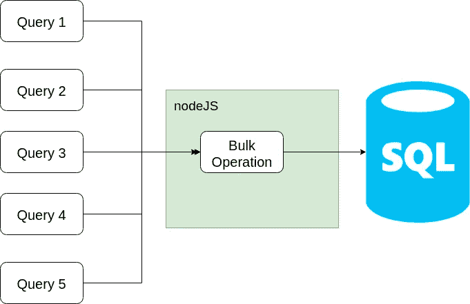

# 用 NodeJS 对 MySQL 进行批量操作

> 原文：<https://levelup.gitconnected.com/bulk-operation-into-mysql-with-nodejs-478c8fc30917>



如果你想使用批量操作将数据批量处理到 MySQL 中，那么这篇文章非常适合你。这是我之前的文章的续篇，在这篇文章中，我们学习了如何安装 node、MYSQL，然后使用 Node 连接并查询 MySQL 数据库。对于本教程，您需要在您的机器上安装 node 和 MySQL。因此，让我们从批量操作开始。

首先，我们需要连接到 MySQL 数据库。

```
const mysql = require('mysql');
const connection = mysql.createConnection({
  host: 'localhost',
  user: 'user',
  password: 'password',
  database: 'database name'
});
connection.connect((err) => {
  if (err) throw err;
  console.log('Connected!');
});
```

一旦我们连接到数据库，我们就可以开始查询它。在之前的文章中，我们已经看到了如何在数据库上执行简单的查询，现在让我们继续进行批量操作。

为了执行批量操作，我们首先需要的是批量数据。因此，您可以将数据存储在 CSV 文件、数组、JSON、字典等中。我们需要做的是将数据转化为数组形式。一旦您的数据是数组格式的，您就可以简单地继续进行简单的查询，但需要做一点小小的改动。让我们考虑一个简单的插入操作，其查询如下

```
let sql="INSERT INTO `table_name` (col1,col2,col3) VALUES (value1,value2value3);";
conn.query(sql, (err,rows) => {
  if(err) throw err;
console.log(rows);
```

为了进行这个查询，我们需要一个数组的数组来包含您的条目。

```
values=[
[value1,value2,value3],
[value1,value2,value3],
[value1,value2,value3]
]
```

父数组“值”中的每个数组将是表中的一行。确保子数组具有与您在 columns 部分中提到的相同数量的值。

> 注意:不要包含任何已将其值设置为默认值或自动增量的列，因为这将由 SQL 数据库处理。另外，不要在 columns 部分提到它们，因为它在 values 数组中没有对应的值。

一旦你创建了数组的数组，你需要把它输入到你的 SQL 查询中，这就是我们的做法

```
var sql = "INSERT INTO `table_name` (name, email, n) VALUES ?";
conn.query(sql, [values], function(err) {
    if (err) throw err;
    conn.end();
});
```

SQL 会这样解释上面的查询

```
INSERT INTO `table_name` (name, email, n) VALUES (value1,value2,value3),(value1,value2,value3),(value1,value2,value3);
```

这正是我们想要的！！！

类似地，我们可以使用相同的方法执行其他操作，如更新或删除。

如果我们想要删除多条记录，我们将需要一个包含我们想要删除的每一行的所有主键的数组。

```
keys=[1,2,3,4,5]
```

一旦我们有了阵列，我们遵循同样的程序

```
var sql = "DELETE FROM `table_name` WHERE `primary_key` in ?";
conn.query(sql, keys, function(err) {
    if (err) throw err;
    conn.end();
});
```

这将导致从表中删除所有具有匹配主键的行。

这个帖子到此为止。我希望它能帮助每一个在 NodeJs 和 MySQL 中挣扎的人。请在下面留下你的评论，告诉我如何才能让这篇文章更好，如果你想在这个领域探索更多，请随时联系我们。感谢您的阅读。