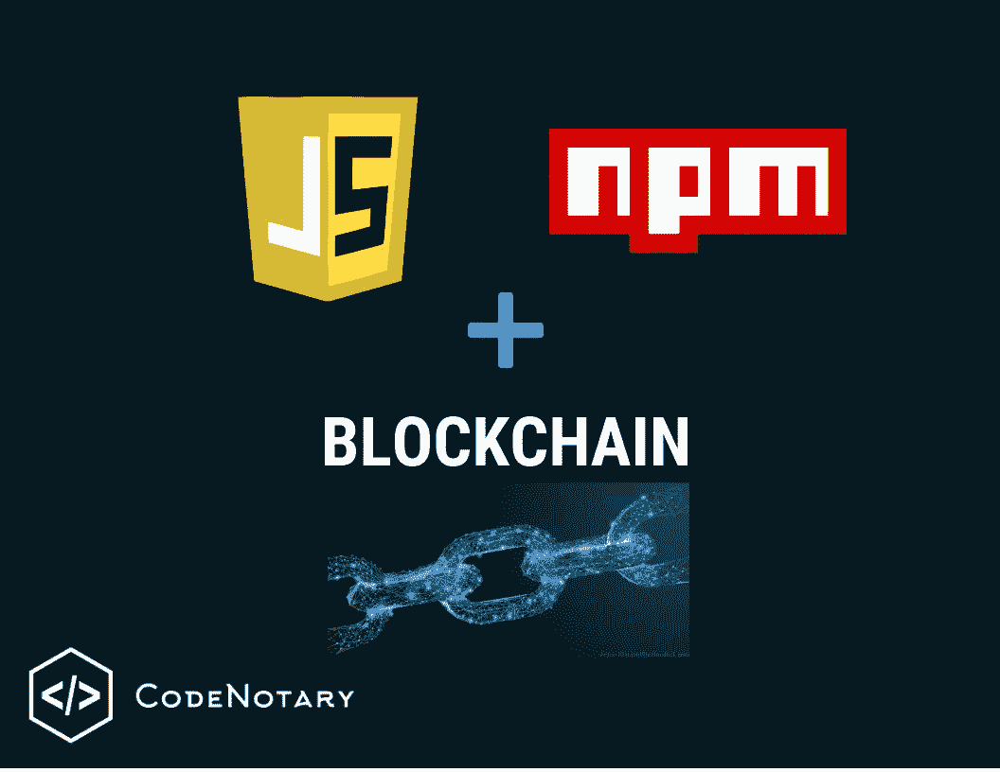

# 使用区块链免费保护您的 JavaScript 应用程序的完整性——NPM 提供集成

> 原文：<https://levelup.gitconnected.com/bulletproof-your-javascript-app-integrity-for-free-with-blockchain-integration-available-on-npm-6300fe8934e8>



2019 年，JavaScript 仍然是 GitHub 上使用的顶级语言之一。它在公共和私有存储库以及来自世界各地各种规模的组织中拥有最多的贡献者。JavaScript 是大部分网络背后的编程语言，用于构建交互式插件和网站。几乎所有在你的浏览器上运行的网络应用都是基于某种 JavaScript 框架的。在这篇博客中，你会发现如何用区块链免费保护你的 JavaScript 应用程序的完整性。

由于 JS 无处不在，它也是一个常见的攻击媒介。还不如放在 [**这篇**](https://hackernoon.com/im-harvesting-credit-card-numbers-and-passwords-from-your-site-here-s-how-9a8cb347c5b5) 的黑客正午文章上:

外面不乏聪明又讨厌的人。[With] [**外面有 580，000 个 npm 包**](http://www.modulecounts.com/) *，【在我看来】胜算甚至更大…至少其中一个包中有一些恶意代码，如果做得好，你甚至不会知道。*

在这里，我们意识到我们有一个独特的机会为社区做出自己的一点贡献。因此，我们决定通过开源我们的验证相关应用程序的核心([**verify . code 公证人. io**](https://verify.codenotary.io/?utm_source=medium&utm_medium=post&utm_campaign=bulletproof-your-javascript-app-integrity-for-free-with-blockchain-integration-available-on-npm) 和[**code 公证人——下载验证 Chrome 扩展**](https://chrome.google.com/webstore/detail/vchain-codenotary-downloa/mnloemedehacppeggbipipjlphdjpjcb) )作为 JS 包，免费公开我们的 JS 集成。现在，数百万 JS 开发人员中的每一个都可以验证他们 web 应用程序中的文件，并根据区块链的不变性检查它们。

# 那么，为什么我们在 NPM 也发布了这个包呢？

您可能已经了解到，我们乐于帮助让世界变得更美好。由于我们发布 JS 集成是因为它是使用最广泛的编码语言，因此我们也将在世界上最大的主要托管 JS 软件包的软件注册中心发布一个验证版本。这就是我们正在做的。

开发人员可以用一个 npm 命令将我们的`jsvcn`包添加到他们现代的 JavaScript 前端应用程序中:

```
npm install jsvcn
```

# 作为开发人员，您为什么应该使用这个包？

首先，你什么都不用做。但是如果你想要一个免费的、易于使用的方法来验证你使用和产生的代码是安全的和未被篡改的，那么你可能想看看来自[**code 公证人**](https://www.codenotary.io/?utm_source=medium&utm_medium=post&utm_campaign=bulletproof-your-javascript-app-integrity-for-free-with-blockchain-integration-available-on-npm) 的 JS 客户端。这是一个经过精心设计和单元测试的软件包，它提供了一个简单的界面和配置选项，因此您不必处理区块链通信的所有复杂问题。您只需选择需要检查的文件，它就会返回其区块链存储的验证状态及其附带的详细信息和元数据。

# code 公证人的 JSVCN 特性

简而言之，`jsvcn`提供的是我们的`vcn`工具功能的验证子集，即它通过 code 公证人区块链验证数字资产，并从 code 公证人查询资产元数据。

为了做同样的事情并验证您的文件，只需使用一个调用:

```
import Jsvcn from "jsvcn"const FILE = new File(...);const jsvcn = new Jsvcn();jsvcn.verify(FILE).then(({ status }) => { ...})
```

或者，您也可以通过在命令中使用文件的 SHA256 哈希来直接验证文件:

```
jsvcn.verify("<SHA256 hash>");
```

# 它是如何工作的

在幕后，`jsvcn.verify()`读取提供的文件，并从中生成一个唯一的 SHA256 散列，然后将其发送给公证人区块链，以永久保存。在它处理之后，在以太坊 Web3 库([https://web3js.readthedocs.io/en/1.0/](https://web3js.readthedocs.io/en/1.0/))的帮助下，您可以恢复文件的信任状态。

在资产已经被签名的情况下，第二个服务器请求查询 case 公证人的资产服务器并扩展区块链响应。因此，在 verify 方法的响应中，您可以获得资产的状态以及 code 公证人存储的关于数字资产的所有元数据。

这个包是一个纯粹的 ES6 库，这意味着开发者可以将它集成到任何使用现代 JS 框架(React、Vue、Angular 等)构建的 web 应用程序中。).唯一的要求是，应用程序应该有某种构建管道，如 Webpack、Rollup 或其他。

# 重要的

verify 方法不会上传您验证的文件。它只发送文件的散列到我们的服务器。文件的读取和散列 100%发生在客户端、浏览器环境和内存中。为了保持浏览器的内存使用量低，该软件包以一种高效和优化的方式做到了这一点，即它以小块的形式读取和计算哈希。

这意味着开发人员可以开发能够在客户端验证大文件而不会降低性能的前端客户端。由于我们基于哈希的解决方案，数字资产永远不会离开用户的计算机。

# 额外功能

# 哈希进度完成指示器

验证(散列)大型文件，如几个 GB 或更多的文件，需要时间。code 公证人验证方法提供一个进度回调作为第二个参数，该参数定期返回哈希进度的百分比值。为此，请使用以下命令:

```
jsvcn.verify(FILE, (progress) => console.log(progress + '%'));
```

这样，您就可以让应用程序向您的用户显示散列过程。

# 附加校验和计算

[**code 公证人. io**](https://www.codenotary.io/?utm_source=medium&utm_medium=post&utm_campaign=bulletproof-your-javascript-app-integrity-for-free-with-blockchain-integration-available-on-npm) 使用 SHA256 算法来生成和比较哈希，但该软件包也可以提供 SHA1 和 MD5 校验和以及 SHA256 哈希计算。在这种情况下，Verify 构造函数需要一些额外的配置，包括所需校验和的名称，如下所示:

```
const jsvcn = new Jsvcn({checksums: ["sha1", "md5"]});
```

# code 公证人库的当前真实使用情况

你应该知道这是一个积极维护的库，每天进行超过 140，000 次验证。目前使用该库的两个应用程序是:

*   [**code 公证人拖拽验证网页**](https://verify.codenotary.io/?utm_source=medium&utm_medium=post&utm_campaign=bulletproof-your-javascript-app-integrity-for-free-with-blockchain-integration-available-on-npm)
*   [**code 公证人 Chrome 扩展**](https://chrome.google.com/webstore/detail/vchain-codenotary-downloa/mnloemedehacppeggbipipjlphdjpjcb)

此外，code 公证人路线图包括在未来进一步扩展该库的计划。

# 演示

要查看库的 verify 方法的原始响应看起来像什么，您可以在您的应用程序中使用，请在 Vue.js < [**这里**](https://vchain-us.github.io/jsvcn/) >查看这个非常简单的 code 公证人验证演示。如果你愿意，你可以在 GitHub 页面的 >这里获得演示应用< [**的源代码。**](https://github.com/vchain-us/jsvcn/tree/master/example)

# 公证人是什么

code 公证人提供数字资产的分散验证，并让用户知道谁签署了它们，以及它们是 100%未被篡改的，无论资产是什么、托管在哪里或它使用的语言、框架或平台。此外，code 公证人的持续验证和强制执行功能可立即识别未知和不可信的软件组件，并防止它们在不需要您做任何额外工作的情况下运行。此外，它还简化了对任何数字资产的管理、监控以及必要时的撤销。

有关 more 公证人及其其他集成的更多信息，请查看:

[**公证整合**](https://www.codenotary.io/integrations/?utm_source=medium&utm_medium=post&utm_campaign=bulletproof-your-javascript-app-integrity-for-free-with-blockchain-integration-available-on-npm)

或者

[**公证人— GitHub 回购**](https://vchain-us.github.io/jsvcn/)

[**公证员——NPM 包**](https://www.npmjs.com/package/jsvcn)