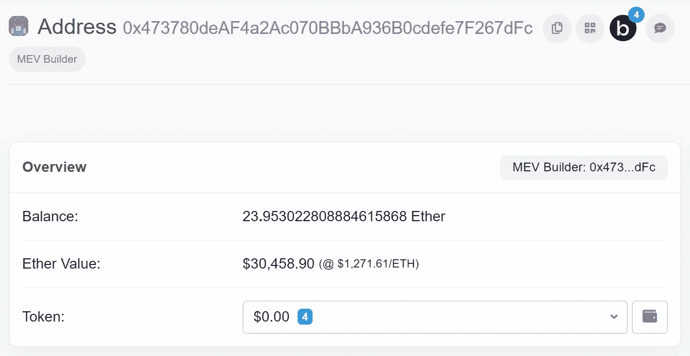
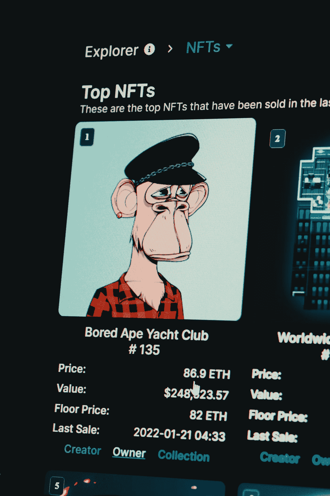
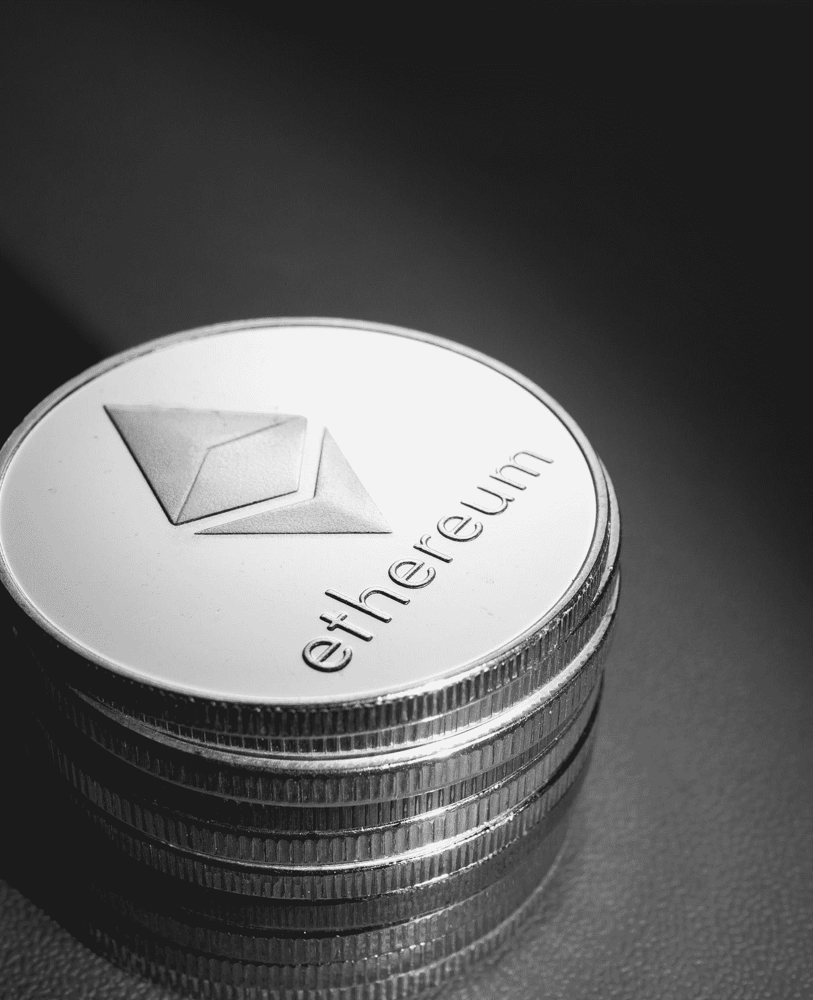
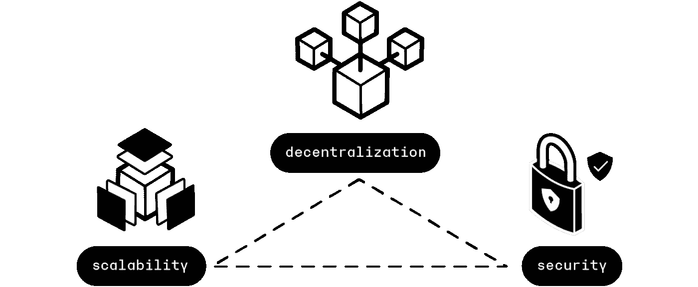

# 打破 5 个区块链神话(甚至程序员都不知道这些)

> 原文：<https://levelup.gitconnected.com/busting-5-blockchain-myths-even-programmers-do-not-know-about-these-995f4af65bc4>

由 [Unsplash](https://unsplash.com?utm_source=medium&utm_medium=referral) 上的 [krakenimages](https://unsplash.com/@krakenimages?utm_source=medium&utm_medium=referral) 拍摄的照片

区块链就在我们身边，但我们大多数人仍然不熟悉它们。

让我们揭穿这 5 个区块链神话，让它们变得简单一点！

# 误解 1:你的加密钱包储存了你的比特币

如果你进入了加密货币世界，并拥有一些加密货币，你一定以前用过加密货币钱包。

其中包括许多流行的数字钱包，例如:

*   [Metamask](https://metamask.io/)
*   [比特币基地钱包](https://www.coinbase.com/wallet)

或者硬件钱包，例如:

*   [总账](https://www.ledger.com/)

> *如果我告诉你，你的钱包* ***没有*** *存储你的加密货币，你会惊讶吗？*

照片由[Maria Shalabaieva](https://unsplash.com/@maria_shalabaieva?utm_source=medium&utm_medium=referral)在 [Unsplash](https://unsplash.com?utm_source=medium&utm_medium=referral) 拍摄

您的钱包存储了您的**私钥**(用密码加密)。

您的私钥证明了您对钱包地址所拥有的资产/加密货币的所有权。

去像[以太扫描](https://etherscan.io/)这样的区块链浏览器，寻找一个特定的钱包地址和与之相关的余额。

以太坊地址及其余额(图片来自[以太坊](https://etherscan.io/address/0x473780deaf4a2ac070bbba936b0cdefe7f267dfc)

你的钱包只是证明你是这个地址的主人。

> 想知道你的加密货币存放在哪里吗？

这是在区块链总账上，是在汇总了你以前所有的交易后写成的。

# 误区二:NFT 存在于区块链上

NFTs 或[不可替代令牌](https://medium.com/gitconnected/100-essential-web-3-concepts-that-one-should-know-about-cedf47b8b6a7)是使用预定义标准在区块链上开发的。

对于以太坊区块链，这个标准被称为 **ERC-721** 。

 [## ethereum.org ERC-721 不可替换令牌标准

### 什么是不可替换的令牌？不可替代的令牌(NFT)用于以独特的方式识别某物或某人。这个…

ethereum.org](https://ethereum.org/en/developers/docs/standards/tokens/erc-721/) 

比方说，你购买了一张 JPEG 艺术图像，它在诸如 [OpenSea](https://opensea.io/) 或 [Rarible](https://rarible.com/) 这样的平台上以 NFT 的形式存在。

与普遍的看法相反，你的 JPEG 艺术图像并不存储在区块链上，因为在上面存储数据**非常昂贵**。

按照区块链存储标准，JPEG 图像及其元数据的大小可能非常大。

因此，你的 JPEG 图片可能存储在 NFT 交易所拥有的非区块链数据库中。

存储在区块链上的是你的所有权证明。

这可以通过以下多种可能的方式来实现:

*   图像及其元数据的哈希与您的钱包地址一起存储在区块链上
*   非区块链数据库中与 JPEG 图像相关联的 ID/ URL 与您的钱包地址一起存储在区块链中

照片由[niran Jan _ photos](https://unsplash.com/@niranjan_photographs?utm_source=medium&utm_medium=referral)在 [Unsplash](https://unsplash.com?utm_source=medium&utm_medium=referral) 上拍摄

# 误解 3:区块链是 100%分权的

是的，区块链是我们创造的最好的分权系统，但这并不意味着它们是完美的。

让我们通过下面的例子来理解这一点。

## 比特币矿池

为了实现利润最大化，比特币矿工结合自己的计算资源，根据贡献大小分配奖励。

这样的比特币矿工群体被称为**矿池**。

最大的两个比特币挖矿池是 [AntPool](https://btc.com/stats/pool/AntPool) 和 [F2Pool](https://btc.com/stats/pool/F2Pool) ，它们在很大程度上为比特币网络的哈希速率做出了贡献。

这种挖掘池最终会聚集在一起并影响区块链的状态(即执行 51%的攻击)。

同样，如果任何一个挖掘池关闭(比如由于技术错误)，网络的哈希速率也会下降。

因此，该网络受到上述中央集权政党的巨大影响。

Brian Wangenheim 在 [Unsplash](https://unsplash.com?utm_source=medium&utm_medium=referral) 拍摄的照片

## 以太坊的**股权证明**

下一个例子是以太坊的共识算法，叫做**利害关系证明**。

 [## 利害关系证明| ethereum.org

### 利害关系证明(PoS)是以太坊共识机制的基础。以太坊开启了它的赌注证明机制…

ethereum.org](https://ethereum.org/en/developers/docs/consensus-mechanisms/pos/) 

这表明，为了成为网络上的验证者，一个人需要存放 **32 ETH** 。

截至今天，这相当于 **40782.40 美元**。

这是一个巨大的数目，并不是每个人都有能力成为以太坊网络上的验证者。

因此，网络掌握在那些付得起这笔钱的人手中。

[摄影:杰瓦尼·威拉斯辛格](https://unsplash.com/es/@jievani?utm_source=medium&utm_medium=referral)在 [Unsplash](https://unsplash.com?utm_source=medium&utm_medium=referral)

# 神话 4:区块链可以继续变得越来越快

据[Crypto.com](https://crypto.com/university/blockchain-scalability):

*   Visa 每秒可以处理多达 24，000 笔交易
*   比特币每秒只能处理 7 笔交易
*   以太坊每秒可以处理 20 笔交易

> *这是否意味着我们可以不断提高这些区块链的处理速度，并将其无限扩展？*

不对！

区块链三难困境决定了区块链的发展。

它规定区块链只能实现三个中的两个**，即:**

1.  可量测性
2.  安全性
3.  分散

区块链三难困境(来源:[https://www . ledger . com/academy/what-is-the-区块链三难困境](https://www.ledger.com/academy/what-is-the-blockchain-trilemma))

因此，如果我们扩展一个区块链，我们可能不得不在它的安全性或去中心化上妥协。

围绕这一点的一些其他解决方案可以是在基础层之上构建第二层，例如，以太坊之上的[多边形](https://polygon.technology/)，但是缩放基础层是一个神话。

# 误解 5:编写 Web-3 软件类似于编写 Web-2 软件

为了更好地理解这一点，让我们谈谈以太坊，它是用于编写和运行分散式应用程序的最大的区块链之一。

以太坊是**分散式和** **分布式计算系统**的一个例子。

它运行在一台名为**以太坊虚拟机或 EVM** 的计算机之上。

这个 EVM 暴露于可计算性理论中的一个重要问题，即**停机问题**。

为了避免这个漏洞，EVM 使用了 **Gas (** 一个在 EVM 上运行智能合同代码所需的事务值)。

 [## 以太坊:什么是气体，我们为什么需要它？

### 对以太坊所需气体的概念感到困惑？我们来简化一下。

medium.com](https://medium.com/coinmonks/ethereum-what-is-gas-and-why-do-we-need-it-88bcd7fc191d) 

因此，当在以太坊智能合约中编写代码时，必须非常小心，因为不同的操作在运行之前需要供应不同量的气体。

这意味着你需要对在动态数组上执行循环和执行复杂的数学函数说再见，因为你可能没有足够的气体在 EVM 上运行它们。

查看以下 EVM 不同操作所需的天然气成本:

 [## 附录 A:以太坊 EVM 操作码和气体消耗

### 本附录是根据 https://github.com/trailofbits/evm-opcodes 人民作为一个国家所做的巩固工作编写的

cypherpunks-core.github.io](https://cypherpunks-core.github.io/ethereumbook/appdx-evm-opcodes-gas.html) 

[制作者 UX 设计工作室](https://unsplash.com/@weareprocreator?utm_source=medium&utm_medium=referral)在 [Unsplash](https://unsplash.com?utm_source=medium&utm_medium=referral) 上的照片

此外，在 EVM 撰写智能合同时，一个人需要精通可靠性**。**

Solidity 的官方文档说它类似于 JavaScript，但当我说它不是时，请相信我。

它是一种**强类型**语言，有**许多漏洞**，并在许多场合提供**令人困惑的语法**(例如，在内存中定义数组或创建多维数组时等等。)

如果一个人绕过了上述问题，他的智能合同仍然不断暴露在被黑客利用的风险中。

这是因为，在一个快速发展的生态系统中，没有人是专家，也没有人知道所有的安全隐患。

例如，阅读以太坊上这个著名的名为 DAO Hack 的黑客:

 [## 差点让以太坊倒闭的 5500 万美元黑客攻击

### 虽然攻击并没有破坏以太坊的代码——它只是利用了 DAO 的智能契约中的一个漏洞——但它投射了…

www.coindesk.com](https://www.coindesk.com/tech/2020/09/17/the-55m-hack-that-almost-brought-ethereum-down/) 

*这就是这篇文章的全部内容！*

*感谢您阅读本文！*

*如果你是 Python 或编程的新手，可以看看我的新书，书名为“*[**”【The No Bulls * * t Guide To Learning Python**](https://bamaniaashish.gumroad.com/l/python-book)**”***:*

 [## 学习 Python 的无牛指南

### 你是一个正在考虑学习编程却不知道从哪里开始的人吗？我有适合你的解决方案…

bamaniaashish.gumroad.com](https://bamaniaashish.gumroad.com/l/python-book)  [## 通过我的推荐链接加入 Medium-Ashish Bama nia 博士

### 阅读 Ashish Bamania 博士(以及 Medium 上成千上万的其他作家)的每一个故事。您的会员费直接…

bamania-ashish.medium.com](https://bamania-ashish.medium.com/membership)