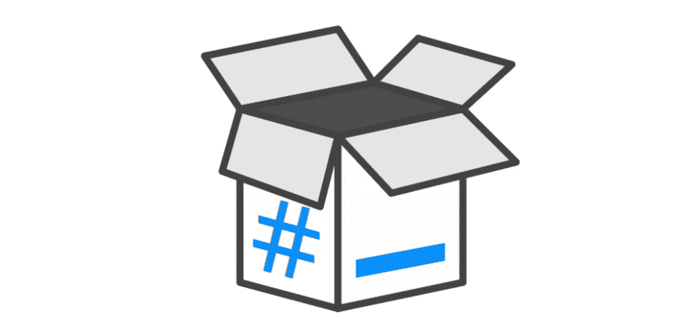

# K8S 中的 BusyBox 嵌入式 Linux 的瑞士军刀

> 原文：<https://levelup.gitconnected.com/busybox-in-k8s-the-swiss-army-knife-of-embedded-linux-ce7ced32de63>

这篇文章将描述 BusyBox 及其在容器应用程序中的使用，尤其是在 K8S 系统中。

# 什么是 BusyBox？

BusyBox 映像是一个基于 Linux 的映像，包含许多方便的实用程序。

*   与其他图像相比，它占用的空间要小得多(~1MB)。
*   它有 400 多个常用命令



Busybox 图片来自[维基百科](https://en.wikipedia.org/wiki/BusyBox)

下面是一个使用 Busybox 映像运行 HTTP Web 服务器的分步示例。

```
// server.go
package mainimport (
 "fmt"
 "net/http"
)func handler(w http.ResponseWriter, r *http.Request) {
 fmt.Fprintf(w, "Hello World!")
}func main() {
 http.HandleFunc("/", handler)
 fmt.Println("Server running...")
 http.ListenAndServe(":8080", nil)
}
```

1.  编译程序

```
GOOS=linux GOARCH=amd64 go build server.go
```

2.构建 docker 映像

Dockerfile 文件

```
# Dockerfile
FROM busyboxCOPY . /app
CMD /app/server
```

构建命令

```
docker build -t goexample .
```

3.启动容器

```
docker run -d -p 8080:8080 goexample
```

4.试验

```
> curl localhost:8080
Hello World!
```

# 在 K8S 中运行交互式 Pod


除了作为其他 docker 映像的方便基础之外，Busybox 还是一个方便的工具箱，用于调试 pod 之间的 k8s 自定义网络连接问题。

以下命令非常有用。

```
kubectl run -i --tty busybox --image=busybox --restart=Never -- sh
```

它以交互模式启动一个 Busybox 容器，然后执行`sh` shell。

您可以在 shell 中执行任何想要的命令。例如，命令`nslooup`查询域名系统以获得域名和 IP 地址之间的映射。

```
/ # **nslookup** cache-redis-cluster-headless
Server:         10.96.0.10
Address:        10.96.0.10:53Name:   cache-redis-cluster-headless.default.svc.cluster.local
Address: 172.17.0.7
Name:   cache-redis-cluster-headless.default.svc.cluster.local
Address: 172.17.0.8
Name:   cache-redis-cluster-headless.default.svc.cluster.local
Address: 172.17.0.9
```

完成后，容器将被自动移除。

# K8S 边车集装箱

在 k8s 中，BusyBox 容器可以帮助诊断 docker 网络。除此之外，这也是一个非常方便的 T2。

假设您需要在主容器启动之前设置一些东西。

作为一个具体的例子，官方的`redis`映像并不作为 *root、*运行 Redis，所以它不能访问文件系统。如果您使用磁盘备份运行 Redis，您将需要打开该磁盘权限。

一个解决方案可能是这样的:

```
initContainers:
      - name: redis-data-permission-fix
        image: busybox
        command: ["/bin/chmod", "-R", "777", "/opt/data/redis"]
        volumeMounts:
        - name: data
          mountPath: /opt/data/redis
```

# 结论

在 k8s 中，BusyBox 容器是

*   用于其他 docker 图像的轻量级基本图像。
*   一把瑞士军刀帮助您诊断 pod 之间的 docker 网络连接问题。
*   k8s 边车模式中的一个有用组件。

发现这篇文章很有用👏？看看我下面的其他文章吧！

*   [Golang 的断路器示例](/circuit-breaker-example-in-golang-e6459c87eaeb)
*   [戈朗通道如何工作](/how-does-golang-channel-works-6d66acd54753#:~:text=Understanding%20Inner%20workings%20of%20the%20Golang%20Channels&text=A%20goroutine%20is%20a%20lightweight,is%20for%20communication%20between%20goroutines.)
*   [避免在 Go 中使用地图时的三个错误](/avoid-the-three-mistakes-when-using-a-map-in-go-699435db226c)

# 分级编码

感谢您成为我们社区的一员！更多内容见[级编码出版物](https://levelup.gitconnected.com/)。
跟随:[推特](https://twitter.com/gitconnected)，[领英](https://www.linkedin.com/company/gitconnected)，[通迅](https://newsletter.levelup.dev/)
**升一级就是转型理工招聘**👉 [**加入我们的人才集体**](https://jobs.levelup.dev/talent/welcome?referral=true)