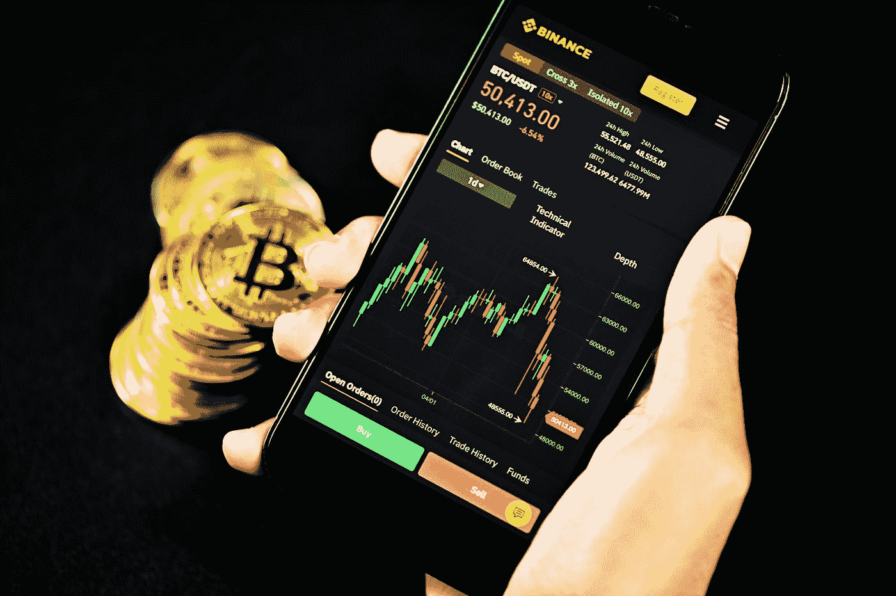

# 水里有血的时候再买

> 原文：<https://levelup.gitconnected.com/buy-when-theres-blood-in-the-water-4be182058394>

## 提示:这是学习密码的最佳时机

[行政长官](https://unsplash.com/@executium?utm_source=medium&utm_medium=referral)在[广场](https://unsplash.com?utm_source=medium&utm_medium=referral)拍照

我应该在两天前发表这篇文章。但是加密市场的发展速度比我想象的要快！

这个周末对我这样的新手来说很难熬。

每当我周六检查我的加密硬币的价值时，它们似乎又下降了一个显著的百分比。

“这太荒谬了，”我告诉自己。

“最好的买入时机是水里有血的时候，”我提醒自己。"当其他人都在恐慌时，那就是你捡便宜货的时候."

我鼓起勇气，买了一个小仓位。我没有足够的勇气去得到更多的东西，但至少可以说我弄湿了我的嘴。

直到周日晚上，我退出了游戏，开始忙着做其他事情。我预计会看到又一个新的低点，但是，相反，市场正在回升。我已经从周六的小额采购中获得了可观的利润。

***吸取教训:在水里有血的时候买***

虽然我希望自己在周六就给出了这个建议，但现在还不算太晚。加密市场似乎再次走牛，但它仍然处于上升期的早期。现在可能是时候在价值开始上涨太多之前多拿一些头寸了。

## **Crypto 会重新流行起来吗？我们又回到牛市了吗？**

我是这么认为的，但我并不自称能预知未来。然而，我想和你分享一些想法。我们最近经历的这场烈火考验。

## 黑天鹅事件可能不止一个

上周，我们发生了几起事件，似乎都在攻击比特币和另类硬币的价值。埃隆·马斯克在他的推特上说，中国再次禁止加密——就像自 2009 年以来每年都做的一样*，然后美国东南部的一条天然气管道遭到了网络攻击。*

*以太坊可能是我最喜欢的加密工具，其负责人维塔利·布特林(Vitaly Buterin)发表了一份声明，他指出，马斯克发的推特越多，他对加密价格的影响就越小。希望这是真的。我只希望一年一度的对中国加密技术的抨击，在以非理性的方式推动市场方面也变得无效。*

*因为整个周末发生在 crypto 的大屠杀似乎完全没有必要。当你看看真实的事实与炒作和心理游戏——现实的结构真的没有潜在的变化来证明加密价格 50%或更多的修正是合理的。*

*随着比特币暴跌回 3 万美元，有多少人卖掉了他们的密码？希望你不是其中之一。希望你保住了宝贵的生命，或者更好的是，希望你明智地增加了你的头寸，这样你现在就可以兑现一些利润。*

## *加密会崩溃。指望它。*

*我只是认为 Crypto 类似于微软。它的 ***将*** 撞毁。*

*因此，与其与不可避免的事情抗争，不如制定一个计划。我已经决定我的新计划是在市场崩溃时远离电脑。当然，如果我有现金的话，可以增加一些仓位，但是，然后…走开。*

*客观来看，最近的下跌幅度约为 40%。但是回到过去。2018 年，比特币从 2 万美元跌至 1 3K 美元。曾几何时，比特币持有者成为钻石手，而加密经历了 80-90%的下跌。现在，那些当时坚持下来的家伙——***他们*** 很强硬。*

## *不要听 MSM 的*

*在大多数情况下，MSM 中加密货币的覆盖面是相当偏颇的。我偶尔会在 NPR 上听一个真正有思想的关于加密的故事，也会在一些更面向技术的网站上读一些好文章，比如麻省理工学院的 Tech Review。但在大多数情况下，金融“专家”似乎对加密怀有真正的敌意。*

*也许是因为他们不懂技术，更容易对你不懂的东西产生厌恶或恐惧？*

*我们有保罗·克鲁格曼(Paul Krugman)和格雷格·叶(Greg Ip)这样的人告诉我们比特币一文不值，我们有主要新闻网站歪曲来自中国的消息，报道新的加密禁令，而不是诚实地指出中国政府只是增加了现有的禁令。*

## *我们需要更强大的密码交换*

*似乎每次 Dogecoin 暴涨，Robinhood 就下降。这并不能激发信心。*

*在这最后一次调整中，比特币基地明显下跌了很多，而且它并不孤单。币安也倒下了。*

*要求这些交流更加稳健一点真的过分吗？把钱花在基础设施上。或者，不要这样做，你的空头会被下一个交易所吃掉，当其他空头下跌时，下一个交易所实际上还在上涨。有些人会乐意支付更高的费用，只是为了知道他们总是能够以可靠和有效的方式执行交易。*

## *一定要止盈！*

*真的很容易被贪婪和恐惧所统治。反抗吧。*

*在上次崩盘中，我没有让自己恐慌抛售，我很高兴我控制住了自己的情绪。现在，如果 cryptos 继续上升，我需要保持同样的克制。*

*当 cryptos 上涨时，谈论赚 10 倍真的很容易。但是…也许能以 2 倍的价格卖出一点？锁定一点点利润？*

*一个人的策略取决于自己的风险承受能力。理论上，如果你愿意承受更多的风险，你就能赚更多的钱。你也可以失去更多。*

*就我个人而言，我认为设立几个目标并划分你计划在每一步获得的利润是一个好主意。*

*所以，假设你的以太坊目标是$10K，现在你已经有了一些你花了$2K 买的东西。*

*为什么不计划以$4K，$6K，$8K 和$10K 的价格卖出等量的股票，即使在$10K 马克之后也留一点在基金里？因为，你永远不知道…*

*不管怎样，这是一种策略。还可以有其他的。如果以太坊涨到 6000 美元，你可能会决定离开，因为你已经明白，把你的钱翻三倍会让你得到你真正想要的房子的首付，这样你就可以组建一个家庭。*

*有时，其他优先事项比最大化您的加密利润更重要。*

*希望这篇文章有所帮助。如果这一次你恐慌了，在底部附近卖出——不要太自责。很多人都有同样的遭遇。从经验中学习，下次做得更好。*