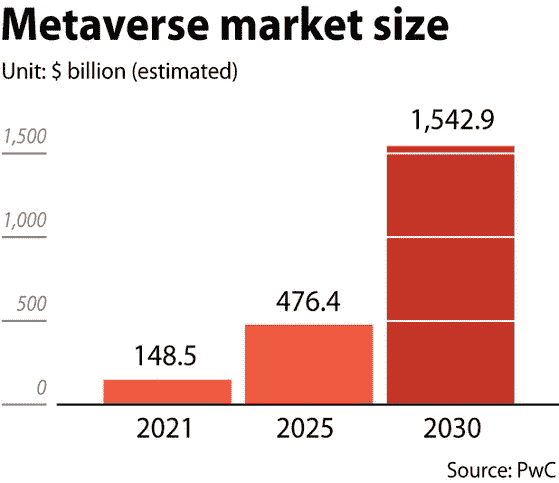
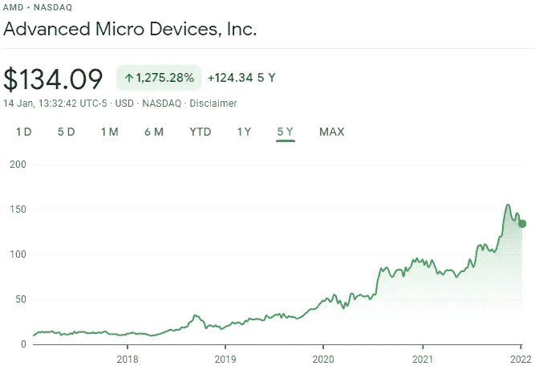
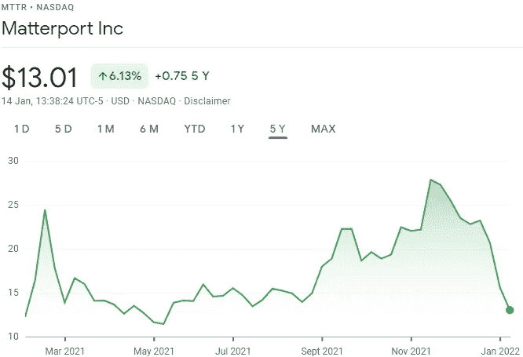
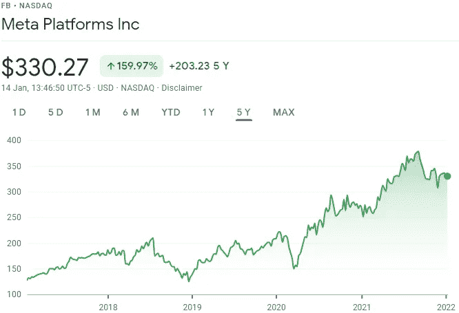
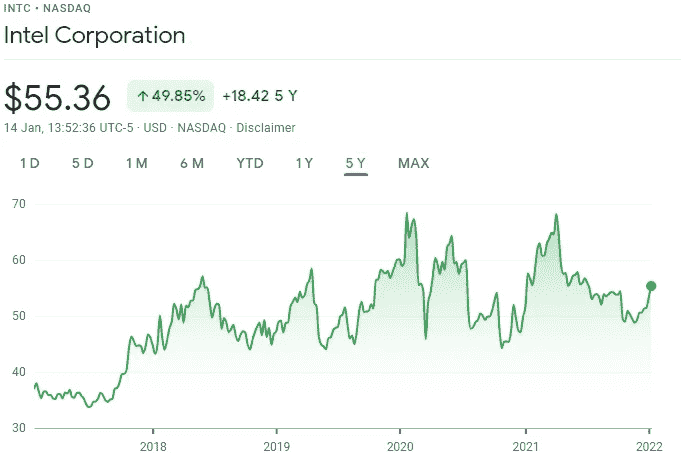

# 买入元宇宙:投资 5 只高潜力元宇宙股票

> 原文：<https://levelup.gitconnected.com/buying-into-the-metaverse-5-high-potential-metaverse-stocks-to-invest-in-d7da99daf077>

这可能是每个人都在谈论的技术发展，但投资者已经急切地寻找长期投资，以便从期待已久的元宇宙的出现中获利。

元宇宙是众多不同技术元素的结合，如虚拟现实、增强现实和视频，能够将用户弹射到一个活生生的数字世界。这项技术被誉为让用户能够工作、娱乐并通过一系列功能与其他人保持联系的一种途径。在元宇宙，你完全可以在一个完全虚拟的空间里参加音乐会，在你的客厅里主持国际商务会议，在沃尔玛购物。

风险投资公司 Epyllion Industries，[的管理合伙人马修·鲍尔(Matthew Ball)最近在量化元宇宙的潜力时声称](https://eu.usatoday.com/story/tech/2021/11/10/metaverse-what-is-it-explained-facebook-microsoft-meta-vr/6337635001/)“我们正处于下一个互联网的尖端”，围绕这一新兴技术的热潮似乎正在蔓延到华尔街。

*(图片:* [*【韩珠日报】*](https://koreajoongangdaily.joins.com/2021/07/01/business/finance/metaverse-zepeto-roblox/20210701190000577.html) *)*

如上述数据所示，随着该技术在未来十年变得更加普及，预计到 2030 年，元宇宙市场将加速增长至超过 1.5 万亿美元。

因为支持元宇宙的技术还处于羽翼未丰的阶段，投资者正在股票中寻找购买机会，这些股票可能会随着采用的继续而增长。

Freedom Finance Europe 投资研究主管马克西姆曼图罗夫(Maxim Manturov)指出:“马克扎克伯格(Mark Zuckerberg)押注元宇宙将成为 Meta Systems 股票的下一个大事件。该公司前身为脸书，去年 10 月更名为 Meta，据说这个名字反映了该公司在社交媒体之外的雄心在我们的 DNA 中，我们是一家创造技术将人们聚集在一起的公司，Meta 是下一个前沿，就像我们刚开始时的社交媒体一样”，扎克伯格在公告中说。他宣布，Meta 将在 2022 年花费至少 100 亿美元来创建元宇宙的虚拟世界，他希望这将成为游戏、社交网络和虚拟工作环境的黄金标准。”

考虑到这一点，让我们更深入地看看五只[高潜力的元宇宙](https://en.freedom24.com/ideas/11332-unity-technologies-investidea)股票:

## 1.先进微设备公司(纳斯达克代码:AMD)

在考虑收购元宇宙时，最重要的股票之一是那些将有助于其基础设施建设的公司。为了支持元宇宙的增长，我们必须考虑 AMD，这是一家制造计算机处理器和相关技术的跨国半导体公司。

AMD 在计算行业 50 年的经验使其成为市场领导者，该公司创新的高端计算、图形和可视化技术使其成为元宇宙未来的[关键角色](https://www.nasdaq.com/articles/best-metaverse-stocks-to-buy-today-4-for-your-list)。

在过去的五年中，AMD 的股票增长了令人印象深刻的 1，275%，该公司目前在构建处理器方面处于领先地位，这将有助于在未来几年使[元宇宙成为现实](/metaverse-what-is-it-and-what-can-it-be-1173a0e65d73)。

## 2.马特波特(纳斯达克代码:MTTR)

Matterport 将自己标榜为世界“领先的空间数据平台”，这是在乞求元宇宙革命时做出的一个非常自信的声明。该公司构建物理空间的 3D 模型。如今，Matterport 通常展示待售或出租的物理空间，管理建筑工作，并以数字方式捕捉独特的空间，作为其商业模式的一部分。

它的软件可以适用于智能手机，这也使得它的服务更容易被小型组织使用。

Matterport 的技术使该公司成为提供元宇宙空间表示的绝佳候选人，该公司的管理层承认该公司的技术有 2400 亿美元的潜在市场。

然而，最近几个月较高的运营费用导致 Matterport 在 2021 年前三个季度亏损[177 美元](https://www.fool.com/investing/2022/01/14/2-monster-metaverse-stocks-buy-long-haul/)。虽然这是一个更高风险的指标，但股票的折扣价可能代表着投资者的买入机会，他们相信该公司有潜力成为元宇宙发展的主要参与者。

## 3.Meta 平台公司(纳斯达克代码:FB)

这位艺术家原名脸书。马克·扎克伯格对元宇宙的潜力坚信不疑，他将自己的公司更名为 Meta 以示感谢。

作为领先成长股的高性能 FAANG 集体的关键成员，Meta 必须被视为高度安全的元宇宙投资。该公司承诺在元宇宙上全力以赴，在十年内投资数十亿美元开发适应技术。

Meta 的行动已经在进行中，2021 年 12 月 9 日，该公司[开放了其虚拟现实空间](https://investorplace.com/2022/01/7-of-the-best-metaverse-stocks-for-2022-to-buy-now/)，这是一项免费服务，用户可以在虚拟空间中玩名为 Arena Clash 的激光标签游戏。随着越来越多的游戏开发者获得在 Horizon Worlds 中创建自己的游戏所需的工具，Meta 很可能会在该技术刚刚起步的几年里成为元宇宙的开拓者。

## 4.英特尔公司(纳斯达克股票代码:INTC)

另一只在 2021 年 12 月向元宇宙进军的股票是英特尔，[管理层强调](https://www.fool.com/investing/2022/01/14/3-top-metaverse-stocks-to-buy-in-january/)新的前沿可能是“计算领域的下一个重大转变”，参与者可以“交流、合作、学习和维持”他们的生活。

英特尔是可能需要提供运行元宇宙所需的计算能力的公司之一的另一个例子。随着采用的展开，能够支持过度工作负载的超大规模数据中心的必要性将是巨大的。事实上，据估计，仅在 2022 年，超大规模数据中心的支出就可能增加 30%。

这使英特尔处于一个关键位置，以利用这种基础设施需求可能导致其股票从 2018 年初以来一直处于的区间中爆发。

## 5.微软公司(纳斯达克股票代码:MSFT)

在元宇宙的早期开发中，有资源与 Meta 竞争的一家公司是微软。

在最近接受《哈佛商业评论》采访时，微软首席执行官[塞特亚·纳德拉说](https://money.usnews.com/investing/slideshows/metaverse-stocks-to-buy?slide=3)她相信“元宇宙的整个想法从根本上来说是这样的:随着我们逐渐将计算嵌入到现实世界中，你甚至可以将现实世界嵌入到计算中”

纳德拉指出，元宇宙对社会的影响可能远远超过互联网本身，有可能改变专业人士在网络空间相遇、合作和互动的方式。面对面的会议可能很快会让位于集成头像或全息图的使用，微软的 HoloLens 可能会获得一个全新的市场。

微软的 Xbox 游戏机很可能在未来也提供与元宇宙的集成，为更强大的功能打开大门。

虽然我们可能还需要很多年才能在虚拟会议室里与同事合作制作全息图，但许多上市公司都在努力为元宇宙打造功能性产品——一路上为投资者提供了大量投资机会。