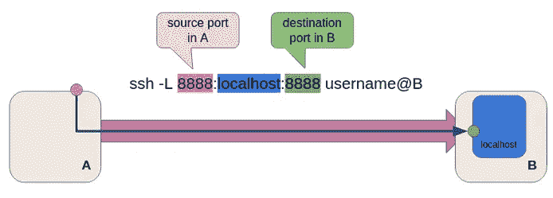
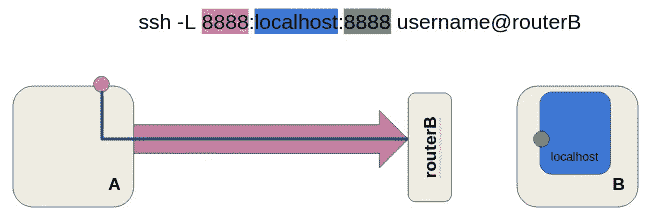
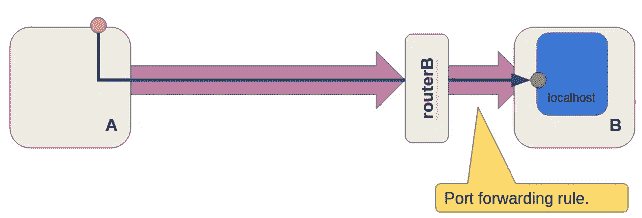
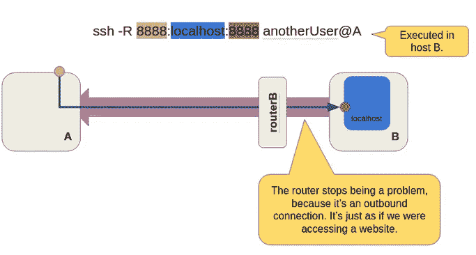
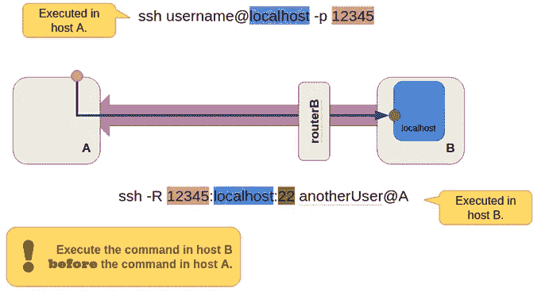
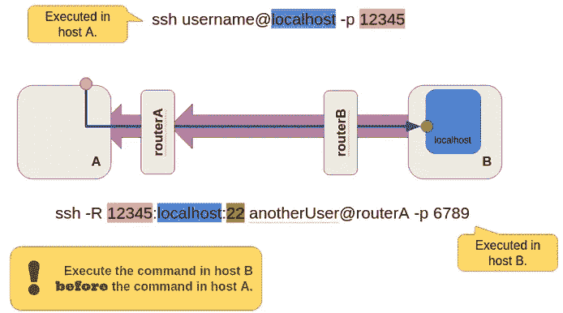

# 使用反向隧道绕过防火墙和路由器

> 原文：<https://levelup.gitconnected.com/bypass-firewalls-and-routers-with-reverse-tunnels-ff584c62e7a>

如果您经常使用远程的、无屏幕的机器，您可能也会经常使用 SSH。SSH 非常适合访问机器，但是如果它位于路由器或防火墙之后，并且您不能更改规则，该怎么办呢？这就是这篇文章的内容:反向隧道！

# 典型的 SSH 连接

最简单的场景是主机 A 和 b 之间的直接连接。假设 A 想要 SSH 到 b。您只需在主机 A 的终端中键入`ssh username@B`。

很简单。这只是一个普通的 SSH 连接。让我们进入隧道。

# 前方隧道

当您想要在特定端口转发连接时，可以使用隧道。假设 A 想要访问主机 B 上运行的 Jupyter 笔记本服务器，端口为 8888，我们希望能够在主机 A 上访问它，就像它在本地运行一样，端口也是相同的。我们可以使用隧道，将主机 A 的端口 8888 中的所有连接转发到主机 b 的端口 8888。

如果你在主机 A 的浏览器上访问 localhost:8888，你肯定会看到 Jupyter 笔记本页面(在主机 B 上提供)。

但是如果主机 B 位于路由器或防火墙之后呢？没问题，您只需要创建一个端口转发规则，确保到 routerB 的连接被转发到主机 b 的 SSH 端口。假设 routerB 的端口 22(默认 SSH 端口)被转发到主机 b 的端口 22。

如果 B 坐在路由器后面，你只需要确定 routerB 的 22 号口到 B 的 22 号口有端口转发规则就可以了**但是如果你配置不了路由器或者防火墙怎么办？**

# 反向隧道

这就是反向隧道进入画面的地方。您不能通过 SSH 连接访问主机 B，因为 B 是隔离的。没办法进去。但是，如果您可以直接访问它，如果您可以直接配置它(例如，手动)，那么您仍然可以通过使用**反向隧道**使连接工作。我们仍然有相同的场景，也就是说，我们希望 A 能够在本地访问运行在主机 B 上的 Jupyter 笔记本(实际上，这可以是任何服务)。

之前，我们使用`-L`选项，将 A 端口 8888 上的本地连接转发到 B 端口 8888。我们仍然希望这样做，但现在 SSH 连接将从主机 B 开始。如果我们再次使用`-L`，我们将 B 端口 8888 上的连接转发到 A 端口 8888，这与我们想要的正好相反。我们需要通过使用`-R`选项来扭转这种情况。它和`-L`完全一样，但是方向不同。

请注意，SSH 连接是从 B 到 A 发起的，但隧道内的转发连接是从 A 到 B。请注意紫色箭头(初始 SSH 连接)现在是如何向左的，但蓝色箭头(转发隧道)仍然是向右的。

有了这个，你就完事了。您可以再次在主机 A 的 localhost 的端口 8888 中访问 Jupyter 笔记本，它将从主机 B(端口 8888)接收页面。

# SSH 进入带有反向隧道的防火墙主机

让我们暂时忘记 Jupyter 笔记本吧。更常见的情况是通过 SSH 连接防火墙主机。使用反向隧道，很简单。让我们把它拆开:

*   b 向 A 发起 SSH 连接:`ssh anotherUser@A`
*   这是基本命令。然后，我们在此基础上添加反向隧道，将 A 的端口 X(我们给它一个数字，比如 12345)上的连接转发到 B 的端口 22。现在，如果 A 在 A 的本地主机的端口 12345 上建立连接，它就可以访问主机 B 的本地主机的端口 22(下图对此进行了说明)。
*   然后，您只需在主机 a 的终端中键入`ssh -p 12345 username@localhost`，进行交互式 SSH 会话。这将在本地主机的端口 12345 中启动一个 SSH 连接，该连接将通过反向隧道转发到主机 B 的端口 22，从而创建所需的连接。

在这个 inceptionesque 场景中，我们有一个 SSH 连接(蓝色箭头，由 A 启动)在另一个 SSH 连接(大粉色箭头，由 B 启动)内部。

我们现在已经介绍了正常和反向隧道的典型使用方式。你可以利用这些知识来进行交流，即使你不得不处理讨厌的防火墙和不可访问的路由器。

一个复杂但常见的设置是在 A 和互联网之间放置一个路由器(查看下图)。假设我们有一个 routerA，它将端口 6789 转发到主机 A 的端口 22 (SSH 的默认端口)。目标仍然是相同的:让主机 A 访问受防火墙保护的主机 b。这实际上并不复杂，但我们必须“分而治之”地解决问题，或者将问题分层:

*   主机 B 必须创建一个到主机 a 的 SSH 连接。这是通过`ssh anotherUser@A`完成的。
*   但是现在，A 在 routerA 后面，routerA 的端口 6789 转发到 A 的端口 22，所以我们必须在原始 SSH 连接中指定该端口:`ssh anotherUser@routerA -p 6789`。由于 routerA 的端口 6789 正在转发到 A 的端口 22，我们得到了我们的连接。
*   b 必须创建一个反向隧道。这部分我们已经讲过了:`ssh -R 12345:localhost:22 anotherUser@routerA -p 6789`。
*   最后，主机 A 像以前一样连接到主机 B，`ssh -p 12345 username@localhost`

如果我们也不能配置 routerA 怎么办？这意味着没有端口转发，A 和 B 都不能接收连接！唯一的出路就是血祭。鸡🐔通常会做。山羊🐐如果你想变得花哨。或者，也许，与第三个主机，与在 A 和 B 开始的隧道…那是家庭作业材料！

**来源**

[https://UNIX . stack exchange . com/questions/46235/how-does-reverse-ssh-tunneling-work](https://unix.stackexchange.com/questions/46235/how-does-reverse-ssh-tunneling-work)