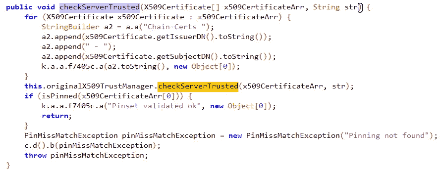
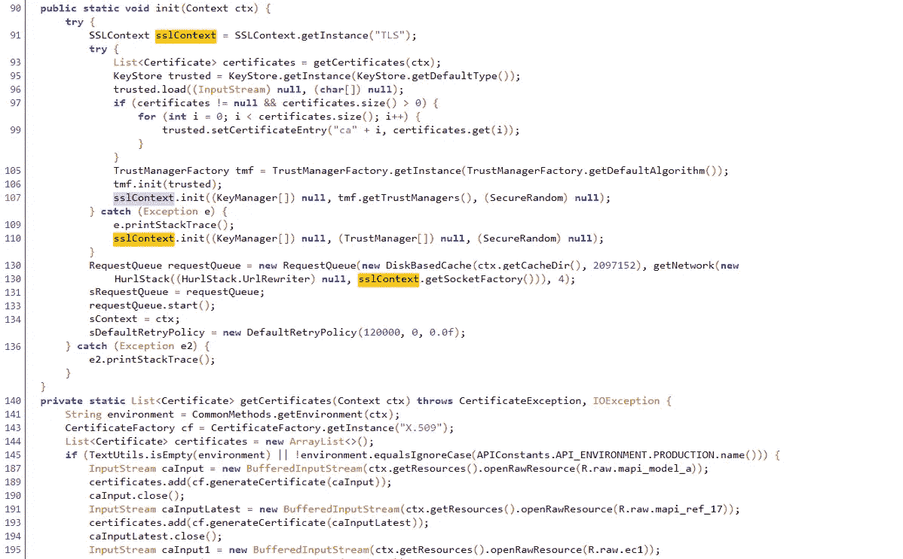
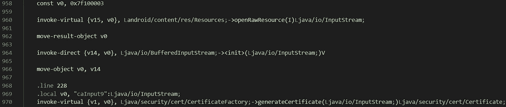

# 绕过 Android 上的 SSL 锁定

> 原文：<https://levelup.gitconnected.com/bypassing-ssl-pinning-on-android-3c82f5c51d86>

## 用 smali 补丁规避 Android 上的证书锁定。

几乎所有的移动应用程序都与后端服务器通信，无论是传输应用程序数据、备份、分析；移动设备中的无线通信信道上存在某种形式的数据来回传输。

大多数开发者都知道他们需要使用 HTTPS，毕竟现在是 2020 年，但在移动应用程序中，这还不够。如果您不检查您正在通信的服务器是否是您期望的服务器，那么您如何相信通信是安全的并且没有被拦截？

> 如果你不验证服务器是合法的，你怎么知道用户通信是安全的？

# 问题和解决方案

问题在于中间人(MitM)攻击，顾名思义，这指的是某种恶意行为者位于客户端(用户/应用程序)和服务器之间的通信中间。在这种情况下，可以截取、读取和修改两个终端设备之间的通信，从而影响用户的保密性和数据的完整性。MitM 可以通过多种方式发生，这不仅限于智能设备，然而在移动环境中，最大的威胁之一是伪造的 Android 证书或 iOS 设备配置文件。


泰勒·维克在 [Unsplash](https://unsplash.com?utm_source=medium&utm_medium=referral) 上的照片

幸运的是，这个问题有一个解决方案，也就是通常所说的证书锁定或公钥锁定。Pinning 是应用程序开发人员指定特定证书来验证应用程序连接的服务器的合法性，以确保它们是可信的。

> 我们可以信任后端服务器使用证书/公钥锁定来提供验证。

这种方法实际上是将证书或公钥的散列“固定”到应用程序中，并使用它来确定它所连接的服务器的信任度，服务器当然持有 PKI 密钥对的私钥。
然而，我们是安全专业人士，虽然理解这些概念的理论很重要，但我们想知道如何打破这些安全保护，以便访问底层 API 调用。如果我们能够打破证书锁定，一般来说，就有可能进一步进入后端系统，以获得无数的用户数据，而不仅仅是一个用户的数据。

我们将了解两个证书锁定实施的示例，它们在代码库中留下了缺陷，恶意用户可以利用这些缺陷来拦截通信并访问这些幕后 API 调用。

# 锁定旁路

我们应该注意到 SSL 固定是一个难以回避的挑战；一个应用程序可以通过多种不同的方式来实现它，从标准的 Java APIs 到围绕它构建的整个库。一旦您确定了应用程序是如何实现锁定的，smali 补丁可能会非常不同，在某些情况下可能会更容易或更复杂。我们将在示例中说明和讨论这一点。

# 空信任链

## Java 语言(一种计算机语言，尤用于创建网站)

在我们的第一个场景中，应用程序被部分混淆，并使用标准的 Java SSL pin。这通常意味着该应用程序实现了一个名为“ *checkServerTrusted* ()”的方法来验证后端，如果使用自定义信任管理器也需要客户端验证的话，可能还需要“ *checkClientTrusted* ()”。

```
public void checkServerTrusted(X509Certificate[] cert, String str)
```

本质上，该方法对连接的服务器端进行身份验证。应用程序提供证书作为输入，通常硬编码在应用程序中的某个位置，实现建立到服务器的证书链，如果可信，则返回正值，或者在负值的情况下，抛出异常。

下面的方法采用 X509 certificates '*X509 certificate earr*'的数组，然后遍历这些数组，提取颁发者和使用者的名称并将其附加到证书链字符串中，然后进行验证，如果出现“找不到固定”的情况，将引发异常。



checkServerTrusted() Java 固定代码

## 斯马利

在这个代码块的小分解中，我们可以看到较低级别的表示，有一些相似之处，但也有一些细微差别需要注意。

方法声明包含标准的 smali，但是我们有:

*   *[【T7]'表示输入参数的数组。*
*   *L* '来表明下面的项目是一个实例或类，在本例中是 X509Certificate。
*   *；*'分隔参数
*   一个字符串实例，再次用' *L* 表示
*   然后，该方法返回 void。

在这种情况下，我们可以在 SSL 固定和字符串构造完成之前简单地将“return void”语句移到。这意味着证书链永远不会被构建，也不会被验证；然而，这也表明了另一个问题和逻辑问题。没有错误检查来验证信任链是有效的或者甚至不是空的，它盲目地接受返回调用并继续通信。


第 513 行添加了 smali 语句的 SSL pinning bypass。

# 存储证书的修改

## Java 语言(一种计算机语言，尤用于创建网站)

下一个场景涵盖了一个更复杂的实现，但同样，它创建证书链的方式存在缺陷，并引入了针对 SSL 锁定的漏洞。

发现 SSL pinning 使用了一个实现名为 *init()* 的方法的类。

1.  该方法的第一步包括调用另一个名为 *getCertificates* ()的方法，如下面几行所示；第 140 行

2.方法 *getcertificates* ()，读取作为原始资源存储的 CA 证书，并在类型 Certificate、*List<Certificate>*的 Java 列表中返回它们

3.回到 *init* ()，实例化一个 Java *Keystore* 并在列表中添加每个证书；第 95–105 行

4.一旦这个*密钥库*被构建，它就被交给一个 Java *信任管理器*，后者将使用它来启动与 Java SSL *init* ()方法的 SSL 协商；第 105–107 行



init()方法和 getCertificates()方法的 Java 代码


getCertificates()的返回值

> 该方法隐式信任它所提供的内容，无论是真实的证书，还是我们定制的假 CA。

从安全的角度来看，这个 *init* ()方法是易受攻击的，因为它完全信任提供给它的证书，但是当它被方法 *getCertificates* ()返回时，并不实际验证这些证书的用途。因此， *getCertificates* ()可能会返回一个空值、一个空列表，或者，正如我们将要展示的，我们为代理工具定制的 CA。

## 斯马利

在方法 *getCertificates* ()的第一部分，我们可以观察到方法调用返回一个列表对象*Ljava/util/List*；在第 354–358 行创建名为 **cf** 的 CertificateFactory，然后在第 362–367 行创建并实例化 *ArrayList* 。

*   这里还需要注意的是，名为**证书**的证书列表存储在变量 **v2** 中，第 367 行。


getCertificates()小代码

在代码的更深处，我们可以开始注意到代码正在做什么的模式。

1.  将资源 ID 放入局部变量。
2.  使用此 ID 调用 *openRawResource* ()的函数；对证书的引用。
3.  使用 *InputStream()* 读取
4.  附加到**证书**列表。
5.  关闭 *InputStream()*

对每个证书重复相同的模式，在方法结束时，返回存储在 **v2** 中的列表。


getCertificates()方法的返回值。v2 是生成的证书列表

因此，这个应用程序从 resources 文件夹中获取基于资源 ID 的外部输入，并构建一个有效的“可信”证书列表。如果我们用攻击者控制的证书替换其中一个证书会怎么样？

> 我们可以用自己的假 CA 替换这个“可信”证书的内容。



证书从原始资源中打开并读入应用程序。

使用存储为常量的资源 ID 值，我们可以使用一个简单的命令行来找出它与哪个原始文件相关。一旦我们找到了资源名称，我们就可以定位原始资源，并用我们自己的证书文本替换这个证书文本。


> 这里需要注意的是，证书可能会被调用。cer，但实际上是 Base64 编码的 DER，也称为 PEM 而不是证书的原始二进制形式(DER 或 CER)。

为了在原始二进制证书、 *cer* 和 *der* 之间转换成 Base64 编码证书、 *crt* 或 *pem* ，我们可以使用 OpenSSL。一旦格式正确，我们就可以覆盖现有的证书。

```
openssl x509 -in proxyCert.der -inform DER -out proxyCertConvert.pem
```

因为我们有对我们的证书和真实代码的真实引用，所以我们需要做的就是调整 smali 的原始逻辑。我们只关心我们的证书被加载，我们可以忽略其他的。

*   我们的证书已经被打开并读入*InputStream***v 0**-389 行
*   使用 *CertificateFactory* 方法 *generateCertificate* ()生成证书，并将其移动到**V5**-390–392 行
*   将我们生成的证书**，v5** 添加到我们的**证书**列表，**v2**-第 395 行
*   关闭原来的*输入流* -行 398
*   将证书列表返回给调用方法-第 400 行。smali 代码的其余部分在此之后继续，但是因为我们已经返回了我们的 **certificates** List 对象，所以它变成了不可访问的代码。


在只添加了假证书后返回证书列表，忽略其余的。

在返回之前，应用程序将只读取包含我们修改内容的证书；文件名保持不变，我们只是交换了文本。由于它是隐式信任的，应用程序继续正常通信，同时由于接受我们的 CA 而通过我们的代理工具传递一切。

我们已经详细介绍了如何绕过证书锁定的不同实现的两个示例，这两个示例都在如何实现保护方面存在错误，但是显示了攻击者如何能够利用最小的缺陷来进一步进入系统并调查 API 调用。

第一个示例演示了一种方法，其中信任链是隐式信任的，除了传递给该方法的内容之外，没有进一步的验证。没有错误处理或检查返回的内容，从而允许无效的返回调用。

第二种是在应用程序包中使用存储的应用程序证书，因为移动应用程序在恶意用户的个人设备上，这从来都不是一个好主意；因为正如所演示的，这些可以用完全不同的东西来替换，以利用代码的弱点。

如果使用正确，证书锁定是保护后端服务器以及客户端-服务器请求和响应中传递的通信的一种广泛方式。然而，不应完全依赖它，也不应将其用作接受 API 上不安全开发实践的理由，而是用作移动应用程序网络安全分层方法的一部分。