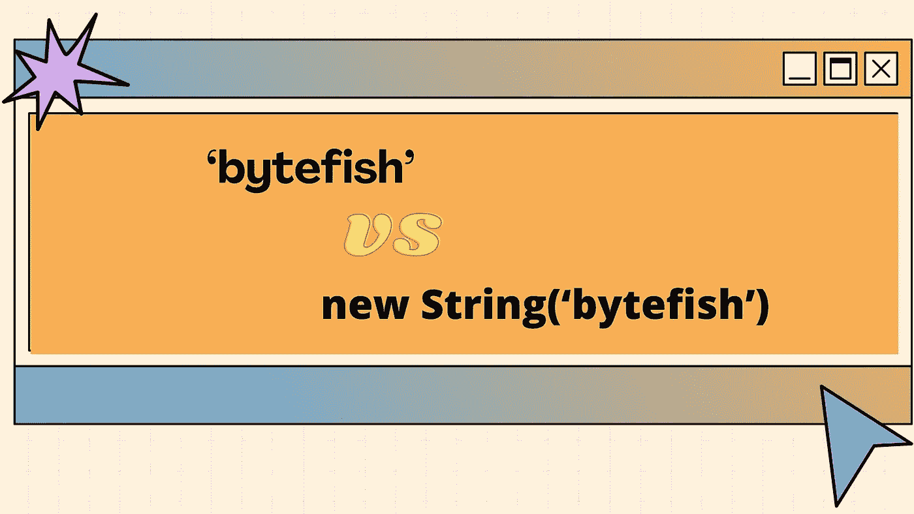
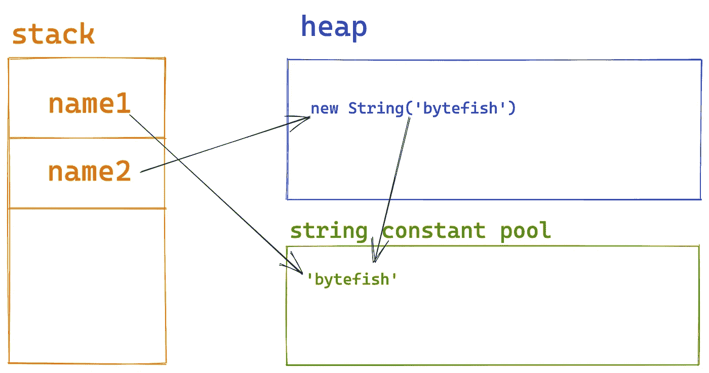
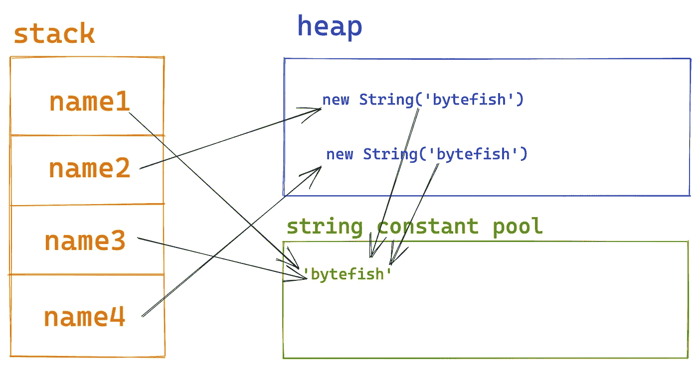
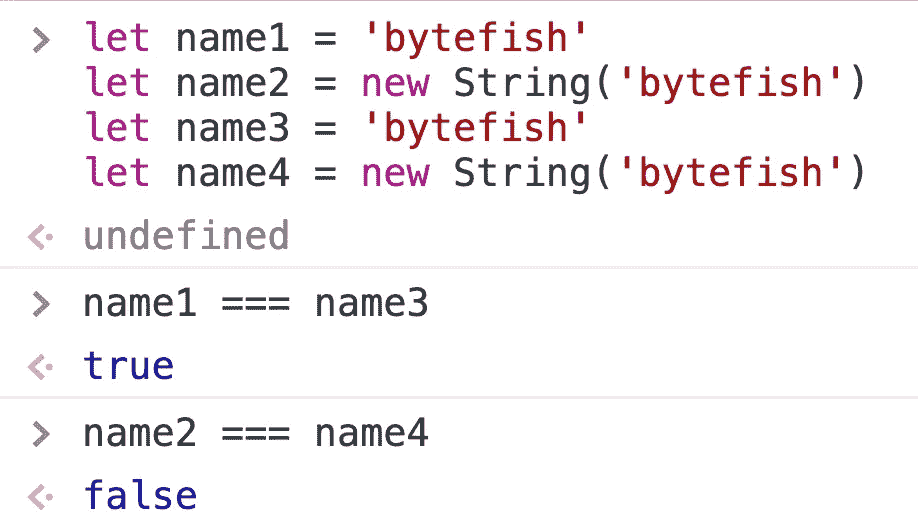
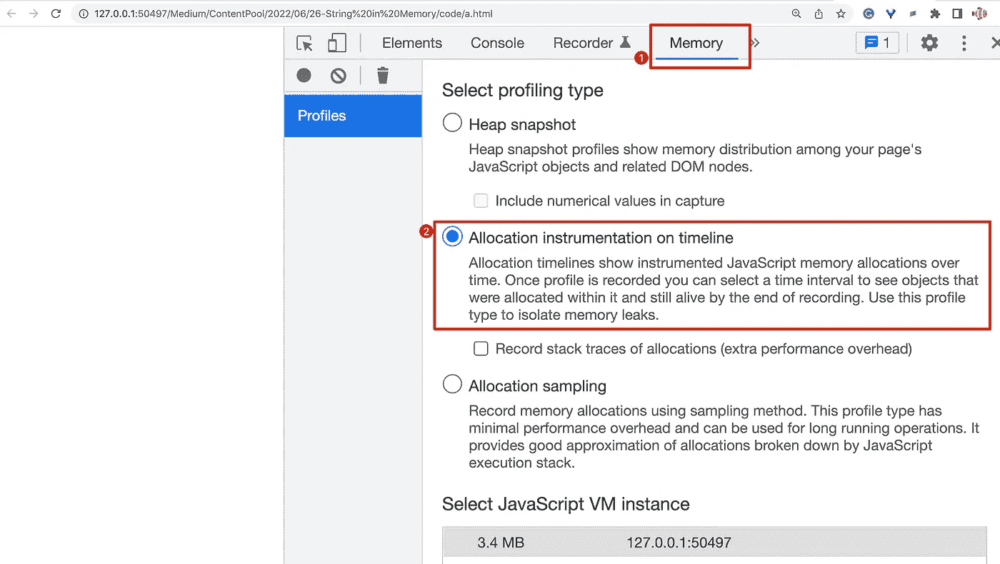
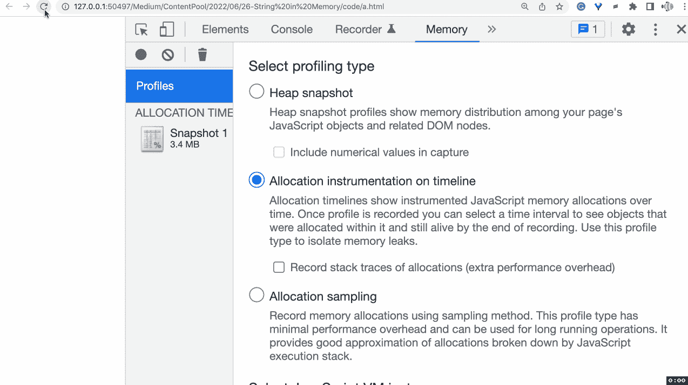
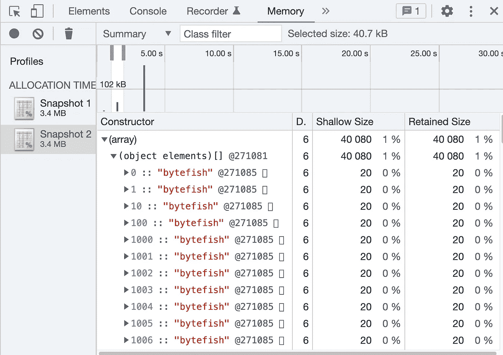
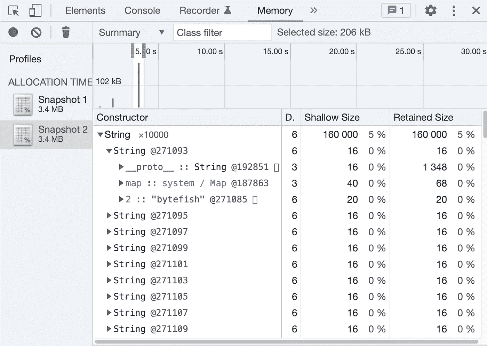

# ' bytefish '与 new String('bytefish '):有何不同？

> 原文：<https://levelup.gitconnected.com/bytefish-vs-new-string-bytefish-what-is-the-difference-a795f6a7a08b>



在下面两行代码中，我们使用两种不同的方法来创建字符串:

```
let name1 = 'bytefish'let name2 = new String('bytefish')
```

那么这两种方式有区别吗？

两者的区别主要体现在内存分配上。

我们知道，在 JavaScript 中，所有对象都是引用类型，它们被分配在堆内存中。

同时，为了高效地处理字符串，V8 引擎维护了一个字符串常量池。字符串存储在字符串常量池中。其实不仅仅是 V8 引擎，很多解释器都会维护一个字符串常量池，比如 Java 虚拟机。

所以上面的代码在运行时的内存分配图如下:



`name1`直接引用字符串常量池中的字符串，而`name2`引用堆中的对象。

如果我们在代码中添加两个变量声明:

```
let name1 = 'bytefish'let name2 = new String('bytefish')let name3 = 'bytefish'let name4 = new String('bytefish')
```

然后内存分配图变成了:



我们可以发现一个有趣的事实:`name1`和`name3`指向同一个位置，而`name2`和`name4`指向两个不同的对象。



# 使用 Chrome DevTools 进行调试

当然，有的朋友可能会说:你怎么证明你说的是对的？

好了，这里我们用 Chrome DevTool 来验证一下上面代码的内存分配。

首先，创建一个 HTML 文件，并在 Chrome 上打开它:

这段代码将在 3s 后创建一个长度为 10000 的数组`arr`，数组中的元素是`"bytefish"`。

5s 后会创建一个长度为 10000 的数组`arr2`，数组中的元素为`new String("bytefish")`。

然后，我们打开:Chrome DevTool →内存→时间轴上的分配插装。



然后我们需要重新加载网页并点击黑点来记录内存使用情况:



现在我们可以看到两个蓝色竖线，它们代表两个内存分配。

您可以点击查看详情:



虽然数组中有 10000 个元素，但是它们都有相同的地址`@271085`。这验证了我们之前提到的字符串常量池的存在。

如果我们单击下一个蓝色竖线，我们可以发现所有的字符串对象也引用`@271085`。



这里我们还可以发现，如果一个字符串是由`new String(“bytefish”)`创建的，那么堆内存中就会产生一个额外的对象，增加了内存消耗。

通过两条蓝色竖线的高度，我们也能明显感觉到后者占用的内存更多。

# 结论

*   `let name1 = ‘bytefish’`将在字符串常量池中创建一个字符串。
*   `let name2 = new String(‘bytefish’)`将在堆中创建一个对象。