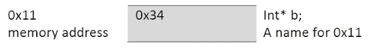

# C/C++指针与 C++参考和 Java 参考

> 原文：<https://levelup.gitconnected.com/c-c-pointer-vs-c-reference-vs-java-reference-facc037eb2a5>

要在 C++中声明一个指针，你可以在指针名旁边使用一个星号。为了说明这一点，在声明常规 int 标量变量时，可以输入以下内容:

**int a；**

当声明一个指针“b”时，你可以输入:

**int * b；**

如您所见，指针变量包含星号。

让我们看看内存，看看刚刚发生了什么。对于标量变量 int“a”，保留了 4 个字节的内存。如果你看下面的表示，你会看到 int“a”实际上被分配了 4 个字节的内存，位于内存地址 0x34(只是一个随机的内存地址)。

如果我们要给标量变量“a”赋值，保留空间将被修改以直接包含该值。这可以从下面看出:

**int a = 5；** // 5 二进制是 00000101

其余字节用零填充。为什么？接下来，您可能想要修改整数值。它必须确保支持预定义的整数范围，对于有符号位，该范围恰好是-2，147，483，648 到 2，147，483，647，对于无符号位，该范围是 0 到 4，294，967，295。

对于指针变量，根据体系结构，在 32 位机器上，将为指针变量分配 4 个字节的内存；在 64 位机器上，将分配 8 个字节。

为了简单起见，我们将使用一个抽象表示，其中指针只占用 1 个字节。因此，当指针“b”在上面声明时，它将像标量变量一样与内存地址相关联，但不能像标量变量“a”那样直接存储值，它只能存储内存地址。下面你可以看到内存地址 0x11 是指针“b”所在的位置。很多时候，在声明时会分配一个 0，所以我们将把存储器地址 0 输入到 0x11 存储器地址中。

这个指针“b”目前不指向任何东西。因此，让我们改变它，将“b”指针指向位于 0x34 的“a”标量变量。我们不能简单地进入

**b = a；**

因为“a”提供存储在 0x34 中的值，而“b”仅存储存储器地址。要将“a”的地址存储到指针“b”中，我们必须在“a”前面使用&符号:

**b =&a；**

现在，“a”的内存地址存储在指针“b”中。

“b”现在指向“a”的内存地址。

如果我们要打印出指针“b”，我们将得到十六进制值 0x34，这是存储在指针“b”中的地址。要打印出“a”的值，我们必须首先取消对指针“b”的引用，方法是再次在它前面加上星号。为了进一步解释解引用，我们将看几个例子。

目前 b 是一个声明的指针(int* b ),它指向“a”的内存地址。

为了打印出“a”的值，我们将使用 C 的 printf 语句:

**printf("%d "，* b)；** //打印 5 张

如您所见，*b 是解引用指针，将产生存储在 a 中的值，即 5。

我们如何更新存储在“a”中的值我们可以通过两种不同的方式来实现。第一种方法是将新值直接赋给“a ”:

**a = 10；**

另一种方法是取消引用表达式左侧的指针:

*** b = 10；** // *b 与“a”相同，因为“b”指向“a”

如果我们要创建其他变量，我们可以通过给指针分配新的内存地址来保持指针指向不同的东西。例如，假设我们创建了一个新的 int c 标量变量。要将指针“b”赋给标量“c”，我们将执行与之前相同的过程:

**b =&c；**

请注意，我们没有取消对指针“b”的引用。因为我们没有取消对指针“b”的引用，“b”被直接修改，现在指向内存地址“c”

那么在 C++中什么是引用呢？你可以把它看作一个别名(也就是同一个内存地址的另一个名字)。在这个例子中，我们已经声明了两个标量变量“a”和“c”。为了给每个变量取一个替换名，我们可以使用一个引用。要添加对“a”的引用，我们可以执行以下操作:

**int&ref = a；**

在这种情况下，出现在左侧的&符号表示变量“ref”应该是一个引用，本质上与“a”是相同的。我们知道“a”位于 0x34。新的引用“ref”也将位于存储器地址 0x34。如果我们要打印“a”或“ref”，我们会看到值 10(我们之前指定 a = 10)。

既然现在存在一个引用，要将我们的指针“b”指向“a ”,我们可以用两种不同的方法来实现:

**b =&a；**

或者

b =&ref；

C++中的引用类型不同于 Java 中的引用类型。在 Java 中，我们有两种不同的类型:值类型和引用类型。值类型由原始数据类型组成，在 Java 中是:

**字节、短整型、整型、长整型、浮点型、双精度型、布尔型和字符型**

所有其他变量类型都是引用类型(即 String 是引用类型，但请记住 Java 中的 String 是不可变的，因此当试图修改 String 时，将在堆中创建一个新对象)。Java 中的引用行为更像 C 或 C++指针，而不像 C++引用类型。最大的区别是 Java 引用总是指向对象，而 C 和 C++指针可以指向任何东西。要在 Java 中创建 int 类型的值类型，可以执行以下操作:

**int var _ name = 10；**

该语句将一个内存位置与 var_name 相关联，并为其赋值 10。与上面 C++例子中的 int a = 5 的过程相同。

当我们创建 car 类型的引用类型(我自己创建的类)时，如下例所示，dinos_car 被分配一个内存位置，Car 对象被分配一个堆中的位置。Car 对象在堆中的位置(内存地址)存储在引用变量 dinos_car 中。

**Car dinos_car =新车(“蓝宝”)；**

new 操作符在堆中创建 Car 对象。那么，上面的语句是做什么的呢？在堆中创建一个位置。获取 Car 对象在堆中的内存地址，并将其分配给 dinos_car。

我们为什么需要推荐信？内存管理。让我们看一个例子。

在上面的例子中，“a”有一个原始数据类型 int。它被赋值为 10，并将该值直接存储在分配给它的内存地址中。我们打印出" a ",正如所料，它打印出 10。接下来，我们调用一个方法，该方法将一个整数作为参数并递增它。一旦我们再次打印出“a ”,我们期望打印出的是 11，但在本例中是 10。为什么？当向 increment 提供参数“a”时，increment 方法会复制它，并且范围仅限于 increment 方法。increment 方法中的局部变量“a”是一个堆栈动态变量，它的生存期大约是该方法的长度。方法完成后，局部变量“a”(在 increment 方法中)被丢弃，不再可见。

当引用变量作为参数传递时，对象在堆中的内存地址被传递，修改直接在对象本身上完成。例如:

在这种情况下，changeCar()方法有两个参数:Car a 和字符串 newCar。引用变量“a”只包含位于堆中某处的对象 Car 的内存地址。该堆对象被直接修改。该对象不会复制到 changeCar()方法中。为什么？物体可能是巨大的。我们不希望每次调用一个方法就复制这么大的对象，因为我们可能会很快耗尽内存，我们的程序会明显变慢。

迪诺·卡伊奇目前是 [LSBio(生命周期生物科学公司)](https://www.lsbio.com/)、[绝对抗体](https://absoluteantibody.com/)、 [Kerafast](https://www.kerafast.com/) 、[珠穆朗玛生物](https://everestbiotech.com/)、[北欧 MUbio](https://www.nordicmubio.com/) 和 [Exalpha](https://www.exalpha.com/) 的 IT 主管。他还担任我的自动系统的首席执行官。他有十多年的软件工程经验。他拥有计算机科学学士学位，辅修生物学。他的背景包括创建企业级电子商务应用程序、执行基于研究的软件开发，以及通过写作促进知识的传播。

你可以在 [LinkedIn](https://www.linkedin.com/in/dinocajic/) 上联系他，在 [Instagram](https://instagram.com/think.dino) 上关注他，或者[订阅他的媒体出版物](https://dinocajic.medium.com/subscribe)。

[*阅读迪诺·卡吉克(以及媒体上成千上万其他作家)的每一个故事。你的会员费直接支持迪诺·卡吉克和你阅读的其他作家。你也可以在媒体上看到所有的故事。*](https://dinocajic.medium.com/membership)