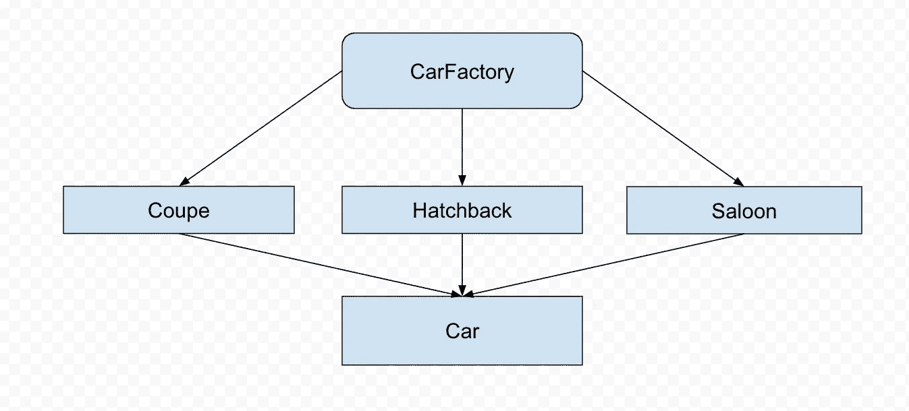

# C#设计模式—工厂方法

> 原文：<https://levelup.gitconnected.com/c-design-patterns-factory-method-23f53888b79b>

## 第 1 部分—工厂方法

帕特里克·亨德利在 [Unsplash](https://unsplash.com/s/photos/guide?utm_source=unsplash&utm_medium=referral&utm_content=creditCopyText) 上的照片

工厂模式是最常用的设计模式之一。它是一种创造性的模式，使用抽象类或接口来定义对象的创建，但让子类决定实例化哪个类。

## 工厂设计模式的优势

*   允许子类选择要创建的对象类型
*   通过消除对绑定特定于应用程序的类的需求来促进*松耦合*。然后，代码将与接口或抽象类进行交互，并与实现该接口或扩展该抽象类的任何类一起工作。

比方说，你买了一栋新房子，你想更换房子的门。现在，有更大的门和更小的门，但我们可以说所有的门都有一个尺寸，这将是我们的界面，根据我们给商店工作人员的尺寸，他会向我们展示适合我们需要的或大或小的门。

*让我们用一些代码再举一个例子:*

上图向我们展示了如何构建我们的工厂方法。首先，我们创建一个简单的汽车抽象类:

枚举为:

之后，我们将需要几辆不同的车，我们将创建 3 个类，一个为轿车，另一个为轿车，第三个为掀背车，为了简单起见，几乎是一样的。

最后，我们可以创建我们的 CarFactory 方法。

就这样，简短而甜蜜。现在，我们可以调用我们的汽车工厂，根据我们传递的车身样式，我们将得到不同类型的汽车作为回报。