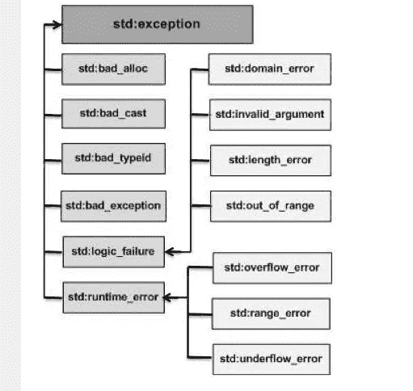

# C++异常处理

> 原文：<https://levelup.gitconnected.com/c-exception-handling-208daca53be5>

## 回到基础

# 基础知识

异常是在程序执行过程中出现的问题。C++异常是对程序运行时出现的异常情况的响应，例如试图被零除。

异常提供了一种将控制从程序的一部分转移到另一部分的方法。C++异常处理建立在三个关键字之上: **try，catch，**和 **throw** 。

*   **抛出**——程序在出现问题时抛出异常。这是使用 **throw** 关键字完成的。
*   **catch**——一个程序在你想处理问题的地方用一个异常处理程序捕捉一个异常。 **catch** 关键字表示异常的捕获。
*   **try**—**try**块标识特定异常将被激活的代码块。后面跟着一个或多个 catch 块。

假设一个块将引发一个异常，一个方法使用 **try** 和 **catch** 关键字的组合来捕获一个异常。try/catch 块放在可能生成异常的代码周围。try/catch 块中的代码称为受保护代码，使用 try/catch 的语法如下

```
try {
// protected code
} catch( ExceptionName e1 ) {
// catch block
} catch( ExceptionName e2 ) {
// catch block
} catch( ExceptionName eN ) {
// catch block
}
```

您可以列出多个 **catch** 语句来捕捉不同类型的异常，以防您的 **try** 块在不同情况下引发多个异常。

# 抛出异常

使用 **throw** 语句可以在代码块中的任何地方抛出异常。throw 语句的操作数决定了异常的类型，可以是任何表达式，表达式结果的类型决定了抛出的异常的类型。

以下是发生被零除情况时抛出异常的示例

```
double division(int a, int b) {
if( b == 0 ) {
throw "Division by zero condition!";
}
return (a/b);
}
```

## 处理任何异常捕获

在 catch 块参数中使用…可以捕获几乎所有异常，而不管其类型如何。

```
try {
// protected code
} catch(...) {
// code to handle any exception
}
```

## 抛出并捕获一个 Const Char 指针

下面的例子展示了一个被零除的异常，其中我们抛出了一个常量字符指针(第 6 行你可以看到我们传递了一个字符串), catch 将常量 char*作为参数。

毫无疑问，这种风格更老，更少面向对象，但你应该意识到这一点。

# C++标准异常

C++提供了一个在 **<异常>** 中定义的标准异常列表，我们可以在我们的程序中使用它。这些按父子类层次结构排列，如下所示



下面是上面层次结构中提到的每个异常的简短描述

**std::exception —** 所有标准 C++异常的异常和父类。

**std::bad_alloc —** 这个可以由**新**抛出。

**std::bad_cast —** 这个可以由 **dynamic_cast** 抛出。

**std::bad_exception —** 这是处理 C++程序中意外异常的有用设备。

**std::bad_typeid —** 这个可以由 **typeid** 抛出。

**std::logic_error —** 理论上可以通过读取代码检测到的异常。

**std::domain_error —** 这是使用数学上无效的域时引发的异常。

**std::invalid_argument —** 这是由于无效的参数而引发的。

**std::length_error —** 创建太大的 std::string 时抛出。

**std::out_of_range —** 这可以由“at”方法抛出，例如 std::vector 和 STD::bit set<>::operator[]()。

**std::runtime_error —** 理论上无法通过读取代码检测到的异常。

**std::overflow_error —** 发生数学溢出时抛出。

**std::range_error —** 当您试图存储超出范围的值时，会出现这种情况。

**std::underflow_error —** 如果发生数学上的下溢，将抛出此错误。

# 定义新的例外

您可以通过继承和覆盖**异常**类功能来定义自己的异常。下面的例子展示了如何使用 std::exception 类以标准方式实现自己的异常

这将产生以下结果

```
MyException caught
C++ Exception
```

这里， **what()** 是异常类提供的公共方法，它已经被所有子异常类覆盖。这将返回异常的原因。

## “”标记前应为类名

如果您在尝试实现上面的示例时，在' { token'之前得到错误“[预期类名”，那是因为您忘记了#include <异常>](https://stackoverflow.com/questions/11297849/very-basic-inheritance-error-expected-class-name-before-token)

# 向自定义 C++异常传递参数

## 警告:ISO C++禁止将字符串常量转换为“char*”

警告意味着您的程序是错误的。在 C++11 之前，传递一个字符串文字作为`char*`曾经是格式良好的，但现在不推荐使用。确保添加一个接受 const char*的函数重载来解决这个问题，并且可以向该函数传递一个字符串文字。

```
MyCustomException(const char* msg): message(msg) {}
```

# 参考

[1] C++异常处理。[https://www . tutorialspoint . com/cplusplus/CPP _ exceptions _ handling . htm #:~:text = A % 20C % 2B % 2B % 20 exception % 20 is % 20a，try % 2C % 20 catch % 2C % 20 和%20throw](https://www.tutorialspoint.com/cplusplus/cpp_exceptions_handling.htm#:~:text=A%20C%2B%2B%20exception%20is%20a,try%2C%20catch%2C%20and%20throw) 。

[2]向自定义 C++异常传递参数。https://rollbar.com/blog/cpp-custom-exceptions/

[3]警告:ISO C++禁止将字符串常量转换为“char*”。[https://stack overflow . com/questions/56524609/warning-iso-c-banneds-converting-a-string-constant-to-char-ww write-string](https://stackoverflow.com/questions/56524609/warning-iso-c-forbids-converting-a-string-constant-to-char-wwrite-string)