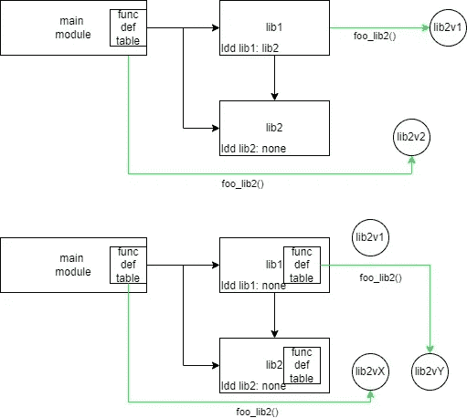

# 面向 C++库的调试

> 原文：<https://levelup.gitconnected.com/c-library-oriented-debugging-c97390165818>

## 您的 C++应用程序如何享受静态链接的好处，同时在运行时保持动态链接的开发灵活性？


链接！玛利亚·李森科在 [Unsplash](https://unsplash.com?utm_source=medium&utm_medium=referral) 上拍摄的照片

# 动机

成熟的实时应用程序很难使用。随着范围的扩大、特性的增加以及依赖关系的逐渐耦合，开发周期变得越来越慢。在本文中，我提供了一个非常基本的概念，“T4”rapid CPP，用于缩短开发周期。

想象一下，一个衡量你在设置环境、索引 IDE、配置、编译、链接和测试应用上花费的时间的指标，实际上与你的市场革新特性直接相关。这个指标是一个组织的无声杀手——一种不断增加的隐形税，它的利息由你的组织每天支付。

这种税基本上是可以避免的。

以我的经验来看，最痛苦的是为了测试一个微小的变化而重置设置。有时痛苦在于花几个小时重新编译我没有编辑过的源代码。有时甚至从未见过。

通常，面向性能的应用程序从静态链接开始。有道理。动态链接要复杂得多，需要运行时开销，并且可能容易出现非常微妙的问题(例如，不正确的符号解析、不同的版本控制以及对执行环境的依赖)。随着时间的推移，这种决策会持续下去，因为大多数开发人员不会每天都处理项目结构，因此，应用程序 blob 会变得越来越大。

但是我在这里并不是要推广动态链接在实时生产环境中的使用。还有其他人证明做这件事是正当的。
我希望在**开发** **环境**中推广使用动态链接。

# Rapidcpp

激励我的想法是一些被调试组件的静态和动态库之间的可互换性的概念。
一些依赖项被链接，但是链接的方法**静态**或**动态**对大多数来说意义不大。然而，它确实在实际意义上发挥了作用。

由于实时应用程序中的大多数链接都是静态的，因此修改函数是不可能的。另一方面，动态链接允许我们在运行时进行符号解析，并用修改后的实现覆盖当前的函数指针。

这似乎是一个开始。

为了实现可互换性， *Rapidcpp* 应牢记以下目标:

1.  支持应该尽可能透明的调试基础结构。
2.  原始代码应该保持不变。
3.  调试模式应该从构建系统触发，而不是从代码触发。
4.  启用现有功能符号的替代。
5.  对性能的影响尽可能小。

# 两种动态链接

`ldd`是 Linux 中列出二进制动态依赖关系的常用工具。在链接结束时，符号不能保持未定义状态。每个未定义的符号必须静态链接或标记为动态符号。当检测到一个符号属于一个动态链接时，动态库的名称将被列在 ELF 文件中，并在`ldd`中被列为一个依赖项。这就是**动态链接。**

这种类型对我们的情况来说是有问题的:符号解析不能撤销，覆盖函数符号是不可能的。

第二种类型的动态链接，**动态加载，**受约束较少，只在运行时发生。`dlopen`和`dlclose`是允许运行时搜索库名并从中提取符号信息的函数。

**Rapicpp** 正在使用**动态加载**来满足我们的要求。从现在开始，这个特性将被称为“动态调试”。

# 动态调试的实现

## 现在看着我让这个符号消失

记住，调用点必须保持不变。但是根据前面**动态链接**的解释，这是矛盾的:原代码是在调用函数，也就是符号。正如用`ldd`解释的，调用函数是为了防止动态库和它们相应的符号从进程内存中被驱逐。例如，下面描述了在我们的 *rapidcpp_shared* 二进制文件中使用动态库 *liblang1_shared.so* 中的符号:


不像你不交房租，libliblang1_shared.so 不会被 0x0006f1ad2c5b000 驱逐，即使你真的希望它被驱逐。

这种对`libliblang1_shared.so`的依赖应该删除。这里使用了一些技巧来保持代码完整，但实际上避免了符号的显式使用。

编译器不能将每个函数都视为一个符号。您现在可能正在猜测我们需要使用一些预处理魔法。

例如， *libliblang1_shared* 有这样的函数定义:

```
void echoHelloWorldEnglish(int x);
```

第一步是混淆符号本身。这可以通过以下方式实现:

```
using func_int_t = void (*)(int);#define echoHelloWorldEnglish(…) CALL_DEBUG_FUNC(func_int_t, echoHelloWorldEnglish, (int), __VA_ARGS__)
```

一旦符号“消失”，我们需要调用函数，而不需要编译符号。为此，我们需要将函数名映射到函数指针:

```
map<string_view, void *> gDynamicSymbols = {{“echoHelloWorldEnglish(int)”, nullptr}}; #define CALL_DEBUG_FUNC(TYPE, FUNC, PARAMS_TYPE, …) 
((TYPE)(gDynamicSymbols[#FUNC #PARAMS_TYPE]))(__VA_ARGS__)
```

结果是:


拜拜库依赖

该解决方案通过在停用的动态调试环境中定义 CALL_DEBUG_FUNC 来保持原始状态:

```
#define CALL_DEBUG_FUNC(TYPE, FUNC, PARAMS_TYPE, …) 
(FUNC)(__VA_ARGS__)
```

它像以前一样直接使用符号。

为了说明所描述的过程，让我们以函数“foo”为例:


## 刚刚发生了什么？！哪里消失了！？

该符号不再存在，已被存储在`gDynamicSymbols`中的函数指针所取代，当程序首次执行时或在调试会话过程中，需要存储该函数指针的值。

首先，程序将通过打开每个动态库来设置这些动态符号。对于每个库，使用`dlsym`查询函数符号名称。(这个机制后面会讲到)。

在初始设置之后，当所有的依赖库和它们的符号都被加载后，程序就可以正常执行了。

## 亲爱的，你不在名单上

到目前为止，有一个假设，即符号函数名等同于实际的函数名。但是`echoHelloWorldEnglish`这个功能的符号名称是不同的。

原因是**名不符实。**

显示名称篡改完整范围的一个例子是`std::thread::detach`函数。
代码中使用的**函数名**为`detach`。
`_ZNSt6thread6**detach**Ev@@GLIBCXX_3.4.11`是**错位的名字。** `std::thread::**detach**()@@GLIBCXX_3.4.11`是**的解缠名称**。

当使用`dlsym`在动态库中搜索函数指针时，符号由**损坏的名称**而不是**函数名称**查看。

名称 mangling 只与 C++编译的代码相关。它接受任何函数的上下文和签名，并将其翻译成唯一的 C 符号。这需要考虑函数返回类型、参数类型和名称空间层次结构，并且允许相同的函数名在不同的签名中重用。
`dlsym`仅使用一个字符串搜索函数符号，但完全忽略所需的上下文和签名。
这就是必须手动处理的原因。

`echoHelloWorldEnglish`是一个 C++函数，编译时没有任何 extern“C”。如前所述，用`dlsym`按原样搜索是徒劳的。因为这个函数的名字被改成了`_Z21echoHelloWorldEnglishi`(在不同的编译器中可能会有所不同)。

`echoHelloWorldEnglish? No, I am sorry you don't appear on nm.`

一旦在`dlsym`中搜索并找到被破坏的名称，它就被存储在`gDynamicSymbols`中，后者将每个函数的 **de** 被破坏的名称映射到它的函数名。只能通过将函数名转换为解混淆的函数名来进行调用。

为了结束这个过程，任何时候调用一个函数，都需要将**函数名**转换成**解混淆名**。只有用它，才能调用它的函数指针。
首先要初始化/重新加载函数——应该是**损坏的名称**。

综上所述，命名混淆是造成“函数名”和“符号名”不同的原因。当不涉及名称混淆时(在 C 代码或指定的 extern“C”修饰符中)，函数名匹配解混淆的名称(当然还有混淆的名称)。


存储新函数指针的流程和执行函数的流程

## 功能覆盖？函数重载！

有了这个简单的机制，流程现在支持运行时“函数重载”。一旦开发人员修改了函数实现，就可以在运行时将其重新加载到流程中并进行测试。

在这个输出中，重载可以通过 *rapidcpp* 来演示。


程序的输出显示了在其宿主库被重新打开之前和之后执行函数“1”的结果。功能“1”输出从“Hello World **5** 变为“Hello World **15** ”。这是刚刚描述的机制的结果。

## 导出全局变量

当在静态链接中链接所有库和主模块时，全局变量被定义并链接到一个模块中。链接后，只要找到全局变量的声明，就可以在过程中的任何地方使用这些变量。

在动态链接的情况下，不同模块唯一知道的符号是`.dynsym` ELF 部分列出的符号。在编译动态库时，在`dynsym` 中导出全局符号是微不足道的，这也需要在主模块中显式地完成。

主模块可以用`--export-dynamic`编译，或者只使用 CMake 将主可执行属性设置为`ENABLE_EXPORTS 1`，以便导出全局符号。

# 透明的基础设施

前面的函数描述了如何在保留流程原始语义的同时进行动态调试。在下文中，构建系统和架构的角色将演示 rapidcpp 在任何项目中的设置和使用。

## CMake

到目前为止，本文描述了如何执行函数重载，以及实现如何通过静态链接仍然支持原始部署。但是如何使用构建系统来实现这一点的知识仍然是隐藏的。

CMake 方法定义了两个变量，可用于编译代码以包含动态调试支持(作为激活模式或不作为激活模式)。

`PROJECT_DEBUG=”SHARED” or “STATIC”`。

`PROJECT_DEUBG_SHARED (only if PROJECT_DEBUG=”SHARED”)`

使用两个只是为了代码的可读性。使用 C++17 `if constexpr`语法，可以用`strcmp`编译代码并对预处理程序符号执行编译时字符串比较。(可惜 GCC 9.4 支持，Clang 10 不支持)。但是`if constexpr`只能像`if`语句一样使用。有时候，动态调试的代码并没有嵌套在函数中或者允许`if`的地方。这就是用`PROJECT_DEBUG_SHARED`的原因。

`PROJECT_DEBUG` 将在每个库中使用:

```
add_library(liblang1 ${PROJECT_DEBUG} ${SOURCE_FILES})
```

这将为设置生成所需的库类型。

请注意，如果您的项目相对较小并且编译时间不成问题，您可以同时生成带动态调试和不带动态调试的二进制文件(在 rapidcpp POC 中，还创建了第三个二进制文件—根本没有 rapidcpp)

## 仅标题

所描述的机制可以通过包含具有所需组件的头文件来使用。标题内容受`PROJECT_DEBUG_SHARED` 和 include 保护。在不使用动态调试的情况下，这种包含实际上是无操作的。

这种方式 *rapidcpp* 从原始程序中提取了额外的开销。这里有一个很强的解耦，只是被包含的头显式地注意到。

这种代码解耦不是一个问题，但是库管理是一个更值得考虑的问题。

# 在 C++程序中应用 rapidcpp

1.  应支持动态调试的所有函数的列表。
2.  所有库的列表和库到其函数符号的映射及其导出。
3.  每个函数符号签名和上下文:返回类型、参数列表、嵌套命名空间，都是 extern“C”。

这些可以自动生成，但目前， *rapidcpp* 手动更新它们。

# 成本分析

*rapidcpp* 将相同的代码编译成三个进程:

*   *rapidcpp_shared* —进程编译时激活了动态调试支持
*   *rapidcpp_static* —进程编译时支持动态调试，但动态调试被禁用
*   rapidcpp —流程编译和链接不支持动态调试(即原始代码)

就时间和空间而言，很容易画出非常快的高光:

## 时间复杂度

很容易画一些本地测试来比较那些库上的函数调用的执行情况。

对于 rapidcpp_shared，似乎每个调用需要大约 6000–16000 纳秒(C 函数调用需要的时间略少)。平均大约 10 微秒(10K 纳秒)

静态调用时间在 2000 到 13500 之间，平均值很低:4K 纳秒。

rapidcpp 显示与 rapidcpp_static 相同的运行时结果。

调用时间的增加可以用以下装配差异来解释:


左边是 rapidcpp_static，右边是 rapidcpp_shared。很容易看出 rapidcpp_shared 调用的开销大约是基准测试的 3 倍。

## 空间复杂性

*rapidcpp* ，不支持动态调试，二进制大小约 218K 字节。
*rapidcpp_static* 稍高，238K 字节。
*rapidcpp_shared* 变得比较大:858K 字节！

*rapidcpp* 和 *rapidcpp_shared* 之间的区别由符号部分中的附加调试信息解释。运行`strip`时，该信息被丢弃，二进制大小变得相等。

共享的 rapidcpp 的大小是由支持动态调试所需的代码和数据段的大小增加来解释的——大约 140K 的额外信息。随着更多的函数/库需要动态调试支持，这个大小可能会增加。

到目前为止，我们讨论了使 rapidcpp 按预期工作的主要概念。

至此，接下来的部分将讨论我在开发 rapidcpp 时经历的一些设计和想法。

# 动态调试控制

*rapidcpp* 最小 POC 只是一个用户通过标准输入控制的开关语句。一些命令调用实际的程序依赖函数。其他选项允许动态调试操作:关闭/打开/重新加载库。

在实际程序中，更有可能假设“动态调试”操作将具有客户机/服务器关系，在逻辑线程上具有客户机和服务器，开发者与它们交互以调试应用程序。 *rapidcpp* 没有这种支持。目前，实际的程序只是一个单线程的 switch 语句，其中一些操作在它们的动态依赖关系中调用函数，而另一些是“动态调试”操作。

# 热插拔功能替换

*rapidcpp* 不支持热插拔——如果在动态库升级期间调用函数，在函数句柄上执行的线程可能会崩溃:


不要惊慌！

*rapidcpp* 可以通过使用双缓冲技术和切换索引来解决这个问题。通过这种方式，我们可以在不中断已经执行的调用的情况下过渡到新的实现
,更简单但更具侵入性的方式是使用互斥体。
*rapidcpp* 都不实现(调用函数和替换其底层 lib 不能同时执行)。

替换库实现被认为是一种罕见的事件，最多每分钟发生一次。

请注意，两个逻辑线程的存在可能会对流程本身产生不利影响，需要根据流程架构考虑它们的相似性和执行细节。

事实上，为了获得最健壮的解决方案，您需要维护一个呼叫者计数器，但这似乎有些矫枉过正。功能应该最多在几秒钟内执行，而不是无限期地拖延。库在动态调试中预计每隔几分钟就要被替换一次，对于旧函数的返回来说，时间绰绰有余。

# 一级/多级调试

所描述的内容允许主模块很容易地在其他动态库中重新定义函数。但是它也不允许动态库被动态调试。当这些库有相互交织的依赖关系时，会有一些挑战。

为了澄清问题，假设 main 依赖于 lib1 和 lib2，但是 lib1 使用 lib2。在这种情况下，lib2 定义可以通用于 main 和 lib1，也可以由用户单独手动定义。甚至在此之前，lib1 可能根本没有动态调试功能。



一级/多级调试图解

第一个流程是通用函数表。lib1 始终只调用 lib2v1，因为 lib 出现在 lib1 的 ldd 中。对于 lib1，lib2 实现是固定的。

第二个流程描述了一个流程，其中每个库维护它们自己的动态调试机制，因此允许在更窄的范围内进行精确调试。接下来的两个字幕解释了这个流程的难点。

## 动态调试库

动态库可以不使用动态调试头作为主模块来链接。在这种情况下，如前所述，任何对其他库的依赖都将在`ldd`中考虑，并且在运行时替换它的实现是不可能的。

动态库可以像主模块一样包含动态 lib 头文件，但是它应该对正在导出的函数调用执行一个`#undef`。上面显示的方案支持函数的调用，但不支持它的声明。

注意:添加`#undef`是为了防止动态库的原始代码保持不变。

## 通用/分布式功能符号

为动态调试选择的设计是中心的:在主模块中，动态调试只需要一个数据结构的副本。这种设计的败笔在于，除了加载的函数之外，动态库不能有不同的函数实现。但是，每个动态库可以使用特定的映射。在这种情况下，动态调试设计变成分布式的。来自该设计的挑战是为每个模块分派动态调试命令，并使该事务可靠。

分布式模型甚至被测试了一段时间，但由于简单的原因而被忽略了:开发人员的认知负荷，他们的长时间动态调试会话变得难以跟踪。坦率地说，我实现的调度尝试并没有很好地工作，经过努力并在头脑中有了第一个原因后，我不得不放弃它。


无论如何，动态库间的交流从来没有困扰过我，但是我必须承认玩条件变量很有趣

# 小问题:编译器支持

*rapidcpp* 同时支持 GCC 和 Clang，但有细微的区别。

常量 char *上的`strcmp` 的结果在 Clang 10 上没有被检测到不是常量表达式，而 GCC 接受这一点。对于 clang 编译器，这里的成本是额外的。

不得不提的是，VSCode + CMake 插件使得编译器之间的过渡过于平滑，令人难以置信。

# 最后的话

Rapidcpp 的潜力仍有待发掘。


rapidcpp 的秘密还隐藏着。约翰·诺比在 [Unsplash](https://unsplash.com?utm_source=medium&utm_medium=referral) 上的照片

感谢阅读这篇文章。这个兼职项目作为一个概念已经在我的脑海中存在了近几年，并且在总共两个月的时间里实现了它。我试着让你感受一下我脑海中突出的问题。你可以在这里公开分享你的想法，问任何你想问的问题。

# 分级编码

感谢您成为我们社区的一员！更多内容见[级编码出版物](https://levelup.gitconnected.com/)。
跟随:[推特](https://twitter.com/gitconnected)，[领英](https://www.linkedin.com/company/gitconnected)，[通迅](https://newsletter.levelup.dev/)
**升一级正在改造理工大招聘➡️** [**加入我们的人才集体**](https://jobs.levelup.dev/talent/welcome?referral=true)