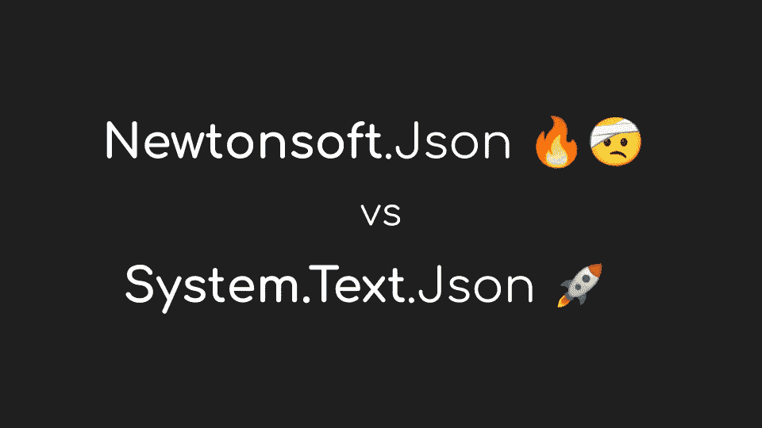

# C#。用 System 反序列化。Json 和 HttpClient

> 原文：<https://levelup.gitconnected.com/c-net-json-deserialization-with-system-net-http-json-and-httpclients-9f49ffb7d9e3>

## 简单的 JSON 反序列化。NET 内置库

老派。NET 开发人员非常熟悉 Newtonsoft。Json，因为它一直是在。NET 框架并没有对它提供很好的支持。

不久前，从。网核 3，后面的团队。NET 引入了新的命名空间——System。Json——包含一组很酷的内置特性来处理 Json 序列化和反序列化。

最近，我们又接触到了 System.Net.Http.Json。

这个命名空间建立在系统之上。JSON，并通过扩展方法与 HttpClients 完全集成，以便在涉及 rest APIs 的 HTTP 调用期间实现更容易的 Json 序列化和反序列化。

让我们以一个简单的 **HTTP GET** 操作为例，看看发生了什么变化，该操作从网络中检索一些 JSON 信息，并将其反序列化为 MyObject 实例:

# 牛顿软件:旧的做事方式

下面是我们过去如何使用旧的 Newtonsoft 类做事情的一个片段:

总的来说，这段代码工作得很好，但也带来了一定程度的复杂性，包括一些 HTTP 相关的语句、一些低级的流操作，以及最后 GET 操作内容的反序列化。

所有这些复杂性常常导致开发人员实现一个更短但不是最佳的反序列化例程:

虽然这也很好，但众所周知，为了创建另一个对象而创建中间字符串并丢弃初始字符串完全是浪费内存，并且经常会导致更多的 ***应用程序暂停*** ，因为需要更多的 GC 周期来清理内存。

对于大型 JSON 对象来说尤其如此。

# 新的选择:系统。Json

新系统。Net.Http.Json 命名空间为我们提供了一些序列化和反序列化 Json 的替代方法。下面是我们如何使用`ReadFromJsonAsync`扩展方法反序列化 HTTP 内容的一个片段:

通过使用`GetFromJsonAsync`扩展方法，也可以跳过对状态代码的检查，而选择空检查:

上述选项提供了简单性和效率之间的完美结合，因为处理底层流和正确反序列化 JSON 对象的所有复杂性都从框架中抽象出来并内置到框架中。

如果您真的喜欢一行程序，我们的最后一段代码仍然可以进一步简化为:

另外两个有趣的方法是`PostAsJsonAsync`和`PutAsJsonAsync`。两者的工作方式非常相似，都是根据各自的 HTTP 方法。

# 你可能也喜欢

 [## 避免 C#中的数组陷阱。网

levelup.gitconnected.com](/avoiding-array-pitfalls-in-c-net-a229a29bc45d)  [## 8 个隐藏的 Visual Studio 功能

### 掌握 Visual Studio 快捷方式和隐藏功能

levelup.gitconnected.com](/8-hidden-visual-studio-features-26723606631b) 

# 参考

*   [如何在？网络](https://docs.microsoft.com/en-us/dotnet/standard/serialization/system-text-json-how-to?pivots=dotnet-6-0)
*   [系统。Net.Http.Json 名称空间](https://docs.microsoft.com/en-us/dotnet/api/system.net.http.json?view=net-5.0)