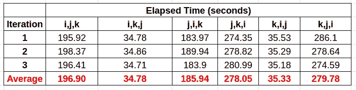
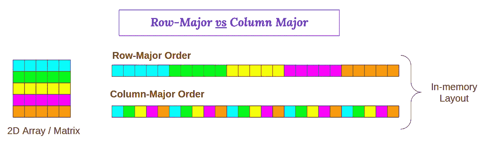
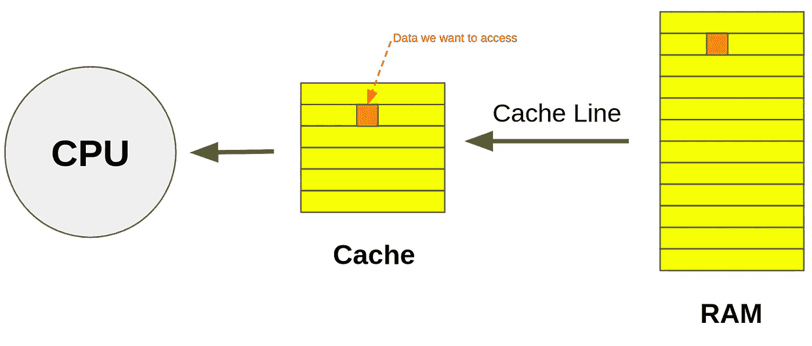
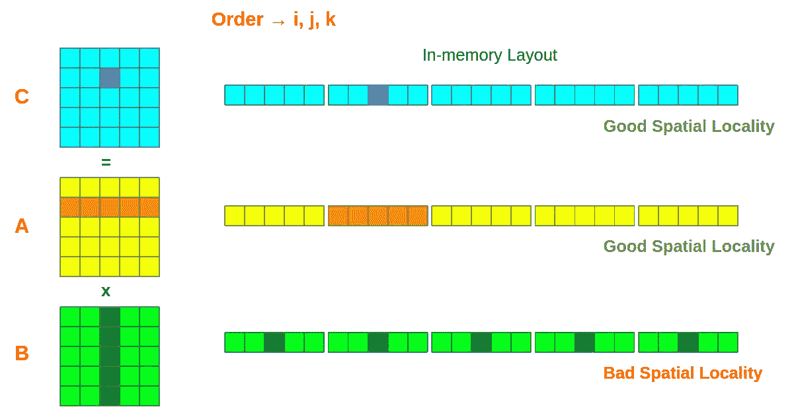
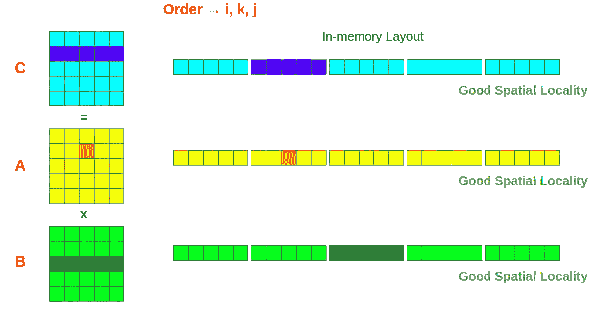
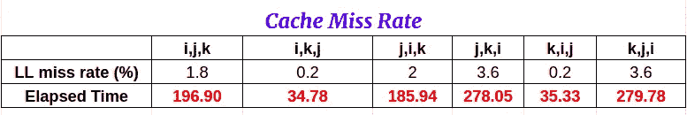
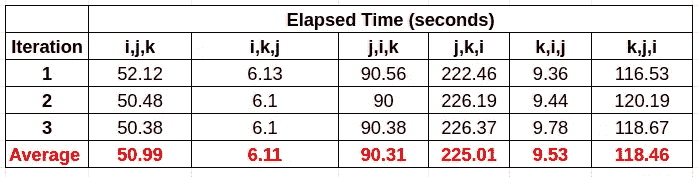

# 通过矩阵乘法研究高速缓存局部性对 C 语言性能的影响

> 原文：<https://levelup.gitconnected.com/c-programming-hacks-4-matrix-multiplication-are-we-doing-it-right-21a9f1cbf53>


[斯科特·格雷厄姆](https://unsplash.com/@sctgrhm?utm_source=medium&utm_medium=referral)在 [Unsplash](https://unsplash.com?utm_source=medium&utm_medium=referral) 上拍照

矩阵乘法对计算机科学领域的任何人来说都是小菜一碟。*能有多难*😏*？这只是创建 2D 数组，用数据填充它，最后是一个嵌套循环的问题。您可能会惊讶地听到，如何实现矩阵乘法会对运行时间产生重大影响。*

## ***C 代码为矩阵乘法***

您可以使用以下命令编译并运行它。

```
gcc -o matrix MatrixMultiplication.c
./martix
```

这就是我们大多数人实现矩阵乘法的方式。*我们可以做出哪些改变？*我们可以改变嵌套循环的顺序吗？当然可以！没有规则规定循环的顺序应该是 i → j → k(尽管我们大部分时间都是这样做的😄).您可以按如下方式编写一个循环，并且仍然会得到正确的输出(顺序无关紧要)。

```
**for** (**int** k = 0; k < n; k++) {
    **for** (**int** j = 0; j < n; j++) {
        **for** (**int** i = 0; i < n; i++) {
            C[i][j] += A[i][k] * B[k][j];
        }
    }
}
```

> 有趣的问题是，这会对表演产生影响吗？

让我们来了解一下！

# 实验

我改变了嵌套循环的顺序，并对每个组合执行了三次迭代。结果如下。



是不是很神奇？仅仅通过改变嵌套循环的顺序，就可以将运行时间从 279.78 秒(最差)减少到 34.78 秒(最好)。顺序为[i，k，j]的嵌套循环比[k，j，i]快 8 倍 T14。 ***但是为什么呢？***

# 缓存位置

为了理解我们的结果，我们需要知道数据实际上是如何存储和访问的。在 C 语言中，二维数组按行优先顺序存储在 RAM 中(与 Fortran 相反，Fortran 中二维数组按列优先顺序存储)。行优先顺序仅仅意味着一行的连续元素在存储器中彼此相邻，而在列优先顺序中，一列的连续元素在存储器中彼此相邻。下图将有助于更好的理解。



作者图片

要处理的数据从 RAM 加载到缓存中。高速缓冲存储器从 RAM 中一次读取相当于一个高速缓存行的数据。假设高速缓存行的大小是 64 字节，即使我们需要访问一个只有 4 字节的整数类型变量，高速缓存也必须加载整个 64 字节。



作者图片

先前访问的高速缓存线存储在高速缓存存储器中。当 CPU 需要访问一些数据时，系统首先检查该特定数据在缓存中是否可用。如果可用，我们称之为缓存命中。如果不是，则称为缓存未命中，需要从 RAM 中加载数据。缓存命中允许更快的数据访问(这是微不足道的，因为从 RAM 加载数据需要更多时间)。

现在，我们可以很容易地分析我们的结果。让我们考虑顺序 I，j，k。



作者图片

假设 i=1，j=2，k = 0..n，我们需要访问矩阵 A 的整个第 2 行和矩阵 B 的整个第 3 列。如果你看一下图中的内存布局，很明显，访问矩阵 A 的第 2 行*提供了良好的空间局部性，因为我们需要的所有数据都在一个缓存行中。然而，在*矩阵 B* 中，我们需要为每个列值访问不同的缓存行，这将导致**更高的缓存未命中率**。*

类似地，如果我们考虑顺序 I，k，j(假设 i=1，k = 2，j = 0..n)



作者图片

在这三种情况下，我们都获得了良好的空间局部性，这将降低缓存未命中率。

我们可以使用以下命令来计算缓存未命中率。

```
valgrind --tool=cachegrind ./matrix
```

*【根据您的系统硬件和矩阵大小，处理可能需要一些时间，请耐心等待*😄*】*

下表显示了末级缓存未命中率。



作者图片

从该表中可以明显看出，末级缓存未命中率和经过的时间之间有很强的相关性。缓存未命中率最高为 3.6%的[j，k，i]和[k，j，i]的运行时间也最长，约为 279 秒。同样，缓存未命中率最小为 0.2%的[i，k，j]和[k，I，j]的运行时间也最少，为~35 秒。

你可能想知道，如果我们使用编译器优化标志会发生什么。它会自己处理缓存局部性吗？下面是用-O3 优化标志编译得到的结果。



因此，很明显，您不能依赖编译器，而必须在编码时考虑缓存空间局部性。

*本文的灵感来源于查尔斯·莱瑟森教授关于性能工程的讲座*[](https://ocw.mit.edu/courses/electrical-engineering-and-computer-science/6-172-performance-engineering-of-software-systems-fall-2018/lecture-videos/lecture-1-intro-and-matrix-multiplication/)