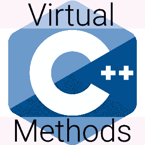

# C++虚方法:概述和一些你可能不知道的事情

> 原文：<https://levelup.gitconnected.com/c-virtual-methods-an-overview-and-some-things-you-might-not-know-33feb5a71813>

带有例子的 C++虚方法的通俗易懂的解释。

# 什么是虚拟方法？

当一个方法用虚拟关键字修饰时，它允许它的行为在一个派生的对象中被重写。

让我们看看上面的代码。

*达*凌驾于*之上的行为从*基地*发言*。当 *DA* 的实例被创建时，它调用这个新行为，而不是在 *Base* 中实现的行为。这显示在第 34 行。

要覆盖一个方法，基方法应该标记为*虚*，派生方法应该具有相同的:

*   名字
*   参数类型列表(不同的名称是可以的，但不推荐)
*   返回类型(或协变)
*   cv 鉴定器
*   参考限定符

如果派生类是使用基类处理的，那么对重写的虚方法的调用将调用派生类中实现的行为。这显示在第 37 和 40 行。

对任何不使用限定名查找的虚函数的调用称为虚调用。执行覆盖方法中的行为。即使是 33 号线也是虚呼。

如果使用限定名查找调用方法，则取消虚拟调用。这显示在第 42–44 行。这就是所谓的直接呼叫。

# 覆盖标识符

让我们看一下第 18 行，这里从*基*说话的*的行为被覆盖。*

要重写虚方法，不需要显式使用重写标识符。但是，出于以下原因使用它会有所帮助:

*   对于阅读代码的人来说，显而易见的是，虚方法被覆盖了。没有猜测工作。
*   编译器知道一个方法是否可以被覆盖，但是通过使用覆盖标识符，编译器可以检查你是否试图覆盖不可覆盖的东西。

## Override 是标识符，不是关键字

*override* 在声明成员方法后使用时有特殊含义。但是，除此之外，它不像关键字那样保留。例如，下面的代码完全有效:

在这样说的时候，*覆盖*仍然应该被视为保留，以避免读者混淆。

# 重写私有虚拟成员

基成员方法不需要可访问才能被重写。它可以被声明为私有，或者可以使用私有继承来继承基类。

在上面的代码中，即使*基*中的*哈欠*是私有的，它仍然能够被 *DA* 覆盖。

如果我们用基类处理 *DA* 的实例，我们就不能再调用*哈欠*，因为它不再可访问。而是可以通过一个名为*do _ 哈欠*的公共方法来调用。

除此之外，即使使用限定名称查找，对*的虚拟调用也不会被抑制。参见第 57–59 行，*do _ 哈欠*调用*哈欠*的 *DA* 实现，而不是*基*实现。虚拟调用只被抑制到第一个被调用的方法，之后任何覆盖行为仍然被使用。第 57-59 行的调用树是*Base::do _ 哈欠→ DA::哈欠*。*

关于将虚方法标记为私有的有很多相互矛盾的信息，我还没有深入研究过这个问题来决定我认为什么是最好的。也许将来我会写一篇关于私有虚拟方法的最佳实践的文章。

# 最终标识符

最终标识符(不是保留关键字，如 override)指定不能在派生类中重写虚方法，或者不能继承类。

在上面的代码中，我们做了 *Base::speak final* 。它不能被覆盖。这样做之后，在 *DA* 中会出现一个错误，其中 *speak* 当前被覆盖，表示 *Base::speak* 不能被覆盖，因为它被标记为 *final* 。

# 最终否决者

如果没有其他方法覆盖虚拟成员方法，那么该方法就是最终的覆盖方法。最终覆盖符是虚拟方法，通过虚拟调用来执行。

## 含糊

当一个方法有不止一个 *final overrider* 时，就会产生歧义。

在上面的代码中，没有办法知道 *d.speak()* 应该调用哪个方法，因为在 *B* 和 *C* 中都有继承的实现。这种由多重继承引起的模糊性被称为钻石问题。

# 无意中隐藏了虚方法

如果方法试图用不同的参数类型列表重写基类中的方法，它不会重写该方法。相反，它定义了一个单独的新方法，并隐藏了从基类继承的方法。

*DA* 无法覆盖 *Base::jump* ，而是隐藏它并定义一个单独的 *jump* 方法。为了让 *DA* 访问 *Base::jump* 它必须使用限定名查找来调用它(第 40 行)。

# 还有更多要讨论的

这绝不是对 C++中虚方法的彻底忽视。在以后的文章中，我的目标是讨论:

*   虚拟析构函数
*   构造和破坏期间的虚拟方法
*   协变返回类型
*   纯虚拟方法

一旦完成，我会把上面的链接到这里。

# 参考

这篇文章的目的是提供一个对 C++虚拟方法的更友好的观察，这些方法在下面的文档中有概述。

[https://en.cppreference.com/w/cpp/language/final](https://en.cppreference.com/w/cpp/language/final)
https://en.cppreference.com/w/cpp/language/overrideT5[https://en.cppreference.com/w/cpp/language/virtual](https://en.cppreference.com/w/cpp/language/virtual)