# C4.5 决策树。自下而上解释

> 原文：<https://levelup.gitconnected.com/c4-5-decision-tree-explained-from-bottom-up-67468c1619a7>

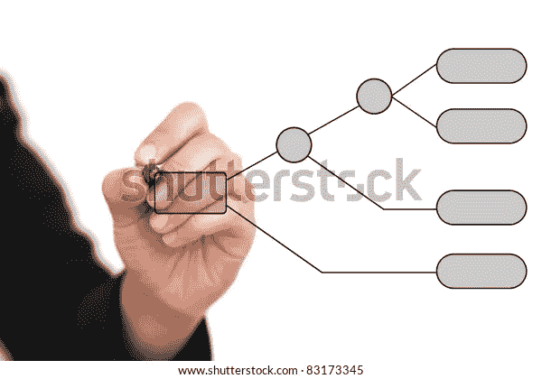

决策图表

C4.5 决策树是一个很难理解的复杂算法。确实需要很多背景知识。这个博客试图整理所有需要的信息，并以一种结构化的方式呈现给读者，让他们不用做额外的研究就能理解。

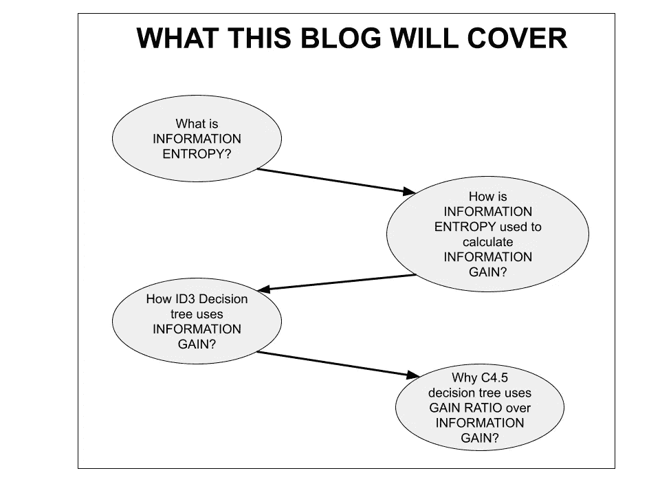

本博客涵盖的内容

# 信息熵

信息熵是给定示例中杂质的度量。让我们详细说明一下

*Shanon 熵或自我信息:*

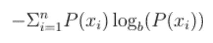

其中 b 是基数。

对于二进制数，基数为 2，对于数据集中的百分比 1，函数的绘图如下:

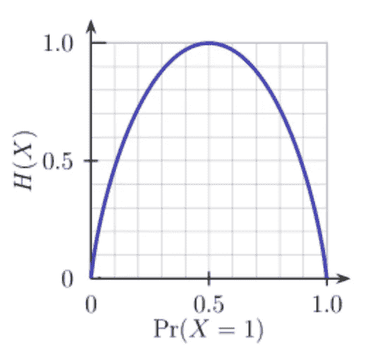

src:[https://www . kdnugges . com/2020/01/decision-tree-algorithm-explained . html](https://www.kdnuggets.com/2020/01/decision-tree-algorithm-explained.html)

因此，如果一个事件的概率接近 1 或 0，信息熵趋向于 0，因为输出或多或少是可预测的。

在统计学中，熵测量数据集中杂质(异质性)的*水平。完全同质数据集的熵为 0，而偏斜数据集的熵更接近 1，如下图所示:*

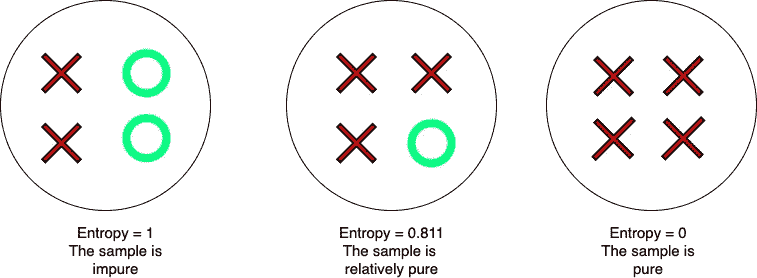

用熵测量样品的杂质

# 信息增益

它是一个参数，用于计算变换前后数据集熵的变化。信息增益有助于特征选择。其工作原理如下。

选择数据集中的一个要素，并基于该要素的值，将数据集分割成多个较小的数据集。从父数据集的总熵到所有新的子数据集的平均熵的变化被计算为信息增益。

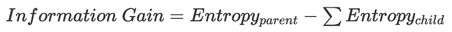

信息增益公式

信息增益越高，特征划分数据集就越准确，因为得到的数据集越同质，熵就越低。这表明要素已准确分割(分类)数据集。另一方面，如果信息增益较低，则意味着生成的数据集或多或少与父数据集一样具有异构性，因此该要素不会提供太多价值。

## 示例:

考虑如下数据集:

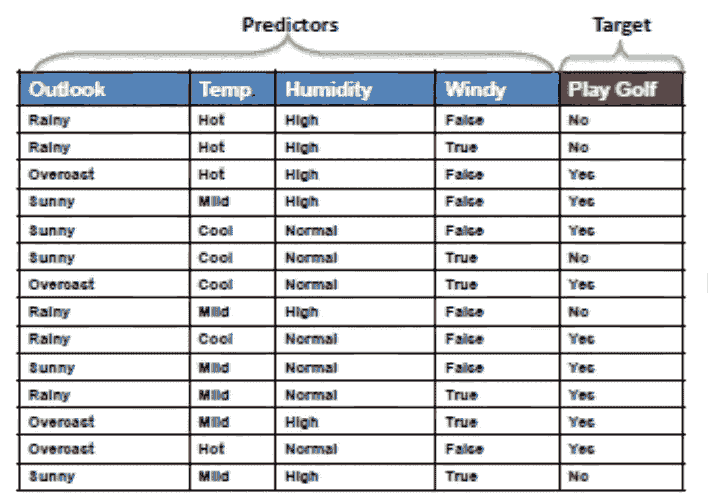

https://www.saedsayad.com/decision_tree.htm

为了预测*打高尔夫*是还是不是，要考虑的特征是*前景、温度、湿度*和*有风。*

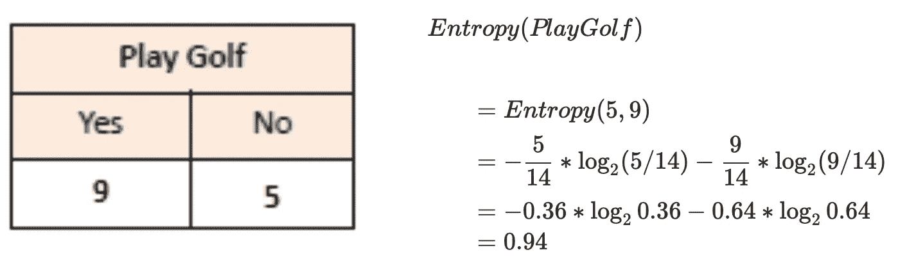

打高尔夫球熵

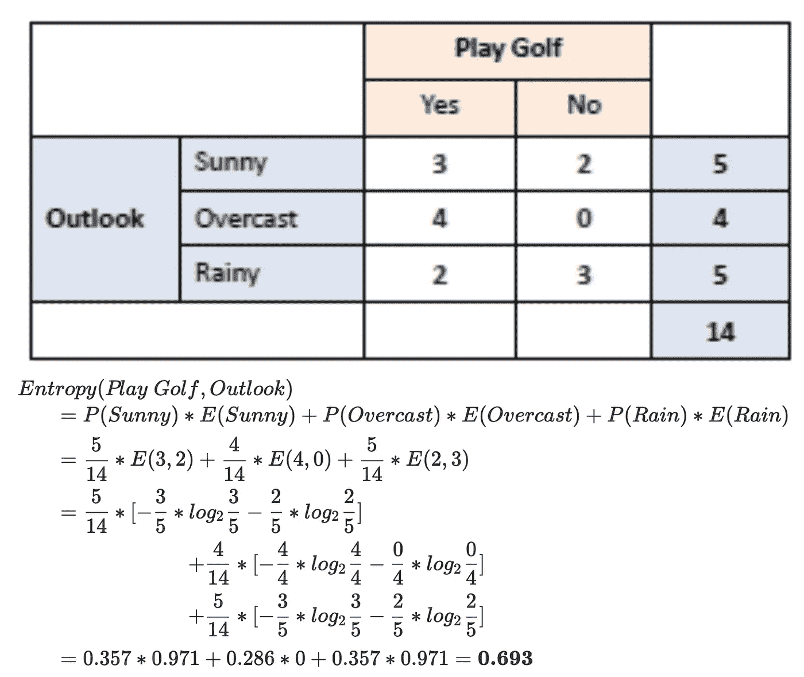

按 Outlook 拆分时 PlayGolf 的熵

因此，从 Outlook 功能中获得的信息如下:

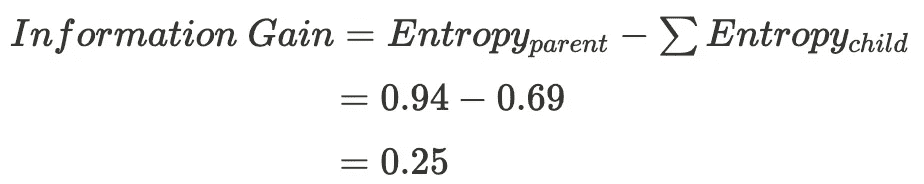

信息增益的计算

# **迭代二分法 3 (ID3)决策树**

**迭代二分法 3 (ID3)** 是一种决策树算法，使用*熵*和*信息增益。*该算法计算数据集中每个特征的信息增益。从中选择具有最高增益的一个，并基于该特征划分数据集。

**例如:**

根据上一节中的公式为“玩高尔夫”数据集中的每个要素计算增益，结果如下:

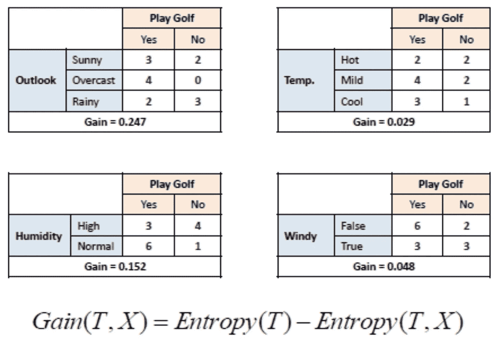

https://www.saedsayad.com/decision_tree.htm

由于*前景*是具有最高信息增益的特征，所以选择它。增益的计算可以参考来源网站。

如下图所示，按 *Outlook* 拆分的数据集*打高尔夫*的值更加同质。

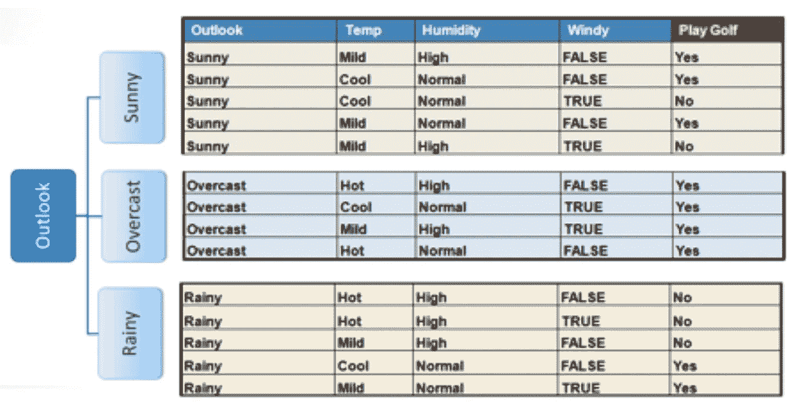

https://www.saedsayad.com/decision_tree.htm

重复该过程，直到所有的目标值都落入相同的类中，或者没有更多的特征需要分割，在这种情况下，选择在目标标签中具有最大计数的类作为节点。

在该示例中，Outlook 功能为“阴”的数据集中的目标值始终为“是”。因此数据集不会被进一步分割。然而，对于其他 2 个数据集，在展望特征为晴天和雨天的情况下，重复该过程，直到得到解决方案。

# C4.5

C4.5 决策树是对 ID3 决策树的修改。与使用信息增益的 ID3 不同，C4.5 使用增益比作为*优度函数*来分割数据集。

信息增益函数倾向于偏好具有更多类别的特征，因为它们倾向于具有更低的熵。这导致训练数据的过度拟合。增益比通过使用称为分割信息或内在信息的公式惩罚具有更多类别的特征来缓解这个问题。

考虑 Outlook 功能的拆分信息的计算。

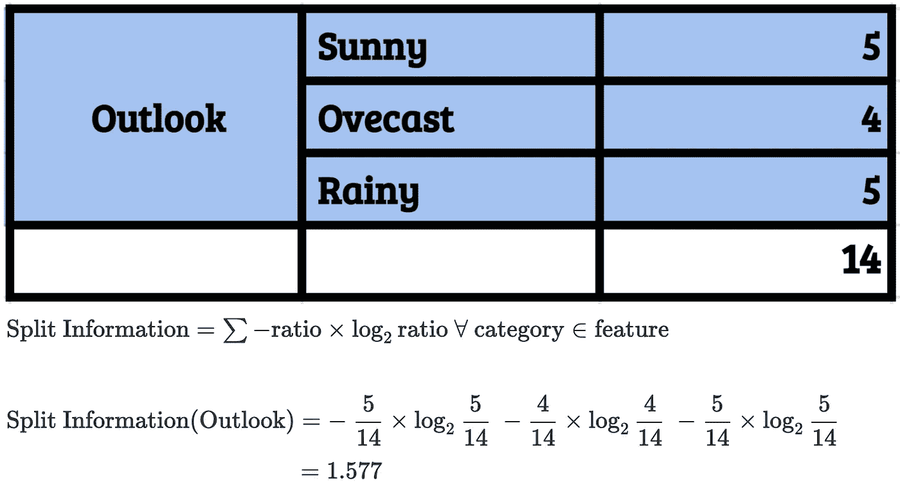

拆分的计算

现在将分离信息的值应用于增益比:

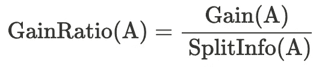

计算增益比的公式

例如，如果该功能只有一个类别，如果 outlook 只有一个类别，比如阳光明媚，则拆分信息应该是:

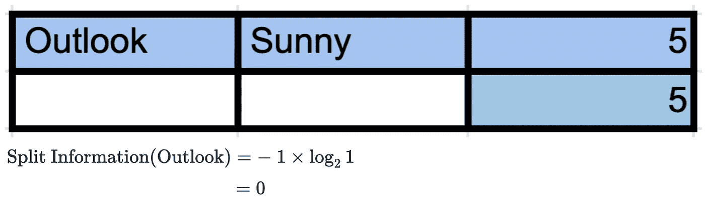

从而导致无限的增益比。由于增益比倾向于具有较少类别的特征，所以分支将较少，从而防止过度拟合。

## 参考资料:

 [## 信息熵简介——机器学习掌握

### 信息论是数学的一个分支，研究在噪声信道中传输数据。一块基石…

machinelearningmastery.com](https://machinelearningmastery.com/what-is-information-entropy)  [## 熵(信息论)

### 在 1-信息论中，随机变量的熵是“信息”、“惊喜”或“意外”的平均水平

en.wikipedia.org](https://en.wikipedia.org/wiki/Entropy_%28information_theory%29)  [## 机器学习的信息增益和互信息-机器学习掌握

### 信息增益计算熵的减少或以某种方式转换数据集带来的惊喜。

machinelearningmastery.com](https://machinelearningmastery.com/information-gain-and-mutual-information/#:~)  [## 什么是熵，为什么信息增益在决策树中很重要？

### 根据维基百科，熵指的是无序或不确定性。

medium.com](https://medium.com/coinmonks/what-is-entropy-and-why-information-gain-is-matter-4e85d46d2f01)  [## 决策图表

### 地图>数据科学>预测未来>建模>分类>决策树决策树构建…

www.saedsayad.com](https://www.saedsayad.com/decision_tree.htm)  [## ID3 算法-维基百科

### 在决策树学习中，ID3(迭代二分法 3)是 Ross Quinlan 发明的一种算法，用于生成一个决策树

en.wikipedia.org](https://en.wikipedia.org/wiki/ID3_algorithm)  [## 信息增益与增益比

### 感谢您为交叉验证提供答案！请务必回答问题。提供详细信息并分享…

stats.stackexchange.com](https://stats.stackexchange.com/questions/346504/information-gain-vs-gain-ratio)  [## 一步一步的 C4.5 决策树示例- Sefik Ilkin Serengil

### 决策树仍然是当今数据科学界的热门话题。这里，ID3 是最常见的常规决策…

sefiks.com](https://sefiks.com/2018/05/13/a-step-by-step-c4-5-decision-tree-example/)