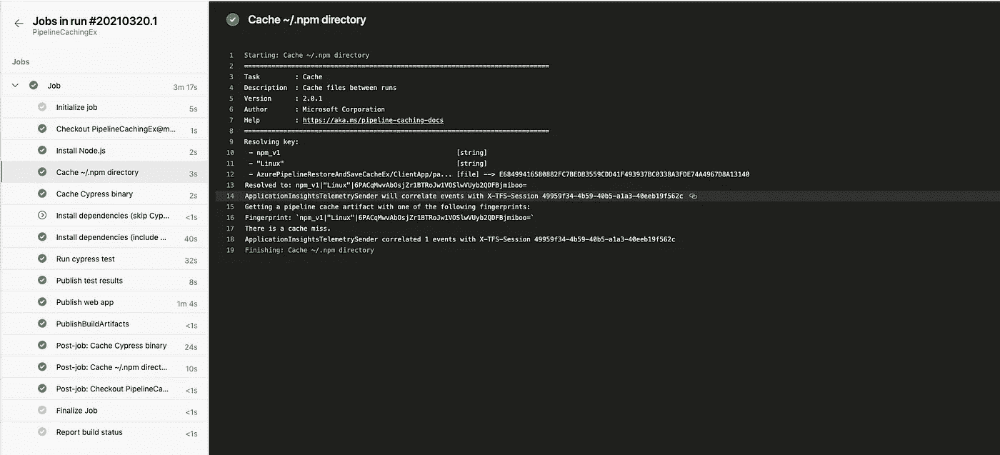
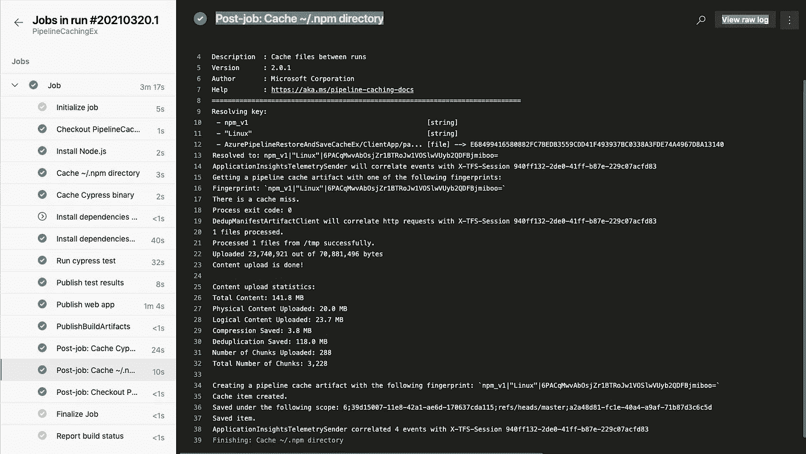

# azure devops 管道中的缓存节点模块和 Cypress 安装。

> 原文：<https://levelup.gitconnected.com/caching-node-modules-and-cypress-installation-in-an-azure-devops-pipeline-3f7a2e07960b>


来自[的](https://burst.shopify.com/digital-downloads?utm_campaign=photo_credit&utm_content=High+Res+Digital+Photography+Flatlay+Picture+%E2%80%94+Free+Images&utm_medium=referral&utm_source=credit) [Shopify 合作伙伴](https://burst.shopify.com/@shopifypartners?utm_campaign=photo_credit&utm_content=High+Res+Digital+Photography+Flatlay+Picture+%E2%80%94+Free+Images&utm_medium=referral&utm_source=credit)拍摄的照片

我有一个后端对前端的应用程序，我是用 Visual Studio 搭建的。后端是 ASP.NET 核心 web API，前端是有棱角的。在 angular 应用程序中，我有 Cypress 端到端测试，我想将其作为构建管道的一部分运行。实现目标需要几样东西。例如，我需要在构建代理上安装 Cypress 二进制文件。我还需要启动 angular 应用程序，以便再次运行测试。安装 Cypress 二进制文件是一个漫长的过程，加上其他步骤，整个构建可能需要很长时间才能完成。经过几次试错，我终于得到了运行 Cypress 测试和缓存二进制文件的构建。请记住，如果保存和恢复缓存数据所需的时间比直接下载和安装数据所需的时间少得多，缓存就有意义。

下面我展示了为我工作的管道的当前配置:

```
# Starter pipeline
# Start with a minimal pipeline that you can customize to build and deploy your code.
# Add steps that build, run tests, deploy, and more:
# https://aka.ms/yaml

trigger:
  - master

pool:
  vmImage: "ubuntu-latest"

variables:
  buildConfiguration: "Release"
  spaDir: "AzurePipelineRestoreAndSaveCacheEx/ClientApp"
  cyCacheDir: "/home/vsts/.cache/Cypress"
  npmCacheDir: "/home/vsts/.npm"

steps:
  - task: NodeTool@0
    inputs:
      versionSpec: "12.19"
    displayName: "Install Node.js"

  - task: Cache@2
    inputs:
      key: 'npm_v1 | "$(Agent.OS)" | $(spaDir)/package-lock.json'
      path: $(npmCacheDir)
      cacheHitVar: NPM_CACHE_RESTORED
    displayName: "Cache ~/.npm directory"

  - task: Cache@2
    inputs:
      key: 'cy_v1 | "$(Agent.OS)" | $(spaDir)/package-lock.json'
      path: $(cyCacheDir)
      cacheHitVar: CYPRESS_CACHE_RESTORED
    displayName: "Cache Cypress binary"

  - script: |
      CYPRESS_INSTALL_BINARY=0 npm ci
    displayName: Install dependencies (skip Cypress install)
    workingDirectory: "$(spaDir)"
    condition: eq(variables.CYPRESS_CACHE_RESTORED, 'true')

  - script: |
      npm ci
    displayName: Install dependencies (include Cypress install)
    workingDirectory: "$(spaDir)"
    condition: eq(variables.CYPRESS_CACHE_RESTORED, 'false')

  - task: CmdLine@2
    inputs:
      script: "npm test"
      workingDirectory: "$(spaDir)"
    displayName: "Run cypress test"

  - task: PublishTestResults@2
    inputs:
      testResultsFormat: "JUnit"
      testResultsFiles: "**/test-output-*.xml"
    displayName: "Publish test results"

  - task: DotNetCoreCLI@2
    displayName: "Publish web app"
    inputs:
      command: "publish"
      projects: "**/*.csproj"
      publishWebProjects: true
      zipAfterPublish: true
      arguments: "--output $(build.artifactstagingdirectory)"

  - task: PublishBuildArtifacts@1
    inputs:
      pathToPublish: $(Build.ArtifactStagingDirectory)
```

首先，我想提一下构建代理。如上面的配置所示，我使用的是基于 ubuntu 的构建代理。起初，我使用基于 windows 的代理；然而，构建花了很长时间才完成。仅仅通过切换到 ubuntu 代理，我就获得了构建时间的显著减少。

```
pool: vmImage: "ubuntu-latest"
```

接下来我要指出的是[缓存](https://docs.microsoft.com/en-us/azure/devops/pipelines/release/caching?view=azure-devops)任务，我用它来缓存 Cypress 和。npm 目录。例如，下面配置的任务缓存全局。npm 目录:

```
- task: Cache@2
    inputs:
      key: 'npm_v1 | "$(Agent.OS)" | $(spaDir)/package-lock.json'
      path: $(npmCacheDir)
      cacheHitVar: NPM_CACHE_RESTORED
    displayName: "Cache ~/.npm directory"
```

在上面的配置中，我指定了一个由字符串“npm_v1”、操作系统的名称和 package-lock.json 文件的 MD5 散列组成的密钥。当任务运行时，它将使用这个键在缓存中查找数据。如果命中，该任务会将数据恢复到 path 参数中指定的文件夹。如果未命中，在构建结束时，该任务会将 path 目录下的数据保存到缓存中。因为密钥由 package-lock.json 的 md5 散列组成，所以只要文件的内容保持不变并且操作系统保持不变，使用密钥在缓存中的后续查找数据就会导致缓存命中。你可能想知道我使用的常量字符串‘NPM _ v1’。这是为了当我想放弃现有的缓存。

> *目前不支持清除缓存。但是，您可以向现有的缓存键添加一个字符串文字(如* `*version2*` *)来更改该键，以避免对现有缓存的任何命中*
> 
> *管道缓存*

根据我的理解，Cypress 安装将二进制文件都放在 node_modules/下。bin 以及全局系统缓存。在 linux 上，Cypress 文件在~/文件夹下。默认为 cache/Cypress。这个目录可以通过设置环境变量 CYPRESS_CACHE_FOLDER 来配置。欲了解更多信息，请查看[文档](https://docs.cypress.io/guides/getting-started/installing-cypress.html#Binary-cache)。

根据 npm 数据是否存在于缓存中，构建执行下面两个任务之一。这两个任务都运行`npm ci` 来安装依赖项。但是，有一个任务会跳过 Cypress 安装，以防缓存命中。缓存 cypress 二进制文件时，缓存任务将结果设置为变量 CYPRESS_CACHED_RESTORED。因此，我使用 condition 并检查这个变量来确定文件是否存在于缓存中，并跳过 cypress 安装，因为缓存任务会将文件恢复到正确的位置。

你可能想知道为什么我总是不检查缓存就运行。这是因为 npm 查看共享缓存目录，该目录包含所有下载的节点模块的缓存版本。对于 linux，该目录是/home/vsts/。我在前面的任务中缓存的 mpm。因此，即使我运行 `npm ci`，我也能获得缓存的好处，因为 npm 首先检查共享缓存目录中是否已经存在该包，以避免进行不必要的网络调用。对于在 CI 环境中运行，使用`npm ci i`是优于`npm install` 的方式，因为前者将通过删除节点模块目录来进行全新安装。这也解释了为什么我需要缓存 Cypress 缓存目录和共享 npm 目录。这是因为 cypress 安装将文件放在 node_modules/下。但是我不缓存 node_modules 目录，只缓存共享的 npm 目录。

> *node . js 项目中启用缓存的方式有多种，但推荐的方式是缓存 npm 的* [*共享缓存目录*](https://docs.npmjs.com/misc/config#cache) *。该目录由 npm 管理，包含所有下载模块的缓存版本。在安装过程中，npm 首先(默认情况下)检查此目录中的模块，这些模块可以减少或消除对公共 npm 注册表或私有注册表的网络调用。*
> 
> [*管道缓存*](http://There%20are%20different%20ways%20to%20enable%20caching%20in%20a%20Node.js%20project,%20but%20the%20recommended%20way%20is%20to%20cache%20npm's%20shared%20cache%20directory.%20This%20directory%20is%20managed%20by%20npm%20and%20contains%20a%20cached%20version%20of%20all%20downloaded%20modules.%20During%20install,%20npm%20checks%20this%20directory%20first%20(by%20default)%20for%20modules%20which%20can%20reduce%20or%20eliminate%20network%20calls%20to%20the%20public%20npm%20registry%20or%20to%20a%20private%20registry.)

每个缓存任务都有一个在构建结束时运行的 post 作业，以便在必要时检查和更新缓存。例如，在缓存未命中的情况下，post 作业会检查路径目录下的文件并将其存储到缓存中。



缓存未命中



作业后缓存—将数据保存到缓存中以供下次运行

在准备好所有节点模块和 cypress 二进制文件之后，下一个任务是启动本地服务器来运行 Cypress 测试。

```
- task: CmdLine@2
    inputs:
      script: "npm test"
      workingDirectory: "$(spaDir)"
    displayName: "Run cypress test"
```

在上面的代码片段中，脚本“npm test”指的是 package.json 中的以下脚本

```
"scripts": {
    "ng": "ng",
    "start": "ng serve",
    "build": "ng build",
    "cy": "npx cypress run",
    "build:ssr": "ng run AzurePipelineRestoreAndSaveCacheEx:server:dev",
    "test": "start-server-and-test start http-get://localhost:4200 cy",
    "lint": "ng lint",
    "e2e": "ng e2e"
  },
```

注意，在上面的配置中，我使用 [start-server-and-test](https://www.npmjs.com/package/start-server-and-test) 模块在本地主机上启动和服务 angular 应用程序，然后运行 Cypress 测试。`cy`命令引用`npx cypress run`，开始命令引用`ng serve`。

测试完成后，cypress 以 junit 格式输出测试结果。为此，我需要在 cypress.json 文件中有以下配置。

```
{
  "chromeWebSecurity": false,
  "baseUrl": "http://localhost:4200",
  "reporter": "junit",
  "reporterOptions": {
    "mochaFile": "tests/test-output-[hash].xml",
    "toConsole": true,
    "attachments": true
  }
}
```

一旦我运行了前端应用程序的测试，最后两个任务基本上是构建和发布 ASP.NET 核心应用程序。其中一部分包括再次构建 angular 应用程序，但这一次是在 prod 模式下，按照。csproj 文件。

```
<Target Name="PublishRunWebpack" AfterTargets="ComputeFilesToPublish">
    <!-- As part of publishing, ensure the JS resources are freshly built in production mode -->
    <Exec WorkingDirectory="$(SpaRoot)" Command="npm run build -- --prod" />
    <Exec WorkingDirectory="$(SpaRoot)" Command="npm run build:ssr -- --prod" Condition=" '$(BuildServerSideRenderer)' == 'true' " />
```

由于这是一个示例项目，我没有太多的节点包。保存和恢复缓存所需的时间与直接下载和安装软件包所需的时间几乎相同。但是，如果您的项目很大并且有很多包，您可能会从缓存中受益。

您可以在此链接查看示例项目:[https://dev.azure.com/taithienbo/_git/PipelineCachingEx.](https://dev.azure.com/taithienbo/_git/PipelineCachingEx.)

# 参考

[安装 Cypress 二进制文件](https://docs.cypress.io/guides/getting-started/installing-cypress.html#Install-binary)

[Azure devops 管道缓存](https://docs.microsoft.com/en-us/azure/devops/pipelines/release/caching?view=azure-devops)

[Cypress 设置 CI](https://docs.cypress.io/guides/continuous-integration/introduction.html#Setting-up-CI) 和 [Cypress 二进制缓存](https://docs.cypress.io/guides/getting-started/installing-cypress.html#Binary-cache)

[Cypress CI boot-your-server](https://docs.cypress.io/guides/continuous-integration/introduction.html#Boot-your-server)[Start-server-and-test 模块](https://www.npmjs.com/package/start-server-and-test)

*原载于 2021 年 3 月 20 日 https://www.taithienbo.com**的* [*。*](https://www.taithienbo.com/caching-node-modules-and-cypress-installation-in-an-azure-devops-pipeline/)