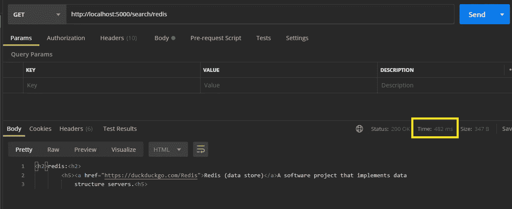
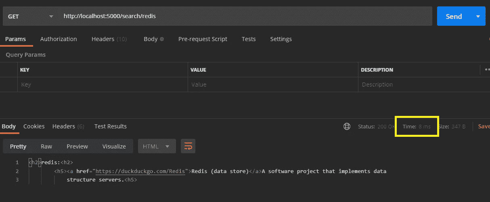

# 使用 Redis 缓存 REST 数据以获得即时响应时间

> 原文：<https://levelup.gitconnected.com/caching-rest-data-for-instant-response-time-w-redis-25b21c29c4b6>


[https://www . help net security . com/2018/06/01/redis-compromise/](https://www.helpnetsecurity.com/2018/06/01/redis-compromise/)找到的图片来源

**REST** *(可表示的状态转移)*，在所有 web 应用中普遍使用，目的是**在客户端和服务器之间传递/编辑/检索**数据。然而，处理 RESTful 请求的最大困难之一是从服务器本身检索数据所需的带宽。当从数据库中检索**大数据**或者由于向**远程 API** 发出请求而导致**连接缓慢**时，通常会出现此常见问题。

通常，如果是这种情况，开发人员要么不得不求助于**减少**从数据库中检索的数据量，要么**在后端创建**他们自己的缓存算法。

听起来，这似乎是一个乏味而令人恼火的过程。然而， **Salvatore Sanfilippo** 听到了这些声音，并建立了最终的缓存解决方案， **Redis** 。

今天我将展示 Redis，并描述它作为存储系统的作用，以及如何使用这个工具使所有响应缓慢的请求瞬间完成。让我们开始吧。

# Redis 是什么？

Redis 代表*(远程字典服务器)*，是一个 **RDMS** *(关系数据库管理系统)*，它包含内存中的数据存储，以持久存储发送到其缓存的 REST 请求。Redis 有一个内置的复制系统来防止数据丢失，不同的模式提供了不同的灵活性，例如 **Redis Sentinel** 用于更好的可访问性，或者 **Redis Cluster** 用于数据之间的自动划分。

# 使用 Redis —安装:

在我们继续讨论这个博客之前，应该将 Redis 服务器下载到本地机器上。

如果你有一个 **Linux/Ubuntu OS** ，关于如何在本地安装 Redis 服务器的资源丰富的教程可以在[这里](https://www.digitalocean.com/community/tutorials/how-to-install-and-secure-redis-on-ubuntu-18-04)找到。如果你碰巧有一个 **OSX** ，那就跟随[这个](https://medium.com/@petehouston/install-and-config-redis-on-mac-os-x-via-homebrew-eb8df9a4f298)有用的教程吧。

# 使用 Redis —配置:

现在我们已经在本地机器上安装了 Redis 服务器，我们可以继续设置我们的应用程序了。

首先，我们需要创建一个新的目录，我们称之为 **redis-respect** 。

```
$ mkdir redis-respect
```

现在，我们希望进入这个新创建的目录的范围，一旦进入，我们就可以通过发出以下命令来继续安装我们的节点依赖项:

```
$ npm init -y //for configuring node package.json$ npm i node-fetch express redis
```

完美。现在我们应该已经为我们的应用程序安装了依赖项。我们想要做的是为应用程序创建启动脚本来运行服务器。在 *package.json* 中，将以下脚本添加到“脚本”类别中。*(为了这篇博客，我使用了包 nodemon)*

# 使用 Redis —服务器设置:

既然我们已经配置了应用程序的布局，现在我们可以继续创建服务器了。在应用程序的根目录下，创建一个名为 *index.js* 的新文件。建立索引后，将提供的信息插入文件中:

现在，如果我们通过 postman 查看我们的本地主机，我们会注意到第一个请求的 ping 保持在相对正常的范围内。



然而，我们的第二个调用将在眨眼之间检索信息！



哇！看看这一改进。这几乎是瞬间的结果。

# 结论:

Redis 是一个存储实用程序，它使用内存缓存来保存从 REST 请求中接收到的数据，从而使响应变得即时。希望这篇文章有助于更清楚地说明 Redis 必须提供的特性和实用程序。

# 分级编码

感谢您成为我们社区的一员！ [**订阅我们的 YouTube 频道**](https://www.youtube.com/channel/UC3v9kBR_ab4UHXXdknz8Fbg?sub_confirmation=1) 或者加入 [**Skilled.dev 编码面试课程**](https://skilled.dev/) 。

[](https://skilled.dev) [## 编写面试问题+获得开发工作

### 掌握编码面试的过程

技术开发](https://skilled.dev)