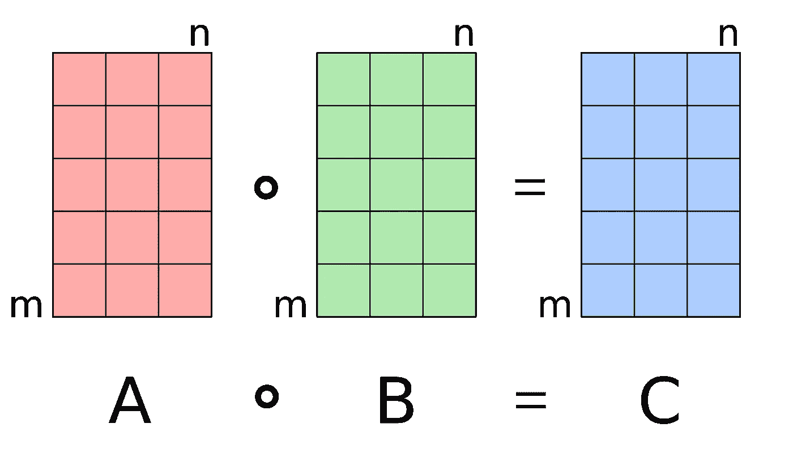
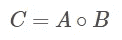
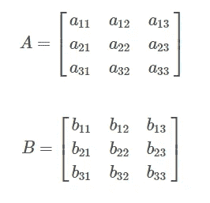
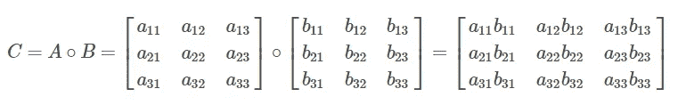
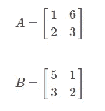
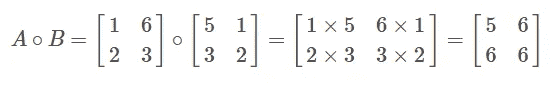

# 使用 Python 线性代数计算 Hadamard 乘积

> 原文：<https://levelup.gitconnected.com/calculate-hadamard-product-using-python-linear-algebra-46564a22c03d>

## 在本文中，我们将通过使用 Python 的例子来讨论计算 Hadamard 乘积的步骤和直觉。


作者图片

**目录**

*   介绍
*   Hadamard 产品说明
*   Python 中的 Hadamard 产品
*   结论

# 介绍

两个矩阵的 Hadamard 积计算非常类似于[矩阵加法](https://pyshark.com/matrix-addition-explained-using-python/)的过程，但是运算本身就是乘法。

为了继续学习本教程，我们需要以下 Python 库:numpy。

如果您没有安装它们，请打开“命令提示符”(在 Windows 上)并使用以下代码安装它们:

```
pip install numpy
```

# Hadamard 产品说明

哈达玛乘积也称为逐元素乘法或逐元素乘积。

而 Hadamard 乘积进行乘法运算，与我们通常在[线性代数](https://pyshark.com/category/linear-algebra/)中看到的[矩阵乘法(矩阵乘积)](https://pyshark.com/matrix-multiplication-explained-using-python/)不同。

Hadamard 乘积只能对相同维数的两个矩阵(2×2、3×3 等)进行计算。该操作产生一个与输入矩阵维数相同的矩阵:



[来源](https://en.wikipedia.org/wiki/Hadamard_product_(matrices)#/media/File:Hadamard_product_qtl1.svg)

对于矩阵 **A** 和 **B** (维数相同)，哈达玛乘积可计算如下:



作者图片

其中∘是逐元素乘法，而不是⋅ [乘法](https://pyshark.com/matrix-multiplication-explained-using-python/)。

让我们考虑两个样本矩阵 **A** 和 **B** :



作者图片

计算哈达玛乘积(逐元素乘法):



作者图片

该过程与[矩阵加法](https://pyshark.com/matrix-addition-explained-using-python/)或[矩阵减法](https://pyshark.com/matrix-subtraction-explained-using-python/)非常相似，除了这里我们将矩阵的元素相乘。

举例来说，我们将使用在[矩阵乘法文章](https://pyshark.com/matrix-multiplication-explained-using-python/#matrix-multiplication-explained)中使用的相同矩阵\(A\)和\(B\ ):



作者图片

计算哈达玛乘积:



作者图片

# Python 中的 Hadamard 产品

为了在 Python 中计算 Hadamard 乘积(逐元素矩阵乘法),我们将使用 numpy 库。第一步是导入它:

Numpy 有很多有用的函数，对于这个操作，我们将使用 [multiply()](https://numpy.org/doc/stable/reference/generated/numpy.add.html) 函数，它对数组的元素进行乘法运算。

回想一下，在 Python 中，矩阵被构造为数组，矩阵需要有相同的维数才能相加。下一步是定义输入矩阵。

我们将使用与[前一节](https://pyshark.com/calculate-hadamard-product-using-python/#hamadard-product-explained)中相同的 2×2 矩阵:

现在我们有了所需的矩阵，我们可以很容易地计算由矩阵元素乘法得到的 Hadamard 乘积:

您应该得到:

```
[[5 6]
 [6 6]]
```

这与我们手动计算的[示例](https://pyshark.com/calculate-hadamard-product-using-python/#hamadard-product-explained)中的输出完全相同。

# 结论

在本文中，我们讨论了 Hadamard 产品的直觉和步骤，并展示了使用 Python 的完整示例。

如果你有任何问题或对一些编辑有建议，请随时在下面留下评论，并查看我的更多[线性代数](https://pyshark.com/category/linear-algebra/)文章。

*原载于 2022 年 1 月 18 日 https://pyshark.com**的* [*。*](https://pyshark.com/calculate-hadamard-product-using-python/)